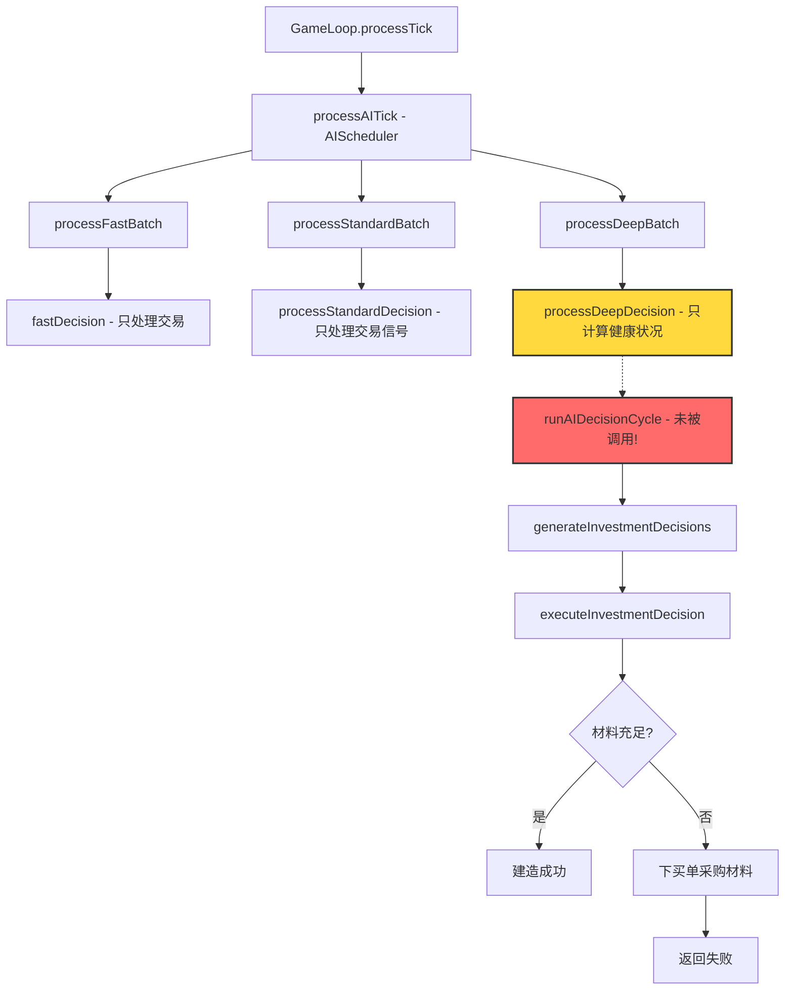

# AI建造建筑问题修复计划

## 问题描述

用户报告：**AI完全不会建造建筑**

## 根本原因分析

通过代码分析，我发现AI不建造建筑的问题有以下几个根本原因：

### 1. 建造材料需求过高

在 [`buildingMaterials.ts`](src/data/buildingMaterials.ts) 中，每种建筑都需要大量材料：

```typescript
// 例如：铁矿场需要
baseMaterials: [
  { goodsId: GOODS.STEEL, amount: 800 },      // 钢材 800
  { goodsId: GOODS.CEMENT, amount: 500 },     // 水泥 500
  { goodsId: GOODS.TIMBER, amount: 300 },     // 木材 300
  { goodsId: GOODS.BUILDING_MATERIALS, amount: 300 }, // 建筑材料 300
  { goodsId: GOODS.BUILDING_PRODUCTS, amount: 100 },  // 建材成品 100
  { goodsId: GOODS.MOTOR, amount: 10 },       // 电机 10
  { goodsId: GOODS.MECHANICAL_PARTS, amount: 100 },   // 机械部件 100
]
```

### 2. AI初始建材库存不足

在 [`WorldInitializer.ts`](src/core/world/WorldInitializer.ts:225-237) 中，AI公司的初始建材库存：

```typescript
const buildingMaterialsInit = [
  { goodsId: 14, amount: 500 + Math.random() * 1000 },  // 钢材 500-1500
  { goodsId: 21, amount: 400 + Math.random() * 600 },   // 水泥 400-1000
  { goodsId: 6, amount: 300 + Math.random() * 500 },    // 木材 300-800
  // ...
];
```

**问题**：初始库存刚好够建造1个简单建筑，但AI需要同时满足生产需求，导致建材不足。

### 3. 建造决策被其他决策挤掉

在 [`AIDecisionEngine.ts`](src/core/ai/AIDecisionEngine.ts:2127-2148) 的 `runAIDecisionCycle` 中：

```typescript
// 只执行前 maxDecisionsPerTick 个决策
const maxDecisionsPerTick = Math.round(8 * personality.decisionFrequency);

// 虽然有优先执行投资决策的逻辑，但只执行1个
if (investmentDecisions.length > 0) {
  const investDecision = investmentDecisions[0];
  if (executeDecision(world, investDecision)) {
    executedDecisions.push(investDecision);
  }
}
```

**问题**：投资决策虽然被优先考虑，但每次只尝试执行1个，且如果材料不足会失败。

### 4. 材料不足时的采购逻辑效率低

在 [`executeInvestmentDecision`](src/core/ai/AIDecisionEngine.ts:1836-1875) 中：

```typescript
// 如果材料不足，为缺少的材料下买单
if (!canBuild) {
  for (const missing of missingMaterials.slice(0, 5)) {
    // 每次最多处理5种材料
    // 下买单...
  }
  return false; // 返回失败，不建造
}
```

**问题**：
1. 每次只处理5种缺失材料
2. 买单下了但不等待成交就返回失败
3. 下次决策周期可能又重新评估，导致重复下单

### 5. AIScheduler 没有调用完整的决策引擎

在 [`AIScheduler.ts`](src/core/ai/AIScheduler.ts:306-358) 中：

```typescript
private processStandardDecision(world: GameWorld, companyId: number): void {
  // 只处理交易信号，没有投资决策
  for (const signal of sellSignals) { ... }
  for (const signal of buySignals) { ... }
}

private processDeepDecision(world: GameWorld, companyId: number): void {
  // TODO: 集成完整的AIDecisionEngine模块
  // 目前只计算健康状况，没有实际执行投资决策
}
```

**问题**：新的AIScheduler系统没有调用 `runAIDecisionCycle`，导致投资决策根本不会被执行！

### 6. GameLoop 中的AI决策调用

在 [`GameLoop.ts`](src/core/loop/GameLoop.ts:336-340) 中：

```typescript
// 使用新的AI调度器处理所有AI决策
const aiSchedulerStats = processAITick(this.world);
const aiDecisions = aiSchedulerStats.fastProcessed +
                    aiSchedulerStats.standardProcessed +
                    aiSchedulerStats.deepProcessed;
```

**问题**：GameLoop只调用了 `processAITick`（AIScheduler），而AIScheduler的 `processDeepDecision` 没有调用完整的 `runAIDecisionCycle`。

## 问题流程图



## 修复方案

### 方案1：在AIScheduler的Deep决策中调用完整决策引擎（推荐）

修改 [`AIScheduler.ts`](src/core/ai/AIScheduler.ts) 的 `processDeepDecision` 方法：

```typescript
import { runAIDecisionCycle } from './AIDecisionEngine';

private processDeepDecision(world: GameWorld, companyId: number): void {
  // 调用完整的AI决策引擎
  runAIDecisionCycle(world, companyId);
}
```

**优点**：
- 改动最小
- 保持现有架构
- 投资决策会在Deep周期执行

**缺点**：
- Deep周期间隔较长（240 tick），建造频率低

### 方案2：增加专门的建造决策周期

在 [`GameLoop.ts`](src/core/loop/GameLoop.ts) 中增加独立的建造决策调用：

```typescript
// 在AI决策后增加
// AI建造决策（每24tick执行一次）
if (currentTick % 24 === 0) {
  runAIBuildingDecisions(this.world);
}
```

新增函数 `runAIBuildingDecisions`：

```typescript
export function runAIBuildingDecisions(world: GameWorld): number {
  let buildingsCreated = 0;
  
  for (let companyId = 1; companyId < world.companies.count; companyId++) {
    if (!world.companies.isAI[companyId]) continue;
    
    const assessment = assessCompanyState(world, companyId);
    const personality = getCompanyPersonality(companyId);
    
    // 生成投资决策
    const investmentDecisions = generateInvestmentDecisions(world, companyId, assessment);
    
    // 按优先级排序
    investmentDecisions.sort((a, b) => b.priority - a.priority);
    
    // 尝试执行前3个
    for (let i = 0; i < Math.min(3, investmentDecisions.length); i++) {
      if (executeDecision(world, investmentDecisions[i])) {
        buildingsCreated++;
      }
    }
  }
  
  return buildingsCreated;
}
```

### 方案3：增加AI初始建材库存

修改 [`WorldInitializer.ts`](src/core/world/WorldInitializer.ts) 中的初始库存：

```typescript
const buildingMaterialsInit = [
  { goodsId: 14, amount: 2000 + Math.random() * 2000 },  // 钢材 2000-4000
  { goodsId: 21, amount: 1500 + Math.random() * 1500 },  // 水泥 1500-3000
  { goodsId: 6, amount: 1000 + Math.random() * 1000 },   // 木材 1000-2000
  { goodsId: 17, amount: 500 + Math.random() * 500 },    // 玻璃 500-1000
  { goodsId: 36, amount: 800 + Math.random() * 800 },    // 建筑材料 800-1600
  { goodsId: 47, amount: 300 + Math.random() * 300 },    // 建材成品 300-600
  { goodsId: 29, amount: 50 + Math.random() * 50 },      // 电机 50-100
  { goodsId: 31, amount: 300 + Math.random() * 300 },    // 机械部件 300-600
  // ...
];
```

### 方案4：降低建筑材料需求

修改 [`buildingMaterials.ts`](src/data/buildingMaterials.ts)，将所有建筑的材料需求降低50%：

```typescript
// 例如：铁矿场
baseMaterials: [
  { goodsId: GOODS.STEEL, amount: 400 },      // 从800降到400
  { goodsId: GOODS.CEMENT, amount: 250 },     // 从500降到250
  // ...
]
```

### 方案5：优化材料采购逻辑

修改 [`executeInvestmentDecision`](src/core/ai/AIDecisionEngine.ts) 中的采购逻辑：

```typescript
// 如果材料不足，创建一个"待建造"任务
if (!canBuild) {
  // 记录待建造任务
  addPendingConstruction(companyId, buildingTypeId, recipeId, missingMaterials);
  
  // 为所有缺失材料下买单（不限制5种）
  for (const missing of missingMaterials) {
    // 下买单...
  }
  
  return false;
}

// 在后续tick检查待建造任务
function checkPendingConstructions(world: GameWorld): void {
  for (const task of pendingConstructions) {
    if (hasSufficientMaterials(world, task)) {
      executeConstruction(world, task);
      removePendingConstruction(task);
    }
  }
}
```

## 推荐实施顺序

1. **立即修复**（方案1）：在AIScheduler的Deep决策中调用完整决策引擎
2. **短期优化**（方案2）：增加专门的建造决策周期
3. **平衡调整**（方案3+4）：增加初始库存 + 适当降低材料需求
4. **长期优化**（方案5）：实现待建造任务队列

## 具体代码修改

### 修改1：AIScheduler.ts

```typescript
// 在文件顶部添加导入
import { runAIDecisionCycle } from './AIDecisionEngine';

// 修改 processDeepDecision 方法
private processDeepDecision(world: GameWorld, companyId: number): void {
  // 调用完整的AI决策引擎（包含投资决策）
  runAIDecisionCycle(world, companyId);
}
```

### 修改2：降低Deep决策间隔

```typescript
const DEFAULT_CONFIG: AISchedulerConfig = {
  // ...
  deepInterval: 48,  // 从240改为48（每2天执行一次）
  // ...
};
```

### 修改3：增加建材初始库存

在 [`WorldInitializer.ts`](src/core/world/WorldInitializer.ts) 中：

```typescript
const buildingMaterialsInit: Array<{ goodsId: number; amount: number }> = [
  { goodsId: 14, amount: 1500 + Math.random() * 1500 },  // 钢材
  { goodsId: 21, amount: 1000 + Math.random() * 1000 },  // 水泥
  { goodsId: 6, amount: 800 + Math.random() * 800 },     // 木材
  { goodsId: 17, amount: 400 + Math.random() * 400 },    // 玻璃
  { goodsId: 36, amount: 600 + Math.random() * 600 },    // 建筑材料
  { goodsId: 47, amount: 200 + Math.random() * 200 },    // 建材成品
  { goodsId: 29, amount: 40 + Math.random() * 40 },      // 电机
  { goodsId: 31, amount: 250 + Math.random() * 250 },    // 机械部件
  { goodsId: 25, amount: 500 + Math.random() * 500 },    // 燃油
  { goodsId: 18, amount: 300 + Math.random() * 300 },    // 塑料
  { goodsId: 19, amount: 200 + Math.random() * 200 },    // 橡胶制品
];
```

### 修改4：增加建造日志

在 [`executeInvestmentDecision`](src/core/ai/AIDecisionEngine.ts) 中增加详细日志：

```typescript
if (action === 'build') {
  console.log(`[AI建造尝试 T${world.tick}] 公司${companyId}(${world.companies.names[companyId]}) 尝试建造 ${buildingDef.name}`);
  
  if (!canBuild) {
    console.log(`[AI建造失败] 材料不足:`, missingMaterials.map(m => {
      const goods = ALL_GOODS.find(g => g.id === m.goodsId);
      return `${goods?.name || m.goodsId}: 缺${m.amount}`;
    }).join(', '));
  }
}
```

## 验证方法

1. 运行游戏，观察控制台日志
2. 检查是否有 `[AI建造]` 相关日志
3. 如果看到 `[AI建造失败] 材料不足`，说明决策在执行但材料不够
4. 如果完全没有建造相关日志，说明决策没有被调用

## 预期效果

修复后：
- AI公司每2天（48 tick）会评估一次建造决策
- 有足够材料时会立即建造
- 材料不足时会主动采购建材
- 控制台会显示建造相关日志

## 风险评估

- **性能影响**：Deep决策间隔从240降到48，可能增加CPU负载
- **经济平衡**：增加初始库存可能影响早期经济平衡
- **建造速度**：修复后AI可能快速扩张，需要观察游戏平衡

## 后续优化建议

1. 实现建造任务队列系统
2. 添加建造优先级智能排序
3. 实现建材市场供需平衡机制
4. 添加AI建造行为的可视化面板