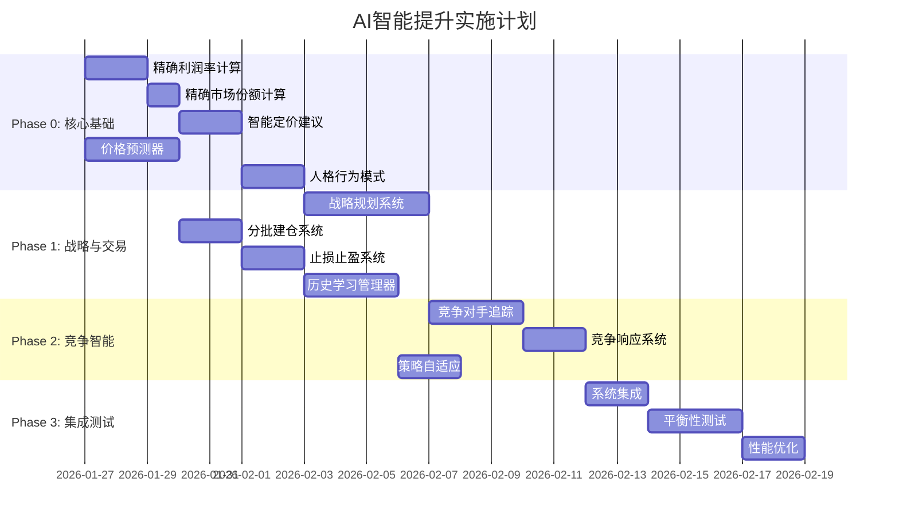

# AI智能提升详细设计方案

> **文档版本**: 1.0
> **创建日期**: 2026-01-26
> **目标**: 全面提升AI公司的智能水平，使其能与玩家形成真正的竞争

---

## 目录

1. [现状分析](#一现状分析)
2. [整体架构设计](#二整体架构设计)
3. [精确决策计算系统](#三精确决策计算系统)
4. [历史学习系统](#四历史学习系统)
5. [战略规划系统](#五战略规划系统)
6. [价格预测系统](#六价格预测系统)
7. [高级交易策略](#七高级交易策略)
8. [人格差异化增强](#八人格差异化增强)
9. [竞争情报系统](#九竞争情报系统)
10. [实施路线图](#十实施路线图)

---

## 一、现状分析

### 1.1 当前AI系统架构

```
┌─────────────────────────────────────────────────────────────┐
│                     AIDecisionEngine.ts                      │
│  ┌─────────────────┐  ┌─────────────────┐  ┌──────────────┐ │
│  │ assessCompany   │  │ generateDecisions│  │ executeDecision│
│  │  State()        │→ │   (4种类型)      │→ │   ()          │
│  └─────────────────┘  └─────────────────┘  └──────────────┘ │
│           ↓                    ↓                    ↓        │
│  ┌─────────────────────────────────────────────────────────┐│
│  │                   AIPersonality.ts                       ││
│  │  • 8种人格定义   • 决策调整   • 目标差距评估              ││
│  └─────────────────────────────────────────────────────────┘│
│           ↓                    ↓                    ↓        │
│  ┌─────────────────────────────────────────────────────────┐│
│  │                  MarketIntelligence.ts                   ││
│  │  • 市场情报收集   • 竞争对手分析   • 战略建议             ││
│  └─────────────────────────────────────────────────────────┘│
└─────────────────────────────────────────────────────────────┘
```

### 1.2 主要问题清单

| 问题 | 位置 | 影响 | 优先级 |
|------|------|------|--------|
| **利润率硬编码** | `assessCompanyState()` 返回 `profitMargin: 0.1` | AI无法准确评估盈利能力 | P0 |
| **市场份额硬编码** | `assessCompanyState()` 返回 `marketShare: 0.05` | AI无法识别市场地位 | P0 |
| **无价格历史分析** | 决策时只看当前价格 | 错过趋势，高买低卖 | P0 |
| **无学习能力** | 无历史记录机制 | 重复错误决策 | P1 |
| **人格影响有限** | 仅调整优先级乘数 | 行为差异不明显 | P1 |
| **战略规划缺失** | 只有反应式决策 | 无法长期规划 | P1 |
| **竞争分析浅显** | 只统计建筑数量 | 无法有效竞争 | P2 |
| **交易策略基础** | 一次性下单 | 成交效率低 | P2 |

### 1.3 当前决策流程问题代码示例

```typescript
// 问题1：硬编码值
export function assessCompanyState(world: GameWorld, companyId: number): CompanyAssessment {
  // ...
  return {
    profitMargin: 0.1,    // ❌ 硬编码！应计算真实利润率
    marketShare: 0.05,    // ❌ 硬编码！应计算真实市场份额
    // ...
  };
}

// 问题2：定价决策过于简单
if (supplyDemandRatio > 1.3) {
  suggestedPrice = currentPrice * 0.95;  // ❌ 简单比例，忽略成本
} else if (supplyDemandRatio < 0.7) {
  suggestedPrice = currentPrice * 1.05;  // ❌ 忽略竞争对手定价
}

// 问题3：投资决策粗糙
if (assessment.cashRatio > 0.4 && assessment.cash > 500000) {
  // ❌ 没有ROI分析，没有市场容量评估
  decisions.push({ type: 'investment', action: 'build', ... });
}
```

---

## 二、整体架构设计

### 2.1 增强后的AI架构

```
┌─────────────────────────────────────────────────────────────────────────────┐
│                          AI Intelligence Core                                │
├─────────────────────────────────────────────────────────────────────────────┤
│  ┌────────────────────────────────────────────────────────────────────────┐ │
│  │                         StrategicPlanner                                │ │
│  │  • 长期目标设定  • 战略路线选择  • 资源配置规划  • 阶段性目标分解        │ │
│  └────────────────────────────────────────────────────────────────────────┘ │
│                                    ↓                                         │
│  ┌──────────────────┐ ┌──────────────────┐ ┌──────────────────────────────┐ │
│  │ PricePredictor   │ │ CompetitorTracker│ │ PerformanceAnalyzer          │ │
│  │ • 趋势分析        │ │ • 行为预测        │ │ • 历史回溯                   │ │
│  │ • 价格预测        │ │ • 威胁评估        │ │ • 策略效果评估               │ │
│  │ • 波动率计算      │ │ • 机会识别        │ │ • 自适应调整                 │ │
│  └──────────────────┘ └──────────────────┘ └──────────────────────────────┘ │
│                                    ↓                                         │
│  ┌────────────────────────────────────────────────────────────────────────┐ │
│  │                        DecisionEngine V2                                │ │
│  │  ┌──────────────┐ ┌──────────────┐ ┌──────────────┐ ┌──────────────┐   │ │
│  │  │ PrecisionCalc│ │ TradingEngine │ │ InvestmentAI │ │ PricingBrain │   │ │
│  │  │ • 真实利润   │ │ • 分批建仓   │ │ • ROI分析    │ │ • 竞争定价   │   │ │
│  │  │ • 真实份额   │ │ • 止损止盈   │ │ • 市场容量   │ │ • 需求弹性   │   │ │
│  │  │ • 边际成本   │ │ • 价格追踪   │ │ • 垂直整合   │ │ • 动态调价   │   │ │
│  │  └──────────────┘ └──────────────┘ └──────────────┘ └──────────────┘   │ │
│  └────────────────────────────────────────────────────────────────────────┘ │
│                                    ↓                                         │
│  ┌────────────────────────────────────────────────────────────────────────┐ │
│  │                      PersonalitySystem V2                               │ │
│  │  • 行为模式模板   • 动态人格演化   • 情境反应规则   • 决策风格定制       │ │
│  └────────────────────────────────────────────────────────────────────────┘ │
└─────────────────────────────────────────────────────────────────────────────┘
```

### 2.2 新增文件结构

```
src/core/ai/
├── AIDecisionEngine.ts      # 现有 - 需重构
├── AIPersonality.ts         # 现有 - 需增强
├── MarketIntelligence.ts    # 现有 - 需增强
├── PlayerAutoTrader.ts      # 现有 - 保持
├── PrecisionCalculator.ts   # 🆕 精确计算模块
├── PerformanceAnalyzer.ts   # 🆕 历史学习模块
├── StrategicPlanner.ts      # 🆕 战略规划模块
├── PricePredictor.ts        # 🆕 价格预测模块
├── AdvancedTradingAI.ts     # 🆕 高级交易模块
├── CompetitorTracker.ts     # 🆕 竞争追踪模块
└── PersonalityBehaviors.ts  # 🆕 人格行为模式
```

---

## 三、精确决策计算系统

### 3.1 真实利润率计算

```typescript
/**
 * 精确利润率计算器
 * 替换硬编码的 profitMargin: 0.1
 */
export interface ProfitAnalysis {
  // 收入
  totalRevenue: number;           // 总收入
  productRevenue: number;         // 产品销售收入
  tradingRevenue: number;         // 交易收入
  
  // 成本
  totalCost: number;              // 总成本
  materialCost: number;           // 原材料成本
  laborCost: number;              // 人工成本
  energyCost: number;             // 能源成本
  maintenanceCost: number;        // 维护成本
  interestCost: number;           // 利息支出
  depreciation: number;           // 折旧
  
  // 利润指标
  grossProfit: number;            // 毛利润
  grossMargin: number;            // 毛利率
  operatingProfit: number;        // 营业利润
  operatingMargin: number;        // 营业利润率
  netProfit: number;              // 净利润
  netMargin: number;              // 净利率
  
  // 趋势
  marginTrend: 'improving' | 'stable' | 'declining';
  revenueGrowth: number;          // 收入增长率
}

/**
 * 计算公司真实利润率
 */
export function calculateProfitAnalysis(
  world: GameWorld,
  companyId: number,
  lookbackTicks: number = 168  // 7天
): ProfitAnalysis {
  const c = world.companies;
  const trades = world.trades;
  const currentTick = world.tick;
  
  // 统计销售收入（最近N个tick的成交）
  let productRevenue = 0;
  let materialCost = 0;
  
  for (let i = 0; i < trades.count; i++) {
    const tradeTick = trades.ticks[i];
    if (tradeTick < currentTick - lookbackTicks) continue;
    
    // 卖出收入
    if (trades.sellerIds[i] === companyId) {
      productRevenue += trades.quantities[i] * trades.prices[i];
    }
    
    // 买入成本（原材料采购）
    if (trades.buyerIds[i] === companyId) {
      materialCost += trades.quantities[i] * trades.prices[i];
    }
  }
  
  // 计算运营成本
  let laborCost = 0;
  let energyCost = 0;
  let maintenanceCost = 0;
  
  for (let i = 0; i < world.buildings.count; i++) {
    if (world.buildings.owners[i] !== companyId) continue;
    if (!world.buildings.isActive[i]) continue;
    
    const recipeId = world.buildings.recipeIds[i];
    const recipe = RECIPES.find(r => r.id === recipeId);
    if (!recipe) continue;
    
    // 按tick比例计算成本
    const tickRatio = lookbackTicks / 24;  // 转换为天数
    laborCost += recipe.laborRequired * 10 * tickRatio;  // 人工成本
    energyCost += recipe.energyRequired * 0.5 * tickRatio;  // 能源成本
    maintenanceCost += 100 * tickRatio;  // 基础维护成本
  }
  
  // 利息成本
  const interestCost = c.totalLiabilities[companyId] * world.economyStats.interestRate * (lookbackTicks / 8760);
  
  // 折旧（简化：每天固定比例）
  const depreciation = c.totalAssets[companyId] * 0.0001 * (lookbackTicks / 24);
  
  // 汇总
  const totalRevenue = productRevenue;
  const totalCost = materialCost + laborCost + energyCost + maintenanceCost + interestCost + depreciation;
  
  // 利润计算
  const grossProfit = totalRevenue - materialCost;
  const grossMargin = totalRevenue > 0 ? grossProfit / totalRevenue : 0;
  
  const operatingProfit = grossProfit - laborCost - energyCost - maintenanceCost;
  const operatingMargin = totalRevenue > 0 ? operatingProfit / totalRevenue : 0;
  
  const netProfit = totalRevenue - totalCost;
  const netMargin = totalRevenue > 0 ? netProfit / totalRevenue : 0;
  
  // 趋势分析（比较前后两个周期）
  // 简化实现：使用历史记录
  const marginTrend = 'stable';  // 需要历史数据支持
  const revenueGrowth = 0;
  
  return {
    totalRevenue,
    productRevenue,
    tradingRevenue: 0,
    totalCost,
    materialCost,
    laborCost,
    energyCost,
    maintenanceCost,
    interestCost,
    depreciation,
    grossProfit,
    grossMargin,
    operatingProfit,
    operatingMargin,
    netProfit,
    netMargin,
    marginTrend,
    revenueGrowth,
  };
}
```

### 3.2 真实市场份额计算

```typescript
/**
 * 市场份额分析结果
 */
export interface MarketShareAnalysis {
  // 按商品分类的市场份额
  shareByGoods: Map<number, number>;
  
  // 总体市场份额（按交易额加权）
  overallShare: number;
  
  // 核心市场份额（主营商品）
  coreMarketShare: number;
  coreMarkets: number[];           // 主营商品ID列表
  
  // 市场地位
  marketPosition: 'leader' | 'challenger' | 'follower' | 'nicher';
  
  // 份额变化
  shareChange: number;             // 份额变化（相对于上一周期）
  shareTrend: 'gaining' | 'stable' | 'losing';
}

/**
 * 计算公司真实市场份额
 */
export function calculateMarketShare(
  world: GameWorld,
  companyId: number,
  lookbackTicks: number = 168
): MarketShareAnalysis {
  const trades = world.trades;
  const currentTick = world.tick;
  
  // 按商品统计交易额
  const companyVolumeByGoods = new Map<number, number>();
  const totalVolumeByGoods = new Map<number, number>();
  
  for (let i = 0; i < trades.count; i++) {
    const tradeTick = trades.ticks[i];
    if (tradeTick < currentTick - lookbackTicks) continue;
    
    const goodsId = trades.goodsIds[i];
    const value = trades.quantities[i] * trades.prices[i];
    
    // 统计总交易额
    totalVolumeByGoods.set(goodsId, (totalVolumeByGoods.get(goodsId) || 0) + value);
    
    // 统计公司卖出额（生产商市场份额）
    if (trades.sellerIds[i] === companyId) {
      companyVolumeByGoods.set(goodsId, (companyVolumeByGoods.get(goodsId) || 0) + value);
    }
  }
  
  // 计算各商品份额
  const shareByGoods = new Map<number, number>();
  let totalCompanyVolume = 0;
  let totalMarketVolume = 0;
  
  for (const [goodsId, totalVolume] of totalVolumeByGoods) {
    const companyVolume = companyVolumeByGoods.get(goodsId) || 0;
    const share = totalVolume > 0 ? companyVolume / totalVolume : 0;
    shareByGoods.set(goodsId, share);
    
    totalCompanyVolume += companyVolume;
    totalMarketVolume += totalVolume;
  }
  
  // 总体市场份额
  const overallShare = totalMarketVolume > 0 ? totalCompanyVolume / totalMarketVolume : 0;
  
  // 识别核心市场（交易额最高的前3个商品）
  const sortedGoods = [...companyVolumeByGoods.entries()]
    .sort((a, b) => b[1] - a[1])
    .slice(0, 3);
  
  const coreMarkets = sortedGoods.map(([id, _]) => id);
  
  // 核心市场份额（核心商品的加权平均份额）
  let coreMarketShare = 0;
  let coreVolume = 0;
  for (const [goodsId, volume] of sortedGoods) {
    const share = shareByGoods.get(goodsId) || 0;
    coreMarketShare += share * volume;
    coreVolume += volume;
  }
  coreMarketShare = coreVolume > 0 ? coreMarketShare / coreVolume : 0;
  
  // 确定市场地位
  let marketPosition: 'leader' | 'challenger' | 'follower' | 'nicher';
  if (coreMarketShare > 0.3) {
    marketPosition = 'leader';
  } else if (coreMarketShare > 0.15) {
    marketPosition = 'challenger';
  } else if (coreMarkets.length >= 3) {
    marketPosition = 'follower';
  } else {
    marketPosition = 'nicher';
  }
  
  return {
    shareByGoods,
    overallShare,
    coreMarketShare,
    coreMarkets,
    marketPosition,
    shareChange: 0,  // 需要历史数据
    shareTrend: 'stable',
  };
}
```

### 3.3 边际成本与定价决策

```typescript
/**
 * 智能定价建议
 */
export interface PricingRecommendation {
  goodsId: number;
  currentPrice: number;
  recommendedPrice: number;
  priceChangePercent: number;
  
  // 定价依据
  marginalCost: number;           // 边际成本
  competitorAvgPrice: number;     // 竞争对手平均价
  demandElasticity: number;       // 需求弹性
  inventoryPressure: number;      // 库存压力 (-1 到 1)
  
  // 预期效果
  expectedVolumeChange: number;   // 预期销量变化
  expectedRevenueChange: number;  // 预期收入变化
  expectedProfitChange: number;   // 预期利润变化
  
  // 置信度
  confidence: number;             // 0-1
  rationale: string;              // 定价理由
}

/**
 * 计算智能定价建议
 */
export function calculatePricingRecommendation(
  world: GameWorld,
  companyId: number,
  goodsId: number
): PricingRecommendation {
  const goods = ALL_GOODS.find(g => g.id === goodsId)!;
  const currentPrice = world.goods.prices[goodsId];
  const basePrice = goods.basePrice;
  
  // 1. 计算边际成本（找到该公司生产此商品的建筑）
  let marginalCost = basePrice * 0.7;  // 默认70%基准价
  for (let i = 0; i < world.buildings.count; i++) {
    if (world.buildings.owners[i] !== companyId) continue;
    const recipeId = world.buildings.recipeIds[i];
    const recipe = RECIPES.find(r => r.id === recipeId);
    if (!recipe) continue;
    
    const produces = recipe.outputs.some(o => o.goodsId === goodsId);
    if (produces) {
      const costStructure = calculateCostStructure(world, i, 10);
      marginalCost = costStructure.marginalCost;
      break;
    }
  }
  
  // 2. 收集竞争对手价格
  const orderBook = getOrderBookView(world, goodsId);
  const competitorPrices: number[] = [];
  for (const order of orderBook.sellOrders) {
    if (order.companyId !== companyId) {
      competitorPrices.push(order.price);
    }
  }
  const competitorAvgPrice = competitorPrices.length > 0
    ? competitorPrices.reduce((a, b) => a + b, 0) / competitorPrices.length
    : currentPrice;
  
  // 3. 计算库存压力
  const inventory = world.companies.inventories[companyId * GOODS_COUNT + goodsId];
  const demand = world.goods.demands[goodsId];
  const inventoryDays = demand > 0 ? inventory / (demand / 24) : 999;
  
  let inventoryPressure = 0;
  if (inventoryDays > 30) inventoryPressure = 0.8;
  else if (inventoryDays > 14) inventoryPressure = 0.4;
  else if (inventoryDays < 3) inventoryPressure = -0.6;
  else if (inventoryDays < 7) inventoryPressure = -0.3;
  
  // 4. 需求弹性
  const demandElasticity = goods.priceElasticity || -1.5;
  
  // 5. 计算推荐价格
  // 目标：最大化利润 = (价格 - 边际成本) × 销量
  // 使用需求弹性推导最优价格
  // P* = MC × (1 + 1/|e|)，其中e为需求弹性
  
  let theoreticalOptimal = marginalCost * (1 + 1 / Math.abs(demandElasticity));
  
  // 考虑竞争：不能偏离竞争对手太多
  const competitiveAdjustment = competitorAvgPrice > 0
    ? (theoreticalOptimal * 0.6 + competitorAvgPrice * 0.4)
    : theoreticalOptimal;
  
  // 考虑库存压力
  const inventoryAdjustment = competitiveAdjustment * (1 - inventoryPressure * 0.1);
  
  // 限制价格变化幅度（每次最多±10%）
  let recommendedPrice = Math.max(
    currentPrice * 0.9,
    Math.min(currentPrice * 1.1, inventoryAdjustment)
  );
  
  // 确保不低于边际成本
  recommendedPrice = Math.max(recommendedPrice, marginalCost * 1.05);
  
  // 6. 预估效果
  const priceChangePercent = (recommendedPrice - currentPrice) / currentPrice;
  const expectedVolumeChange = priceChangePercent * demandElasticity;
  const currentRevenue = currentPrice * (demand / 24);
  const expectedRevenueChange = priceChangePercent + expectedVolumeChange;
  const expectedProfitChange = expectedRevenueChange * 1.2;  // 简化
  
  // 7. 生成理由
  let rationale = '';
  if (inventoryPressure > 0.5) {
    rationale = '库存积压严重，建议降价促销';
  } else if (inventoryPressure < -0.3) {
    rationale = '库存偏低，可适度提价';
  } else if (recommendedPrice > currentPrice * 1.03) {
    rationale = '市场供不应求，建议提价';
  } else if (recommendedPrice < currentPrice * 0.97) {
    rationale = '竞争激烈，建议降价';
  } else {
    rationale = '价格处于合理区间';
  }
  
  return {
    goodsId,
    currentPrice,
    recommendedPrice,
    priceChangePercent,
    marginalCost,
    competitorAvgPrice,
    demandElasticity,
    inventoryPressure,
    expectedVolumeChange,
    expectedRevenueChange,
    expectedProfitChange,
    confidence: 0.7,
    rationale,
  };
}
```

---

## 四、历史学习系统

### 4.1 历史记录结构

```typescript
/**
 * AI公司历史记录
 */
export interface AICompanyHistory {
  companyId: number;
  
  // 财务历史（按天记录）
  dailySnapshots: DailySnapshot[];
  
  // 决策历史（最近1000条）
  decisionHistory: DecisionRecord[];
  
  // 交易历史分析
  tradingPerformance: TradingPerformance;
  
  // 策略效果评估
  strategyEvaluations: StrategyEvaluation[];
}

export interface DailySnapshot {
  tick: number;
  cash: number;
  totalAssets: number;
  totalLiabilities: number;
  revenue: number;
  profit: number;
  marketShare: number;
  buildingCount: number;
}

export interface DecisionRecord {
  tick: number;
  decisionType: DecisionType;
  action: string;
  params: Record<string, number | string>;
  outcome: 'success' | 'partial' | 'failure';
  profitImpact: number;          // 对利润的实际影响
  learningWeight: number;        // 学习权重（越近的越重要）
}

export interface TradingPerformance {
  // 买入表现
  avgBuyPriceVsMarket: number;   // 买入价相对市场价的偏差
  buyFillRate: number;           // 买单成交率
  
  // 卖出表现
  avgSellPriceVsMarket: number;  // 卖出价相对市场价的偏差
  sellFillRate: number;          // 卖单成交率
  
  // 时机把握
  trendFollowingAccuracy: number; // 趋势跟随准确率
  contraTradingSuccess: number;   // 逆势交易成功率
}

export interface StrategyEvaluation {
  strategyType: string;          // 策略类型
  timeframe: number;             // 评估周期
  totalAttempts: number;         // 尝试次数
  successRate: number;           // 成功率
  avgProfit: number;             // 平均利润
  riskAdjustedReturn: number;    // 风险调整后收益
  recommendation: 'increase' | 'maintain' | 'decrease';
}
```

### 4.2 学习算法

```typescript
/**
 * AI学习管理器
 */
export class AILearningManager {
  private historyByCompany: Map<number, AICompanyHistory> = new Map();
  private maxHistoryDays: number = 365;
  
  /**
   * 记录决策
   */
  recordDecision(
    companyId: number,
    decision: AIDecision,
    tick: number
  ): void {
    const history = this.getOrCreateHistory(companyId);
    
    history.decisionHistory.push({
      tick,
      decisionType: decision.type,
      action: decision.action,
      params: decision.params,
      outcome: 'pending' as any,  // 稍后评估
      profitImpact: 0,
      learningWeight: 1.0,
    });
    
    // 限制历史记录数量
    if (history.decisionHistory.length > 1000) {
      history.decisionHistory.shift();
    }
  }
  
  /**
   * 评估决策结果
   */
  evaluateDecisionOutcome(
    companyId: number,
    decisionTick: number,
    profit: number
  ): void {
    const history = this.historyByCompany.get(companyId);
    if (!history) return;
    
    const record = history.decisionHistory.find(d => d.tick === decisionTick);
    if (!record) return;
    
    record.profitImpact = profit;
    record.outcome = profit > 0 ? 'success' : profit > -1000 ? 'partial' : 'failure';
    
    // 计算学习权重（时间衰减）
    const age = world.tick - decisionTick;
    record.learningWeight = Math.exp(-age / (24 * 30));  // 30天半衰期
  }
  
  /**
   * 根据历史调整策略参数
   */
  getStrategyAdjustment(
    companyId: number,
    strategyType: string
  ): StrategyAdjustment {
    const history = this.historyByCompany.get(companyId);
    if (!history) {
      return { multiplier: 1.0, confidenceBonus: 0 };
    }
    
    // 分析该策略类型的历史表现
    const relevantDecisions = history.decisionHistory.filter(
      d => d.decisionType === strategyType && d.outcome !== 'pending'
    );
    
    if (relevantDecisions.length < 5) {
      return { multiplier: 1.0, confidenceBonus: 0 };
    }
    
    // 计算加权成功率
    let weightedSuccess = 0;
    let totalWeight = 0;
    
    for (const decision of relevantDecisions) {
      const successValue = decision.outcome === 'success' ? 1 : 
                           decision.outcome === 'partial' ? 0.5 : 0;
      weightedSuccess += successValue * decision.learningWeight;
      totalWeight += decision.learningWeight;
    }
    
    const successRate = totalWeight > 0 ? weightedSuccess / totalWeight : 0.5;
    
    // 根据成功率调整策略激进程度
    let multiplier: number;
    if (successRate > 0.7) {
      multiplier = 1.2;  // 增加频率
    } else if (successRate > 0.5) {
      multiplier = 1.0;  // 保持
    } else if (successRate > 0.3) {
      multiplier = 0.8;  // 减少
    } else {
      multiplier = 0.5;  // 大幅减少
    }
    
    // 置信度加成（历史数据越多越自信）
    const confidenceBonus = Math.min(0.2, relevantDecisions.length * 0.01);
    
    return { multiplier, confidenceBonus };
  }
  
  /**
   * 分析交易表现
   */
  analyzeTradingPerformance(
    world: GameWorld,
    companyId: number
  ): TradingPerformance {
    const trades = world.trades;
    const currentTick = world.tick;
    
    let buyPriceRatioSum = 0;
    let buyCount = 0;
    let sellPriceRatioSum = 0;
    let sellCount = 0;
    
    // 分析最近的交易
    for (let i = Math.max(0, trades.count - 500); i < trades.count; i++) {
      const tradeTick = trades.ticks[i];
      if (tradeTick < currentTick - 168) continue;
      
      const marketPrice = world.goods.prices[trades.goodsIds[i]];
      const tradePrice = trades.prices[i];
      
      if (trades.buyerIds[i] === companyId) {
        buyPriceRatioSum += tradePrice / marketPrice;
        buyCount++;
      }
      
      if (trades.sellerIds[i] === companyId) {
        sellPriceRatioSum += tradePrice / marketPrice;
        sellCount++;
      }
    }
    
    return {
      avgBuyPriceVsMarket: buyCount > 0 ? buyPriceRatioSum / buyCount : 1.0,
      buyFillRate: 0.7,  // 需要订单数据
      avgSellPriceVsMarket: sellCount > 0 ? sellPriceRatioSum / sellCount : 1.0,
      sellFillRate: 0.6,
      trendFollowingAccuracy: 0.5,
      contraTradingSuccess: 0.4,
    };
  }
  
  private getOrCreateHistory(companyId: number): AICompanyHistory {
    if (!this.historyByCompany.has(companyId)) {
      this.historyByCompany.set(companyId, {
        companyId,
        dailySnapshots: [],
        decisionHistory: [],
        tradingPerformance: {
          avgBuyPriceVsMarket: 1.0,
          buyFillRate: 0.5,
          avgSellPriceVsMarket: 1.0,
          sellFillRate: 0.5,
          trendFollowingAccuracy: 0.5,
          contraTradingSuccess: 0.5,
        },
        strategyEvaluations: [],
      });
    }
    return this.historyByCompany.get(companyId)!;
  }
}

export interface StrategyAdjustment {
  multiplier: number;
  confidenceBonus: number;
}
```

---

## 五、战略规划系统

### 5.1 战略目标框架

```typescript
/**
 * 战略目标类型
 */
export type StrategicGoalType = 
  | 'market_leadership'      // 市场领导者
  | 'cost_leadership'        // 成本领先
  | 'differentiation'        // 差异化
  | 'focus'                  // 专注利基
  | 'vertical_integration'   // 垂直整合
  | 'diversification'        // 多元化
  | 'survival';              // 生存模式

/**
 * 战略计划
 */
export interface StrategicPlan {
  companyId: number;
  primaryGoal: StrategicGoalType;
  secondaryGoals: StrategicGoalType[];
  
  // 目标市场
  targetMarkets: TargetMarket[];
  
  // 里程碑
  milestones: StrategicMilestone[];
  
  // 资源配置
  resourceAllocation: ResourceAllocation;
  
  // 当前进度
  currentPhase: number;
  overallProgress: number;
  
  // 计划周期
  planStartTick: number;
  planEndTick: number;
  reviewInterval: number;      // 复盘周期
}

export interface TargetMarket {
  goodsId: number;
  currentShare: number;
  targetShare: number;
  priority: 'primary' | 'secondary' | 'opportunistic';
  strategy: 'penetrate' | 'maintain' | 'defend' | 'exit';
}

export interface StrategicMilestone {
  id: number;
  description: string;
  targetTick: number;
  condition: MilestoneCondition;
  status: 'pending' | 'in_progress' | 'achieved' | 'failed';
  reward?: number;             // 达成后解锁的资源
}

export interface MilestoneCondition {
  type: 'market_share' | 'revenue' | 'profit' | 'building_count' | 'cash';
  goodsId?: number;
  threshold: number;
  comparison: 'greater' | 'less' | 'equal';
}

export interface ResourceAllocation {
  // 资金分配比例（总和 = 1）
  production: number;          // 生产/建造
  trading: number;             // 交易
  marketing: number;           // 市场营销
  rd: number;                  // 研发
  reserve: number;             // 现金储备
  
  // 产能分配（按商品）
  productionFocus: Map<number, number>;  // goodsId -> 产能比例
}
```

### 5.2 战略规划器

```typescript
/**
 * 战略规划器
 */
export class StrategicPlanner {
  private plans: Map<number, StrategicPlan> = new Map();
  
  /**
   * 为公司生成战略计划
   */
  generateStrategicPlan(
    world: GameWorld,
    companyId: number,
    personality: AIPersonality
  ): StrategicPlan {
    // 1. 分析当前状态
    const profitAnalysis = calculateProfitAnalysis(world, companyId);
    const marketShare = calculateMarketShare(world, companyId);
    const cash = world.companies.cash[companyId];
    const assets = world.companies.totalAssets[companyId];
    
    // 2. 根据状态和人格选择主要战略
    let primaryGoal: StrategicGoalType;
    
    if (cash < 100000 || profitAnalysis.netMargin < -0.2) {
      primaryGoal = 'survival';
    } else if (personality.specializationDegree > 0.8) {
      primaryGoal = 'focus';
    } else if (personality.pricingBias < -0.3 && personality.expansionBias > 0.6) {
      primaryGoal = 'cost_leadership';
    } else if (personality.pricingBias > 0.3) {
      primaryGoal = 'differentiation';
    } else if (marketShare.coreMarketShare > 0.2 && assets > 5000000) {
      primaryGoal = 'vertical_integration';
    } else if (personality.expansionBias > 0.7) {
      primaryGoal = 'market_leadership';
    } else {
      primaryGoal = 'diversification';
    }
    
    // 3. 确定目标市场
    const targetMarkets = this.identifyTargetMarkets(world, companyId, primaryGoal, marketShare);
    
    // 4. 设定里程碑
    const milestones = this.createMilestones(primaryGoal, targetMarkets, cash);
    
    // 5. 资源配置
    const resourceAllocation = this.allocateResources(primaryGoal, personality, profitAnalysis);
    
    const plan: StrategicPlan = {
      companyId,
      primaryGoal,
      secondaryGoals: [],
      targetMarkets,
      milestones,
      resourceAllocation,
      currentPhase: 0,
      overallProgress: 0,
      planStartTick: world.tick,
      planEndTick: world.tick + 8760,  // 1年计划
      reviewInterval: 24 * 30,          // 每月复盘
    };
    
    this.plans.set(companyId, plan);
    return plan;
  }
  
  /**
   * 识别目标市场
   */
  private identifyTargetMarkets(
    world: GameWorld,
    companyId: number,
    strategy: StrategicGoalType,
    currentShare: MarketShareAnalysis
  ): TargetMarket[] {
    const targets: TargetMarket[] = [];
    
    // 分析每个商品市场
    for (let goodsId = 0; goodsId < world.goods.count; goodsId++) {
      const share = currentShare.shareByGoods.get(goodsId) || 0;
      const intel = collectMarketIntelligence(world, goodsId);
      
      // 根据战略确定市场策略
      let marketStrategy: TargetMarket['strategy'] = 'maintain';
      let targetShare = share;
      let priority: TargetMarket['priority'] = 'opportunistic';
      
      switch (strategy) {
        case 'market_leadership':
          if (share > 0.1 && intel.profitPotential !== 'low') {
            marketStrategy = 'penetrate';
            targetShare = Math.min(0.4, share * 1.5);
            priority = 'primary';
          }
          break;
          
        case 'cost_leadership':
          if (intel.supplyDemandRatio < 1.2) {
            marketStrategy = 'penetrate';
            targetShare = Math.min(0.5, share + 0.2);
            priority = share > 0.05 ? 'primary' : 'secondary';
          }
          break;
          
        case 'focus':
          if (currentShare.coreMarkets.includes(goodsId)) {
            marketStrategy = 'penetrate';
            targetShare = Math.min(0.6, share * 2);
            priority = 'primary';
          } else if (share > 0) {
            marketStrategy = 'exit';
          }
          break;
          
        case 'vertical_integration':
          // 寻找上下游整合机会
          // 如果当前生产商品A，且商品A需要B作为原料，则考虑进入B市场
          // TODO: 分析产业链
          break;
          
        case 'survival':
          if (share > 0.05 && intel.profitPotential !== 'low') {
            marketStrategy = 'defend';
            priority = 'primary';
          } else {
            marketStrategy = 'exit';
          }
          break;
      }
      
      if (marketStrategy !== 'maintain' || share > 0.01) {
        targets.push({
          goodsId,
          currentShare: share,
          targetShare,
          priority,
          strategy: marketStrategy,
        });
      }
    }
    
    // 按优先级排序
    targets.sort((a, b) => {
      const priorityOrder = { primary: 0, secondary: 1, opportunistic: 2 };
      return priorityOrder[a.priority] - priorityOrder[b.priority];
    });
    
    return targets.slice(0, 10);  // 最多关注10个市场
  }
  
  /**
   * 创建里程碑
   */
  private createMilestones(
    strategy: StrategicGoalType,
    markets: TargetMarket[],
    currentCash: number
  ): StrategicMilestone[] {
    const milestones: StrategicMilestone[] = [];
    const now = 0;  // 使用相对时间
    
    switch (strategy) {
      case 'market_leadership':
        const primaryMarket = markets.find(m => m.priority === 'primary');
        if (primaryMarket) {
          milestones.push({
            id: 1,
            description: `在${primaryMarket.goodsId}市场达到${(primaryMarket.targetShare * 100).toFixed(0)}%份额`,
            targetTick: now + 8760,
            condition: {
              type: 'market_share',
              goodsId: primaryMarket.goodsId,
              threshold: primaryMarket.targetShare,
              comparison: 'greater',
            },
            status: 'pending',
          });
        }
        break;
        
      case 'survival':
        milestones.push({
          id: 1,
          description: '恢复正向现金流',
          targetTick: now + 24 * 30,
          condition: {
            type: 'profit',
            threshold: 0,
            comparison: 'greater',
          },
          status: 'pending',
        });
        milestones.push({
          id: 2,
          description: '现金储备达到50万',
          targetTick: now + 24 * 90,
          condition: {
            type: 'cash',
            threshold: 500000,
            comparison: 'greater',
          },
          status: 'pending',
        });
        break;
        
      // 其他战略类型的里程碑...
    }
    
    return milestones;
  }
  
  /**
   * 资源分配
   */
  private allocateResources(
    strategy: StrategicGoalType,
    personality: AIPersonality,
    profit: ProfitAnalysis
  ): ResourceAllocation {
    let allocation: ResourceAllocation;
    
    switch (strategy) {
      case 'market_leadership':
        allocation = {
          production: 0.4,
          trading: 0.25,
          marketing: 0.15,
          rd: 0.05,
          reserve: 0.15,
          productionFocus: new Map(),
        };
        break;
        
      case 'cost_leadership':
        allocation = {
          production: 0.5,
          trading: 0.2,
          marketing: 0.05,
          rd: 0.1,
          reserve: 0.15,
          productionFocus: new Map(),
        };
        break;
        
      case 'survival':
        allocation = {
          production: 0.2,
          trading: 0.3,
          marketing: 0,
          rd: 0,
          reserve: 0.5,
          productionFocus: new Map(),
        };
        break;
        
      default:
        allocation = {
          production: 0.35,
          trading: 0.25,
          marketing: 0.1,
          rd: 0.1,
          reserve: 0.2,
          productionFocus: new Map(),
        };
    }
    
    return allocation;
  }
  
  /**
   * 检查并更新战略进度
   */
  reviewProgress(world: GameWorld, companyId: number): void {
    const plan = this.plans.get(companyId);
    if (!plan) return;
    
    // 检查里程碑
    for (const milestone of plan.milestones) {
      if (milestone.status !== 'pending') continue;
      
      const achieved = this.checkMilestoneCondition(world, companyId, milestone.condition);
      if (achieved) {
        milestone.status = 'achieved';
        console.log(`[战略] 公司 ${companyId} 达成里程碑: ${milestone.description}`);
      } else if (world.tick > milestone.targetTick) {
        milestone.status = 'failed';
      }
    }
    
    // 计算总进度
    const achievedCount = plan.milestones.filter(m => m.status === 'achieved').length;
    plan.overallProgress = plan.milestones.length > 0
      ? achievedCount / plan.milestones.length
      : 0;
  }
  
  private checkMilestoneCondition(
    world: GameWorld,
    companyId: number,
    condition: MilestoneCondition
  ): boolean {
    let value: number;
    
    switch (condition.type) {
      case 'market_share':
        const share = calculateMarketShare(world, companyId);
        value = condition.goodsId !== undefined
          ? share.shareByGoods.get(condition.goodsId) || 0
          : share.overallShare;
        break;
      case 'cash':
        value = world.companies.cash[companyId];
        break;
      case 'profit':
        const profit = calculateProfitAnalysis(world, companyId);
        value = profit.netProfit;
        break;
      case 'revenue':
        const rev = calculateProfitAnalysis(world, companyId);
        value = rev.totalRevenue;
        break;
      case 'building_count':
        value = 0;
        for (let i = 0; i < world.buildings.count; i++) {
          if (world.buildings.owners[i] === companyId) value++;
        }
        break;
      default:
        return false;
    }
    
    switch (condition.comparison) {
      case 'greater':
        return value > condition.threshold;
      case 'less':
        return value < condition.threshold;
      case 'equal':
        return Math.abs(value - condition.threshold) < 0.01;
    }
  }
  
  /**
   * 获取战略驱动的决策权重
   */
  getStrategicWeights(companyId: number): Map<DecisionType, number> {
    const plan = this.plans.get(companyId);
    const weights = new Map<DecisionType, number>();
    
    if (!plan) {
      // 默认权重
      weights.set('production', 1.0);
      weights.set('trading', 1.0);
      weights.set('pricing', 1.0);
      weights.set('investment', 1.0);
      return weights;
    }
    
    // 根据资源配置调整决策权重
    weights.set('production', plan.resourceAllocation.production * 3);
    weights.set('trading', plan.resourceAllocation.trading * 3);
    weights.set('pricing', 1.0);  // 定价始终重要
    weights.set('investment', (plan.resourceAllocation.production + plan.resourceAllocation.rd) * 2);
    
    return weights;
  }
}
```

---

## 六、价格预测系统

### 6.1 价格预测模型

```typescript
/**
 * 价格预测结果
 */
export interface PricePrediction {
  goodsId: number;
  currentPrice: number;
  
  // 短期预测（1-7天）
  shortTermPrediction: {
    direction: 'up' | 'down' | 'stable';
    magnitude: number;           // 预期变化幅度
    confidence: number;          // 置信度
    targetPrice: number;
  };
  
  // 中期预测（7-30天）
  mediumTermPrediction: {
    direction: 'up' | 'down' | 'stable';
    magnitude: number;
    confidence: number;
    targetPrice: number;
  };
  
  // 趋势指标
  trendIndicators: {
    momentum: number;            // 动量 (-1 到 1)
    volatility: number;          // 波动率
    trendStrength: number;       // 趋势强度
    supportLevel: number;        // 支撑位
    resistanceLevel: number;     // 阻力位
  };
  
  // 影响因素
  factors: PriceFactor[];
}

export interface PriceFactor {
  name: string;
  impact: 'positive' | 'negative' | 'neutral';
  strength: number;              // 影响强度
  description: string;
}

/**
 * 价格预测器
 */
export class PricePredictor {
  private priceHistory: Map<number, number[]> = new Map();
  private maxHistory: number = 720;  // 30天 × 24tick
  
  /**
   * 记录价格
   */
  recordPrice(goodsId: number, price: number): void {
    if (!this.priceHistory.has(goodsId)) {
      this.priceHistory.set(goodsId, []);
    }
    
    const history = this.priceHistory.get(goodsId)!;
    history.push(price);
    
    if (history.length > this.maxHistory) {
      history.shift();
    }
  }
  
  /**
   * 预测价格
   */
  predictPrice(world: GameWorld, goodsId: number): PricePrediction {
    const history = this.priceHistory.get(goodsId) || [];
    const currentPrice = world.goods.prices[goodsId];
    const goods = ALL_GOODS.find(g => g.id === goodsId)!;
    
    // 计算技术指标
    const indicators = this.calculateTechnicalIndicators(history, currentPrice);
    
    // 分析基本面因素
    const factors = this.analyzeFundamentalFactors(world, goodsId);
    
    // 综合预测
    const shortTerm = this.predictShortTerm(indicators, factors, currentPrice);
    const mediumTerm = this.predictMediumTerm(indicators, factors, currentPrice, goods.basePrice);
    
    return {
      goodsId,
      currentPrice,
      shortTermPrediction: shortTerm,
      mediumTermPrediction: mediumTerm,
      trendIndicators: indicators,
      factors,
    };
  }
  
  /**
   * 计算技术指标
   */
  private calculateTechnicalIndicators(
    history: number[],
    currentPrice: number
  ): PricePrediction['trendIndicators'] {
    if (history.length < 24) {
      // 历史数据不足
      return {
        momentum: 0,
        volatility: 0.1,
        trendStrength: 0,
        supportLevel: currentPrice * 0.9,
        resistanceLevel: currentPrice * 1.1,
      };
    }
    
    // 动量 (最近24tick vs 之前24tick)
    const recent = history.slice(-24);
    const previous = history.slice(-48, -24);
    const recentAvg = recent.reduce((a, b) => a + b, 0) / recent.length;
    const previousAvg = previous.length > 0
      ? previous.reduce((a, b) => a + b, 0) / previous.length
      : recentAvg;
    const momentum = previousAvg > 0 ? (recentAvg - previousAvg) / previousAvg : 0;
    
    // 波动率 (标准差 / 均值)
    const mean = recentAvg;
    const variance = recent.reduce((sum, p) => sum + Math.pow(p - mean, 2), 0) / recent.length;
    const volatility = mean > 0 ? Math.sqrt(variance) / mean : 0.1;
    
    // 趋势强度 (使用线性回归R²)
    const trendStrength = this.calculateTrendStrength(history.slice(-72));
    
    // 支撑和阻力位
    const last7Days = history.slice(-168);
    const { support, resistance } = this.findSupportResistance(last7Days, currentPrice);
    
    return {
      momentum: Math.max(-1, Math.min(1, momentum * 10)),
      volatility,
      trendStrength,
      supportLevel: support,
      resistanceLevel: resistance,
    };
  }
  
  /**
   * 计算趋势强度
   */
  private calculateTrendStrength(prices: number[]): number {
    if (prices.length < 2) return 0;
    
    const n = prices.length;
    let sumX = 0, sumY = 0, sumXY = 0, sumX2 = 0, sumY2 = 0;
    
    for (let i = 0; i < n; i++) {
      sumX += i;
      sumY += prices[i];
      sumXY += i * prices[i];
      sumX2 += i * i;
      sumY2 += prices[i] * prices[i];
    }
    
    const r2Numerator = (n * sumXY - sumX * sumY);
    const r2Denominator = Math.sqrt((n * sumX2 - sumX * sumX) * (n * sumY2 - sumY * sumY));
    
    return r2Denominator > 0 ? Math.abs(r2Numerator / r2Denominator) : 0;
  }
  
  /**
   * 找支撑和阻力位
   */
  private findSupportResistance(
    prices: number[],
    currentPrice: number
  ): { support: number; resistance: number } {
    if (prices.length === 0) {
      return { support: currentPrice * 0.9, resistance: currentPrice * 1.1 };
    }
    
    const min = Math.min(...prices);
    const max = Math.max(...prices);
    
    // 支撑位：历史最低点附近
    const support = min * 0.98;
    
    // 阻力位：历史最高点附近
    const resistance = max * 1.02;
    
    return { support, resistance };
  }
  
  /**
   * 分析基本面因素
   */
  private analyzeFundamentalFactors(
    world: GameWorld,
    goodsId: number
  ): PriceFactor[] {
    const factors: PriceFactor[] = [];
    
    const supply = world.goods.supplies[goodsId];
    const demand = world.goods.demands[goodsId];
    const ratio = demand > 0 ? supply / demand : 1;
    
    // 供需因素
    if (ratio < 0.7) {
      factors.push({
        name: '供应短缺',
        impact: 'positive',
        strength: Math.min(1, (0.7 - ratio) * 2),
        description: `供需比 ${ratio.toFixed(2)}，供不应求`,
      });
    } else if (ratio > 1.3) {
      factors.push({
        name: '供应过剩',
        impact: 'negative',
        strength: Math.min(1, (ratio - 1.3) * 2),
        description: `供需比 ${ratio.toFixed(2)}，供过于求`,
      });
    }
    
    // 季节因素
    const season = getCurrentSeason(world.tick);
    const seasonalFactor = getTotalSeasonalMultiplier(goodsId, world.tick);
    if (seasonalFactor > 1.1) {
      factors.push({
        name: '季节旺季',
        impact: 'positive',
        strength: seasonalFactor - 1,
        description: `当前为${season}，需求上升`,
      });
    } else if (seasonalFactor < 0.9) {
      factors.push({
        name: '季节淡季',
        impact: 'negative',
        strength: 1 - seasonalFactor,
        description: `当前为${season}，需求下降`,
      });
    }
    
    // 经济周期
    const cyclePhase = world.economyStats.cyclePhase;
    if (cyclePhase === 'expansion' || cyclePhase === 'peak') {
      factors.push({
        name: '经济繁荣',
        impact: 'positive',
        strength: 0.3,
        description: `经济处于${cyclePhase}阶段`,
      });
    } else if (cyclePhase === 'contraction' || cyclePhase === 'trough') {
      factors.push({
        name: '经济衰退',
        impact: 'negative',
        strength: 0.3,
        description: `经济处于${cyclePhase}阶段`,
      });
    }
    
    return factors;
  }
  
  /**
   * 短期预测（1-7天）
   */
  private predictShortTerm(
    indicators: PricePrediction['trendIndicators'],
    factors: PriceFactor[],
    currentPrice: number
  ): PricePrediction['shortTermPrediction'] {
    // 技术面权重0.6，基本面权重0.4
    let technicalScore = indicators.momentum * indicators.trendStrength;
    
    let fundamentalScore = 0;
    for (const factor of factors) {
      const sign = factor.impact === 'positive' ? 1 : factor.impact === 'negative' ? -1 : 0;
      fundamentalScore += sign * factor.strength;
    }
    fundamentalScore = fundamentalScore / Math.max(1, factors.length);
    
    const combinedScore = technicalScore * 0.6 + fundamentalScore * 0.4;
    
    let direction: 'up' | 'down' | 'stable';
    if (combinedScore > 0.15) direction = 'up';
    else if (combinedScore < -0.15) direction = 'down';
    else direction = 'stable';
    
    const magnitude = Math.abs(combinedScore) * indicators.volatility * 3;
    const confidence = indicators.trendStrength * 0.5 + (1 - indicators.volatility) * 0.5;
    
    const targetPrice = currentPrice * (1 + (direction === 'up' ? magnitude : direction === 'down' ? -magnitude : 0));
    
    return {
      direction,
      magnitude,
      confidence: Math.max(0.1, Math.min(0.9, confidence)),
      targetPrice,
    };
  }
  
  /**
   * 中期预测（7-30天）
   */
  private predictMediumTerm(
    indicators: PricePrediction['trendIndicators'],
    factors: PriceFactor[],
    currentPrice: number,
    basePrice: number
  ): PricePrediction['mediumTermPrediction'] {
    // 中期更重视基本面和均值回归
    
    // 均值回归倾向
    const meanReversionTarget = basePrice;
    const deviationFromMean = (currentPrice - meanReversionTarget) / meanReversionTarget;
    
    // 基本面影响
    let fundamentalScore = 0;
    for (const factor of factors) {
      const sign = factor.impact === 'positive' ? 1 : factor.impact === 'negative' ? -1 : 0;
      fundamentalScore += sign * factor.strength;
    }
    
    // 均值回归权重更高
    const combinedScore = -deviationFromMean * 0.5 + fundamentalScore * 0.5;
    
    let direction: 'up' | 'down' | 'stable';
    if (combinedScore > 0.1) direction = 'up';
    else if (combinedScore < -0.1) direction = 'down';
    else direction = 'stable';
    
    const magnitude = Math.abs(combinedScore) * 0.2;  // 中期变化更温和
    const confidence = 0.4 + indicators.trendStrength * 0.2;  // 中期预测置信度较低
    
    const targetPrice = currentPrice * (1 + (direction === 'up' ? magnitude : direction === 'down' ? -magnitude : 0));
    
    return {
      direction,
      magnitude,
      confidence: Math.max(0.2, Math.min(0.7, confidence)),
      targetPrice,
    };
  }
}
```

---

## 七、高级交易策略

### 7.1 分批建仓系统

```typescript
/**
 * 建仓计划
 */
export interface PositionBuildingPlan {
  id: number;
  companyId: number;
  goodsId: number;
  side: 'buy' | 'sell';
  
  // 目标
  totalQuantity: number;
  targetPrice: number;
  maxPriceDeviation: number;     // 最大可接受偏离
  
  // 分批策略
  strategy: 'linear' | 'pyramid' | 'iceberg' | 'twap';
  slices: number;                 // 分批数量
  intervalTicks: number;          // 批次间隔
  
  // 执行状态
  executedQuantity: number;
  executedSlices: number;
  avgExecutionPrice: number;
  lastExecutionTick: number;
  
  // 控制
  status: 'active' | 'completed' | 'cancelled' | 'paused';
  startTick: number;
  expiryTick: number;
}

/**
 * 高级交易AI
 */
export class AdvancedTradingAI {
  private positionPlans: Map<number, PositionBuildingPlan[]> = new Map();
  private nextPlanId: number = 1;
  
  /**
   * 创建分批建仓计划
   */
  createPositionPlan(
    world: GameWorld,
    companyId: number,
    goodsId: number,
    side: 'buy' | 'sell',
    totalQuantity: number,
    urgency: 'low' | 'medium' | 'high'
  ): PositionBuildingPlan {
    const currentPrice = world.goods.prices[goodsId];
    const prediction = pricePredictor.predictPrice(world, goodsId);
    
    // 根据紧迫度确定策略
    let strategy: PositionBuildingPlan['strategy'];
    let slices: number;
    let intervalTicks: number;
    
    switch (urgency) {
      case 'high':
        strategy = 'twap';
        slices = 3;
        intervalTicks = 4;
        break;
      case 'medium':
        strategy = 'linear';
        slices = 5;
        intervalTicks = 12;
        break;
      case 'low':
        strategy = 'iceberg';
        slices = 8;
        intervalTicks = 24;
        break;
    }
    
    // 根据价格预测调整目标价格
    let targetPrice = currentPrice;
    if (side === 'buy' && prediction.shortTermPrediction.direction === 'up') {
      // 预期上涨，愿意付更高价
      targetPrice *= 1.02;
    } else if (side === 'sell' && prediction.shortTermPrediction.direction === 'down') {
      // 预期下跌，愿意接受更低价
      targetPrice *= 0.98;
    }
    
    const plan: PositionBuildingPlan = {
      id: this.nextPlanId++,
      companyId,
      goodsId,
      side,
      totalQuantity,
      targetPrice,
      maxPriceDeviation: 0.1,
      strategy,
      slices,
      intervalTicks,
      executedQuantity: 0,
      executedSlices: 0,
      avgExecutionPrice: 0,
      lastExecutionTick: 0,
      status: 'active',
      startTick: world.tick,
      expiryTick: world.tick + slices * intervalTicks * 2,
    };
    
    const companyPlans = this.positionPlans.get(companyId) || [];
    companyPlans.push(plan);
    this.positionPlans.set(companyId, companyPlans);
    
    return plan;
  }
  
  /**
   * 执行建仓计划
   */
  executePositionPlans(world: GameWorld): void {
    for (const [companyId, plans] of this.positionPlans) {
      for (const plan of plans) {
        if (plan.status !== 'active') continue;
        
        // 检查是否到执行时间
        if (world.tick - plan.lastExecutionTick < plan.intervalTicks) continue;
        
        // 检查是否已完成
        if (plan.executedQuantity >= plan.totalQuantity || plan.executedSlices >= plan.slices) {
          plan.status = 'completed';
          continue;
        }
        
        // 检查是否过期
        if (world.tick > plan.expiryTick) {
          plan.status = 'cancelled';
          continue;
        }
        
        // 检查价格是否可接受
        const currentPrice = world.goods.prices[plan.goodsId];
        const priceDeviation = Math.abs(currentPrice - plan.targetPrice) / plan.targetPrice;
        
        if (priceDeviation > plan.maxPriceDeviation) {
          // 价格偏离太大，跳过本次执行
          continue;
        }
        
        // 计算本次执行数量
        const remainingQuantity = plan.totalQuantity - plan.executedQuantity;
        const remainingSlices = plan.slices - plan.executedSlices;
        let sliceQuantity: number;
        
        switch (plan.strategy) {
          case 'linear':
            sliceQuantity = remainingQuantity / remainingSlices;
            break;
          case 'pyramid':
            // 金字塔：前面多后面少
            const pyramidFactor = (remainingSlices + 1) / (plan.slices + 1) * 2;
            sliceQuantity = (plan.totalQuantity / plan.slices) * pyramidFactor;
            sliceQuantity = Math.min(sliceQuantity, remainingQuantity);
            break;
          case 'iceberg':
            // 冰山：均匀但只露出一小部分
            sliceQuantity = Math.min(remainingQuantity / remainingSlices, plan.totalQuantity * 0.1);
            break;
          case 'twap':
            sliceQuantity = remainingQuantity / remainingSlices;
            break;
        }
        
        // 执行下单
        let orderId: number | null;
        if (plan.side === 'buy') {
          orderId = createBuyOrder(world, companyId, plan.goodsId, sliceQuantity, currentPrice * 1.01);
        } else {
          orderId = createSellOrder(world, companyId, plan.goodsId, sliceQuantity, currentPrice * 0.99);
        }
        
        if (orderId !== null) {
          plan.executedSlices++;
          plan.executedQuantity += sliceQuantity;
          plan.avgExecutionPrice = 
            (plan.avgExecutionPrice * (plan.executedSlices - 1) + currentPrice) / plan.executedSlices;
          plan.lastExecutionTick = world.tick;
        }
      }
    }
  }
}
```

### 7.2 止损止盈系统

```typescript
/**
 * 风险管理规则
 */
export interface RiskManagementRule {
  id: number;
  companyId: number;
  goodsId: number;
  type: 'stop_loss' | 'take_profit' | 'trailing_stop';
  
  // 触发条件
  triggerPrice?: number;          // 固定触发价
  triggerPercent?: number;        // 百分比触发
  trailingAmount?: number;        // 追踪止损金额
  
  // 执行参数
  quantity: number;               // 或 'all' 表示全部
  orderType: 'market' | 'limit';
  limitPriceOffset?: number;      // 限价单偏移
  
  // 状态
  status: 'active' | 'triggered' | 'executed' | 'cancelled';
  entryPrice: number;             // 入场价格
  highWaterMark?: number;         // 最高价（用于追踪止损）
  
  createdTick: number;
}

/**
 * 风险管理器
 */
export class RiskManager {
  private rules: Map<number, RiskManagementRule[]> = new Map();
  
  /**
   * 设置止损
   */
  setStopLoss(
    companyId: number,
    goodsId: number,
    entryPrice: number,
    stopPercent: number,
    quantity: number
  ): RiskManagementRule {
    const rule: RiskManagementRule = {
      id: Date.now(),
      companyId,
      goodsId,
      type: 'stop_loss',
      triggerPercent: stopPercent,
      triggerPrice: entryPrice * (1 - stopPercent),
      quantity,
      orderType: 'market',
      status: 'active',
      entryPrice,
      createdTick: 0,
    };
    
    this.addRule(companyId, rule);
    return rule;
  }
  
  /**
   * 设置止盈
   */
  setTakeProfit(
    companyId: number,
    goodsId: number,
    entryPrice: number,
    profitPercent: number,
    quantity: number
  ): RiskManagementRule {
    const rule: RiskManagementRule = {
      id: Date.now(),
      companyId,
      goodsId,
      type: 'take_profit',
      triggerPercent: profitPercent,
      triggerPrice: entryPrice * (1 + profitPercent),
      quantity,
      orderType: 'limit',
      limitPriceOffset: -0.01,  // 稍低于触发价确保成交
      status: 'active',
      entryPrice,
      createdTick: 0,
    };
    
    this.addRule(companyId, rule);
    return rule;
  }
  
  /**
   * 设置追踪止损
   */
  setTrailingStop(
    companyId: number,
    goodsId: number,
    entryPrice: number,
    trailingPercent: number,
    quantity: number
  ): RiskManagementRule {
    const rule: RiskManagementRule = {
      id: Date.now(),
      companyId,
      goodsId,
      type: 'trailing_stop',
      triggerPercent: trailingPercent,
      trailingAmount: entryPrice * trailingPercent,
      quantity,
      orderType: 'market',
      status: 'active',
      entryPrice,
      highWaterMark: entryPrice,
      createdTick: 0,
    };
    
    this.addRule(companyId, rule);
    return rule;
  }
  
  /**
   * 检查并执行规则
   */
  checkAndExecuteRules(world: GameWorld): void {
    for (const [companyId, rules] of this.rules) {
      for (const rule of rules) {
        if (rule.status !== 'active') continue;
        
        const currentPrice = world.goods.prices[rule.goodsId];
        let shouldTrigger = false;
        
        switch (rule.type) {
          case 'stop_loss':
            shouldTrigger = currentPrice <= rule.triggerPrice!;
            break;
            
          case 'take_profit':
            shouldTrigger = currentPrice >= rule.triggerPrice!;
            break;
            
          case 'trailing_stop':
            // 更新最高价
            if (currentPrice > rule.highWaterMark!) {
              rule.highWaterMark = currentPrice;
              rule.triggerPrice = currentPrice - rule.trailingAmount!;
            }
            shouldTrigger = currentPrice <= rule.triggerPrice!;
            break;
        }
        
        if (shouldTrigger) {
          this.executeRule(world, rule);
        }
      }
    }
  }
  
  private executeRule(world: GameWorld, rule: RiskManagementRule): void {
    rule.status = 'triggered';
    
    // 获取实际可卖数量
    const inventory = world.companies.inventories[rule.companyId * GOODS_COUNT + rule.goodsId];
    const reserved = world.companies.inventoryReserved[rule.companyId * GOODS_COUNT + rule.goodsId];
    const available = inventory - reserved;
    const sellQuantity = Math.min(rule.quantity, available);
    
    if (sellQuantity <= 0) {
      rule.status = 'cancelled';
      return;
    }
    
    // 下卖单
    let price: number;
    if (rule.orderType === 'market') {
      price = world.goods.prices[rule.goodsId] * 0.95;  // 市价单用较低价确保成交
    } else {
      price = rule.triggerPrice! + (rule.limitPriceOffset || 0);
    }
    
    const orderId = createSellOrder(world, rule.companyId, rule.goodsId, sellQuantity, price);
    
    if (orderId !== null) {
      rule.status = 'executed';
      console.log(`[风控] 公司 ${rule.companyId} 触发${rule.type}，卖出 ${sellQuantity} 单位商品 ${rule.goodsId}`);
    }
  }
  
  private addRule(companyId: number, rule: RiskManagementRule): void {
    const companyRules = this.rules.get(companyId) || [];
    companyRules.push(rule);
    this.rules.set(companyId, companyRules);
  }
}
```

---

## 八、人格差异化增强

### 8.1 行为模式定义

```typescript
/**
 * 行为模式模板
 * 每种人格对应一套具体的行为规则
 */
export interface BehaviorPattern {
  personalityType: PersonalityType;
  
  // 定价行为
  pricingBehavior: {
    // 定价相对于边际成本的加成
    markupRange: { min: number; max: number };
    // 竞争对手价格的跟随程度 (0-1)
    competitorFollowing: number;
    // 库存压力敏感度 (0-1)
    inventorySensitivity: number;
    // 价格调整频率 (每N个tick调整一次)
    adjustmentFrequency: number;
    // 价格变化幅度限制
    maxPriceChangePerAdjust: number;
  };
  
  // 交易行为
  tradingBehavior: {
    // 订单类型偏好
    preferMarketOrders: boolean;
    // 买入激进程度 (愿意支付溢价的比例)
    buyAggressiveness: number;
    // 卖出激进程度 (愿意折价的比例)
    sellAggressiveness: number;
    // 持仓周期偏好
    holdingPeriod: 'short' | 'medium' | 'long';
    // 分批建仓偏好
    positionBuildingStrategy: 'all_at_once' | 'linear' | 'pyramid' | 'iceberg';
  };
  
  // 投资行为
  investmentBehavior: {
    // 投资前需要的ROI阈值
    minROIThreshold: number;
    // 现金储备底线比例
    cashReserveRatio: number;
    // 扩张vs整合偏好 (0=只整合, 1=只扩张)
    expansionVsConsolidation: number;
    // 单次投资占现金比例上限
    maxInvestmentRatio: number;
    // 投资回顾周期
    investmentReviewPeriod: number;
  };
  
  // 风险管理
  riskManagement: {
    // 是否使用止损
    useStopLoss: boolean;
    stopLossPercent: number;
    // 是否使用止盈
    useTakeProfit: boolean;
    takeProfitPercent: number;
    // 最大仓位集中度
    maxPositionConcentration: number;
    // 最大杠杆率
    maxLeverageRatio: number;
  };
  
  // 竞争响应
  competitiveResponse: {
    // 对价格战的响应
    priceWarResponse: 'match' | 'undercut' | 'ignore' | 'differentiate';
    // 对市场进入的响应
    entryResponse: 'defend' | 'accommodate' | 'preempt';
    // 联盟/合作倾向
    alliancePropensity: number;
  };
}

/**
 * 预定义行为模式
 */
export const BEHAVIOR_PATTERNS: Record<PersonalityType, BehaviorPattern> = {
  aggressive: {
    personalityType: 'aggressive',
    pricingBehavior: {
      markupRange: { min: 0.05, max: 0.15 },
      competitorFollowing: 0.3,
      inventorySensitivity: 0.8,
      adjustmentFrequency: 12,
      maxPriceChangePerAdjust: 0.08,
    },
    tradingBehavior: {
      preferMarketOrders: true,
      buyAggressiveness: 0.1,
      sellAggressiveness: 0.15,
      holdingPeriod: 'short',
      positionBuildingStrategy: 'all_at_once',
    },
    investmentBehavior: {
      minROIThreshold: 0.1,
      cashReserveRatio: 0.15,
      expansionVsConsolidation: 0.85,
      maxInvestmentRatio: 0.6,
      investmentReviewPeriod: 24 * 7,
    },
    riskManagement: {
      useStopLoss: false,
      stopLossPercent: 0.2,
      useTakeProfit: true,
      takeProfitPercent: 0.3,
      maxPositionConcentration: 0.6,
      maxLeverageRatio: 2.0,
    },
    competitiveResponse: {
      priceWarResponse: 'undercut',
      entryResponse: 'preempt',
      alliancePropensity: 0.2,
    },
  },
  
  conservative: {
    personalityType: 'conservative',
    pricingBehavior: {
      markupRange: { min: 0.15, max: 0.35 },
      competitorFollowing: 0.7,
      inventorySensitivity: 0.4,
      adjustmentFrequency: 48,
      maxPriceChangePerAdjust: 0.03,
    },
    tradingBehavior: {
      preferMarketOrders: false,
      buyAggressiveness: -0.05,
      sellAggressiveness: -0.03,
      holdingPeriod: 'long',
      positionBuildingStrategy: 'linear',
    },
    investmentBehavior: {
      minROIThreshold: 0.25,
      cashReserveRatio: 0.45,
      expansionVsConsolidation: 0.3,
      maxInvestmentRatio: 0.25,
      investmentReviewPeriod: 24 * 30,
    },
    riskManagement: {
      useStopLoss: true,
      stopLossPercent: 0.1,
      useTakeProfit: true,
      takeProfitPercent: 0.2,
      maxPositionConcentration: 0.25,
      maxLeverageRatio: 0.5,
    },
    competitiveResponse: {
      priceWarResponse: 'ignore',
      entryResponse: 'accommodate',
      alliancePropensity: 0.6,
    },
  },
  
  opportunist: {
    personalityType: 'opportunist',
    pricingBehavior: {
      markupRange: { min: 0.02, max: 0.4 },
      competitorFollowing: 0.5,
      inventorySensitivity: 0.9,
      adjustmentFrequency: 6,
      maxPriceChangePerAdjust: 0.12,
    },
    tradingBehavior: {
      preferMarketOrders: true,
      buyAggressiveness: 0.05,
      sellAggressiveness: 0.1,
      holdingPeriod: 'short',
      positionBuildingStrategy: 'pyramid',
    },
    investmentBehavior: {
      minROIThreshold: 0.15,
      cashReserveRatio: 0.35,
      expansionVsConsolidation: 0.6,
      maxInvestmentRatio: 0.4,
      investmentReviewPeriod: 24 * 14,
    },
    riskManagement: {
      useStopLoss: true,
      stopLossPercent: 0.12,
      useTakeProfit: true,
      takeProfitPercent: 0.25,
      maxPositionConcentration: 0.4,
      maxLeverageRatio: 1.5,
    },
    competitiveResponse: {
      priceWarResponse: 'differentiate',
      entryResponse: 'preempt',
      alliancePropensity: 0.4,
    },
  },
  
  // ... 其他人格类型的行为模式
  specialist: {
    personalityType: 'specialist',
    pricingBehavior: {
      markupRange: { min: 0.2, max: 0.5 },
      competitorFollowing: 0.4,
      inventorySensitivity: 0.5,
      adjustmentFrequency: 24,
      maxPriceChangePerAdjust: 0.05,
    },
    tradingBehavior: {
      preferMarketOrders: false,
      buyAggressiveness: 0,
      sellAggressiveness: 0,
      holdingPeriod: 'medium',
      positionBuildingStrategy: 'linear',
    },
    investmentBehavior: {
      minROIThreshold: 0.2,
      cashReserveRatio: 0.3,
      expansionVsConsolidation: 0.4,
      maxInvestmentRatio: 0.35,
      investmentReviewPeriod: 24 * 21,
    },
    riskManagement: {
      useStopLoss: true,
      stopLossPercent: 0.15,
      useTakeProfit: true,
      takeProfitPercent: 0.3,
      maxPositionConcentration: 0.7,
      maxLeverageRatio: 1.0,
    },
    competitiveResponse: {
      priceWarResponse: 'differentiate',
      entryResponse: 'defend',
      alliancePropensity: 0.3,
    },
  },
  
  diversified: {
    personalityType: 'diversified',
    pricingBehavior: {
      markupRange: { min: 0.1, max: 0.25 },
      competitorFollowing: 0.6,
      inventorySensitivity: 0.6,
      adjustmentFrequency: 24,
      maxPriceChangePerAdjust: 0.04,
    },
    tradingBehavior: {
      preferMarketOrders: false,
      buyAggressiveness: 0,
      sellAggressiveness: 0.02,
      holdingPeriod: 'medium',
      positionBuildingStrategy: 'iceberg',
    },
    investmentBehavior: {
      minROIThreshold: 0.18,
      cashReserveRatio: 0.35,
      expansionVsConsolidation: 0.55,
      maxInvestmentRatio: 0.3,
      investmentReviewPeriod: 24 * 14,
    },
    riskManagement: {
      useStopLoss: true,
      stopLossPercent: 0.12,
      useTakeProfit: true,
      takeProfitPercent: 0.22,
      maxPositionConcentration: 0.2,
      maxLeverageRatio: 1.2,
    },
    competitiveResponse: {
      priceWarResponse: 'match',
      entryResponse: 'accommodate',
      alliancePropensity: 0.5,
    },
  },
  
  innovator: {
    personalityType: 'innovator',
    pricingBehavior: {
      markupRange: { min: 0.25, max: 0.6 },
      competitorFollowing: 0.2,
      inventorySensitivity: 0.3,
      adjustmentFrequency: 36,
      maxPriceChangePerAdjust: 0.06,
    },
    tradingBehavior: {
      preferMarketOrders: false,
      buyAggressiveness: 0.05,
      sellAggressiveness: -0.05,
      holdingPeriod: 'long',
      positionBuildingStrategy: 'linear',
    },
    investmentBehavior: {
      minROIThreshold: 0.12,
      cashReserveRatio: 0.25,
      expansionVsConsolidation: 0.5,
      maxInvestmentRatio: 0.45,
      investmentReviewPeriod: 24 * 30,
    },
    riskManagement: {
      useStopLoss: false,
      stopLossPercent: 0.2,
      useTakeProfit: false,
      takeProfitPercent: 0.5,
      maxPositionConcentration: 0.5,
      maxLeverageRatio: 1.5,
    },
    competitiveResponse: {
      priceWarResponse: 'differentiate',
      entryResponse: 'preempt',
      alliancePropensity: 0.4,
    },
  },
  
  cost_leader: {
    personalityType: 'cost_leader',
    pricingBehavior: {
      markupRange: { min: 0.02, max: 0.1 },
      competitorFollowing: 0.8,
      inventorySensitivity: 0.7,
      adjustmentFrequency: 12,
      maxPriceChangePerAdjust: 0.06,
    },
    tradingBehavior: {
      preferMarketOrders: true,
      buyAggressiveness: -0.03,
      sellAggressiveness: 0.08,
      holdingPeriod: 'short',
      positionBuildingStrategy: 'all_at_once',
    },
    investmentBehavior: {
      minROIThreshold: 0.08,
      cashReserveRatio: 0.3,
      expansionVsConsolidation: 0.7,
      maxInvestmentRatio: 0.45,
      investmentReviewPeriod: 24 * 14,
    },
    riskManagement: {
      useStopLoss: true,
      stopLossPercent: 0.08,
      useTakeProfit: true,
      takeProfitPercent: 0.15,
      maxPositionConcentration: 0.45,
      maxLeverageRatio: 1.8,
    },
    competitiveResponse: {
      priceWarResponse: 'undercut',
      entryResponse: 'preempt',
      alliancePropensity: 0.2,
    },
  },
  
  premium: {
    personalityType: 'premium',
    pricingBehavior: {
      markupRange: { min: 0.4, max: 0.8 },
      competitorFollowing: 0.1,
      inventorySensitivity: 0.2,
      adjustmentFrequency: 72,
      maxPriceChangePerAdjust: 0.03,
    },
    tradingBehavior: {
      preferMarketOrders: false,
      buyAggressiveness: 0.03,
      sellAggressiveness: -0.1,
      holdingPeriod: 'long',
      positionBuildingStrategy: 'iceberg',
    },
    investmentBehavior: {
      minROIThreshold: 0.3,
      cashReserveRatio: 0.4,
      expansionVsConsolidation: 0.25,
      maxInvestmentRatio: 0.2,
      investmentReviewPeriod: 24 * 30,
    },
    riskManagement: {
      useStopLoss: true,
      stopLossPercent: 0.15,
      useTakeProfit: false,
      takeProfitPercent: 0.4,
      maxPositionConcentration: 0.35,
      maxLeverageRatio: 0.8,
    },
    competitiveResponse: {
      priceWarResponse: 'ignore',
      entryResponse: 'defend',
      alliancePropensity: 0.5,
    },
  },
};
```

---

## 九、竞争情报系统

### 9.1 竞争对手追踪

```typescript
/**
 * 竞争对手追踪数据
 */
export interface CompetitorTracking {
  competitorId: number;
  
  // 历史快照
  snapshots: CompetitorSnapshot[];
  
  // 行为分析
  behaviorAnalysis: {
    pricingPattern: 'undercutter' | 'follower' | 'leader' | 'random';
    expansionRate: number;         // 建筑增长率
    tradingStyle: 'aggressive' | 'passive' | 'balanced';
    focusAreas: number[];          // 主攻市场
    recentMoves: CompetitorMove[];
  };
  
  // 威胁评估
  threatAssessment: {
    overallThreat: 'high' | 'medium' | 'low';
    marketOverlap: number;         // 市场重叠度
    competitiveStrength: number;   // 竞争力评分
    predictedActions: PredictedAction[];
  };
}

export interface CompetitorSnapshot {
  tick: number;
  cash: number;
  assets: number;
  buildingCount: number;
  marketShare: number;
  avgPrice: number;
  profitEstimate: number;
}

export interface CompetitorMove {
  tick: number;
  moveType: 'price_cut' | 'price_raise' | 'expansion' | 'contraction' | 'new_market' | 'exit_market';
  details: Record<string, number | string>;
  impact: number;
}

export interface PredictedAction {
  actionType: string;
  probability: number;
  expectedTick: number;
  potentialImpact: 'positive' | 'negative' | 'neutral';
}

/**
 * 竞争追踪器
 */
export class CompetitorTracker {
  private tracking: Map<number, Map<number, CompetitorTracking>> = new Map();
  
  /**
   * 更新竞争对手数据
   */
  updateCompetitorData(world: GameWorld, observerId: number): void {
    for (let compId = 0; compId < world.companies.count; compId++) {
      if (compId === observerId) continue;
      
      const tracking = this.getOrCreateTracking(observerId, compId);
      
      // 记录快照
      const snapshot: CompetitorSnapshot = {
        tick: world.tick,
        cash: world.companies.cash[compId],
        assets: world.companies.totalAssets[compId],
        buildingCount: this.countBuildings(world, compId),
        marketShare: calculateMarketShare(world, compId).overallShare,
        avgPrice: this.estimateAvgPrice(world, compId),
        profitEstimate: this.estimateProfit(world, compId),
      };
      
      tracking.snapshots.push(snapshot);
      if (tracking.snapshots.length > 100) {
        tracking.snapshots.shift();
      }
      
      // 分析行为变化
      this.analyzeCompetitorBehavior(world, tracking);
      
      // 更新威胁评估
      this.assessThreat(world, observerId, tracking);
    }
  }
  
  /**
   * 分析竞争对手行为
   */
  private analyzeCompetitorBehavior(
    world: GameWorld,
    tracking: CompetitorTracking
  ): void {
    const snapshots = tracking.snapshots;
    if (snapshots.length < 2) return;
    
    const recent = snapshots.slice(-10);
    const older = snapshots.slice(-20, -10);
    
    // 分析定价模式
    const recentPrices = recent.map(s => s.avgPrice);
    const olderPrices = older.map(s => s.avgPrice);
    const priceChange = average(recentPrices) - average(olderPrices);
    
    if (priceChange < -0.05 * average(olderPrices)) {
      tracking.behaviorAnalysis.pricingPattern = 'undercutter';
    } else if (Math.abs(priceChange) < 0.02 * average(olderPrices)) {
      tracking.behaviorAnalysis.pricingPattern = 'follower';
    } else if (priceChange > 0.05 * average(olderPrices)) {
      tracking.behaviorAnalysis.pricingPattern = 'leader';
    } else {
      tracking.behaviorAnalysis.pricingPattern = 'random';
    }
    
    // 分析扩张率
    const buildingGrowth = (recent[recent.length - 1].buildingCount - recent[0].buildingCount) / recent.length;
    tracking.behaviorAnalysis.expansionRate = buildingGrowth;
    
    // 检测重大变动
    const latestSnapshot = snapshots[snapshots.length - 1];
    const previousSnapshot = snapshots[snapshots.length - 2];
    
    if (latestSnapshot.buildingCount > previousSnapshot.buildingCount) {
      tracking.behaviorAnalysis.recentMoves.push({
        tick: world.tick,
        moveType: 'expansion',
        details: { buildingDelta: latestSnapshot.buildingCount - previousSnapshot.buildingCount },
        impact: 0.1,
      });
    }
    
    if (latestSnapshot.avgPrice < previousSnapshot.avgPrice * 0.95) {
      tracking.behaviorAnalysis.recentMoves.push({
        tick: world.tick,
        moveType: 'price_cut',
        details: { priceChange: (latestSnapshot.avgPrice - previousSnapshot.avgPrice) / previousSnapshot.avgPrice },
        impact: 0.2,
      });
    }
    
    // 限制历史记录数量
    if (tracking.behaviorAnalysis.recentMoves.length > 20) {
      tracking.behaviorAnalysis.recentMoves.shift();
    }
  }
  
  /**
   * 评估威胁程度
   */
  private assessThreat(
    world: GameWorld,
    observerId: number,
    tracking: CompetitorTracking
  ): void {
    const observerShare = calculateMarketShare(world, observerId);
    const competitorShare = calculateMarketShare(world, tracking.competitorId);
    
    // 计算市场重叠
    let overlap = 0;
    let totalMarkets = 0;
    for (const [goodsId, share] of observerShare.shareByGoods) {
      if (share > 0.01) {
        totalMarkets++;
        const competitorShareInMarket = competitorShare.shareByGoods.get(goodsId) || 0;
        if (competitorShareInMarket > 0.01) {
          overlap++;
        }
      }
    }
    tracking.threatAssessment.marketOverlap = totalMarkets > 0 ? overlap / totalMarkets : 0;
    
    // 计算竞争力
    const latest = tracking.snapshots[tracking.snapshots.length - 1];
    const competitiveStrength = (
      (latest?.cash || 0) / 1000000 * 0.3 +
      (latest?.buildingCount || 0) * 0.5 +
      (latest?.marketShare || 0) * 100 * 0.2
    );
    tracking.threatAssessment.competitiveStrength = competitiveStrength;
    
    // 综合威胁评估
    const threatScore = tracking.threatAssessment.marketOverlap * 0.4 +
                        competitiveStrength / 10 * 0.3 +
                        tracking.behaviorAnalysis.expansionRate * 0.3;
    
    if (threatScore > 0.7) {
      tracking.threatAssessment.overallThreat = 'high';
    } else if (threatScore > 0.4) {
      tracking.threatAssessment.overallThreat = 'medium';
    } else {
      tracking.threatAssessment.overallThreat = 'low';
    }
    
    // 预测行动
    tracking.threatAssessment.predictedActions = this.predictActions(tracking);
  }
  
  /**
   * 预测竞争对手行动
   */
  private predictActions(tracking: CompetitorTracking): PredictedAction[] {
    const predictions: PredictedAction[] = [];
    const recentMoves = tracking.behaviorAnalysis.recentMoves;
    
    // 基于历史模式预测
    const priceCuts = recentMoves.filter(m => m.moveType === 'price_cut').length;
    const expansions = recentMoves.filter(m => m.moveType === 'expansion').length;
    
    if (priceCuts > 2) {
      predictions.push({
        actionType: 'continued_price_war',
        probability: 0.7,
        expectedTick: 0,
        potentialImpact: 'negative',
      });
    }
    
    if (expansions > 1 && tracking.behaviorAnalysis.expansionRate > 0.1) {
      predictions.push({
        actionType: 'aggressive_expansion',
        probability: 0.6,
        expectedTick: 0,
        potentialImpact: 'negative',
      });
    }
    
    return predictions;
  }
  
  /**
   * 获取竞争响应建议
   */
  getCompetitiveResponse(
    observerId: number,
    competitorId: number
  ): CompetitiveResponseSuggestion[] {
    const tracking = this.getTracking(observerId, competitorId);
    if (!tracking) return [];
    
    const suggestions: CompetitiveResponseSuggestion[] = [];
    
    // 根据威胁级别和行为模式生成建议
    if (tracking.threatAssessment.overallThreat === 'high') {
      if (tracking.behaviorAnalysis.pricingPattern === 'undercutter') {
        suggestions.push({
          action: 'differentiate',
          description: '对手采用低价策略，建议差异化竞争，提升产品品质',
          urgency: 'high',
          estimatedCost: 500000,
        });
      }
      
      if (tracking.behaviorAnalysis.expansionRate > 0.2) {
        suggestions.push({
          action: 'defend_market',
          description: '对手快速扩张，建议加固核心市场份额',
          urgency: 'high',
          estimatedCost: 1000000,
        });
      }
    }
    
    return suggestions;
  }
  
  // 辅助方法
  private getOrCreateTracking(observerId: number, competitorId: number): CompetitorTracking {
    if (!this.tracking.has(observerId)) {
      this.tracking.set(observerId, new Map());
    }
    const observerTracking = this.tracking.get(observerId)!;
    
    if (!observerTracking.has(competitorId)) {
      observerTracking.set(competitorId, {
        competitorId,
        snapshots: [],
        behaviorAnalysis: {
          pricingPattern: 'random',
          expansionRate: 0,
          tradingStyle: 'balanced',
          focusAreas: [],
          recentMoves: [],
        },
        threatAssessment: {
          overallThreat: 'low',
          marketOverlap: 0,
          competitiveStrength: 0,
          predictedActions: [],
        },
      });
    }
    
    return observerTracking.get(competitorId)!;
  }
  
  private getTracking(observerId: number, competitorId: number): CompetitorTracking | null {
    return this.tracking.get(observerId)?.get(competitorId) || null;
  }
  
  private countBuildings(world: GameWorld, companyId: number): number {
    let count = 0;
    for (let i = 0; i < world.buildings.count; i++) {
      if (world.buildings.owners[i] === companyId) count++;
    }
    return count;
  }
  
  private estimateAvgPrice(world: GameWorld, companyId: number): number {
    // 简化：使用公司库存商品的加权平均价格
    let totalValue = 0;
    let totalQty = 0;
    for (let i = 0; i < GOODS_COUNT; i++) {
      const qty = world.companies.inventories[companyId * GOODS_COUNT + i];
      if (qty > 0) {
        totalValue += qty * world.goods.prices[i];
        totalQty += qty;
      }
    }
    return totalQty > 0 ? totalValue / totalQty : 100;
  }
  
  private estimateProfit(world: GameWorld, companyId: number): number {
    const profit = calculateProfitAnalysis(world, companyId);
    return profit.netProfit;
  }
}

export interface CompetitiveResponseSuggestion {
  action: string;
  description: string;
  urgency: 'high' | 'medium' | 'low';
  estimatedCost: number;
}

function average(arr: number[]): number {
  return arr.length > 0 ? arr.reduce((a, b) => a + b, 0) / arr.length : 0;
}
```

---

## 十、实施路线图

### 10.1 优先级矩阵

| 模块 | 复杂度 | 价值 | 优先级 | 依赖 |
|------|--------|------|--------|------|
| 精确决策计算 | 中 | 极高 | **P0** | 无 |
| 价格预测系统 | 中 | 高 | **P0** | 无 |
| 人格行为增强 | 低 | 高 | **P0** | 精确计算 |
| 战略规划系统 | 高 | 高 | **P1** | 精确计算 |
| 高级交易策略 | 中 | 中 | **P1** | 价格预测 |
| 历史学习系统 | 中 | 高 | **P1** | 无 |
| 竞争情报系统 | 中 | 中 | **P2** | 精确计算 |
| 风险管理器 | 低 | 中 | **P2** | 高级交易 |

### 10.2 实施阶段



### 10.3 Phase 0 详细任务清单

**1. 精确利润率计算 (2天)**
- [x] 设计 ProfitAnalysis 接口
- [ ] 实现 calculateProfitAnalysis 函数
- [ ] 替换 assessCompanyState 中的硬编码值
- [ ] 添加利润趋势跟踪

**2. 精确市场份额计算 (1天)**
- [x] 设计 MarketShareAnalysis 接口
- [ ] 实现 calculateMarketShare 函数
- [ ] 替换 assessCompanyState 中的硬编码值
- [ ] 实现核心市场识别

**3. 智能定价建议 (2天)**
- [x] 设计 PricingRecommendation 接口
- [ ] 实现边际成本计算
- [ ] 实现竞争对手价格分析
- [ ] 实现需求弹性调整
- [ ] 集成到定价决策流程

**4. 价格预测器 (3天)**
- [x] 设计 PricePrediction 接口
- [ ] 实现价格历史记录
- [ ] 实现技术指标计算（动量、波动率、趋势强度）
- [ ] 实现基本面因素分析
- [ ] 实现短期/中期预测

**5. 人格行为模式 (2天)**
- [x] 设计 BehaviorPattern 接口
- [x] 定义8种人格的行为模式
- [ ] 实现行为模式驱动的决策修正
- [ ] 集成到决策引擎

---

## 附录：关键接口汇总

### 新增文件列表

```
src/core/ai/
├── PrecisionCalculator.ts    # 精确计算模块
│   ├── calculateProfitAnalysis()
│   ├── calculateMarketShare()
│   └── calculatePricingRecommendation()
│
├── PerformanceAnalyzer.ts    # 历史学习模块
│   ├── AILearningManager
│   ├── recordDecision()
│   └── getStrategyAdjustment()
│
├── StrategicPlanner.ts       # 战略规划模块
│   ├── StrategicPlanner
│   ├── generateStrategicPlan()
│   └── getStrategicWeights()
│
├── PricePredictor.ts         # 价格预测模块
│   ├── PricePredictor
│   ├── predictPrice()
│   └── calculateTechnicalIndicators()
│
├── AdvancedTradingAI.ts      # 高级交易模块
│   ├── AdvancedTradingAI
│   ├── createPositionPlan()
│   └── RiskManager
│
├── CompetitorTracker.ts      # 竞争追踪模块
│   ├── CompetitorTracker
│   ├── updateCompetitorData()
│   └── getCompetitiveResponse()
│
└── PersonalityBehaviors.ts   # 人格行为模式
    ├── BehaviorPattern
    └── BEHAVIOR_PATTERNS
```

### AIDecisionEngine.ts 需要的修改

```typescript
// 修改 assessCompanyState 函数
export function assessCompanyState(world: GameWorld, companyId: number): CompanyAssessment {
  // 替换硬编码，使用精确计算
  const profitAnalysis = calculateProfitAnalysis(world, companyId);
  const marketShareAnalysis = calculateMarketShare(world, companyId);
  
  return {
    // ...existing properties
    profitMargin: profitAnalysis.netMargin,              // 真实利润率
    marketShare: marketShareAnalysis.coreMarketShare,     // 真实市场份额
    // ...
  };
}

// 修改 runAIDecisionCycle 函数
export function runAIDecisionCycle(world: GameWorld, companyId: number): AIDecision[] {
  // 1. 获取行为模式
  const personality = getCompanyPersonality(companyId);
  const behaviorPattern = BEHAVIOR_PATTERNS[personality.type];
  
  // 2. 获取战略权重
  const strategicWeights = strategicPlanner.getStrategicWeights(companyId);
  
  // 3. 获取历史学习调整
  const learningAdjustment = learningManager.getStrategyAdjustment(companyId, 'all');
  
  // 4. 获取价格预测
  // ... 在交易决策中使用
  
  // 5. 生成并过滤决策
  // ... 应用行为模式和战略权重
}
```

---

*文档结束*

**下一步**: 确认方案后切换到Code模式实施Phase 0的核心模块