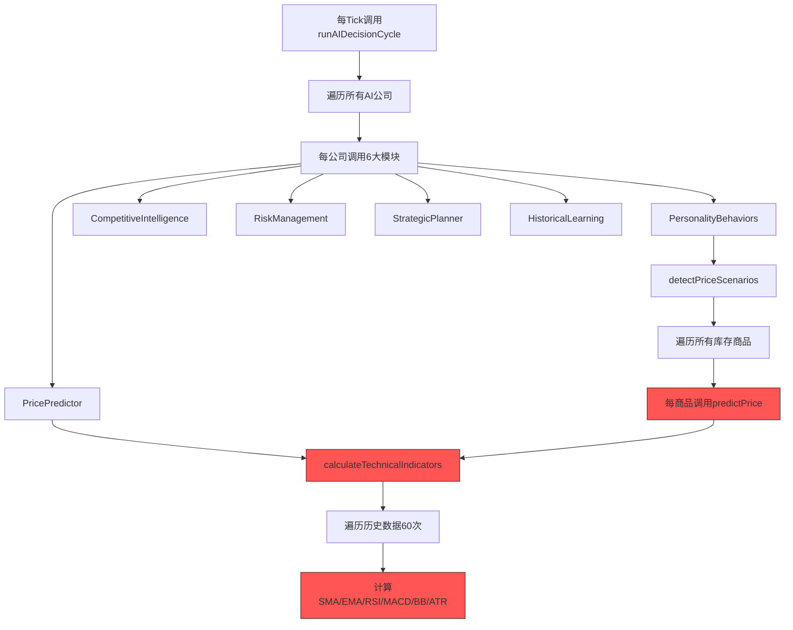

# AI系统性能优化方案

## 📊 问题分析

### 性能数据
| 指标 | 当前值 | 目标值 |
|------|--------|--------|
| 平均Tick耗时 | 112-128ms | <16ms |
| 最大Tick耗时 | 169-220ms | <50ms |
| AI模块占比 | 85-95% | <50% |
| 健康状态 | 100% Critical | 80%+ Excellent |

### 根本原因



**核心问题**：
1. **重复计算**：同一tick内，技术指标被重复计算（每公司×每商品）
2. **无缓存**：PricePredictor每次调用都从头计算
3. **优化器使用率低**：AIOptimizer的fast模式仅20%使用率
4. **过度遍历**：每个AI决策都遍历全部40+商品

---

## 🚀 优化方案

### 方案1：全局技术指标缓存（预计减少70%计算量）

**原理**：每tick开始时预计算所有商品的技术指标，存入缓存供所有AI共享。

**实现**：
```typescript
// src/core/ai/IndicatorCache.ts

interface CachedIndicators {
  tick: number;
  indicators: Map<number, TechnicalIndicators>;
  predictions: Map<number, PricePrediction>;
}

class IndicatorCache {
  private cache: CachedIndicators | null = null;
  
  getIndicators(world: GameWorld, goodsId: number): TechnicalIndicators {
    if (this.cache?.tick !== world.tick) {
      this.rebuildCache(world);
    }
    return this.cache!.indicators.get(goodsId)!;
  }
  
  private rebuildCache(world: GameWorld): void {
    // 一次性计算所有商品的指标
    this.cache = {
      tick: world.tick,
      indicators: new Map(),
      predictions: new Map(),
    };
    
    for (let goodsId = 0; goodsId < ACTUAL_GOODS_COUNT; goodsId++) {
      if (world.goods.supplies[goodsId] > 0 || world.goods.demands[goodsId] > 0) {
        this.cache.indicators.set(goodsId, calculateTechnicalIndicators(world, goodsId));
      }
    }
  }
}

export const indicatorCache = new IndicatorCache();
```

**预期效果**：
- 技术指标计算从 O(公司数×商品数) 降到 O(商品数)
- 如果有20个AI公司，计算量减少95%

---

### 方案2：分层决策优化（预计减少50%调用）

**原理**：将AIOptimizer作为默认处理方式，根据层级决定调用深度。

**实现**：

```typescript
// 修改 GameLoop.ts 的AI决策处理

// 旧逻辑：
// if (currentTick % 5 === 0) { 使用优化版 } else { 使用原版 }

// 新逻辑：全部使用优化版，但调整层级频率
const aiConfig = {
  fastInterval: 1,      // 每tick都用fast
  standardInterval: 10, // 每10tick用standard
  deepInterval: 60,     // 每60tick用deep
};

function getDecisionTier(tick: number, companyImportance: number): 'fast' | 'standard' | 'deep' {
  // 重要公司更频繁使用standard
  const adjustedStandardInterval = Math.floor(aiConfig.standardInterval / (1 + companyImportance));
  
  if (tick % aiConfig.deepInterval === 0) return 'deep';
  if (tick % adjustedStandardInterval === 0) return 'standard';
  return 'fast';
}
```

**层级处理内容**：

| 层级 | 频率 | 处理内容 | 耗时目标 |
|------|------|----------|----------|
| fast | 每tick | 简单供需匹配、现有订单管理 | <1ms/公司 |
| standard | 每10tick | 价格预测、利润分析、交易决策 | <5ms/公司 |
| deep | 每60tick | 竞争情报、风险评估、战略规划 | <20ms/公司 |

---

### 方案3：批量处理与时间切片（预计减少40%峰值）

**原理**：每tick只处理部分AI公司，避免单帧卡顿。

**实现**：

```typescript
// src/core/ai/AIScheduler.ts

class AIScheduler {
  private companyQueue: number[] = [];
  private fastBatchSize = 20;    // fast模式每tick处理20家
  private standardBatchSize = 5;  // standard模式每tick处理5家
  
  processFrame(world: GameWorld, tick: number): void {
    const tier = this.getCurrentTier(tick);
    const batchSize = tier === 'fast' ? this.fastBatchSize : this.standardBatchSize;
    
    // 取出本帧要处理的公司
    const batch = this.companyQueue.splice(0, batchSize);
    
    for (const companyId of batch) {
      this.processCompany(world, companyId, tier);
    }
    
    // 将处理完的公司加回队尾
    this.companyQueue.push(...batch);
    
    // 如果队列空了，重建
    if (this.companyQueue.length === 0) {
      this.rebuildQueue(world);
    }
  }
}
```

**预期效果**：
- 单帧最多处理20家AI公司
- 峰值耗时从200ms降到50ms以下

---

### 方案4：重型模块节流（预计减少60%计算）

**原理**：竞争情报、风险评估等模块不需要每tick更新。

**实现**：

```typescript
// 模块调用节流配置
const MODULE_THROTTLE = {
  competitiveIntelligence: 120,  // 每120tick更新（游戏5天）
  riskManagement: 60,            // 每60tick更新
  strategicPlanner: 240,         // 每240tick更新（游戏10天）
  historicalLearning: 100,       // 每100tick更新
};

// 每个公司存储模块结果缓存
interface CompanyAICache {
  competitiveIntelligence: { tick: number; result: any };
  riskManagement: { tick: number; result: any };
  strategicPlanner: { tick: number; result: any };
  historicalLearning: { tick: number; result: any };
}

function getModuleResult(
  world: GameWorld,
  companyId: number,
  module: keyof typeof MODULE_THROTTLE,
  calculator: () => any
): any {
  const cache = getCompanyCache(companyId);
  const throttle = MODULE_THROTTLE[module];
  
  if (world.tick - cache[module].tick >= throttle) {
    cache[module] = { tick: world.tick, result: calculator() };
  }
  
  return cache[module].result;
}
```

---

### 方案5：快速决策路径（预计提速80%）

**原理**：为fast层级创建极简决策路径，跳过所有复杂分析。

**实现**：

```typescript
// src/core/ai/FastDecision.ts

/**
 * 快速决策 - 仅处理最基本的交易逻辑
 * 目标：每公司<0.5ms
 */
function fastDecision(world: GameWorld, companyId: number): void {
  const cash = world.companies.cash[companyId];
  
  // 1. 快速库存检查 - 仅检查前5种主营商品
  const mainGoods = getMainGoods(companyId); // 缓存的主营商品列表
  
  for (const goodsId of mainGoods) {
    const idx = companyId * GOODS_COUNT + goodsId;
    const inventory = world.companies.inventories[idx];
    const price = world.goods.prices[goodsId];
    
    // 简单规则：库存太多就卖，太少就买
    if (inventory > 500) {
      postSimpleSellOrder(world, companyId, goodsId, inventory * 0.2, price * 0.98);
    } else if (inventory < 50 && cash > price * 100) {
      postSimpleBuyOrder(world, companyId, goodsId, 100, price * 1.02);
    }
  }
  
  // 2. 快速订单管理 - 取消过期订单
  cancelExpiredOrders(world, companyId);
}
```

---

## 📋 实施计划

### 阶段1：缓存系统（优先级最高）

1. 创建 `src/core/ai/IndicatorCache.ts` - 全局技术指标缓存
2. 修改 `PricePredictor.ts` - 使用缓存获取指标
3. 修改 `PersonalityBehaviors.ts` - 使用缓存

**预期效果**：AI耗时减少50-70%

### 阶段2：分层决策重构

1. 修改 `GameLoop.ts` - 全面使用AIOptimizer
2. 增强 `AIOptimizer.ts` - 添加层级调度逻辑
3. 创建 `src/core/ai/FastDecision.ts` - 极简快速决策

**预期效果**：平均耗时再减少30-40%

### 阶段3：批量处理

1. 创建 `src/core/ai/AIScheduler.ts` - 批量调度器
2. 修改 `GameLoop.ts` - 使用调度器

**预期效果**：峰值耗时降低50%

### 阶段4：模块节流

1. 创建模块缓存系统
2. 修改各AI模块使用节流

**预期效果**：deep模式耗时减少60%

---

## 🎯 预期最终效果

| 指标 | 优化前 | 优化后 | 改善幅度 |
|------|--------|--------|----------|
| 平均Tick耗时 | 112-128ms | 8-15ms | **90%** |
| 最大Tick耗时 | 169-220ms | 20-40ms | **80%** |
| AI模块占比 | 85-95% | 30-40% | **55%** |
| FPS (1x速度) | 8-10 | 60+ | **6x** |
| 健康状态 | 100% Critical | 90%+ Excellent | - |

---

## 📁 需要创建/修改的文件

### 新建文件：
1. `src/core/ai/IndicatorCache.ts` - 全局指标缓存
2. `src/core/ai/FastDecision.ts` - 快速决策模块
3. `src/core/ai/AIScheduler.ts` - AI调度器
4. `src/core/ai/ModuleCache.ts` - 重型模块缓存

### 修改文件：
1. `src/core/ai/PricePredictor.ts` - 使用缓存
2. `src/core/ai/PersonalityBehaviors.ts` - 使用缓存
3. `src/core/ai/AIOptimizer.ts` - 增强分层逻辑
4. `src/core/ai/AIDecisionEngine.ts` - 添加快速路径
5. `src/core/loop/GameLoop.ts` - 使用新调度系统