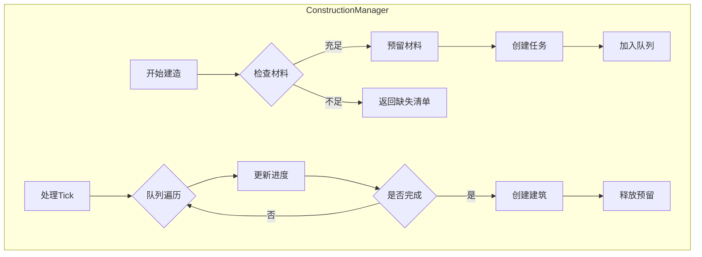
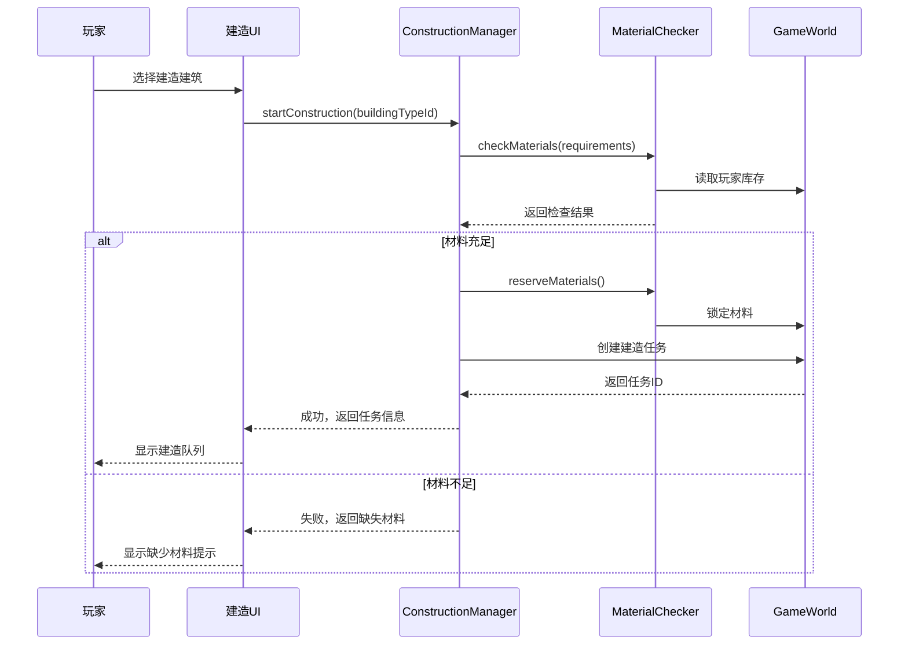
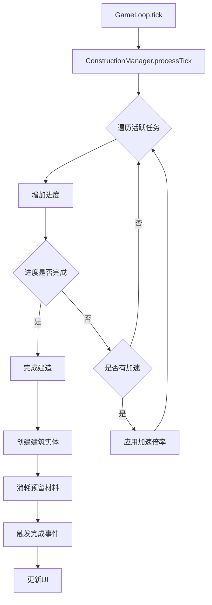

# 建筑建造系统设计方案

## 一、架构概述

### 1.1 现有系统分析

通过对项目代码的深入分析，发现：

| 组件 | 现状 | 说明 |
|------|------|------|
| 建筑定义 | ✅ 已有 | 107种建筑类型在 `src/data/buildings.ts` |
| 商品系统 | ✅ 已有 | 230种商品在 `src/data/goods.ts` |
| 库存系统 | ✅ 已有 | `CompaniesSystem.inventories` 管理玩家资源 |
| 建造成本 | ⚠️ 仅现金 | `buildCost` 字段只有货币成本 |
| 建造时间 | ⚠️ 未实现 | `buildTime` 字段已定义但未使用 |
| 建造队列 | ❌ 缺失 | 需要新增 |
| 材料需求 | ❌ 缺失 | 需要新增 |
| 建造UI | ❌ 缺失 | 需要新增 |

### 1.2 设计原则

1. **与现有架构兼容**：遵循项目的SoA设计模式
2. **高性能**：使用TypedArray存储建造队列数据
3. **可扩展**：支持新建筑类型和材料种类
4. **数据驱动**：材料需求通过配置定义

---

## 二、数据结构设计

### 2.1 建筑材料需求配置

```typescript
// src/data/buildingMaterials.ts

/** 材料需求定义 */
export interface MaterialRequirement {
  goodsId: number;     // 商品ID
  amount: number;       // 所需数量
  optional?: boolean;   // 是否可选（可用其他材料替代）
}

/** 建筑建造配置 */
export interface BuildingConstructionConfig {
  buildingTypeId: number;                    // 建筑类型ID
  baseMaterials: MaterialRequirement[];       // 基础建造材料
  upgradeMaterials: MaterialRequirement[][];  // 各等级升级材料 [level1, level2, ...]
  buildTime: number;                          // 建造时间（tick）
  unlockConditions?: {
    requiredBuildings?: number[];            // 前置建筑类型ID
    requiredLevel?: number;                  // 需要玩家等级
    requiredTech?: string[];                 // 需要解锁的科技
  };
  workers?: number;                          // 建造所需工人数
}

/** 所有建筑的建造配置 */
export const BUILDING_CONSTRUCTION_CONFIGS: Map<number, BuildingConstructionConfig>;
```

### 2.2 建造队列数据结构

```typescript
// src/core/construction/ConstructionQueue.ts

/** 建造任务状态 */
export enum ConstructionStatus {
  QUEUED = 0,        // 排队中
  BUILDING = 1,      // 建造中
  PAUSED = 2,        // 暂停
  COMPLETED = 3,     // 已完成
  CANCELLED = 4,     // 已取消
}

/** 建造任务类型 */
export enum ConstructionType {
  NEW_BUILDING = 0,  // 新建建筑
  UPGRADE = 1,       // 升级建筑
  DEMOLISH = 2,      // 拆除建筑
}

/** 建造队列系统数据（SoA设计） */
export interface ConstructionQueueSystem {
  maxTasks: number;
  activeCount: number;
  
  // 任务基础信息
  taskIds: Uint32Array;              // 任务唯一ID
  companyIds: Uint16Array;           // 所属公司
  buildingTypeIds: Uint8Array;       // 建筑类型
  taskTypes: Uint8Array;             // 任务类型（新建/升级）
  statuses: Uint8Array;              // 任务状态
  targetLevels: Uint8Array;          // 目标等级（升级时使用）
  
  // 时间追踪
  startTicks: Uint32Array;           // 开始时间
  requiredTicks: Uint32Array;        // 所需时间
  progressTicks: Uint32Array;        // 已完成时间
  
  // 加速道具
  speedBoosts: Float32Array;         // 速度加成倍率
  
  // 预留库存的材料索引
  reservedMaterialsStart: Uint32Array;  // 预留材料起始索引
  reservedMaterialsCount: Uint8Array;   // 预留材料数量
  
  // 建筑引用（升级时使用）
  existingBuildingIds: Int16Array;   // -1 表示新建
  
  // 元数据
  nextTaskId: number;
}

/** 预留材料数据 */
export interface ReservedMaterialsPool {
  maxEntries: number;
  count: number;
  
  taskIds: Uint32Array;      // 关联的任务ID
  goodsIds: Uint16Array;     // 商品ID
  amounts: Float32Array;     // 预留数量
}
```

### 2.3 扩展 GameWorld

```typescript
// 在 src/core/world/GameWorld.ts 中新增

export interface GameWorld {
  // ... 现有字段 ...
  
  /** 建造队列系统 */
  construction: ConstructionQueueSystem;
  
  /** 预留材料池 */
  reservedMaterials: ReservedMaterialsPool;
}
```

---

## 三、材料配置示例

### 3.1 采掘类建筑材料

```typescript
// 铁矿场 (ID: 0)
{
  buildingTypeId: 0,
  baseMaterials: [
    { goodsId: 6, amount: 500 },    // 木材 500
    { goodsId: 14, amount: 200 },   // 钢材 200
    { goodsId: 21, amount: 300 },   // 水泥 300
    { goodsId: 31, amount: 50 },    // 机械部件 50
  ],
  upgradeMaterials: [
    [],  // 1级无需材料
    [    // 升级到2级
      { goodsId: 14, amount: 100 },
      { goodsId: 31, amount: 30 },
    ],
    [    // 升级到3级
      { goodsId: 14, amount: 200 },
      { goodsId: 31, amount: 60 },
      { goodsId: 26, amount: 20 },  // 电子元件
    ],
    // ...
  ],
  buildTime: 48,  // 2天
  unlockConditions: {
    requiredBuildings: [],  // 无前置
  },
}

// 半导体厂 (ID: 17) - 高科技建筑
{
  buildingTypeId: 17,
  baseMaterials: [
    { goodsId: 14, amount: 2000 },  // 钢材
    { goodsId: 17, amount: 1000 },  // 玻璃
    { goodsId: 21, amount: 1500 },  // 水泥
    { goodsId: 26, amount: 500 },   // 电子元件
    { goodsId: 27, amount: 100 },   // 芯片
    { goodsId: 51, amount: 20 },    // 工业机器人
    { goodsId: 222, amount: 50 },   // 光刻胶
    { goodsId: 223, amount: 100 },  // 惰性气体
  ],
  buildTime: 240,  // 10天
  unlockConditions: {
    requiredBuildings: [16, 10],  // 需要先有电子厂和化工厂
    requiredLevel: 5,
  },
}
```

---

## 四、核心功能模块

### 4.1 建造管理器 (ConstructionManager)



#### 主要方法：

```typescript
class ConstructionManager {
  /** 检查是否可以建造 */
  canConstruct(
    world: GameWorld,
    companyId: number,
    buildingTypeId: number,
  ): { canBuild: boolean; missingMaterials: MaterialRequirement[] };
  
  /** 开始建造新建筑 */
  startConstruction(
    world: GameWorld,
    companyId: number,
    buildingTypeId: number,
    recipeId?: number,
  ): { success: boolean; taskId?: number; error?: string };
  
  /** 开始升级建筑 */
  startUpgrade(
    world: GameWorld,
    buildingId: number,
    targetLevel: number,
  ): { success: boolean; taskId?: number; error?: string };
  
  /** 取消建造任务 */
  cancelConstruction(
    world: GameWorld,
    taskId: number,
  ): { success: boolean; refundedMaterials: MaterialRequirement[] };
  
  /** 使用加速道具 */
  applySpeedBoost(
    world: GameWorld,
    taskId: number,
    boostMultiplier: number,
    duration: number,
  ): boolean;
  
  /** 每tick处理建造进度 */
  processTick(world: GameWorld): void;
  
  /** 获取公司的建造队列 */
  getQueue(world: GameWorld, companyId: number): ConstructionTask[];
  
  /** 获取建造进度百分比 */
  getProgress(world: GameWorld, taskId: number): number;
  
  /** 获取预计完成时间 */
  getEstimatedCompletion(world: GameWorld, taskId: number): number;
}
```

### 4.2 材料检查服务 (MaterialChecker)

```typescript
class MaterialChecker {
  /** 检查材料是否充足 */
  checkMaterials(
    world: GameWorld,
    companyId: number,
    requirements: MaterialRequirement[],
  ): {
    sufficient: boolean;
    available: Map<number, number>;
    missing: MaterialRequirement[];
    totalCost: number;  // 按当前市价计算
  };
  
  /** 预留材料（从库存中锁定） */
  reserveMaterials(
    world: GameWorld,
    companyId: number,
    taskId: number,
    requirements: MaterialRequirement[],
  ): boolean;
  
  /** 消耗已预留的材料 */
  consumeReservedMaterials(
    world: GameWorld,
    taskId: number,
  ): void;
  
  /** 释放预留材料（取消时返还） */
  releaseReservedMaterials(
    world: GameWorld,
    taskId: number,
  ): MaterialRequirement[];
  
  /** 计算材料的市场价值 */
  calculateMaterialValue(
    world: GameWorld,
    requirements: MaterialRequirement[],
  ): number;
}
```

### 4.3 建造队列处理器 (QueueProcessor)

```typescript
class QueueProcessor {
  /** 处理每tick的建造进度 */
  processQueue(world: GameWorld): ConstructionEvent[];
  
  /** 完成建造任务 */
  completeTask(world: GameWorld, taskId: number): number;  // 返回新建筑ID
  
  /** 检查前置条件 */
  checkPrerequisites(
    world: GameWorld,
    companyId: number,
    buildingTypeId: number,
  ): { met: boolean; missing: string[] };
  
  /** 获取队列中的下一个任务 */
  getNextTask(world: GameWorld, companyId: number): number | null;
}
```

---

## 五、UI 组件设计

### 5.1 组件层次结构

```
BuildingConstructionPanel/
├── BuildingCategoryTabs          # 建筑分类标签
├── BuildingGrid                  # 建筑卡片网格
│   └── BuildingCard             # 单个建筑卡片
│       ├── BuildingIcon         # 建筑图标
│       ├── MaterialRequirements # 材料需求列表
│       │   └── MaterialRow      # 单个材料行
│       ├── BuildTimeInfo        # 建造时间信息
│       └── BuildButton          # 建造按钮
├── ConstructionQueue            # 建造队列面板
│   └── QueueItem                # 队列项
│       ├── ProgressBar          # 进度条
│       ├── TimeRemaining        # 剩余时间
│       └── CancelButton         # 取消按钮
└── MaterialInventory            # 材料仓库概览
```

### 5.2 建筑卡片组件

```tsx
// src/ui/components/Construction/BuildingCard.tsx

interface BuildingCardProps {
  buildingType: BuildingTypeDefinition;
  constructionConfig: BuildingConstructionConfig;
  playerInventory: Map<number, number>;
  onBuild: (buildingTypeId: number) => void;
}

const BuildingCard: React.FC<BuildingCardProps> = ({
  buildingType,
  constructionConfig,
  playerInventory,
  onBuild,
}) => {
  return (
    <div className="building-card">
      <div className="building-header">
        <BuildingIcon typeId={buildingType.id} />
        <h3>{buildingType.name}</h3>
      </div>
      
      <div className="material-requirements">
        <h4>所需材料:</h4>
        {constructionConfig.baseMaterials.map(req => (
          <MaterialRow
            key={req.goodsId}
            goodsId={req.goodsId}
            required={req.amount}
            available={playerInventory.get(req.goodsId) ?? 0}
          />
        ))}
      </div>
      
      <div className="build-info">
        <span>建造时间: {formatTime(constructionConfig.buildTime)}</span>
        <span>建造费用: ${buildingType.buildCost.toLocaleString()}</span>
      </div>
      
      <button 
        className={canBuild ? "build-btn" : "build-btn disabled"}
        onClick={() => onBuild(buildingType.id)}
        disabled={!canBuild}
      >
        {canBuild ? "开始建造" : "材料不足"}
      </button>
    </div>
  );
};
```

### 5.3 材料行组件（颜色反馈）

```tsx
// src/ui/components/Construction/MaterialRow.tsx

interface MaterialRowProps {
  goodsId: number;
  required: number;
  available: number;
}

const MaterialRow: React.FC<MaterialRowProps> = ({
  goodsId,
  required,
  available,
}) => {
  const goods = GOODS_BY_ID.get(goodsId);
  const sufficient = available >= required;
  const ratio = Math.min(available / required, 1);
  
  return (
    <div className={`material-row ${sufficient ? 'sufficient' : 'insufficient'}`}>
      <span className="material-name">{goods?.name}</span>
      <span className="material-amount">
        <span style={{ color: getColor(ratio) }}>
          {available.toFixed(0)}
        </span>
        <span className="separator">/</span>
        <span>{required.toFixed(0)}</span>
      </span>
      {!sufficient && (
        <span className="shortage">
          (缺少 {(required - available).toFixed(0)})
        </span>
      )}
    </div>
  );
};

// 颜色计算：绿色(充足) -> 黄色(部分) -> 红色(不足)
function getColor(ratio: number): string {
  if (ratio >= 1) return '#10b981';  // 绿色
  if (ratio >= 0.5) return '#f59e0b'; // 黄色
  return '#ef4444';  // 红色
}
```

### 5.4 建造队列组件

```tsx
// src/ui/components/Construction/ConstructionQueue.tsx

interface ConstructionQueueProps {
  tasks: ConstructionTask[];
  onCancel: (taskId: number) => void;
  onBoost: (taskId: number) => void;
}

const ConstructionQueue: React.FC<ConstructionQueueProps> = ({
  tasks,
  onCancel,
  onBoost,
}) => {
  return (
    <div className="construction-queue">
      <h3>建造队列 ({tasks.length}/5)</h3>
      
      {tasks.length === 0 ? (
        <p className="empty-queue">暂无建造任务</p>
      ) : (
        <div className="queue-list">
          {tasks.map((task, index) => (
            <QueueItem
              key={task.id}
              task={task}
              position={index + 1}
              onCancel={() => onCancel(task.id)}
              onBoost={() => onBoost(task.id)}
            />
          ))}
        </div>
      )}
    </div>
  );
};
```

### 5.5 进度条组件

```tsx
// src/ui/components/Construction/ProgressBar.tsx

interface ProgressBarProps {
  current: number;
  total: number;
  status: ConstructionStatus;
  speedBoost?: number;
}

const ProgressBar: React.FC<ProgressBarProps> = ({
  current,
  total,
  status,
  speedBoost = 1,
}) => {
  const progress = (current / total) * 100;
  const remaining = total - current;
  const adjustedRemaining = Math.ceil(remaining / speedBoost);
  
  return (
    <div className="progress-container">
      <div className="progress-bar">
        <div 
          className={`progress-fill ${getStatusClass(status)}`}
          style={{ width: `${progress}%` }}
        />
      </div>
      <div className="progress-info">
        <span>{progress.toFixed(1)}%</span>
        <span>剩余: {formatTime(adjustedRemaining)}</span>
        {speedBoost > 1 && (
          <span className="boost-indicator">⚡{speedBoost}x</span>
        )}
      </div>
    </div>
  );
};
```

---

## 六、数据流设计

### 6.1 建造流程时序图



### 6.2 Tick处理流程



---

## 七、文件结构

```
src/
├── core/
│   └── construction/
│       ├── index.ts                    # 导出模块
│       ├── ConstructionManager.ts      # 建造管理器
│       ├── ConstructionQueue.ts        # 队列数据结构
│       ├── MaterialChecker.ts          # 材料检查服务
│       ├── QueueProcessor.ts           # 队列处理器
│       └── ConstructionEvents.ts       # 建造事件定义
├── data/
│   └── buildingMaterials.ts           # 建筑材料配置
└── ui/
    └── components/
        └── Construction/
            ├── index.ts                # 导出组件
            ├── BuildingConstructionPanel.tsx
            ├── BuildingCard.tsx
            ├── BuildingCategoryTabs.tsx
            ├── MaterialRow.tsx
            ├── ConstructionQueue.tsx
            ├── QueueItem.tsx
            ├── ProgressBar.tsx
            └── Construction.css        # 样式文件
```

---

## 八、扩展性设计

### 8.1 支持新建筑类型

新建筑只需在 `BUILDING_CONSTRUCTION_CONFIGS` 添加配置：

```typescript
// 添加新建筑材料配置
BUILDING_CONSTRUCTION_CONFIGS.set(newBuildingId, {
  buildingTypeId: newBuildingId,
  baseMaterials: [...],
  upgradeMaterials: [...],
  buildTime: 72,
  unlockConditions: {...},
});
```

### 8.2 支持新材料种类

新商品自动可用于建造系统，只需在配置中引用：

```typescript
baseMaterials: [
  { goodsId: NEW_GOODS_ID, amount: 100 },
]
```

### 8.3 前置依赖系统

```typescript
interface UnlockConditions {
  requiredBuildings?: number[];      // 需要拥有的建筑
  requiredBuildingLevels?: Map<number, number>;  // 建筑等级要求
  requiredTech?: string[];           // 科技树解锁
  requiredPlayerLevel?: number;      // 玩家等级
  requiredReputation?: number;       // 声望要求
  requiredAchievements?: string[];   // 成就解锁
}
```

### 8.4 加速道具系统

```typescript
interface SpeedBoostItem {
  id: string;
  name: string;
  multiplier: number;     // 速度倍率 (如 2.0 = 2倍速)
  duration: number;       // 持续时间(tick)
  instantComplete?: boolean;  // 是否立即完成
  cost: number;           // 道具价格
}

const SPEED_BOOST_ITEMS: SpeedBoostItem[] = [
  { id: 'rush_order', name: '加急订单', multiplier: 2.0, duration: 24, cost: 10000 },
  { id: 'overtime', name: '加班建造', multiplier: 1.5, duration: 48, cost: 5000 },
  { id: 'instant_build', name: '立即完成', multiplier: 1, duration: 0, instantComplete: true, cost: 50000 },
];
```

---

## 九、实现状态 (已完成)

### 阶段1: 核心功能 ✅ 已完成
- [x] 设计数据结构
- [x] 实现 `ConstructionQueueSystem` - `src/core/construction/ConstructionTick.ts`
- [x] 实现材料检查功能
- [x] 实现 `startConstruction()` - 开始建造
- [x] 实现 `processTick()` - 每tick处理建造进度
- [x] 创建完整建筑材料配置 (107种建筑) - `src/data/buildingMaterials.ts`

### 阶段2: 完整功能 ✅ 已完成
- [x] 实现取消和退款机制 - `cancelConstruction()`, `cancelDemolition()`
- [x] 实现拆除建筑功能 - `startDemolition()`, 材料回收
- [x] 完善所有建筑的材料配置 (真实材料：钢材、水泥、木材等)
- [x] 实现自动挂单采购缺失材料

### 阶段3: UI实现 ✅ 已完成
- [x] 建筑选择面板 - `BuildingCatalog.tsx`
- [x] 材料需求展示 - `BuildModal.tsx` 显示材料需求和库存状态
- [x] 建造队列界面 - `ConstructionQueuePanel.tsx`
- [x] 进度条和时间显示
- [x] 拆除功能UI - `BuildingDetailPanel.tsx` 添加拆除按钮

### 阶段4: 高级功能 (待实现)
- [ ] 加速道具系统
- [ ] 批量建造
- [ ] 建造模板/预设

---

## 十、已实现的文件清单

### 核心模块
| 文件 | 说明 |
|------|------|
| `src/core/construction/index.ts` | 模块导出 |
| `src/core/construction/ConstructionTick.ts` | 建造/拆除队列处理核心逻辑 |

### 数据配置
| 文件 | 说明 |
|------|------|
| `src/data/buildingMaterials.ts` | 107种建筑的材料需求配置 |

### UI组件
| 文件 | 说明 |
|------|------|
| `src/ui/components/Production/ConstructionQueuePanel.tsx` | 建造队列悬浮面板 |
| `src/ui/components/Production/BuildModal.tsx` | 建造确认弹窗(显示材料) |
| `src/ui/components/Production/BuildingDetailPanel.tsx` | 建筑详情(含拆除功能) |

### 状态管理
| 文件 | 说明 |
|------|------|
| `src/stores/gameStore.ts` | 新增建造队列相关方法 |

### 游戏世界
| 文件 | 说明 |
|------|------|
| `src/core/world/GameWorld.ts` | 添加 construction/demolition 队列结构 |
| `src/core/world/WorldInitializer.ts` | 初始化队列系统 |
| `src/core/loop/GameLoop.ts` | 集成 processConstructionTick() |

---

## 十一、材料系统特点

### 真实材料需求
系统使用实际商品作为建造材料，涵盖完整的产业链产品：

#### 基础材料
- **钢材(14)**: 建筑结构主体
- **水泥(21)**: 地基和混凝土结构
- **木材(6)**: 装修和临时建筑
- **砖块(152)**: 墙体建造

#### 中间产品
- **电子元件(26)**: 自动化控制系统
- **机械部件(31)**: 生产设备
- **电机(29)**: 动力系统
- **变压器(184)**: 电力系统
- **电力电缆(185)**: 供电线路
- **传感器(188)**: 监控系统

#### 最终产品（新增！）
建筑现在使用最终产品作为展示和运营设备：

| 建筑类型 | 所需最终产品 | 用途 |
|---------|-------------|------|
| **电子商城** | 电脑(39)、智能手机(38)、平板(194)、智能手表(195)、路由器(191) | 展示商品 |
| **汽车4S店** | 汽车(41)、电动汽车(42)、摩托车(122) | 展示车辆 |
| **服装店** | 服装(43)、鞋子(149)、皮具(148) | 展示服饰 |
| **奢侈品店** | 奢侈品(53)、珠宝(54)、高端手机(55) | 展示高端产品 |
| **药店** | 医疗设备(48) | 健康检测 |
| **家居商城** | 家具(46)、卫浴设备(157)、家电(40)、装饰品(159)、餐具(158) | 展示家居产品 |
| **体育用品店** | 自行车(121)、电动滑板车(123)、运动器材(218)、运动鞋(149) | 展示体育产品 |
| **玩具店** | 玩具(217)、电子游戏(216) | 展示玩具 |
| **乐器店** | 乐器(219)、音乐专辑(214) | 展示乐器 |
| **书店** | 图书(212) | 展示书籍 |
| **物流中心** | 无人机(52)、公交车(127)、电脑(39)、路由器(191) | 物流设备 |
| **发电厂** | 光伏系统(49)、储能系统(50)、风力发电机(183) | 发电设备 |
| **学校** | 电脑(39)、平板(194)、图书(212)、屏幕(30) | 教学设备 |
| **医院** | 医疗设备(48)、工业机器人(51)、卫浴设备(157) | 医疗设施 |
| **酒店** | 家具(46)、家电(40)、卫浴设备(157)、装饰品(159) | 客房设施 |
| **运输公司** | 公交车(127)、汽车(41)、无人机(52) | 运输车辆 |

### 拆除回收系统
- 现金回收: 建造成本的 30%
- 材料回收: 建造材料的 50%
- 拆除时间: 建造时间的 50%

### 自动挂单功能
当玩家缺少建造材料时，系统会：
1. 自动在市场创建买单
2. 使用当前市价的 1.1 倍作为出价
3. 订单有效期为 100 ticks

---

## 十、性能考虑

1. **使用TypedArray**：建造队列使用 `Uint32Array` 等高效数据结构
2. **批量处理**：每tick批量更新所有活跃任务的进度
3. **惰性计算**：仅在需要时计算材料价值
4. **索引优化**：使用 `companyId` 索引快速查询公司队列
5. **内存池**：预分配固定大小的任务数组，避免动态分配

```typescript
// 建议配置
const MAX_CONSTRUCTION_TASKS = 1000;  // 最大同时建造任务数
const MAX_RESERVED_MATERIALS = 5000;  // 最大预留材料条目
const MAX_QUEUE_PER_COMPANY = 10;     // 每公司最大队列数
```

---

## 十一、与现有系统集成

### 11.1 GameLoop 集成

```typescript
// src/core/loop/GameLoop.ts

function tick(world: GameWorld): void {
  // ... 现有逻辑 ...
  
  // 处理建造队列
  constructionManager.processTick(world);
  
  // ... 继续其他处理 ...
}
```

### 11.2 存档系统集成

```typescript
// src/core/save/SaveManager.ts

function saveGame(world: GameWorld): SaveData {
  return {
    // ... 现有数据 ...
    construction: serializeConstructionQueue(world.construction),
    reservedMaterials: serializeReservedMaterials(world.reservedMaterials),
  };
}
```

### 11.3 AI系统集成

```typescript
// AI公司也可以使用建造系统
function aiDecideConstruction(world: GameWorld, companyId: number): void {
  const canBuild = constructionManager.canConstruct(world, companyId, targetBuilding);
  if (canBuild.canBuild) {
    constructionManager.startConstruction(world, companyId, targetBuilding);
  }
}
```

---

本设计方案提供了完整的建筑建造系统架构，涵盖数据结构、核心逻辑、UI组件和扩展性考虑。是否需要我对某个部分进行更详细的说明，或者开始进入代码实现阶段？