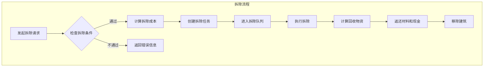

# 建筑建造系统设计方案 V2

## 修订说明

本版本在V1基础上进行了以下重大改进：
1. **材料系统升级**：使用更多种类的商品，按建筑特性定制材料需求
2. **新增拆除系统**：完整的建筑拆除功能，包括材料回收、现金返还、拆除成本

---

## 一、建筑材料需求设计原则

### 1.1 材料分类体系

根据建筑类型，材料需求分为以下几类：

| 材料类别 | 说明 | 适用建筑 |
|---------|------|---------|
| **基础结构材料** | 钢材、水泥、砖、木板等 | 所有建筑 |
| **建筑装饰材料** | 玻璃、瓷砖、涂料、装饰材料 | 所有建筑 |
| **电气设备** | 电力电缆、变压器、电子元件 | 工业建筑 |
| **机械设备** | 机械部件、轴承、电机 | 生产建筑 |
| **专业设备** | 按建筑类型定制的特殊设备 | 特定建筑 |
| **安全环保设备** | 过滤器、密封件等 | 化工/医药建筑 |

### 1.2 材料需求计算公式

```
总材料需求 = 基础材料 × 建筑规模系数 + 专业材料
```

---

## 二、详细材料配置

### 2.1 采掘类建筑材料

#### 铁矿场 (ID: 0)
```typescript
{
  buildingTypeId: 0,
  baseMaterials: [
    // 基础结构
    { goodsId: 14, amount: 800 },    // 钢材 800吨
    { goodsId: 21, amount: 500 },    // 水泥 500吨
    { goodsId: 6, amount: 300 },     // 木材 300立方米
    { goodsId: 152, amount: 200 },   // 砖 200万块
    
    // 电气设备
    { goodsId: 185, amount: 5 },     // 电力电缆 5公里
    { goodsId: 184, amount: 3 },     // 变压器 3台
    { goodsId: 29, amount: 10 },     // 电机 10台
    
    // 机械设备
    { goodsId: 31, amount: 100 },    // 机械部件 100套
    { goodsId: 226, amount: 200 },   // 轴承 200套
    { goodsId: 227, amount: 100 },   // 弹簧 100件
    
    // 专业设备
    { goodsId: 81, amount: 50 },     // 炸药 50吨（采矿用）
  ],
  buildTime: 48,
}

// 铜矿场 (ID: 1)
{
  buildingTypeId: 1,
  baseMaterials: [
    { goodsId: 14, amount: 900 },    // 钢材
    { goodsId: 21, amount: 550 },    // 水泥
    { goodsId: 6, amount: 280 },     // 木材
    { goodsId: 152, amount: 220 },   // 砖
    { goodsId: 185, amount: 6 },     // 电力电缆
    { goodsId: 184, amount: 4 },     // 变压器
    { goodsId: 29, amount: 12 },     // 电机
    { goodsId: 31, amount: 120 },    // 机械部件
    { goodsId: 226, amount: 250 },   // 轴承
    { goodsId: 81, amount: 60 },     // 炸药
    { goodsId: 20, amount: 30 },     // 化学品（选矿用）
  ],
  buildTime: 48,
}

// 煤矿 (ID: 2)
{
  buildingTypeId: 2,
  baseMaterials: [
    { goodsId: 14, amount: 600 },    // 钢材
    { goodsId: 21, amount: 400 },    // 水泥
    { goodsId: 6, amount: 400 },     // 木材（矿井支撑）
    { goodsId: 152, amount: 150 },   // 砖
    { goodsId: 185, amount: 8 },     // 电力电缆（矿井照明通风）
    { goodsId: 184, amount: 2 },     // 变压器
    { goodsId: 29, amount: 15 },     // 电机（通风、提升）
    { goodsId: 31, amount: 80 },     // 机械部件
    { goodsId: 229, amount: 50 },    // 过滤器（防尘）
    { goodsId: 228, amount: 100 },   // 密封件
  ],
  buildTime: 36,
}

// 油田 (ID: 3)
{
  buildingTypeId: 3,
  baseMaterials: [
    { goodsId: 14, amount: 2000 },   // 钢材（钻井平台、管道）
    { goodsId: 21, amount: 800 },    // 水泥
    { goodsId: 80, amount: 500 },    // 特种钢材（耐腐蚀）
    { goodsId: 185, amount: 15 },    // 电力电缆
    { goodsId: 184, amount: 8 },     // 变压器
    { goodsId: 29, amount: 30 },     // 电机（抽油机）
    { goodsId: 31, amount: 300 },    // 机械部件
    { goodsId: 228, amount: 500 },   // 密封件（防泄漏）
    { goodsId: 229, amount: 100 },   // 过滤器
    { goodsId: 19, amount: 200 },    // 橡胶制品（密封）
  ],
  buildTime: 96,
}

// 气田 (ID: 4)
{
  buildingTypeId: 4,
  baseMaterials: [
    { goodsId: 14, amount: 1800 },   // 钢材
    { goodsId: 21, amount: 700 },    // 水泥
    { goodsId: 80, amount: 400 },    // 特种钢材
    { goodsId: 185, amount: 12 },    // 电力电缆
    { goodsId: 184, amount: 6 },     // 变压器
    { goodsId: 29, amount: 25 },     // 电机
    { goodsId: 31, amount: 250 },    // 机械部件
    { goodsId: 228, amount: 600 },   // 密封件（高压密封）
    { goodsId: 229, amount: 80 },    // 过滤器
    { goodsId: 188, amount: 20 },    // 传感器（气体检测）
  ],
  buildTime: 84,
}

// 伐木场 (ID: 5)
{
  buildingTypeId: 5,
  baseMaterials: [
    { goodsId: 14, amount: 200 },    // 钢材
    { goodsId: 21, amount: 150 },    // 水泥
    { goodsId: 6, amount: 500 },     // 木材（仓库、工棚）
    { goodsId: 185, amount: 2 },     // 电力电缆
    { goodsId: 29, amount: 5 },      // 电机（锯木机）
    { goodsId: 31, amount: 50 },     // 机械部件
    { goodsId: 25, amount: 500 },    // 燃油（林业机械）
  ],
  buildTime: 24,
}

// 农场 (ID: 6)
{
  buildingTypeId: 6,
  baseMaterials: [
    { goodsId: 14, amount: 150 },    // 钢材
    { goodsId: 21, amount: 200 },    // 水泥
    { goodsId: 6, amount: 400 },     // 木材（仓库、畜舍）
    { goodsId: 152, amount: 300 },   // 砖
    { goodsId: 185, amount: 3 },     // 电力电缆
    { goodsId: 29, amount: 8 },      // 电机（灌溉泵）
    { goodsId: 18, amount: 100 },    // 塑料（大棚、管道）
    { goodsId: 25, amount: 300 },    // 燃油（农机）
  ],
  buildTime: 36,
}

// 硅石矿场 (ID: 7)
{
  buildingTypeId: 7,
  baseMaterials: [
    { goodsId: 14, amount: 850 },    // 钢材
    { goodsId: 21, amount: 520 },    // 水泥
    { goodsId: 6, amount: 250 },     // 木材
    { goodsId: 185, amount: 5 },     // 电力电缆
    { goodsId: 184, amount: 3 },     // 变压器
    { goodsId: 29, amount: 10 },     // 电机
    { goodsId: 31, amount: 110 },    // 机械部件
    { goodsId: 226, amount: 220 },   // 轴承
    { goodsId: 81, amount: 55 },     // 炸药
  ],
  buildTime: 48,
}
```

### 2.2 加工类建筑材料

#### 钢铁厂 (ID: 8)
```typescript
{
  buildingTypeId: 8,
  baseMaterials: [
    // 基础结构（大型工业建筑）
    { goodsId: 14, amount: 5000 },   // 钢材
    { goodsId: 21, amount: 3000 },   // 水泥
    { goodsId: 152, amount: 1000 },  // 砖（耐火砖）
    { goodsId: 17, amount: 500 },    // 玻璃
    
    // 电气设备（高耗能）
    { goodsId: 185, amount: 30 },    // 电力电缆
    { goodsId: 184, amount: 20 },    // 变压器
    { goodsId: 29, amount: 50 },     // 电机
    { goodsId: 26, amount: 100 },    // 电子元件（控制系统）
    
    // 机械设备
    { goodsId: 31, amount: 500 },    // 机械部件
    { goodsId: 226, amount: 800 },   // 轴承
    { goodsId: 227, amount: 300 },   // 弹簧
    
    // 专业设备
    { goodsId: 80, amount: 1000 },   // 特种钢材（高炉内衬）
    { goodsId: 229, amount: 200 },   // 过滤器（除尘）
    { goodsId: 228, amount: 300 },   // 密封件
  ],
  buildTime: 96,
}

// 炼油厂 (ID: 9)
{
  buildingTypeId: 9,
  baseMaterials: [
    { goodsId: 14, amount: 6000 },   // 钢材（储罐、管道）
    { goodsId: 21, amount: 2500 },   // 水泥
    { goodsId: 80, amount: 2000 },   // 特种钢材（耐腐蚀）
    { goodsId: 17, amount: 300 },    // 玻璃
    { goodsId: 185, amount: 40 },    // 电力电缆
    { goodsId: 184, amount: 25 },    // 变压器
    { goodsId: 29, amount: 80 },     // 电机（泵）
    { goodsId: 26, amount: 200 },    // 电子元件
    { goodsId: 188, amount: 100 },   // 传感器（温度、压力）
    { goodsId: 31, amount: 600 },    // 机械部件
    { goodsId: 228, amount: 1000 },  // 密封件
    { goodsId: 229, amount: 300 },   // 过滤器
    { goodsId: 224, amount: 50 },    // 催化剂
  ],
  buildTime: 120,
}

// 化工厂 (ID: 10)
{
  buildingTypeId: 10,
  baseMaterials: [
    { goodsId: 14, amount: 4000 },   // 钢材
    { goodsId: 21, amount: 2000 },   // 水泥
    { goodsId: 80, amount: 1500 },   // 特种钢材（耐腐蚀容器）
    { goodsId: 17, amount: 600 },    // 玻璃（实验室）
    { goodsId: 185, amount: 25 },    // 电力电缆
    { goodsId: 184, amount: 15 },    // 变压器
    { goodsId: 29, amount: 60 },     // 电机
    { goodsId: 26, amount: 150 },    // 电子元件
    { goodsId: 188, amount: 80 },    // 传感器
    { goodsId: 31, amount: 400 },    // 机械部件
    { goodsId: 228, amount: 800 },   // 密封件
    { goodsId: 229, amount: 400 },   // 过滤器（废气处理）
    { goodsId: 224, amount: 100 },   // 催化剂
    { goodsId: 155, amount: 200 },   // 涂料（防腐）
  ],
  buildTime: 108,
}

// 玻璃厂 (ID: 11)
{
  buildingTypeId: 11,
  baseMaterials: [
    { goodsId: 14, amount: 1500 },   // 钢材
    { goodsId: 21, amount: 1000 },   // 水泥
    { goodsId: 152, amount: 500 },   // 砖（耐火砖）
    { goodsId: 185, amount: 15 },    // 电力电缆
    { goodsId: 184, amount: 10 },    // 变压器
    { goodsId: 29, amount: 30 },     // 电机
    { goodsId: 31, amount: 200 },    // 机械部件
    { goodsId: 226, amount: 300 },   // 轴承
    { goodsId: 229, amount: 100 },   // 过滤器
  ],
  buildTime: 60,
}

// 纺织厂 (ID: 12)
{
  buildingTypeId: 12,
  baseMaterials: [
    { goodsId: 14, amount: 800 },    // 钢材
    { goodsId: 21, amount: 600 },    // 水泥
    { goodsId: 6, amount: 300 },     // 木材
    { goodsId: 17, amount: 400 },    // 玻璃（采光）
    { goodsId: 185, amount: 10 },    // 电力电缆
    { goodsId: 184, amount: 5 },     // 变压器
    { goodsId: 29, amount: 100 },    // 电机（纺织机）
    { goodsId: 31, amount: 300 },    // 机械部件
    { goodsId: 226, amount: 500 },   // 轴承
    { goodsId: 227, amount: 200 },   // 弹簧
  ],
  buildTime: 48,
}

// 食品厂 (ID: 13)
{
  buildingTypeId: 13,
  baseMaterials: [
    { goodsId: 14, amount: 1000 },   // 钢材（不锈钢设备）
    { goodsId: 21, amount: 700 },    // 水泥
    { goodsId: 153, amount: 500 },   // 瓷砖（卫生要求）
    { goodsId: 17, amount: 300 },    // 玻璃
    { goodsId: 185, amount: 12 },    // 电力电缆
    { goodsId: 184, amount: 6 },     // 变压器
    { goodsId: 29, amount: 40 },     // 电机
    { goodsId: 31, amount: 200 },    // 机械部件
    { goodsId: 229, amount: 150 },   // 过滤器（空气净化）
    { goodsId: 228, amount: 200 },   // 密封件
    { goodsId: 18, amount: 100 },    // 塑料（包装设备）
  ],
  buildTime: 48,
}

// 水泥厂 (ID: 14)
{
  buildingTypeId: 14,
  baseMaterials: [
    { goodsId: 14, amount: 2000 },   // 钢材
    { goodsId: 21, amount: 1500 },   // 水泥
    { goodsId: 152, amount: 800 },   // 砖
    { goodsId: 185, amount: 20 },    // 电力电缆
    { goodsId: 184, amount: 12 },    // 变压器
    { goodsId: 29, amount: 50 },     // 电机（磨机、窑）
    { goodsId: 31, amount: 400 },    // 机械部件
    { goodsId: 226, amount: 600 },   // 轴承
    { goodsId: 229, amount: 300 },   // 过滤器（除尘）
  ],
  buildTime: 72,
}

// 铝冶炼厂 (ID: 15)
{
  buildingTypeId: 15,
  baseMaterials: [
    { goodsId: 14, amount: 3000 },   // 钢材
    { goodsId: 21, amount: 1800 },   // 水泥
    { goodsId: 152, amount: 600 },   // 砖
    { goodsId: 185, amount: 50 },    // 电力电缆（高耗电）
    { goodsId: 184, amount: 30 },    // 变压器
    { goodsId: 29, amount: 40 },     // 电机
    { goodsId: 26, amount: 80 },     // 电子元件
    { goodsId: 31, amount: 350 },    // 机械部件
    { goodsId: 229, amount: 200 },   // 过滤器
    { goodsId: 20, amount: 100 },    // 化学品（电解液）
  ],
  buildTime: 84,
}
```

### 2.3 制造类建筑材料

#### 电子厂 (ID: 16)
```typescript
{
  buildingTypeId: 16,
  baseMaterials: [
    // 基础结构（洁净厂房）
    { goodsId: 14, amount: 3000 },   // 钢材
    { goodsId: 21, amount: 2000 },   // 水泥
    { goodsId: 17, amount: 1000 },   // 玻璃
    { goodsId: 153, amount: 800 },   // 瓷砖
    { goodsId: 155, amount: 500 },   // 涂料（防静电）
    
    // 电气设备
    { goodsId: 185, amount: 30 },    // 电力电缆
    { goodsId: 184, amount: 15 },    // 变压器
    { goodsId: 29, amount: 50 },     // 电机
    { goodsId: 26, amount: 500 },    // 电子元件
    { goodsId: 188, amount: 100 },   // 传感器
    
    // 洁净室设备
    { goodsId: 229, amount: 500 },   // 过滤器（HEPA）
    { goodsId: 223, amount: 200 },   // 惰性气体
    { goodsId: 31, amount: 300 },    // 机械部件
  ],
  buildTime: 120,
}

// 半导体厂 (ID: 17)
{
  buildingTypeId: 17,
  baseMaterials: [
    // 超洁净厂房
    { goodsId: 14, amount: 8000 },   // 钢材
    { goodsId: 21, amount: 5000 },   // 水泥
    { goodsId: 17, amount: 3000 },   // 玻璃
    { goodsId: 153, amount: 2000 },  // 瓷砖
    { goodsId: 155, amount: 1000 },  // 涂料
    
    // 电气设备
    { goodsId: 185, amount: 100 },   // 电力电缆
    { goodsId: 184, amount: 50 },    // 变压器
    { goodsId: 29, amount: 100 },    // 电机
    { goodsId: 26, amount: 2000 },   // 电子元件
    { goodsId: 27, amount: 500 },    // 芯片（控制系统）
    { goodsId: 188, amount: 500 },   // 传感器
    
    // 专业设备
    { goodsId: 222, amount: 200 },   // 光刻胶
    { goodsId: 223, amount: 1000 },  // 惰性气体
    { goodsId: 229, amount: 2000 },  // 过滤器（超净）
    { goodsId: 20, amount: 500 },    // 化学品
    { goodsId: 51, amount: 50 },     // 工业机器人
  ],
  buildTime: 240,
}

// 汽车工厂 (ID: 18)
{
  buildingTypeId: 18,
  baseMaterials: [
    { goodsId: 14, amount: 10000 },  // 钢材
    { goodsId: 21, amount: 6000 },   // 水泥
    { goodsId: 17, amount: 2000 },   // 玻璃
    { goodsId: 155, amount: 800 },   // 涂料
    { goodsId: 185, amount: 60 },    // 电力电缆
    { goodsId: 184, amount: 30 },    // 变压器
    { goodsId: 29, amount: 200 },    // 电机
    { goodsId: 26, amount: 500 },    // 电子元件
    { goodsId: 31, amount: 1000 },   // 机械部件
    { goodsId: 226, amount: 1500 },  // 轴承
    { goodsId: 51, amount: 100 },    // 工业机器人
    { goodsId: 225, amount: 200 },   // 胶粘剂
  ],
  buildTime: 168,
}

// 家电厂 (ID: 19)
{
  buildingTypeId: 19,
  baseMaterials: [
    { goodsId: 14, amount: 2500 },   // 钢材
    { goodsId: 21, amount: 1500 },   // 水泥
    { goodsId: 17, amount: 600 },    // 玻璃
    { goodsId: 185, amount: 25 },    // 电力电缆
    { goodsId: 184, amount: 12 },    // 变压器
    { goodsId: 29, amount: 80 },     // 电机
    { goodsId: 26, amount: 300 },    // 电子元件
    { goodsId: 31, amount: 400 },    // 机械部件
    { goodsId: 226, amount: 500 },   // 轴承
    { goodsId: 18, amount: 200 },    // 塑料
  ],
  buildTime: 96,
}

// 电池厂 (ID: 20)
{
  buildingTypeId: 20,
  baseMaterials: [
    { goodsId: 14, amount: 4000 },   // 钢材
    { goodsId: 21, amount: 2500 },   // 水泥
    { goodsId: 17, amount: 800 },    // 玻璃
    { goodsId: 153, amount: 600 },   // 瓷砖
    { goodsId: 185, amount: 40 },    // 电力电缆
    { goodsId: 184, amount: 20 },    // 变压器
    { goodsId: 29, amount: 60 },     // 电机
    { goodsId: 26, amount: 400 },    // 电子元件
    { goodsId: 188, amount: 150 },   // 传感器
    { goodsId: 31, amount: 350 },    // 机械部件
    { goodsId: 229, amount: 300 },   // 过滤器
    { goodsId: 20, amount: 200 },    // 化学品
    { goodsId: 51, amount: 30 },     // 工业机器人
  ],
  buildTime: 144,
}

// 零部件厂 (ID: 21)
{
  buildingTypeId: 21,
  baseMaterials: [
    { goodsId: 14, amount: 2000 },   // 钢材
    { goodsId: 21, amount: 1200 },   // 水泥
    { goodsId: 17, amount: 400 },    // 玻璃
    { goodsId: 185, amount: 20 },    // 电力电缆
    { goodsId: 184, amount: 10 },    // 变压器
    { goodsId: 29, amount: 100 },    // 电机
    { goodsId: 26, amount: 150 },    // 电子元件
    { goodsId: 31, amount: 500 },    // 机械部件
    { goodsId: 226, amount: 800 },   // 轴承
    { goodsId: 227, amount: 400 },   // 弹簧
  ],
  buildTime: 84,
}
```

### 2.4 服务类建筑材料

#### 物流中心 (ID: 22)
```typescript
{
  buildingTypeId: 22,
  baseMaterials: [
    { goodsId: 14, amount: 2000 },   // 钢材（货架、结构）
    { goodsId: 21, amount: 1500 },   // 水泥
    { goodsId: 6, amount: 500 },     // 木材
    { goodsId: 17, amount: 300 },    // 玻璃
    { goodsId: 185, amount: 15 },    // 电力电缆
    { goodsId: 184, amount: 8 },     // 变压器
    { goodsId: 29, amount: 30 },     // 电机（传送带）
    { goodsId: 26, amount: 100 },    // 电子元件（分拣系统）
    { goodsId: 31, amount: 200 },    // 机械部件
  ],
  buildTime: 60,
}

// 仓储中心 (ID: 23)
{
  buildingTypeId: 23,
  baseMaterials: [
    { goodsId: 14, amount: 1500 },   // 钢材
    { goodsId: 21, amount: 1000 },   // 水泥
    { goodsId: 6, amount: 400 },     // 木材
    { goodsId: 185, amount: 10 },    // 电力电缆
    { goodsId: 184, amount: 5 },     // 变压器
    { goodsId: 29, amount: 20 },     // 电机
    { goodsId: 31, amount: 150 },    // 机械部件
  ],
  buildTime: 48,
}

// 发电厂 (ID: 24)
{
  buildingTypeId: 24,
  baseMaterials: [
    { goodsId: 14, amount: 8000 },   // 钢材
    { goodsId: 21, amount: 5000 },   // 水泥
    { goodsId: 152, amount: 1000 },  // 砖
    { goodsId: 17, amount: 500 },    // 玻璃
    { goodsId: 185, amount: 100 },   // 电力电缆
    { goodsId: 184, amount: 50 },    // 变压器
    { goodsId: 29, amount: 100 },    // 电机（发电机）
    { goodsId: 26, amount: 300 },    // 电子元件
    { goodsId: 188, amount: 200 },   // 传感器
    { goodsId: 31, amount: 600 },    // 机械部件
    { goodsId: 226, amount: 800 },   // 轴承
    { goodsId: 229, amount: 400 },   // 过滤器
  ],
  buildTime: 144,
}
```

### 2.5 零售类建筑材料

#### 便利店 (ID: 49)
```typescript
{
  buildingTypeId: 49,
  baseMaterials: [
    { goodsId: 14, amount: 50 },     // 钢材
    { goodsId: 21, amount: 80 },     // 水泥
    { goodsId: 152, amount: 100 },   // 砖
    { goodsId: 17, amount: 100 },    // 玻璃（门窗、展柜）
    { goodsId: 153, amount: 50 },    // 瓷砖
    { goodsId: 155, amount: 30 },    // 涂料
    { goodsId: 185, amount: 1 },     // 电力电缆
    { goodsId: 26, amount: 20 },     // 电子元件（收银系统）
    { goodsId: 40, amount: 5 },      // 家电（冰柜、空调）
  ],
  buildTime: 12,
}

// 超市 (ID: 50)
{
  buildingTypeId: 50,
  baseMaterials: [
    { goodsId: 14, amount: 300 },    // 钢材
    { goodsId: 21, amount: 400 },    // 水泥
    { goodsId: 152, amount: 300 },   // 砖
    { goodsId: 17, amount: 400 },    // 玻璃
    { goodsId: 153, amount: 200 },   // 瓷砖
    { goodsId: 155, amount: 100 },   // 涂料
    { goodsId: 185, amount: 5 },     // 电力电缆
    { goodsId: 184, amount: 2 },     // 变压器
    { goodsId: 26, amount: 50 },     // 电子元件
    { goodsId: 40, amount: 20 },     // 家电
    { goodsId: 46, amount: 50 },     // 家具（货架）
  ],
  buildTime: 36,
}

// 大卖场 (ID: 51)
{
  buildingTypeId: 51,
  baseMaterials: [
    { goodsId: 14, amount: 1500 },   // 钢材
    { goodsId: 21, amount: 2000 },   // 水泥
    { goodsId: 152, amount: 800 },   // 砖
    { goodsId: 17, amount: 1500 },   // 玻璃
    { goodsId: 153, amount: 1000 },  // 瓷砖
    { goodsId: 155, amount: 500 },   // 涂料
    { goodsId: 185, amount: 20 },    // 电力电缆
    { goodsId: 184, amount: 10 },    // 变压器
    { goodsId: 29, amount: 30 },     // 电机（电梯、传送带）
    { goodsId: 26, amount: 200 },    // 电子元件
    { goodsId: 40, amount: 100 },    // 家电
    { goodsId: 46, amount: 200 },    // 家具
  ],
  buildTime: 72,
}
```

---

## 三、建筑拆除系统设计

### 3.1 拆除系统概述



### 3.2 拆除数据结构

```typescript
// src/core/construction/DemolitionSystem.ts

/** 拆除任务状态 */
export enum DemolitionStatus {
  QUEUED = 0,        // 排队中
  IN_PROGRESS = 1,   // 拆除中
  COMPLETED = 2,     // 已完成
  CANCELLED = 3,     // 已取消
}

/** 拆除任务配置 */
export interface DemolitionConfig {
  // 时间配置
  baseDemolitionTime: number;        // 基础拆除时间（tick）
  timePerBuildCost: number;          // 每单位建造成本增加的拆除时间
  
  // 成本配置
  laborCostMultiplier: number;       // 人工成本倍率（相对于建造）
  equipmentCostMultiplier: number;   // 设备成本倍率
  
  // 回收配置
  materialRecoveryRate: number;      // 材料回收率（0-1）
  cashRecoveryRate: number;          // 现金回收率（0-1）
  levelDepreciation: number;         // 每级折旧率
  ageDepreciation: number;           // 每年龄折旧率
  
  // 特殊规则
  hazardousMaterialPenalty: number;  // 危险材料处理惩罚
  rushDemolitionMultiplier: number;  // 加急拆除成本倍率
}

/** 默认拆除配置 */
export const DEFAULT_DEMOLITION_CONFIG: DemolitionConfig = {
  baseDemolitionTime: 12,            // 基础12 tick
  timePerBuildCost: 0.00001,         // 每10万建造成本增加1 tick
  
  laborCostMultiplier: 0.3,          // 人工成本为建造的30%
  equipmentCostMultiplier: 0.1,      // 设备成本为建造的10%
  
  materialRecoveryRate: 0.5,         // 回收50%材料
  cashRecoveryRate: 0.3,             // 回收30%现金
  levelDepreciation: 0.05,           // 每级折旧5%
  ageDepreciation: 0.02,             // 每年折旧2%
  
  hazardousMaterialPenalty: 0.2,     // 危险材料处理额外20%成本
  rushDemolitionMultiplier: 2.0,     // 加急拆除2倍成本
};

/** 拆除任务 */
export interface DemolitionTask {
  taskId: number;
  companyId: number;
  buildingId: number;
  buildingTypeId: number;
  buildingLevel: number;
  buildingAge: number;               // 建筑年龄（tick）
  
  status: DemolitionStatus;
  
  // 时间
  startTick: number;
  requiredTicks: number;
  progressTicks: number;
  
  // 成本
  laborCost: number;
  equipmentCost: number;
  totalCost: number;
  
  // 回收
  recoveredMaterials: MaterialRequirement[];
  recoveredCash: number;
  
  // 选项
  isRush: boolean;                   // 是否加急
  sellMaterials: boolean;            // 是否直接出售回收材料
}

/** 拆除队列系统（SoA设计） */
export interface DemolitionQueueSystem {
  maxTasks: number;
  activeCount: number;
  
  taskIds: Uint32Array;
  companyIds: Uint16Array;
  buildingIds: Uint16Array;
  buildingTypeIds: Uint8Array;
  buildingLevels: Uint8Array;
  buildingAges: Uint32Array;
  
  statuses: Uint8Array;
  
  startTicks: Uint32Array;
  requiredTicks: Uint32Array;
  progressTicks: Uint32Array;
  
  laborCosts: Float32Array;
  equipmentCosts: Float32Array;
  totalCosts: Float32Array;
  
  recoveredCash: Float32Array;
  
  isRush: Uint8Array;
  sellMaterials: Uint8Array;
  
  // 回收材料索引
  recoveredMaterialsStart: Uint32Array;
  recoveredMaterialsCount: Uint8Array;
  
  nextTaskId: number;
}
```

### 3.3 拆除管理器

```typescript
// src/core/construction/DemolitionManager.ts

class DemolitionManager {
  private config: DemolitionConfig;
  
  constructor(config: DemolitionConfig = DEFAULT_DEMOLITION_CONFIG) {
    this.config = config;
  }
  
  /**
   * 检查是否可以拆除建筑
   */
  canDemolish(
    world: GameWorld,
    buildingId: number,
  ): { canDemolish: boolean; reason?: string } {
    const building = getBuildingById(world, buildingId);
    if (!building) {
      return { canDemolish: false, reason: '建筑不存在' };
    }
    
    // 检查是否正在生产
    if (building.isProducing) {
      return { canDemolish: false, reason: '建筑正在生产中，请先停止生产' };
    }
    
    // 检查是否有库存
    if (building.inventoryCount > 0) {
      return { canDemolish: false, reason: '建筑内有库存，请先清空' };
    }
    
    // 检查是否已在拆除队列
    if (this.isInDemolitionQueue(world, buildingId)) {
      return { canDemolish: false, reason: '建筑已在拆除队列中' };
    }
    
    return { canDemolish: true };
  }
  
  /**
   * 计算拆除成本和回收
   */
  calculateDemolition(
    world: GameWorld,
    buildingId: number,
    options: { isRush?: boolean; sellMaterials?: boolean } = {},
  ): DemolitionEstimate {
    const building = getBuildingById(world, buildingId);
    const buildingType = BUILDINGS_BY_ID.get(building.typeId);
    const constructionConfig = BUILDING_CONSTRUCTION_CONFIGS.get(building.typeId);
    
    // 计算拆除时间
    let demolitionTime = this.config.baseDemolitionTime +
      buildingType.buildCost * this.config.timePerBuildCost;
    
    if (options.isRush) {
      demolitionTime = Math.ceil(demolitionTime / 2);
    }
    
    // 计算拆除成本
    let laborCost = buildingType.buildCost * this.config.laborCostMultiplier;
    let equipmentCost = buildingType.buildCost * this.config.equipmentCostMultiplier;
    
    // 危险材料处理（化工厂、核电厂等）
    if (this.isHazardousBuilding(building.typeId)) {
      laborCost *= (1 + this.config.hazardousMaterialPenalty);
      equipmentCost *= (1 + this.config.hazardousMaterialPenalty);
    }
    
    // 加急拆除
    if (options.isRush) {
      laborCost *= this.config.rushDemolitionMultiplier;
      equipmentCost *= this.config.rushDemolitionMultiplier;
    }
    
    const totalCost = laborCost + equipmentCost;
    
    // 计算折旧率
    const levelDepreciation = building.level * this.config.levelDepreciation;
    const ageInYears = building.age / (24 * 365); // 假设1 tick = 1小时
    const ageDepreciation = Math.min(ageInYears * this.config.ageDepreciation, 0.5);
    const totalDepreciation = Math.min(levelDepreciation + ageDepreciation, 0.8);
    
    const recoveryRate = this.config.materialRecoveryRate * (1 - totalDepreciation);
    
    // 计算回收材料
    const recoveredMaterials: MaterialRequirement[] = [];
    if (constructionConfig) {
      for (const material of constructionConfig.baseMaterials) {
        const recoveredAmount = Math.floor(material.amount * recoveryRate);
        if (recoveredAmount > 0) {
          recoveredMaterials.push({
            goodsId: material.goodsId,
            amount: recoveredAmount,
          });
        }
      }
    }
    
    // 计算回收现金
    const cashRecoveryRate = this.config.cashRecoveryRate * (1 - totalDepreciation);
    const recoveredCash = Math.floor(buildingType.buildCost * cashRecoveryRate);
    
    // 如果选择出售材料，计算材料价值
    let materialSaleValue = 0;
    if (options.sellMaterials) {
      for (const material of recoveredMaterials) {
        const price = getCurrentPrice(world, material.goodsId);
        materialSaleValue += material.amount * price * 0.8; // 80%市价出售
      }
    }
    
    return {
      demolitionTime,
      laborCost,
      equipmentCost,
      totalCost,
      recoveredMaterials,
      recoveredCash,
      materialSaleValue,
      totalRecovery: recoveredCash + (options.sellMaterials ? materialSaleValue : 0),
      netCost: totalCost - recoveredCash - (options.sellMaterials ? materialSaleValue : 0),
    };
  }
  
  /**
   * 开始拆除建筑
   */
  startDemolition(
    world: GameWorld,
    buildingId: number,
    options: { isRush?: boolean; sellMaterials?: boolean } = {},
  ): { success: boolean; taskId?: number; error?: string } {
    // 检查是否可以拆除
    const canDemolish = this.canDemolish(world, buildingId);
    if (!canDemolish.canDemolish) {
      return { success: false, error: canDemolish.reason };
    }
    
    // 计算拆除详情
    const estimate = this.calculateDemolition(world, buildingId, options);
    
    // 检查资金是否足够
    const company = getCompanyById(world, building.companyId);
    if (company.cash < estimate.totalCost) {
      return { success: false, error: '资金不足以支付拆除费用' };
    }
    
    // 扣除拆除费用
    company.cash -= estimate.totalCost;
    
    // 创建拆除任务
    const taskId = this.createDemolitionTask(world, buildingId, estimate, options);
    
    return { success: true, taskId };
  }
  
  /**
   * 取消拆除任务
   */
  cancelDemolition(
    world: GameWorld,
    taskId: number,
  ): { success: boolean; refundAmount?: number; error?: string } {
    const task = this.getTask(world, taskId);
    if (!task) {
      return { success: false, error: '任务不存在' };
    }
    
    if (task.status !== DemolitionStatus.QUEUED) {
      return { success: false, error: '只能取消排队中的任务' };
    }
    
    // 退还部分费用（80%）
    const refundAmount = task.totalCost * 0.8;
    const company = getCompanyById(world, task.companyId);
    company.cash += refundAmount;
    
    // 移除任务
    this.removeTask(world, taskId);
    
    return { success: true, refundAmount };
  }
  
  /**
   * 处理每tick的拆除进度
   */
  processTick(world: GameWorld): DemolitionEvent[] {
    const events: DemolitionEvent[] = [];
    const queue = world.demolition;
    
    for (let i = 0; i < queue.activeCount; i++) {
      if (queue.statuses[i] !== DemolitionStatus.IN_PROGRESS) {
        continue;
      }
      
      // 增加进度
      queue.progressTicks[i]++;
      
      // 检查是否完成
      if (queue.progressTicks[i] >= queue.requiredTicks[i]) {
        const event = this.completeDemolition(world, i);
        events.push(event);
      }
    }
    
    // 启动队列中的下一个任务
    this.startNextTask(world);
    
    return events;
  }
  
  /**
   * 完成拆除
   */
  private completeDemolition(world: GameWorld, taskIndex: number): DemolitionEvent {
    const queue = world.demolition;
    const taskId = queue.taskIds[taskIndex];
    const companyId = queue.companyIds[taskIndex];
    const buildingId = queue.buildingIds[taskIndex];
    
    // 获取回收材料
    const recoveredMaterials = this.getRecoveredMaterials(world, taskIndex);
    const recoveredCash = queue.recoveredCash[taskIndex];
    const sellMaterials = queue.sellMaterials[taskIndex] === 1;
    
    // 返还现金
    const company = getCompanyById(world, companyId);
    company.cash += recoveredCash;
    
    // 处理回收材料
    if (sellMaterials) {
      // 直接出售材料
      let saleValue = 0;
      for (const material of recoveredMaterials) {
        const price = getCurrentPrice(world, material.goodsId);
        saleValue += material.amount * price * 0.8;
      }
      company.cash += saleValue;
    } else {
      // 添加到库存
      for (const material of recoveredMaterials) {
        addToInventory(world, companyId, material.goodsId, material.amount);
      }
    }
    
    // 移除建筑
    removeBuilding(world, buildingId);
    
    // 更新任务状态
    queue.statuses[taskIndex] = DemolitionStatus.COMPLETED;
    
    return {
      type: 'demolition_complete',
      taskId,
      companyId,
      buildingId,
      recoveredMaterials,
      recoveredCash,
      soldMaterials: sellMaterials,
    };
  }
  
  /**
   * 判断是否为危险建筑
   */
  private isHazardousBuilding(buildingTypeId: number): boolean {
    const hazardousTypes = [
      9,   // 炼油厂
      10,  // 化工厂
      30,  // 制药厂
      80,  // 铀矿场
      81,  // 核燃料厂
      82,  // 核电设备厂
    ];
    return hazardousTypes.includes(buildingTypeId);
  }
}
```

### 3.4 拆除UI组件

```tsx
// src/ui/components/Construction/DemolitionPanel.tsx

interface DemolitionPanelProps {
  buildingId: number;
  onClose: () => void;
}

const DemolitionPanel: React.FC<DemolitionPanelProps> = ({
  buildingId,
  onClose,
}) => {
  const [isRush, setIsRush] = useState(false);
  const [sellMaterials, setSellMaterials] = useState(false);
  const [estimate, setEstimate] = useState<DemolitionEstimate | null>(null);
  
  useEffect(() => {
    const est = demolitionManager.calculateDemolition(
      world, buildingId, { isRush, sellMaterials }
    );
    setEstimate(est);
  }, [buildingId, isRush, sellMaterials]);
  
  const handleDemolish = () => {
    const result = demolitionManager.startDemolition(
      world, buildingId, { isRush, sellMaterials }
    );
    if (result.success) {
      onClose();
    } else {
      alert(result.error);
    }
  };
  
  if (!estimate) return null;
  
  return (
    <div className="demolition-panel">
      <h2>拆除建筑</h2>
      
      <div className="building-info">
        <h3>{building.name}</h3>
        <p>等级: {building.level}</p>
        <p>建造成本: ${building.buildCost.toLocaleString()}</p>
      </div>
      
      <div className="demolition-options">
        <label>
          <input
            type="checkbox"
            checked={isRush}
            onChange={(e) => setIsRush(e.target.checked)}
          />
          加急拆除（时间减半，成本翻倍）
        </label>
        
        <label>
          <input
            type="checkbox"
            checked={sellMaterials}
            onChange={(e) => setSellMaterials(e.target.checked)}
          />
          直接出售回收材料（80%市价）
        </label>
      </div>
      
      <div className="cost-breakdown">
        <h4>拆除成本</h4>
        <div className="cost-row">
          <span>人工费用:</span>
          <span className="cost">${estimate.laborCost.toLocaleString()}</span>
        </div>
        <div className="cost-row">
          <span>设备费用:</span>
          <span className="cost">${estimate.equipmentCost.toLocaleString()}</span>
        </div>
        <div className="cost-row total">
          <span>总成本:</span>
          <span className="cost">${estimate.totalCost.toLocaleString()}</span>
        </div>
      </div>
      
      <div className="recovery-breakdown">
        <h4>回收预估</h4>
        <div className="recovery-row">
          <span>现金回收:</span>
          <span className="recovery">${estimate.recoveredCash.toLocaleString()}</span>
        </div>
        
        {!sellMaterials && (
          <div className="materials-list">
            <h5>回收材料:</h5>
            {estimate.recoveredMaterials.map(mat => (
              <div key={mat.goodsId} className="material-row">
                <span>{getGoodsName(mat.goodsId)}</span>
                <span>{mat.amount}</span>
              </div>
            ))}
          </div>
        )}
        
        {sellMaterials && (
          <div className="recovery-row">
            <span>材料出售:</span>
            <span className="recovery">${estimate.materialSaleValue.toLocaleString()}</span>
          </div>
        )}
        
        <div className="recovery-row total">
          <span>总回收:</span>
          <span className="recovery">${estimate.totalRecovery.toLocaleString()}</span>
        </div>
      </div>
      
      <div className="net-result">
        <span>净{estimate.netCost > 0 ? '支出' : '收入'}:</span>
        <span className={estimate.netCost > 0 ? 'cost' : 'profit'}>
          ${Math.abs(estimate.netCost).toLocaleString()}
        </span>
      </div>
      
      <div className="time-info">
        <span>拆除时间:</span>
        <span>{formatTime(estimate.demolitionTime)}</span>
      </div>
      
      <div className="actions">
        <button className="cancel-btn" onClick={onClose}>取消</button>
        <button className="demolish-btn" onClick={handleDemolish}>
          确认拆除
        </button>
      </div>
    </div>
  );
};
```

---

## 四、完整材料配置表

### 4.1 材料分类索引

| 商品ID | 名称 | 类别 | 常用于 |
|--------|------|------|--------|
| 6 | 木材 | 基础结构 | 农业、轻工建筑 |
| 14 | 钢材 | 基础结构 | 所有工业建筑 |
| 17 | 玻璃 | 装饰材料 | 办公、零售建筑 |
| 18 | 塑料 | 辅助材料 | 食品、电子建筑 |
| 19 | 橡胶制品 | 密封材料 | 化工、石油建筑 |
| 20 | 化学品 | 专业材料 | 化工、冶金建筑 |
| 21 | 水泥 | 基础结构 | 所有建筑 |
| 26 | 电子元件 | 电气设备 | 电子、自动化建筑 |
| 27 | 芯片 | 高端设备 | 半导体、AI建筑 |
| 29 | 电机 | 机械设备 | 所有生产建筑 |
| 31 | 机械部件 | 机械设备 | 所有生产建筑 |
| 51 | 工业机器人 | 自动化设备 | 高端制造建筑 |
| 80 | 特种钢材 | 专业材料 | 军工、化工建筑 |
| 81 | 炸药 | 专业材料 | 采矿建筑 |
| 152 | 砖 | 基础结构 | 传统建筑 |
| 153 | 瓷砖 | 装饰材料 | 食品、医药建筑 |
| 155 | 涂料 | 装饰材料 | 所有建筑 |
| 184 | 变压器 | 电气设备 | 高耗能建筑 |
| 185 | 电力电缆 | 电气设备 | 所有建筑 |
| 188 | 传感器 | 控制设备 | 自动化建筑 |
| 222 | 光刻胶 | 专业材料 | 半导体建筑 |
| 223 | 惰性气体 | 专业材料 | 半导体、焊接建筑 |
| 224 | 催化剂 | 专业材料 | 化工、炼油建筑 |
| 225 | 胶粘剂 | 辅助材料 | 汽车、电子建筑 |
| 226 | 轴承 | 机械设备 | 所有机械建筑 |
| 227 | 弹簧 | 机械设备 | 机械建筑 |
| 228 | 密封件 | 密封材料 | 化工、石油建筑 |
| 229 | 过滤器 | 环保设备 | 化工、食品建筑 |

### 4.2 建筑材料需求汇总

详细的107种建筑材料配置将在实现阶段完成，遵循以下原则：

1. **采掘类**：重点使用钢材、水泥、机械部件、炸药
2. **加工类**：重点使用钢材、特种钢材、电气设备、过滤器
3. **制造类**：重点使用钢材、电子元件、机械部件、工业机器人
4. **服务类**：重点使用钢材、水泥、电气设备
5. **零售类**：重点使用玻璃、瓷砖、涂料、家电

---

## 五、实现优先级

### 阶段1: 核心功能
- [ ] 实现新的材料配置数据结构
- [ ] 更新 `BUILDING_CONSTRUCTION_CONFIGS` 配置
- [ ] 实现 `DemolitionManager` 核心逻辑
- [ ] 实现 `DemolitionQueueSystem` 数据结构

### 阶段2: 完整功能
- [ ] 完成所有107种建筑的材料配置
- [ ] 实现拆除队列处理
- [ ] 实现材料回收逻辑
- [ ] 实现危险建筑特殊处理

### 阶段3: UI实现
- [ ] 更新建造面板显示新材料需求
- [ ] 实现拆除确认面板
- [ ] 实现拆除队列显示
- [ ] 实现拆除进度条

### 阶段4: 优化和测试
- [ ] 性能优化
- [ ] 平衡性测试
- [ ] AI系统集成

---

## 六、与现有系统集成

### 6.1 GameWorld 扩展

```typescript
export interface GameWorld {
  // ... 现有字段 ...
  
  /** 建造队列系统 */
  construction: ConstructionQueueSystem;
  
  /** 拆除队列系统 */
  demolition: DemolitionQueueSystem;
  
  /** 预留材料池 */
  reservedMaterials: ReservedMaterialsPool;
}
```

### 6.2 GameLoop 集成

```typescript
function tick(world: GameWorld): void {
  // ... 现有逻辑 ...
  
  // 处理建造队列
  constructionManager.processTick(world);
  
  // 处理拆除队列
  demolitionManager.processTick(world);
  
  // ... 继续其他处理 ...
}
```

---

本设计方案提供了完整的建筑材料系统升级和拆除功能设计。是否需要我对某个部分进行更详细的说明，或者开始进入代码实现阶段？