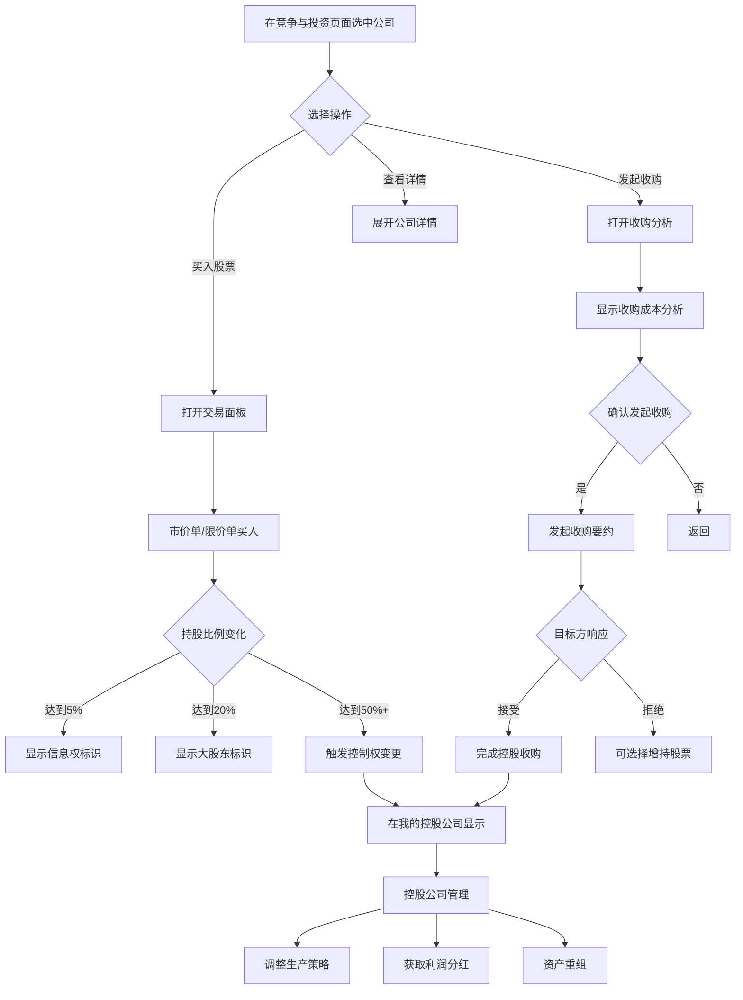

# 竞争对手与股票市场融合计划

> **核心目标：将竞争对手页面和股票页面合并为一个统一的"竞争与投资"页面**

## 一、现状分析

### 1.1 当前系统架构

#### 竞争对手系统 (Competitors.tsx)
- 显示AI公司列表（名称、人格、现金、市场份额）
- 市场份额饼图
- 收购功能（通过AcquisitionSystem）
- 竞争分析提示

#### 股票市场系统 (StockMarket.ts + Stock.tsx)
- AI公司股票上市和交易
- 股价动态计算（基于业绩变化）
- 玩家持股管理
- IPO功能

### 1.2 问题识别

| 问题 | 描述 | 影响 |
|------|------|------|
| **页面分离** | 竞争对手和股票是两个独立页面 | 用户需要来回切换 |
| 数据割裂 | 竞争对手页面不显示股票信息 | 用户无法快速了解公司全貌 |
| 功能重复 | 收购系统和股票交易是两个独立入口 | 用户困惑，体验不一致 |
| 逻辑断层 | 累积持股无法触发控制权变更 | 股票投资缺乏战略价值 |
| 界面孤立 | 股票页面无公司经营分析 | 投资决策缺乏信息支撑 |

## 二、统一页面架构设计

### 2.1 核心设计原则

```
┌─────────────────────────────────────────────────────────────┐
│                    统一公司数据视图                          │
├─────────────────────────────────────────────────────────────┤
│  CompanyProfile = 基础信息 + 股票信息 + 竞争分析 + 持股关系  │
└─────────────────────────────────────────────────────────────┘
                              │
                              ▼
┌─────────────────────────────────────────────────────────────┐
│              竞争与投资 (统一页面)                            │
│  ┌─────────────┐ ┌─────────────┐ ┌─────────────────────────┐│
│  │ 市场总览    │ │ 我的投资    │ │ 公司列表(含股票+竞争)   ││
│  └─────────────┘ └─────────────┘ └─────────────────────────┘│
│                                                             │
│  ┌─────────────────────────────────────────────────────────┐│
│  │ 选中公司详情 (股票交易 + 收购分析 + 公司管理)            ││
│  └─────────────────────────────────────────────────────────┘│
└─────────────────────────────────────────────────────────────┘
```

### 2.2 数据模型扩展

```typescript
// 统一公司视图接口
interface CompanyProfile {
  // 基础信息
  id: number;
  name: string;
  personality: PersonalityType;
  
  // 财务数据
  cash: number;
  totalAssets: number;
  marketShare: number;
  buildingCount: number;
  
  // 股票信息（关联Stock）
  stock: {
    ticker: string;
    currentPrice: number;
    priceChange: number;
    priceChangePercent: number;
    marketCap: number;
    pe: number;
    pb: number;
    volume: number;
    isListed: boolean;
  } | null;
  
  // 持股关系
  ownership: {
    majorShareholders: Array<{
      holderId: number;
      holderName: string;
      shares: number;
      percentage: number;
    }>;
    playerHolding: {
      shares: number;
      percentage: number;
      avgCost: number;
      unrealizedGain: number;
    } | null;
  };
  
  // 竞争关系
  competition: {
    trend: 'up' | 'down' | 'stable';
    specialization: string;
    threatLevel: 'low' | 'medium' | 'high';
    relationType: 'competitor' | 'supplier' | 'customer' | 'neutral';
  };
  
  // 控制权状态
  controlStatus: {
    isPlayerControlled: boolean;      // 玩家是否控股
    isPlayerMajorShareholder: boolean; // 玩家是否大股东
    controllingShareholderId: number | null;
    canAcquire: boolean;              // 是否可以收购
  };
}
```

### 2.3 控制权机制设计

```
持股比例          权利                    状态
─────────────────────────────────────────────────
  0% ~ 5%        无特殊权利              小散户
  5% ~ 10%       信息披露权              重要股东
 10% ~ 20%       董事会席位              大股东
 20% ~ 33%       重大决策否决权          战略投资者
 33% ~ 50%       一定控制权              相对控股
 50%+            完全控制权              绝对控股

绝对控股后:
- 可调整目标公司生产策略
- 获取目标公司利润分红
- 可发起资产重组
- 影响目标公司AI决策
```

### 2.4 统一页面设计 - "竞争与投资"

#### 完整页面布局

```
┌─────────────────────────────────────────────────────────────────────────────────┐
│  竞争与投资                                                      [我的公司IPO]  │
├─────────────────────────────────────────────────────────────────────────────────┤
│                                                                                 │
│  ┌─────────────────────┐  ┌─────────────────────┐  ┌───────────────────────┐   │
│  │ 市场指数            │  │ 我的投资组合         │  │ 市场竞争格局          │   │
│  │ 1,234.56 ↑2.3%     │  │ 总市值: ¥5.2M       │  │ 涨:5 跌:3 平:2       │   │
│  │ 总市值: ¥125.5M    │  │ 盈亏: +¥520K(+11%)  │  │ HHI: 1,850 (中度集中) │   │
│  └─────────────────────┘  └─────────────────────┘  └───────────────────────┘   │
│                                                                                 │
│  ┌──────────────────────────────────────────┐  ┌────────────────────────────┐  │
│  │ 市场份额饼图                             │  │ 我的控股公司               │  │
│  │                                          │  │ ┌────────────────────────┐ │  │
│  │         [饼图显示各公司市场份额]          │  │ │ 精密零件 (52.3%)      │ │  │
│  │                                          │  │ │ 现金:¥2.1M 建筑:2    │ │  │
│  │                                          │  │ │ [管理] [分红] [重组]  │ │  │
│  │                                          │  │ └────────────────────────┘ │  │
│  │                                          │  │ 无控股公司时显示:          │  │
│  │                                          │  │ "持股超过50%可获得控制权"   │  │
│  └──────────────────────────────────────────┘  └────────────────────────────┘  │
│                                                                                 │
│  ═══════════════════════════════════════════════════════════════════════════   │
│  [🏢 全部公司] [📈 我的持股] [⭐ 收藏] [🔻 跌幅榜] [🔺 涨幅榜]    🔍[搜索公司] │
│  ═══════════════════════════════════════════════════════════════════════════   │
│                                                                                 │
│  ┌─────────────────────────────────────────────────────────────────────────┐   │
│  │ 公司列表 (融合竞争对手+股票信息)                                        │   │
│  ├─────────────────────────────────────────────────────────────────────────┤   │
│  │ [代码] [公司名称]   [股价]   [涨跌]  [经营风格] [市值]  [市场份额] [持股]│   │
│  ├─────────────────────────────────────────────────────────────────────────┤   │
│  │ TQGY  铁拳工业    ¥12.50   +2.3%   激进型    ¥12.5M   15.2%    1,000   │   │
│  │       ├ 主营: 钢材、铝材  现金: ¥5.0M  建筑: 3  威胁: 高               │   │
│  │       └ [买入] [卖出] [收购] [详情▼]                                   │   │
│  ├─────────────────────────────────────────────────────────────────────────┤   │
│  │ HTZY  恒泰资源    ¥8.20    -1.2%   保守型    ¥8.2M    10.5%    --      │   │
│  │       ├ 主营: 煤炭、原油  现金: ¥8.0M  建筑: 4  威胁: 中               │   │
│  │       └ [买入] [卖出] [收购] [详情▼]                                   │   │
│  ├─────────────────────────────────────────────────────────────────────────┤   │
│  │ ...更多公司...                                                          │   │
│  └─────────────────────────────────────────────────────────────────────────┘   │
│                                                                                 │
│  ═══════════════════════════════════════════════════════════════════════════   │
│                                                                                 │
│  ┌─────────────────────────────────────────────────────────────────────────┐   │
│  │ 选中公司详情面板 (点击"详情"展开)                                       │   │
│  │                                                                         │   │
│  │ ┌──────────────────────┐  ┌──────────────────────────────────────────┐ │   │
│  │ │ 铁拳工业 TQGY        │  │ 股东结构                                 │ │   │
│  │ │ ¥12.50 (+¥0.28)     │  │ ████████████████░░░░░                    │ │   │
│  │ │ ┌──────────────────┐ │  │ 🟦自持50% 🟩恒泰15% 🟨玩家5% 🟪其他30%    │ │   │
│  │ │ │   股价走势图     │ │  └──────────────────────────────────────────┘ │   │
│  │ │ │                  │ │                                              │   │
│  │ │ └──────────────────┘ │  ┌──────────────────────────────────────────┐ │   │
│  │ │ 今开:12.22 最高:12.60│  │ 公司分析                                 │ │   │
│  │ │ 昨收:12.22 最低:12.10│  │ 经营风格: 激进型                         │ │   │
│  │ │ 成交:5,000 换手:0.5% │  │ 主营业务: 钢材、铝材、汽车零部件          │ │   │
│  │ │ 市盈率:15.2 市净率:1.8│  │ 建筑数量: 3 (钢铁厂x2, 铁矿场x1)         │ │   │
│  │ └──────────────────────┘  │ 现金储备: ¥5,000,000                      │ │   │
│  │                           │ 市场份额: 15.2%                           │ │   │
│  │ ┌─────────────────────┐   │ 竞争威胁: ⚠️ 高 (正在扩张钢材产能)        │ │   │
│  │ │ 我的持股            │   │ 发展趋势: 📈 上升                         │ │   │
│  │ │ 持有: 1,000股(0.1%)│   └──────────────────────────────────────────┘ │   │
│  │ │ 成本: ¥11.00/股    │                                               │   │
│  │ │ 市值: ¥12,500      │   ┌──────────────────────────────────────────┐ │   │
│  │ │ 盈亏: +¥1,500(+13.6%)│   │ 收购可行性分析                          │ │   │
│  │ └─────────────────────┘   │ 收购51%控股需要: ¥6.4M                   │ │   │
│  │                           │ 建议溢价: 20%                             │ │   │
│  │ ┌─────────────────────┐   │ 协同效应: ¥500K/年                        │ │   │
│  │ │ 交易面板            │   │ 风险等级: 中                              │ │   │
│  │ │ ○市价单 ○限价单     │   │ [发起收购要约]                            │ │   │
│  │ │ 数量: [____]股      │   └──────────────────────────────────────────┘ │   │
│  │ │ 限价: [____]元      │                                               │   │
│  │ │ 预估: ¥12,500       │                                               │   │
│  │ │ [确认买入] [确认卖出]│                                               │   │
│  │ └─────────────────────┘                                               │   │
│  └─────────────────────────────────────────────────────────────────────────┘   │
│                                                                                 │
│  ┌─────────────────────────────────────────────────────────────────────────┐   │
│  │ 竞争分析提示                                                            │   │
│  │ ┌────────────────────┐ ┌────────────────────┐ ┌────────────────────┐   │   │
│  │ │ ⚠️ 价格战警告      │ │ 💡 市场机会        │ │ ✅ 竞争优势        │   │   │
│  │ │ 低价王公司正在...  │ │ 电子产品市场需求..│ │ 您在原材料供应... │   │   │
│  │ └────────────────────┘ └────────────────────┘ └────────────────────┘   │   │
│  └─────────────────────────────────────────────────────────────────────────┘   │
│                                                                                 │
└─────────────────────────────────────────────────────────────────────────────────┘
```

#### 交互说明

1. **标签页切换**
   - "全部公司"：显示所有AI公司
   - "我的持股"：只显示玩家持有股票的公司
   - "收藏"：用户收藏的关注公司
   - "跌幅榜/涨幅榜"：按涨跌幅排序

2. **公司列表行为**
   - 单击行：选中公司，展开详情面板
   - 快捷按钮：直接在列表中买入/卖出/收购

3. **详情面板**
   - 左侧：股票交易（价格图表+交易面板）
   - 右侧：公司分析（经营+竞争+收购）

4. **我的控股公司**
   - 持股超过50%的公司显示在此区域
   - 可直接管理控股公司的生产策略

### 2.5 统一收购流程



## 三、代码实现计划

### 3.1 新增/修改文件列表

| 文件 | 类型 | 描述 |
|------|------|------|
| `src/core/finance/CompanyProfile.ts` | 新增 | 统一公司数据模型 |
| `src/core/finance/OwnershipControl.ts` | 新增 | 股权控制逻辑 |
| `src/ui/components/Company/CompanyCard.tsx` | 新增 | 统一公司卡片组件 |
| `src/ui/components/Company/CompanyRow.tsx` | 新增 | 公司列表行组件 |
| `src/ui/components/Company/CompanyDetail.tsx` | 新增 | 公司详情面板 |
| `src/ui/components/Company/ShareholderChart.tsx` | 新增 | 股东结构图表 |
| `src/ui/components/Company/TradePanel.tsx` | 新增 | 交易面板组件 |
| `src/ui/components/Company/ControlledCompanies.tsx` | 新增 | 控股公司管理 |
| `src/ui/pages/CompetitorsAndInvestment.tsx` | 新增 | **统一页面（核心）** |
| `src/core/finance/StockMarket.ts` | 修改 | 添加持股关系查询 |
| `src/ui/pages/Competitors.tsx` | 删除 | 合并到新页面 |
| `src/ui/pages/Stock.tsx` | 删除 | 合并到新页面 |
| `src/stores/gameStore.ts` | 修改 | 添加统一数据获取 |
| `src/App.tsx` | 修改 | 更新路由 |
| `src/ui/components/Layout/Sidebar.tsx` | 修改 | 更新导航菜单 |

### 3.2 StockMarket.ts 扩展

```typescript
// 新增函数

/**
 * 获取公司股东列表
 */
export function getShareholderList(companyId: number): Array<{
  holderId: number;
  holderName: string;
  shares: number;
  percentage: number;
}>;

/**
 * 获取玩家对某公司的持股详情
 */
export function getPlayerHoldingDetails(companyId: number): {
  shares: number;
  percentage: number;
  avgCost: number;
  unrealizedGain: number;
  controlLevel: 'none' | 'minor' | 'major' | 'controlling';
} | null;

/**
 * 检查控制权变更
 */
export function checkControlChange(
  world: GameWorld,
  companyId: number
): {
  changed: boolean;
  previousController: number | null;
  newController: number | null;
  reason: string;
};

/**
 * 获取控股公司列表
 */
export function getControlledCompanies(ownerId: number): number[];
```

### 3.3 OwnershipControl.ts 设计

```typescript
/**
 * 股权控制系统
 * 管理持股比例与控制权的映射关系
 */

// 控制权等级
export enum ControlLevel {
  None = 0,           // 无持股
  Retail = 1,         // 散户 (0-5%)
  Significant = 2,    // 重要股东 (5-10%)
  Major = 3,          // 大股东 (10-20%)
  Strategic = 4,      // 战略投资者 (20-33%)
  Relative = 5,       // 相对控股 (33-50%)
  Absolute = 6,       // 绝对控股 (50%+)
}

// 控制权权利配置
export const CONTROL_RIGHTS = {
  [ControlLevel.None]: [],
  [ControlLevel.Retail]: [],
  [ControlLevel.Significant]: ['view_financials'],
  [ControlLevel.Major]: ['view_financials', 'board_seat'],
  [ControlLevel.Strategic]: ['view_financials', 'board_seat', 'veto_major'],
  [ControlLevel.Relative]: ['view_financials', 'board_seat', 'veto_major', 'influence_strategy'],
  [ControlLevel.Absolute]: ['view_financials', 'board_seat', 'veto_major', 'influence_strategy', 'full_control'],
};

/**
 * 计算控制权等级
 */
export function calculateControlLevel(percentage: number): ControlLevel;

/**
 * 检查是否有特定权利
 */
export function hasControlRight(
  holderId: number, 
  companyId: number, 
  right: string
): boolean;

/**
 * 处理控制权变更
 */
export function handleControlChange(
  world: GameWorld,
  companyId: number,
  newControllerId: number
): void;

/**
 * 应用控股方对被控公司的策略影响
 */
export function applyControllerInfluence(
  world: GameWorld,
  controllerId: number,
  targetId: number,
  influence: 'production' | 'pricing' | 'expansion'
): void;
```

### 3.4 统一页面组件结构

```tsx
// CompetitorsAndInvestment.tsx - 主页面结构
const CompetitorsAndInvestment: React.FC = () => {
  const [selectedCompanyId, setSelectedCompanyId] = useState<number | null>(null);
  const [activeTab, setActiveTab] = useState<'all' | 'holdings' | 'favorites' | 'gainers' | 'losers'>('all');
  const [showIPOModal, setShowIPOModal] = useState(false);
  
  return (
    <div className="p-6 space-y-6">
      <Header />
      
      {/* 顶部统计卡片 */}
      <div className="grid grid-cols-3 gap-4">
        <MarketIndexCard />
        <MyPortfolioCard />
        <MarketCompetitionCard />
      </div>
      
      {/* 市场份额图 + 控股公司 */}
      <div className="grid grid-cols-2 gap-6">
        <MarketShareChart />
        <ControlledCompaniesPanel />
      </div>
      
      {/* 标签页切换 */}
      <CompanyTabs activeTab={activeTab} onChange={setActiveTab} />
      
      {/* 公司列表 */}
      <CompanyList
        filter={activeTab}
        selectedId={selectedCompanyId}
        onSelect={setSelectedCompanyId}
      />
      
      {/* 选中公司详情面板 */}
      {selectedCompanyId && (
        <CompanyDetailPanel
          companyId={selectedCompanyId}
          onClose={() => setSelectedCompanyId(null)}
        />
      )}
      
      {/* 竞争分析提示 */}
      <CompetitionInsights />
      
      {/* IPO模态框 */}
      <IPOModal visible={showIPOModal} onClose={() => setShowIPOModal(false)} />
    </div>
  );
};
```

### 3.5 CompanyRow.tsx - 公司列表行组件

```tsx
interface CompanyRowProps {
  profile: CompanyProfile;
  isSelected: boolean;
  onSelect: () => void;
  onQuickBuy: () => void;
  onQuickSell: () => void;
  onAcquire: () => void;
}

const CompanyRow: React.FC<CompanyRowProps> = (props) => {
  const { profile, isSelected, onSelect } = props;
  
  return (
    <div className={`company-row ${isSelected ? 'selected' : ''}`}>
      {/* 主行：代码、名称、股价、涨跌、风格、市值、份额、持股 */}
      <div className="main-row" onClick={onSelect}>
        <span className="ticker">{profile.stock?.ticker}</span>
        <span className="name">{profile.name}</span>
        <span className="price">{formatPrice(profile.stock?.currentPrice)}</span>
        <span className={`change ${profile.stock?.priceChange >= 0 ? 'up' : 'down'}`}>
          {formatPercent(profile.stock?.priceChangePercent)}
        </span>
        <span className="personality">{personalityLabels[profile.personality]}</span>
        <span className="market-cap">{formatMoney(profile.stock?.marketCap)}</span>
        <span className="market-share">{formatPercent(profile.marketShare)}</span>
        <span className="holding">{profile.ownership.playerHolding?.shares || '--'}</span>
      </div>
      
      {/* 子行：主营业务 + 快捷按钮 */}
      <div className="sub-row">
        <span className="specialization">主营: {profile.competition.specialization}</span>
        <span className="cash">现金: {formatMoney(profile.cash)}</span>
        <span className="buildings">建筑: {profile.buildingCount}</span>
        <span className="threat">威胁: {profile.competition.threatLevel}</span>
        <div className="actions">
          <button onClick={props.onQuickBuy}>买入</button>
          <button onClick={props.onQuickSell}>卖出</button>
          <button onClick={props.onAcquire}>收购</button>
          <button onClick={onSelect}>详情▼</button>
        </div>
      </div>
    </div>
  );
};
```

### 3.6 CompanyDetailPanel.tsx - 公司详情面板

```tsx
interface CompanyDetailPanelProps {
  companyId: number;
  onClose: () => void;
}

const CompanyDetailPanel: React.FC<CompanyDetailPanelProps> = ({ companyId, onClose }) => {
  const profile = useGameStore(state => state.getCompanyProfile(companyId));
  
  return (
    <div className="company-detail-panel">
      <div className="grid grid-cols-2 gap-6">
        {/* 左侧：股票交易 */}
        <div className="stock-section">
          <StockInfo stock={profile.stock} />
          <PriceChart companyId={companyId} />
          <MyHoldingCard holding={profile.ownership.playerHolding} />
          <TradePanel companyId={companyId} currentPrice={profile.stock?.currentPrice} />
        </div>
        
        {/* 右侧：公司分析 */}
        <div className="analysis-section">
          <ShareholderChart ownership={profile.ownership} />
          <CompanyAnalysis profile={profile} />
          <AcquisitionAnalysis companyId={companyId} />
        </div>
      </div>
    </div>
  );
};
```

### 3.7 gameStore.ts 扩展

```typescript
interface GameActions {
  // ============ 统一公司数据 ============
  getCompanyProfile: (companyId: number) => CompanyProfile | null;
  getAllCompanyProfiles: () => CompanyProfile[];
  
  // ============ 控制权相关 ============
  getPlayerControlledCompanies: () => number[];
  getPlayerControlLevel: (companyId: number) => ControlLevel;
  hasControlRight: (companyId: number, right: string) => boolean;
  
  // ============ 股票交易 ============
  quickBuyStock: (companyId: number, quantity: number) => boolean;
  quickSellStock: (companyId: number, quantity: number) => boolean;
  
  // ============ 收购相关 ============
  initiateStockAcquisition: (
    targetId: number,
    targetPercentage: number,
    maxPricePerShare: number
  ) => boolean;
  
  // ============ 控股公司管理 ============
  setControlledCompanyStrategy: (
    companyId: number,
    strategy: 'aggressive' | 'conservative' | 'balanced'
  ) => boolean;
  requestDividend: (companyId: number, amount: number) => boolean;
  initiateAssetTransfer: (
    fromCompanyId: number,
    toCompanyId: number,
    assetType: 'building' | 'inventory',
    assetIds: number[]
  ) => boolean;
  
  // ============ 收藏管理 ============
  toggleFavoriteCompany: (companyId: number) => void;
  getFavoriteCompanies: () => number[];
}
```

## 四、UI交互流程

### 4.1 统一页面主交互流程

```
用户进入"竞争与投资"页面
       │
       ▼
┌──────────────────────────────────┐
│ 显示:                            │
│ - 市场指数、投资组合、竞争格局    │
│ - 市场份额饼图 + 控股公司列表    │
│ - 全部公司列表(含股票+竞争信息)  │
└──────────────────────────────────┘
       │
       ├───────────────────────────────────────┐
       ▼                                       ▼
[点击公司行]                            [切换标签页]
       │                                       │
       ▼                                       ▼
展开公司详情面板                     筛选: 我的持股/收藏/涨跌榜
       │
       ├─────────────────┬──────────────────┐
       ▼                 ▼                  ▼
[股票交易区]         [公司分析区]      [收购分析区]
       │                 │                  │
       ▼                 ▼                  ▼
买入/卖出股票      查看经营详情      发起收购要约
       │
       ▼
更新持股显示和控制权状态
```

### 4.2 控股公司管理交互

```
用户持股超过50%
       │
       ▼
触发控制权变更通知(Toast)
       │
       ▼
"我的控股公司"区域显示新公司
       │
       ▼
用户点击[管理]按钮
       │
       ▼
┌──────────────────────────────────┐
│ 控股公司管理面板 (弹出)           │
│                                  │
│ ┌──────────────────────────────┐ │
│ │ 精密零件 - 您持有52.3%股份   │ │
│ └──────────────────────────────┘ │
│                                  │
│ [财务概况]                       │
│ 现金: ¥2.1M | 资产: ¥5.5M       │
│ 本月盈利: ¥180K                 │
│                                  │
│ [经营策略] ○激进 ●稳健 ○保守    │
│                                  │
│ [分红设置]                       │
│ 分红比例: [30]% (每季度)        │
│ 预计分红: ¥54K → 您获得: ¥28.2K │
│ [申请分红]                       │
│                                  │
│ [资产重组]                       │
│ ├ 将建筑转移到我的公司           │
│ ├ 将库存转移到我的公司           │
│ └ 与其他控股公司合并             │
│                                  │
│                    [关闭]        │
└──────────────────────────────────┘
```

### 4.3 快速交易流程

```
用户在公司列表点击[买入]按钮
       │
       ▼
┌──────────────────────────────────┐
│ 快速买入 - 铁拳工业 TQGY         │
│                                  │
│ 当前股价: ¥12.50 (+2.3%)        │
│ 可用资金: ¥1,500,000            │
│                                  │
│ 买入数量: [1000____]股          │
│ 快捷: [100] [500] [1000] [5000] │
│                                  │
│ 订单类型: ●市价单 ○限价单        │
│                                  │
│ 预估成本: ¥12,500               │
│                                  │
│    [取消]          [确认买入]    │
└──────────────────────────────────┘
```

## 五、实施阶段

### 阶段1：数据模型与核心逻辑（Day 1）
- [ ] 创建 `src/core/finance/CompanyProfile.ts`
- [ ] 创建 `src/core/finance/OwnershipControl.ts`
- [ ] 扩展 `src/core/finance/StockMarket.ts` 添加股东查询

### 阶段2：基础UI组件（Day 2）
- [ ] 创建 `src/ui/components/Company/CompanyRow.tsx`
- [ ] 创建 `src/ui/components/Company/ShareholderChart.tsx`
- [ ] 创建 `src/ui/components/Company/TradePanel.tsx`

### 阶段3：详情与管理组件（Day 3）
- [ ] 创建 `src/ui/components/Company/CompanyDetail.tsx`
- [ ] 创建 `src/ui/components/Company/ControlledCompanies.tsx`
- [ ] 创建 `src/ui/components/Company/AcquisitionAnalysis.tsx`

### 阶段4：统一页面整合（Day 4）
- [ ] 创建 `src/ui/pages/CompetitorsAndInvestment.tsx`
- [ ] 更新 `src/stores/gameStore.ts`
- [ ] 更新 `src/App.tsx` 路由

### 阶段5：清理与优化（Day 5）
- [ ] 删除 `src/ui/pages/Competitors.tsx`
- [ ] 删除 `src/ui/pages/Stock.tsx`
- [ ] 更新 `src/ui/components/Layout/Sidebar.tsx`
- [ ] 功能测试与Bug修复

## 六、预期效果

### 6.1 用户体验提升
- 一站式查看竞争对手全貌
- 更便捷的股票交易入口
- 清晰的持股关系展示
- 直观的控制权状态

### 6.2 游戏深度增加
- 股票投资具有战略价值
- 通过持股影响竞争格局
- 控股公司带来额外收益
- 收购路径多样化

### 6.3 系统一致性
- 统一的公司数据来源
- 一致的UI展示风格
- 清晰的功能边界

## 七、技术注意事项

1. **性能优化**：CompanyProfile计算较重，需缓存
2. **数据同步**：确保股票数据和竞争数据实时同步
3. **控制权边界**：控股后不能完全接管AI决策，只能施加影响
4. **回测兼容**：保存系统需支持新数据结构