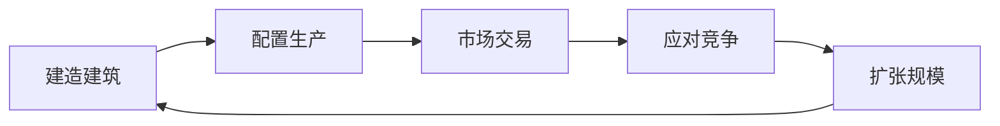
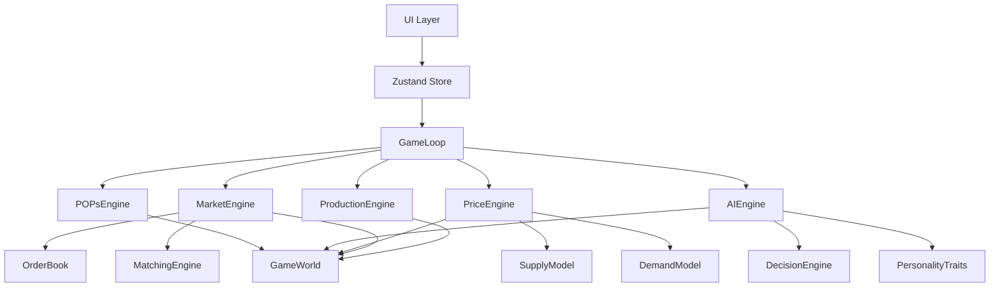
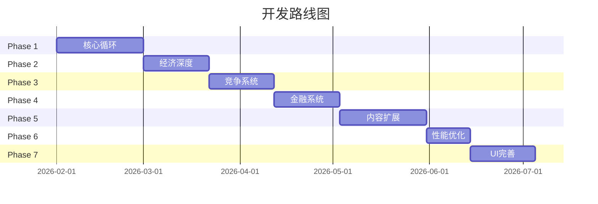

# 《供应链指挥官》完整游戏开发计划

> **文档版本**: 2.0  
> **更新日期**: 2026-01-25  
> **文档性质**: 可直接用于AI辅助开发的完整游戏设计与技术规范  
> **目标**: 构建一个基于真实经济学原理的高性能商业模拟游戏

---

## 目录

1. [项目概览](#一项目概览)
2. [核心游戏设计](#二核心游戏设计)
3. [经济系统详细设计](#三经济系统详细设计)
4. [生产系统设计](#四生产系统设计)
5. [市场交易系统](#五市场交易系统)
6. [AI竞争对手系统](#六ai竞争对手系统)
7. [金融与股票系统](#七金融与股票系统)
8. [高性能架构设计](#八高性能架构设计)
9. [UI/UX设计规范](#九uiux设计规范)
10. [技术栈与项目结构](#十技术栈与项目结构)
11. [分阶段开发路线图](#十一分阶段开发路线图)
12. [附录：数据配置表](#十二附录数据配置表)

---

## 一、项目概览

### 1.1 游戏愿景

《供应链指挥官》是一款**经济模拟/商业策略**游戏，玩家扮演企业CEO，在一个遵循真实经济学原理运行的虚拟城市中，通过生产、交易、竞争来建立商业帝国。

### 1.2 核心设计哲学

| 原则 | 说明 |
|------|------|
| **宏观视角** | 玩家做战略决策，不做微操 |
| **经济真实** | 价格由供需曲线决定，不靠随机数 |
| **涌现复杂** | 简单规则产生复杂行为，而非硬编码剧情 |
| **高性能** | 10ms/tick，支持大规模模拟 |

### 1.3 核心游戏循环



### 1.4 游戏规模目标

| 维度 | 规模 |
|------|------|
| 商品种类 | 60种（4层产业链） |
| 建筑类型 | 25种 |
| AI公司 | 20家（5种人格） |
| 人口模拟 | 100万虚拟消费者 |
| Tick频率 | 50ms/tick（20 TPS） |
| 单Tick计算 | <10ms |

### 1.5 与简化游戏的区别

| 维度 | 简化游戏 | 本项目 |
|------|---------|---------|
| 需求 | 固定数量 | 连续需求曲线，受多因素影响 |
| 供给 | 产能=产出 | 成本曲线决定最优产量 |
| 价格 | 供需比例调整 | 多种价格发现机制并存 |
| 参与者 | 同质化理性人 | 异质偏好、有限理性 |
| 时间 | 即时均衡 | 动态调整、滞后效应 |
| 货币 | 无限流动性 | 货币供应、利率、信贷 |

---

## 二、核心游戏设计

### 2.1 游戏时间系统

```typescript
interface TimeSystem {
  tick: number;              // 当前tick（游戏最小时间单位）
  ticksPerDay: number;       // 每天tick数（默认24）
  ticksPerYear: number;      // 每年tick数（默认8760 = 365*24）
  tickInterval: number;      // tick间隔（毫秒，默认50）
  speed: 1 | 2 | 4 | 8;     // 游戏速度倍数
  paused: boolean;
}

// 时间转换
function tickToDate(tick: number): GameDate {
  const day = Math.floor(tick / 24) + 1;
  const hour = tick % 24;
  const month = Math.floor((day - 1) / 30) + 1;
  const year = Math.floor((month - 1) / 12) + 1;
  return { year, month: ((month - 1) % 12) + 1, day: ((day - 1) % 30) + 1, hour };
}
```

### 2.2 资源与货币

```typescript
interface EconomyGlobals {
  // 货币系统
  currency: {
    symbol: '¥';
    name: '游戏币';
    precision: 2;            // 小数位数
  };
  
  // 初始经济规模
  initialGDP: 10_000_000_000;        // 100亿
  initialPopulation: 1_000_000;       // 100万人口
  initialMoneySupply: 50_000_000_000; // 500亿货币
  
  // 通胀目标
  targetInflation: 0.02;              // 2%年化
  
  // 利率
  baseInterestRate: 0.03;             // 3%基准利率
}
```

### 2.3 玩家公司初始状态

```typescript
interface PlayerCompany {
  id: 'player';
  name: string;                // 玩家命名
  
  // 初始资源
  initialCash: 1_000_000;      // 100万启动资金
  initialBuildings: [];        // 无初始建筑
  
  // 信用额度
  creditLimit: 500_000;        // 50万信用额度
  creditRate: 0.08;            // 8%贷款利率
  
  // 声望
  reputation: 50;              // 0-100
}
```

---

## 三、经济系统详细设计

### 3.1 价格形成机制

#### 3.1.1 瓦尔拉斯均衡价格搜索

```typescript
/**
 * 通过迭代调整找到供需均衡价格
 * 原理：超额需求则涨价，超额供给则跌价
 */
function findEquilibriumPrice(
  supplyFn: (price: number) => number,
  demandFn: (price: number) => number,
  initialPrice: number,
  tolerance: number = 0.01
): number {
  let price = initialPrice;
  const maxIterations = 50;
  const adjustmentSpeed = 0.1;
  
  for (let i = 0; i < maxIterations; i++) {
    const supply = supplyFn(price);
    const demand = demandFn(price);
    const excessDemand = demand - supply;
    
    // 均衡条件：超额需求接近零
    if (Math.abs(excessDemand) < tolerance * (supply + demand) / 2) {
      break;
    }
    
    // 价格调整
    const priceAdjustment = adjustmentSpeed * excessDemand / (supply + demand);
    price *= (1 + priceAdjustment);
    price = Math.max(price, 0.01);  // 防止负价格
  }
  
  return price;
}
```

#### 3.1.2 价格稳定机制

```typescript
const PRICE_STABILITY = {
  MAX_TICK_CHANGE: 0.05,        // 单tick最大变化5%
  MEAN_REVERSION: 0.002,        // 均值回归速率
  VOLATILITY_DAMPENING: 0.1,    // 波动抑制
};

function stabilizePrice(
  currentPrice: number,
  equilibriumPrice: number,
  basePrice: number
): number {
  // 计算目标变化
  let targetChange = (equilibriumPrice - currentPrice) / currentPrice;
  
  // 限制变化幅度
  targetChange = Math.max(-PRICE_STABILITY.MAX_TICK_CHANGE, 
                          Math.min(PRICE_STABILITY.MAX_TICK_CHANGE, targetChange));
  
  // 均值回归
  const reversionPull = (basePrice - currentPrice) / currentPrice * PRICE_STABILITY.MEAN_REVERSION;
  
  return currentPrice * (1 + targetChange + reversionPull);
}
```

### 3.2 供给侧模型

#### 3.2.1 生产成本曲线

```typescript
interface ProductionCostModel {
  // 固定成本（不随产量变化）
  fixedCosts: {
    depreciation: number;      // 设备折旧
    rent: number;              // 厂房租金
    insurance: number;         // 保险费用
    management: number;        // 管理人员
  };
  
  // 可变成本（随产量变化）
  variableCosts: {
    rawMaterials: number;      // 原材料单价
    labor: number;             // 人工单价
    energy: number;            // 能源单价
    logistics: number;         // 物流单价
  };
  
  // 边际成本递增因子
  marginalCostCurve: {
    optimalCapacity: number;   // 最优产能（边际成本最低点）
    curveFactor: number;       // 成本上升速度（0.5-2.0）
  };
}

/**
 * 计算边际成本
 * 在最优产能之前，边际成本恒定
 * 超过最优产能后，边际成本递增（加班、设备损耗等）
 */
function marginalCost(model: ProductionCostModel, quantity: number): number {
  const variable = Object.values(model.variableCosts).reduce((a, b) => a + b, 0);
  const { optimalCapacity, curveFactor } = model.marginalCostCurve;
  
  if (quantity <= optimalCapacity) {
    return variable;
  }
  
  const excess = quantity - optimalCapacity;
  return variable * (1 + curveFactor * excess / optimalCapacity);
}

/**
 * 利润最大化产量决策
 * 原理：边际成本 = 边际收益（市场价格）
 */
function optimalQuantity(model: ProductionCostModel, price: number): number {
  let low = 0;
  let high = model.marginalCostCurve.optimalCapacity * 3;
  
  while (high - low > 1) {
    const mid = Math.floor((low + high) / 2);
    if (marginalCost(model, mid) < price) {
      low = mid;
    } else {
      high = mid;
    }
  }
  
  return Math.floor(low);
}
```

#### 3.2.2 产能投资决策

```typescript
interface CapacityInvestmentModel {
  expectedPrice: number;          // 预期未来价格
  expectedDemand: number;         // 预期市场需求
  investmentCost: number;         // 扩产投资成本
  paybackPeriod: number;          // 预期回收周期（年）
  requiredROI: number;            // 要求的投资回报率
  priceVolatility: number;        // 价格波动率
  competitorCount: number;        // 竞争者数量
}

function shouldExpandCapacity(model: CapacityInvestmentModel): boolean {
  const expectedMargin = model.expectedPrice * 0.15;
  const expectedAnnualProfit = model.expectedDemand * expectedMargin;
  
  // 风险调整
  const riskFactor = 1 - model.priceVolatility * 0.5 - 0.02 * model.competitorCount;
  const adjustedProfit = expectedAnnualProfit * Math.max(0.3, riskFactor);
  
  // ROI计算
  const actualROI = adjustedProfit / model.investmentCost;
  
  return actualROI > model.requiredROI;
}
```

### 3.3 需求侧模型

#### 3.3.1 效用函数与需求曲线

```typescript
interface DemandModel {
  type: 'necessity' | 'normal' | 'luxury';
  baseQuantity: number;           // 基准需求量
  priceElasticity: number;        // 价格弹性
  incomeElasticity: number;       // 收入弹性
}

/**
 * 计算需求量
 * 使用CES效用函数推导的需求曲线
 */
function calculateDemand(
  model: DemandModel,
  price: number,
  basePrice: number,
  income: number,
  baseIncome: number
): number {
  // 价格效应：需求随价格上升而下降
  const priceEffect = Math.pow(price / basePrice, model.priceElasticity);
  
  // 收入效应：需求随收入上升而增加（正常品）
  const incomeEffect = Math.pow(income / baseIncome, model.incomeElasticity);
  
  return model.baseQuantity * priceEffect * incomeEffect;
}

// 预设弹性参数
const ELASTICITY_PRESETS: Record<string, { priceElasticity: number; incomeElasticity: number }> = {
  // 必需品：刚性需求
  'food':        { priceElasticity: -0.3, incomeElasticity: 0.5 },
  'electricity': { priceElasticity: -0.2, incomeElasticity: 0.3 },
  'fuel':        { priceElasticity: -0.4, incomeElasticity: 0.4 },
  
  // 一般消费品：中等弹性
  'clothing':    { priceElasticity: -1.0, incomeElasticity: 1.0 },
  'appliances':  { priceElasticity: -1.2, incomeElasticity: 1.5 },
  'electronics': { priceElasticity: -1.3, incomeElasticity: 1.6 },
  
  // 耐用品：高弹性
  'car':         { priceElasticity: -1.5, incomeElasticity: 2.0 },
  'furniture':   { priceElasticity: -1.4, incomeElasticity: 1.8 },
  
  // 奢侈品：高弹性
  'luxury':      { priceElasticity: -2.5, incomeElasticity: 3.0 },
  'jewelry':     { priceElasticity: -3.0, incomeElasticity: 4.0 },
  
  // 工业品：派生需求
  'steel':       { priceElasticity: -0.5, incomeElasticity: 0.8 },
  'copper':      { priceElasticity: -0.4, incomeElasticity: 0.7 },
  'chemicals':   { priceElasticity: -0.6, incomeElasticity: 0.9 },
};
```

#### 3.3.2 消费者分层

```typescript
interface PopulationLayer {
  name: string;
  share: number;                  // 人口占比
  avgIncome: number;              // 月平均收入
  consumptionPriority: string[];  // 消费优先级
  savingsRate: number;            // 储蓄率
}

const POPULATION_LAYERS: PopulationLayer[] = [
  { 
    name: '高收入', 
    share: 0.10, 
    avgIncome: 50000, 
    consumptionPriority: ['luxury', 'car', 'electronics', 'travel'],
    savingsRate: 0.35
  },
  { 
    name: '中产', 
    share: 0.40, 
    avgIncome: 15000, 
    consumptionPriority: ['appliances', 'car', 'clothing', 'electronics'],
    savingsRate: 0.20
  },
  { 
    name: '工薪', 
    share: 0.35, 
    avgIncome: 6000, 
    consumptionPriority: ['food', 'clothing', 'electronics', 'appliances'],
    savingsRate: 0.10
  },
  { 
    name: '低收入', 
    share: 0.15, 
    avgIncome: 2500, 
    consumptionPriority: ['food', 'daily-necessities', 'clothing'],
    savingsRate: 0.02
  },
];
```

#### 3.3.3 替代品机制

```typescript
interface SubstitutionRule {
  primary: string;              // 首选商品
  substitute: string;           // 替代商品
  priceRatioThreshold: number;  // 价格比触发阈值
  utilityRatio: number;         // 替代品效用比例
}

const SUBSTITUTION_RULES: SubstitutionRule[] = [
  { primary: 'beef', substitute: 'pork', priceRatioThreshold: 1.5, utilityRatio: 0.85 },
  { primary: 'premium-phone', substitute: 'budget-phone', priceRatioThreshold: 2.0, utilityRatio: 0.7 },
  { primary: 'electric-car', substitute: 'fuel-car', priceRatioThreshold: 1.3, utilityRatio: 0.9 },
  { primary: 'steel', substitute: 'aluminum', priceRatioThreshold: 1.2, utilityRatio: 0.8 },
];

function applySubstitution(
  demand: Map<string, number>,
  prices: Map<string, number>
): Map<string, number> {
  const adjustedDemand = new Map(demand);
  
  for (const rule of SUBSTITUTION_RULES) {
    const primaryPrice = prices.get(rule.primary) || 0;
    const subPrice = prices.get(rule.substitute) || 0;
    
    if (primaryPrice > subPrice * rule.priceRatioThreshold) {
      const primaryDemand = adjustedDemand.get(rule.primary) || 0;
      const transferAmount = primaryDemand * 0.3;  // 转移30%需求
      
      adjustedDemand.set(rule.primary, primaryDemand - transferAmount);
      adjustedDemand.set(
        rule.substitute, 
        (adjustedDemand.get(rule.substitute) || 0) + transferAmount / rule.utilityRatio
      );
    }
  }
  
  return adjustedDemand;
}
```

### 3.4 市场结构模型

#### 3.4.1 市场集中度分析

```typescript
enum MarketStructure {
  PERFECT_COMPETITION = 'perfect',    // 完全竞争
  MONOPOLISTIC_COMPETITION = 'monopolistic', // 垄断竞争
  OLIGOPOLY = 'oligopoly',            // 寡头
  MONOPOLY = 'monopoly',              // 垄断
}

interface MarketStructureAnalysis {
  hhi: number;                  // 赫芬达尔指数
  cr4: number;                  // 前4大公司份额
  structure: MarketStructure;
  lernerIndex: number;          // 勒纳指数（定价权）
}

function analyzeMarketStructure(marketShares: Map<string, number>): MarketStructureAnalysis {
  const shares = Array.from(marketShares.values()).sort((a, b) => b - a);
  
  // HHI = Σ(市场份额%)²
  const hhi = shares.reduce((sum, share) => sum + share * share * 10000, 0);
  const cr4 = shares.slice(0, 4).reduce((sum, share) => sum + share, 0);
  
  let structure: MarketStructure;
  if (shares.length === 1 || shares[0] > 0.9) {
    structure = MarketStructure.MONOPOLY;
  } else if (hhi > 2500) {
    structure = MarketStructure.OLIGOPOLY;
  } else if (hhi > 1500) {
    structure = MarketStructure.MONOPOLISTIC_COMPETITION;
  } else {
    structure = MarketStructure.PERFECT_COMPETITION;
  }
  
  // 勒纳指数 = (P - MC) / P
  const lernerIndex = structure === MarketStructure.MONOPOLY ? 0.5 :
                      structure === MarketStructure.OLIGOPOLY ? 0.3 :
                      structure === MarketStructure.MONOPOLISTIC_COMPETITION ? 0.15 : 0.05;
  
  return { hhi, cr4, structure, lernerIndex };
}
```

#### 3.4.2 反垄断机制

```typescript
interface AntitrustRules {
  hhiThreshold: 2500;           // HHI调查阈值
  maxMarketShare: 0.7;          // 单一公司最大份额
  mergersReviewThreshold: 0.3;  // 合并审查门槛
  
  penalties: {
    priceFixing: 0.1;           // 价格操纵罚款（年收入比例）
    marketAbuse: 0.05;          // 市场滥用罚款
    forcedDivestiture: boolean; // 强制拆分
  };
}
```

### 3.5 经济周期系统

```typescript
interface BusinessCycle {
  phase: 'expansion' | 'peak' | 'contraction' | 'trough';
  cyclePosition: number;        // 0-1，0为谷底，0.5为峰值
  cycleLength: number;          // tick数（默认5年周期）
  amplitude: number;            // 振幅（默认±10%）
  
  leadingIndicators: {
    stockMarketIndex: number;
    newOrders: number;
    buildingPermits: number;
    consumerConfidence: number;
  };
}

function updateBusinessCycle(cycle: BusinessCycle, tick: number): void {
  const radians = (tick % cycle.cycleLength) / cycle.cycleLength * 2 * Math.PI;
  cycle.cyclePosition = (Math.sin(radians) + 1) / 2;
  
  if (cycle.cyclePosition > 0.75) {
    cycle.phase = 'peak';
  } else if (cycle.cyclePosition > 0.5) {
    cycle.phase = 'expansion';
  } else if (cycle.cyclePosition > 0.25) {
    cycle.phase = 'trough';
  } else {
    cycle.phase = 'contraction';
  }
}

function cyclicalEffect(
  cycle: BusinessCycle,
  variable: 'demand' | 'investment' | 'credit' | 'employment'
): number {
  const baseEffect = cycle.amplitude * (cycle.cyclePosition - 0.5) * 2;
  
  const sensitivity: Record<string, number> = {
    demand: 0.8,
    investment: 1.5,      // 投资对周期最敏感
    credit: 1.2,
    employment: 0.6,      // 就业有滞后性
  };
  
  return 1 + baseEffect * sensitivity[variable];
}
```

---

## 四、生产系统设计

### 4.1 生产方式配置（Victoria 3风格）

```typescript
interface ProductionSlot {
  type: 'process' | 'automation' | 'energy' | 'logistics' | 'quality';
  selectedMethod: string;
  availableMethods: ProductionMethod[];
}

interface ProductionMethod {
  id: string;
  name: string;
  
  // 配方修正
  inputMultiplier: number;      // 投入倍数
  outputMultiplier: number;     // 产出倍数
  
  // 成本修正
  laborMultiplier: number;      // 人力需求
  energyMultiplier: number;     // 能源需求
  
  // 前置条件
  requiredLevel?: number;       // 需要建筑等级
  requiredTech?: string[];      // 需要技术
  
  // 切换成本
  switchCooldown: number;       // tick数
  switchCost: number;           // 切换费用
}

// 示例：钢铁厂配置
const STEEL_MILL_SLOTS: ProductionSlot[] = [
  {
    type: 'process',
    selectedMethod: 'blast_furnace',
    availableMethods: [
      { 
        id: 'blast_furnace', 
        name: '高炉炼钢', 
        inputMultiplier: 1.0, 
        outputMultiplier: 1.0, 
        laborMultiplier: 1.0, 
        energyMultiplier: 1.0, 
        switchCooldown: 48,
        switchCost: 50000
      },
      { 
        id: 'electric_arc', 
        name: '电弧炉炼钢', 
        inputMultiplier: 0.8, 
        outputMultiplier: 1.2, 
        laborMultiplier: 0.7, 
        energyMultiplier: 1.5, 
        switchCooldown: 24,
        switchCost: 100000,
        requiredLevel: 2
      },
    ]
  },
  {
    type: 'automation',
    selectedMethod: 'semi_auto',
    availableMethods: [
      { id: 'manual', name: '人工操作', outputMultiplier: 0.8, laborMultiplier: 1.5, inputMultiplier: 1, energyMultiplier: 0.8, switchCooldown: 12, switchCost: 0 },
      { id: 'semi_auto', name: '半自动化', outputMultiplier: 1.0, laborMultiplier: 1.0, inputMultiplier: 1, energyMultiplier: 1.0, switchCooldown: 24, switchCost: 200000 },
      { id: 'full_auto', name: '全自动化', outputMultiplier: 1.2, laborMultiplier: 0.4, inputMultiplier: 1, energyMultiplier: 1.3, switchCooldown: 48, switchCost: 500000, requiredLevel: 3 },
    ]
  },
  {
    type: 'energy',
    selectedMethod: 'grid_power',
    availableMethods: [
      { id: 'coal_power', name: '燃煤发电', outputMultiplier: 1.0, laborMultiplier: 1.1, inputMultiplier: 1, energyMultiplier: 0.7, switchCooldown: 72, switchCost: 300000 },
      { id: 'grid_power', name: '电网供电', outputMultiplier: 1.0, laborMultiplier: 1.0, inputMultiplier: 1, energyMultiplier: 1.0, switchCooldown: 24, switchCost: 50000 },
      { id: 'solar_power', name: '光伏发电', outputMultiplier: 0.95, laborMultiplier: 0.9, inputMultiplier: 1, energyMultiplier: 0.3, switchCooldown: 96, switchCost: 800000, requiredLevel: 2 },
    ]
  },
];
```

### 4.2 配方系统

```typescript
interface Recipe {
  id: string;
  name: string;
  buildingType: string;
  
  inputs: { goodsId: string; amount: number }[];
  outputs: { goodsId: string; amount: number }[];
  
  ticksRequired: number;        // 生产周期
  laborRequired: number;        // 人力需求
  energyRequired: number;       // 能源需求（kWh）
  
  unlockConditions?: {
    minLevel?: number;
    requiredTech?: string[];
  };
}

// 完整配方表（4层产业链）
const RECIPES: Record<string, Recipe> = {
  // ========== 层级0: 采掘业 ==========
  'iron-mining': {
    id: 'iron-mining',
    name: '铁矿开采',
    buildingType: 'iron-mine',
    inputs: [],
    outputs: [{ goodsId: 'iron-ore', amount: 100 }],
    ticksRequired: 1,
    laborRequired: 50,
    energyRequired: 200
  },
  'coal-mining': {
    id: 'coal-mining',
    name: '煤炭开采',
    buildingType: 'coal-mine',
    inputs: [],
    outputs: [{ goodsId: 'coal', amount: 150 }],
    ticksRequired: 1,
    laborRequired: 40,
    energyRequired: 150
  },
  'oil-extraction': {
    id: 'oil-extraction',
    name: '石油开采',
    buildingType: 'oil-field',
    inputs: [],
    outputs: [{ goodsId: 'crude-oil', amount: 80 }],
    ticksRequired: 1,
    laborRequired: 30,
    energyRequired: 300
  },
  'farming': {
    id: 'farming',
    name: '农业种植',
    buildingType: 'farm',
    inputs: [],
    outputs: [{ goodsId: 'grain', amount: 200 }],
    ticksRequired: 24,  // 1天周期
    laborRequired: 100,
    energyRequired: 50
  },
  
  // ========== 层级1: 基础材料 ==========
  'steel-production': {
    id: 'steel-production',
    name: '钢铁冶炼',
    buildingType: 'steel-mill',
    inputs: [
      { goodsId: 'iron-ore', amount: 100 },
      { goodsId: 'coal', amount: 50 }
    ],
    outputs: [{ goodsId: 'steel', amount: 80 }],
    ticksRequired: 2,
    laborRequired: 80,
    energyRequired: 500
  },
  'oil-refining': {
    id: 'oil-refining',
    name: '石油精炼',
    buildingType: 'refinery',
    inputs: [{ goodsId: 'crude-oil', amount: 100 }],
    outputs: [
      { goodsId: 'fuel', amount: 60 },
      { goodsId: 'plastic-raw', amount: 30 }
    ],
    ticksRequired: 2,
    laborRequired: 40,
    energyRequired: 400
  },
  'plastic-production': {
    id: 'plastic-production',
    name: '塑料生产',
    buildingType: 'chemical-plant',
    inputs: [{ goodsId: 'plastic-raw', amount: 50 }],
    outputs: [{ goodsId: 'plastic', amount: 40 }],
    ticksRequired: 1,
    laborRequired: 30,
    energyRequired: 200
  },
  
  // ========== 层级2: 中间产品 ==========
  'car-parts': {
    id: 'car-parts',
    name: '汽车零部件',
    buildingType: 'parts-factory',
    inputs: [
      { goodsId: 'steel', amount: 50 },
      { goodsId: 'plastic', amount: 20 }
    ],
    outputs: [{ goodsId: 'car-parts', amount: 30 }],
    ticksRequired: 3,
    laborRequired: 100,
    energyRequired: 300
  },
  'electronics-components': {
    id: 'electronics-components',
    name: '电子元件',
    buildingType: 'electronics-factory',
    inputs: [
      { goodsId: 'copper', amount: 20 },
      { goodsId: 'silicon', amount: 10 },
      { goodsId: 'plastic', amount: 15 }
    ],
    outputs: [{ goodsId: 'electronics', amount: 25 }],
    ticksRequired: 2,
    laborRequired: 60,
    energyRequired: 250
  },
  'battery-production': {
    id: 'battery-production',
    name: '电池生产',
    buildingType: 'battery-factory',
    inputs: [
      { goodsId: 'lithium', amount: 30 },
      { goodsId: 'copper', amount: 15 },
      { goodsId: 'chemicals', amount: 20 }
    ],
    outputs: [{ goodsId: 'battery', amount: 20 }],
    ticksRequired: 3,
    laborRequired: 50,
    energyRequired: 350
  },
  
  // ========== 层级3: 最终产品 ==========
  'car-assembly': {
    id: 'car-assembly',
    name: '汽车组装',
    buildingType: 'car-factory',
    inputs: [
      { goodsId: 'car-parts', amount: 20 },
      { goodsId: 'electronics', amount: 10 },
      { goodsId: 'battery', amount: 5 }
    ],
    outputs: [{ goodsId: 'car', amount: 1 }],
    ticksRequired: 5,
    laborRequired: 200,
    energyRequired: 400
  },
  'smartphone-assembly': {
    id: 'smartphone-assembly',
    name: '智能手机组装',
    buildingType: 'phone-factory',
    inputs: [
      { goodsId: 'electronics', amount: 15 },
      { goodsId: 'battery', amount: 5 },
      { goodsId: 'glass', amount: 3 }
    ],
    outputs: [{ goodsId: 'smartphone', amount: 10 }],
    ticksRequired: 2,
    laborRequired: 80,
    energyRequired: 150
  },
  'appliance-production': {
    id: 'appliance-production',
    name: '家电生产',
    buildingType: 'appliance-factory',
    inputs: [
      { goodsId: 'steel', amount: 30 },
      { goodsId: 'electronics', amount: 20 },
      { goodsId: 'plastic', amount: 25 }
    ],
    outputs: [{ goodsId: 'appliances', amount: 5 }],
    ticksRequired: 4,
    laborRequired: 120,
    energyRequired: 280
  },
};
```

### 4.3 建筑系统

```typescript
interface BuildingType {
  id: string;
  name: string;
  category: 'extraction' | 'processing' | 'manufacturing' | 'service';
  
  // 建造成本
  buildCost: number;
  buildTime: number;            // tick数
  
  // 运营成本
  maintenanceCost: number;      // 每日维护费
  laborCost: number;            // 人力成本
  
  // 升级
  maxLevel: number;
  upgradeCosts: number[];       // 各等级升级费用
  upgradeEffects: {
    capacityMultiplier: number;
    efficiencyMultiplier: number;
  }[];
  
  // 可用配方
  availableRecipes: string[];
  
  // 可用槽位
  slots: ProductionSlot[];
}

const BUILDING_TYPES: Record<string, BuildingType> = {
  // 采掘类
  'iron-mine': {
    id: 'iron-mine',
    name: '铁矿场',
    category: 'extraction',
    buildCost: 500000,
    buildTime: 48,
    maintenanceCost: 1000,
    laborCost: 5000,
    maxLevel: 5,
    upgradeCosts: [0, 200000, 400000, 800000, 1600000],
    upgradeEffects: [
      { capacityMultiplier: 1.0, efficiencyMultiplier: 1.0 },
      { capacityMultiplier: 1.3, efficiencyMultiplier: 1.1 },
      { capacityMultiplier: 1.6, efficiencyMultiplier: 1.2 },
      { capacityMultiplier: 2.0, efficiencyMultiplier: 1.3 },
      { capacityMultiplier: 2.5, efficiencyMultiplier: 1.4 },
    ],
    availableRecipes: ['iron-mining'],
    slots: []
  },
  
  // 加工类
  'steel-mill': {
    id: 'steel-mill',
    name: '钢铁厂',
    category: 'processing',
    buildCost: 2000000,
    buildTime: 96,
    maintenanceCost: 5000,
    laborCost: 20000,
    maxLevel: 5,
    upgradeCosts: [0, 800000, 1600000, 3200000, 6400000],
    upgradeEffects: [
      { capacityMultiplier: 1.0, efficiencyMultiplier: 1.0 },
      { capacityMultiplier: 1.25, efficiencyMultiplier: 1.1 },
      { capacityMultiplier: 1.5, efficiencyMultiplier: 1.2 },
      { capacityMultiplier: 1.8, efficiencyMultiplier: 1.3 },
      { capacityMultiplier: 2.2, efficiencyMultiplier: 1.5 },
    ],
    availableRecipes: ['steel-production'],
    slots: STEEL_MILL_SLOTS
  },
  
  // 制造类
  'car-factory': {
    id: 'car-factory',
    name: '汽车工厂',
    category: 'manufacturing',
    buildCost: 10000000,
    buildTime: 168,
    maintenanceCost: 20000,
    laborCost: 100000,
    maxLevel: 5,
    upgradeCosts: [0, 4000000, 8000000, 16000000, 32000000],
    upgradeEffects: [
      { capacityMultiplier: 1.0, efficiencyMultiplier: 1.0 },
      { capacityMultiplier: 1.2, efficiencyMultiplier: 1.1 },
      { capacityMultiplier: 1.4, efficiencyMultiplier: 1.2 },
      { capacityMultiplier: 1.7, efficiencyMultiplier: 1.3 },
      { capacityMultiplier: 2.0, efficiencyMultiplier: 1.5 },
    ],
    availableRecipes: ['car-assembly'],
    slots: []
  },
};
```

---

## 五、市场交易系统

### 5.1 订单簿机制

```typescript
interface Order {
  id: number;
  companyId: number;
  goodsId: number;
  type: 'buy' | 'sell';
  quantity: number;
  price: number;
  remaining: number;
  createdTick: number;
  expiryTick: number;
  orderType: 'limit' | 'market';
}

interface OrderBook {
  goodsId: number;
  buyOrders: Order[];           // 按价格降序
  sellOrders: Order[];          // 按价格升序
  
  lastTradePrice: number;
  lastTradeQuantity: number;
  lastTradeTick: number;
  
  // 统计
  volume24h: number;
  high24h: number;
  low24h: number;
}

class OrderBookManager {
  private orderBooks: Map<number, OrderBook> = new Map();
  
  getBestBid(goodsId: number): number | null {
    const book = this.orderBooks.get(goodsId);
    return book?.buyOrders[0]?.price ?? null;
  }
  
  getBestAsk(goodsId: number): number | null {
    const book = this.orderBooks.get(goodsId);
    return book?.sellOrders[0]?.price ?? null;
  }
  
  getSpread(goodsId: number): number | null {
    const bid = this.getBestBid(goodsId);
    const ask = this.getBestAsk(goodsId);
    if (bid === null || ask === null) return null;
    return (ask - bid) / bid;
  }
  
  getMidPrice(goodsId: number): number | null {
    const bid = this.getBestBid(goodsId);
    const ask = this.getBestAsk(goodsId);
    if (bid === null || ask === null) return null;
    return (bid + ask) / 2;
  }
}
```

### 5.2 撮合引擎

```typescript
interface Trade {
  id: number;
  buyOrderId: number;
  sellOrderId: number;
  buyCompanyId: number;
  sellCompanyId: number;
  goodsId: number;
  quantity: number;
  price: number;
  value: number;
  tick: number;
}

function matchOrders(book: OrderBook, world: GameWorld): Trade[] {
  const trades: Trade[] = [];
  
  while (book.buyOrders.length > 0 && book.sellOrders.length > 0) {
    const buy = book.buyOrders[0];
    const sell = book.sellOrders[0];
    
    // 价格不匹配则停止
    if (buy.price < sell.price) break;
    
    // 计算成交量
    const quantity = Math.min(buy.remaining, sell.remaining);
    const price = sell.price;  // 使用卖价（价格优先）
    const value = quantity * price;
    
    // 创建成交记录
    const trade: Trade = {
      id: world.nextTradeId++,
      buyOrderId: buy.id,
      sellOrderId: sell.id,
      buyCompanyId: buy.companyId,
      sellCompanyId: sell.companyId,
      goodsId: book.goodsId,
      quantity,
      price,
      value,
      tick: world.tick,
    };
    trades.push(trade);
    
    // 更新订单剩余
    buy.remaining -= quantity;
    sell.remaining -= quantity;
    
    // 移除已完成订单
    if (buy.remaining === 0) book.buyOrders.shift();
    if (sell.remaining === 0) book.sellOrders.shift();
    
    // 更新订单簿统计
    book.lastTradePrice = price;
    book.lastTradeQuantity = quantity;
    book.lastTradeTick = world.tick;
    book.volume24h += quantity;
  }
  
  return trades;
}
```

### 5.3 定价策略

```typescript
// 卖家定价（基于成本）
function sellerPricing(company: Company, goodsId: string): number {
  const cost = company.getAverageCost(goodsId);
  const inventoryDays = company.getInventoryDays(goodsId);
  const marketPrice = getMarketPrice(goodsId);
  
  // 根据库存周转调整利润率
  let profitMargin: number;
  if (inventoryDays > 60) {
    profitMargin = -0.1;        // 亏损出清
  } else if (inventoryDays > 30) {
    profitMargin = 0.05;        // 微利
  } else if (inventoryDays > 14) {
    profitMargin = 0.15;        // 正常利润
  } else if (inventoryDays > 7) {
    profitMargin = 0.25;        // 较高利润
  } else {
    profitMargin = 0.35;        // 惜售
  }
  
  const costBasedPrice = cost * (1 + profitMargin);
  
  // 参考市场价格
  return costBasedPrice * 0.6 + marketPrice * 0.4;
}

// 买家定价（基于价值）
function buyerPricing(company: Company, goodsId: string): number {
  const valueToMe = company.estimateValue(goodsId);
  const urgency = company.getUrgency(goodsId);
  const marketPrice = getMarketPrice(goodsId);
  
  // 紧迫程度影响出价
  // urgency: 1.0=正常, 1.3=停产急需, 0.85=库存充足
  const valueBased = valueToMe * urgency;
  
  // 不超过市场价太多
  return Math.min(valueBased, marketPrice * 1.2);
}
```

### 5.4 自动交易系统

```typescript
interface AutoTradeConfig {
  enabled: boolean;
  maxActiveOrders: number;
  orderRefreshInterval: number;  // tick
  goodsConfigs: Map<string, GoodsAutoTradeConfig>;
}

interface GoodsAutoTradeConfig {
  goodsId: string;
  
  autoBuy: {
    enabled: boolean;
    triggerThreshold: number;     // 库存低于此值触发
    targetStock: number;          // 采购到此值
    maxPriceRatio: number;        // 最高接受价格（相对市价）
    priority: 'low' | 'medium' | 'high';
  };
  
  autoSell: {
    enabled: boolean;
    triggerThreshold: number;     // 库存高于此值触发
    reserveStock: number;         // 保留库存
    minPriceRatio: number;        // 最低接受价格（相对成本）
  };
}

// 智能建议生成
function generateAutoTradeRecommendation(company: Company): AutoTradeConfig {
  const config: AutoTradeConfig = {
    enabled: false,
    maxActiveOrders: 20,
    orderRefreshInterval: 12,
    goodsConfigs: new Map()
  };
  
  // 分析建筑需求
  for (const building of company.buildings) {
    const recipe = building.getCurrentRecipe();
    
    // 输入品：需要采购
    for (const input of recipe.inputs) {
      const dailyConsumption = input.amount / recipe.ticksRequired * 24;
      
      config.goodsConfigs.set(input.goodsId, {
        goodsId: input.goodsId,
        autoBuy: {
          enabled: true,
          triggerThreshold: dailyConsumption * 3,
          targetStock: dailyConsumption * 7,
          maxPriceRatio: 1.15,
          priority: 'high'
        },
        autoSell: { enabled: false, triggerThreshold: 0, reserveStock: 0, minPriceRatio: 1 }
      });
    }
    
    // 输出品：需要销售
    for (const output of recipe.outputs) {
      const dailyProduction = output.amount / recipe.ticksRequired * 24;
      
      config.goodsConfigs.set(output.goodsId, {
        goodsId: output.goodsId,
        autoBuy: { enabled: false, triggerThreshold: 0, targetStock: 0, maxPriceRatio: 1, priority: 'low' },
        autoSell: {
          enabled: true,
          triggerThreshold: dailyProduction * 5,
          reserveStock: dailyProduction * 2,
          minPriceRatio: 0.95
        }
      });
    }
  }
  
  return config;
}
```

---

## 六、AI竞争对手系统

### 6.1 人格系统

```typescript
enum AIPersonality {
  MONOPOLIST = 'monopolist',      // 垄断者：激进扩张，控制市场
  OLD_MONEY = 'old_money',        // 老钱派：保守稳健，注重品质
  INNOVATOR = 'innovator',        // 创新者：技术领先，高溢价
  TREND_SURFER = 'trend_surfer',  // 追潮者：跟随热点，快进快出
  COST_LEADER = 'cost_leader',    // 成本领先：薄利多销，规模效应
}

interface AICompany {
  id: string;
  name: string;
  personality: AIPersonality;
  
  // 行为参数（0-1）
  riskTolerance: number;          // 风险容忍度
  expansionSpeed: number;         // 扩张速度
  priceAggression: number;        // 价格激进度
  qualityFocus: number;           // 质量关注度
  innovationDrive: number;        // 创新驱动力
  
  // 专注行业
  primaryIndustries: string[];
  
  // 状态
  cash: number;
  buildings: Building[];
  marketShares: Map<string, number>;
  reputation: number;
}

// 预设公司
const AI_COMPANIES: AICompany[] = [
  {
    id: 'tiejiong',
    name: '铁拳重工',
    personality: AIPersonality.MONOPOLIST,
    riskTolerance: 0.8,
    expansionSpeed: 0.9,
    priceAggression: 0.9,
    qualityFocus: 0.4,
    innovationDrive: 0.3,
    primaryIndustries: ['steel', 'machinery'],
    cash: 50000000,
    buildings: [],
    marketShares: new Map(),
    reputation: 60
  },
  {
    id: 'xingchen',
    name: '星辰科技',
    personality: AIPersonality.INNOVATOR,
    riskTolerance: 0.6,
    expansionSpeed: 0.7,
    priceAggression: 0.5,
    qualityFocus: 0.9,
    innovationDrive: 0.95,
    primaryIndustries: ['electronics', 'chips'],
    cash: 80000000,
    buildings: [],
    marketShares: new Map(),
    reputation: 75
  },
  {
    id: 'lvye',
    name: '绿叶能源',
    personality: AIPersonality.OLD_MONEY,
    riskTolerance: 0.3,
    expansionSpeed: 0.4,
    priceAggression: 0.3,
    qualityFocus: 0.7,
    innovationDrive: 0.4,
    primaryIndustries: ['energy', 'oil'],
    cash: 100000000,
    buildings: [],
    marketShares: new Map(),
    reputation: 85
  },
  {
    id: 'dongfang',
    name: '东方汽车',
    personality: AIPersonality.OLD_MONEY,
    riskTolerance: 0.4,
    expansionSpeed: 0.5,
    priceAggression: 0.4,
    qualityFocus: 0.8,
    innovationDrive: 0.5,
    primaryIndustries: ['automotive'],
    cash: 70000000,
    buildings: [],
    marketShares: new Map(),
    reputation: 70
  },
  {
    id: 'sihai',
    name: '四海食品',
    personality: AIPersonality.TREND_SURFER,
    riskTolerance: 0.7,
    expansionSpeed: 0.8,
    priceAggression: 0.6,
    qualityFocus: 0.5,
    innovationDrive: 0.6,
    primaryIndustries: ['food', 'beverages'],
    cash: 30000000,
    buildings: [],
    marketShares: new Map(),
    reputation: 55
  },
];
```

### 6.2 决策引擎

```typescript
interface AIState {
  cashRatio: number;              // 现金/总资产
  inventoryDays: number;          // 平均库存周转天数
  marketOpportunity: boolean;     // 是否存在扩张机会
  threatLevel: number;            // 来自玩家的威胁等级
  profitability: number;          // 近期利润率
}

interface AIAction {
  type: 'buy' | 'sell' | 'build' | 'upgrade' | 'price_war' | 'quality_upgrade' | 'divest';
  params: Record<string, any>;
  priority: number;
}

function aiDecision(ai: AICompany, world: GameWorld): AIAction[] {
  const actions: AIAction[] = [];
  const state = evaluateAIState(ai, world);
  
  // 1. 库存管理
  for (const goods of ai.needsToRestock()) {
    actions.push({
      type: 'buy',
      params: {
        goodsId: goods.id,
        quantity: goods.targetStock - goods.currentStock,
        maxPrice: goods.value * ai.getUrgencyMultiplier(),
      },
      priority: 8
    });
  }
  
  // 2. 销售决策
  for (const goods of ai.hasExcess()) {
    actions.push({
      type: 'sell',
      params: {
        goodsId: goods.id,
        quantity: goods.currentStock - goods.reserveStock,
        minPrice: goods.cost * (1 + ai.getMarginTarget()),
      },
      priority: 6
    });
  }
  
  // 3. 扩张决策
  if (ai.shouldExpand(state)) {
    const opportunity = ai.findBestOpportunity(world);
    if (opportunity && ai.canAfford(opportunity)) {
      actions.push({
        type: 'build',
        params: { buildingType: opportunity.buildingType, location: opportunity.location },
        priority: 5
      });
    }
  }
  
  // 4. 竞争响应
  const playerThreat = detectPlayerThreat(ai, world);
  if (playerThreat.level > 0.4) {
    actions.push(...planCounterStrategy(ai, playerThreat));
  }
  
  // 按优先级排序
  return actions.sort((a, b) => b.priority - a.priority);
}
```

### 6.3 竞争反击策略

```typescript
interface ThreatInfo {
  level: number;                  // 0-1
  contestedGoods: string[];       // 竞争的商品
  playerMarketShare: number;      // 玩家市场份额
  priceUndercut: number;          // 玩家价格低于AI的幅度
}

function planCounterStrategy(ai: AICompany, threat: ThreatInfo): AIAction[] {
  const actions: AIAction[] = [];
  
  switch (ai.personality) {
    case AIPersonality.MONOPOLIST:
      // 价格战 + 囤积原料
      if (threat.priceUndercut > 0.1) {
        actions.push({
          type: 'price_war',
          params: {
            targetGoods: threat.contestedGoods,
            priceReduction: 0.2,
            duration: 30
          },
          priority: 9
        });
      }
      // 控制上游供应
      actions.push({
        type: 'buy',
        params: {
          goodsId: getUpstreamGoods(threat.contestedGoods[0]),
          quantity: 'max',
          maxPrice: 1.3
        },
        priority: 7
      });
      break;
      
    case AIPersonality.OLD_MONEY:
      // 差异化 + 品质提升
      actions.push({
        type: 'quality_upgrade',
        params: {
          buildings: ai.getBuildingsForGoods(threat.contestedGoods),
          investmentRatio: 0.3
        },
        priority: 7
      });
      break;
      
    case AIPersonality.INNOVATOR:
      // 技术突破 + 新产品
      actions.push({
        type: 'upgrade',
        params: {
          focus: 'efficiency',
          buildings: ai.buildings.filter(b => b.level < b.maxLevel)
        },
        priority: 8
      });
      break;
      
    case AIPersonality.TREND_SURFER:
      // 逃离市场，寻找新机会
      actions.push({
        type: 'divest',
        params: {
          goodsId: threat.contestedGoods[0],
          sellPrice: 0.8  // 8折出售
        },
        priority: 6
      });
      const hotMarket = findHotMarket(world);
      if (hotMarket) {
        actions.push({
          type: 'build',
          params: { buildingType: hotMarket.buildingType },
          priority: 5
        });
      }
      break;
      
    case AIPersonality.COST_LEADER:
      // 降本增效
      actions.push({
        type: 'upgrade',
        params: {
          focus: 'automation',
          buildings: ai.buildings
        },
        priority: 7
      });
      break;
  }
  
  return actions;
}
```

---

## 七、金融与股票系统

### 7.1 股票估值模型

```typescript
interface StockValuation {
  companyId: string;
  
  // 基础估值
  bookValue: number;              // 净资产
  earningsValue: number;          // 盈利能力 = 净利润 × P/E
  cashFlowValue: number;          // 现金流折现值
  
  // 市场因素
  supplyDemand: number;           // 买卖订单比
  sentiment: number;              // 市场情绪 0.8-1.5
  momentum: number;               // 动量因子
  
  // 计算股价
  calculatePrice(): number {
    const fundamentalValue = this.bookValue * 0.3 + this.earningsValue * 0.5 + this.cashFlowValue * 0.2;
    const marketMultiplier = 1 + (this.supplyDemand - 1) * 0.15;
    const sentimentMultiplier = this.sentiment;
    const momentumMultiplier = 1 + this.momentum * 0.05;
    
    return fundamentalValue * marketMultiplier * sentimentMultiplier * momentumMultiplier;
  }
}

// P/E倍数参考
const PE_RATIOS: Record<string, number> = {
  'extraction': 8,      // 采掘业
  'processing': 12,     // 加工业
  'manufacturing': 15,  // 制造业
  'technology': 25,     // 科技业
  'service': 18,        // 服务业
};
```

### 7.2 股票交易系统

```typescript
interface StockOrder {
  id: number;
  investorId: string;           // 玩家或AI投资者
  companyId: string;            // 目标公司
  type: 'buy' | 'sell';
  quantity: number;             // 股数
  price: number;
  remaining: number;
}

interface StockMarket {
  stocks: Map<string, Stock>;
  orders: StockOrder[];
  
  // 交易规则
  tradingHours: { start: number; end: number };  // tick范围
  priceLimit: number;           // 涨跌停限制（0.1 = 10%）
  minTradingUnit: number;       // 最小交易单位（100股）
  
  // 分红
  dividendFrequency: number;    // tick数
  dividendRatio: number;        // 净利润分红比例
}

interface Stock {
  companyId: string;
  totalShares: number;
  floatingShares: number;       // 流通股
  
  price: number;
  previousClose: number;
  high: number;
  low: number;
  volume: number;
  
  // 持股结构
  shareholders: Map<string, number>;  // investorId -> 股数
}
```

### 7.3 收购机制

```typescript
interface TakeoverBid {
  acquirerId: string;
  targetId: string;
  offerPrice: number;
  premium: number;              // 溢价率
  
  // 持股状态
  currentHolding: number;       // 当前持股比例
  targetHolding: number;        // 目标持股比例
  
  // 控制权门槛
  // 30%: 可发起收购要约
  // 51%: 获得控制权
  // 67%: 绝对控制（可强制合并）
  // 90%: 可强制挤出小股东
  
  status: 'pending' | 'approved' | 'rejected' | 'completed';
  expiryTick: number;
}

// 防御措施
enum DefenseMeasure {
  POISON_PILL = 'poison_pill',           // 毒丸计划：增发稀释
  WHITE_KNIGHT = 'white_knight',         // 白衣骑士：引入友方收购者
  SCORCHED_EARTH = 'scorched_earth',     // 焦土策略：出售核心资产
  PAC_MAN = 'pac_man',                   // 反收购：收购收购方
  GOLDEN_PARACHUTE = 'golden_parachute', // 金色降落伞：高管补偿
}

function canInitiateTakeover(acquirer: Company, target: Company): boolean {
  const currentHolding = target.getShareholding(acquirer.id);
  const acquirerCash = acquirer.cash;
  const targetMarketCap = target.marketCap;
  
  // 需要持股>=30%或足够现金
  return currentHolding >= 0.3 || acquirerCash >= targetMarketCap * 0.5;
}
```

### 7.4 货币与信贷系统

```typescript
interface MonetarySystem {
  // 货币供应
  m0: number;                   // 基础货币
  m1: number;                   // 狭义货币
  m2: number;                   // 广义货币
  
  // 利率
  policyRate: number;           // 央行政策利率
  depositRate: number;          // 存款利率
  lendingRate: number;          // 贷款利率
  
  // 通胀
  cpi: number;                  // 消费者价格指数
  inflationRate: number;        // 年化通胀率
}

interface CreditSystem {
  // 贷款申请
  applyLoan(company: Company, amount: number, purpose: string): LoanDecision;
  
  // 信用评估
  evaluateCredit(company: Company): CreditScore;
  
  // 贷款参数
  maxLoanToAsset: 0.6;          // 最大资产负债率
  maxLoanToIncome: 5;           // 最大贷款/年收入比
}

interface LoanDecision {
  approved: boolean;
  amount: number;
  rate: number;
  term: number;                 // tick数
  collateral: string[];         // 抵押物
}

function evaluateCredit(company: Company): number {
  let score = 50;  // 基础分
  
  // 资产规模
  if (company.totalAssets > 10000000) score += 10;
  if (company.totalAssets > 100000000) score += 10;
  
  // 盈利能力
  if (company.profitMargin > 0.1) score += 15;
  if (company.profitMargin > 0.2) score += 10;
  
  // 负债率
  if (company.debtRatio < 0.3) score += 10;
  if (company.debtRatio > 0.6) score -= 20;
  
  // 现金流
  if (company.cashFlow > 0) score += 10;
  
  // 历史记录
  if (company.loanHistory.defaultCount === 0) score += 5;
  if (company.loanHistory.defaultCount > 0) score -= 30;
  
  return Math.max(0, Math.min(100, score));
}
```

---

## 八、高性能架构设计

### 8.1 SoA数据结构

```typescript
/**
 * 结构体数组（Structure of Arrays）设计
 * 相比对象数组，SoA更适合批量处理和缓存优化
 */
interface GameWorld {
  tick: number;
  
  // 商品系统（连续内存）
  goods: {
    count: number;
    prices: Float32Array;           // 当前价格
    baseValues: Float32Array;       // 基准价值
    supplies: Float32Array;         // 本tick供给
    demands: Float32Array;          // 本tick需求
    priceHistory: Float32Array;     // [GOODS_COUNT × HISTORY_SIZE]
    historyIndex: number;
  };
  
  // 建筑系统
  buildings: {
    count: number;
    maxCount: number;
    types: Uint8Array;              // 建筑类型ID
    owners: Uint16Array;            // 所属公司ID
    levels: Uint8Array;             // 等级
    efficiencies: Float32Array;     // 效率
    progress: Float32Array;         // 生产进度
    inputBuffers: Float32Array;     // [N × MAX_INPUTS]
    outputBuffers: Float32Array;    // [N × MAX_OUTPUTS]
    slotMethods: Uint8Array;        // [N × MAX_SLOTS]
  };
  
  // 公司系统
  companies: {
    count: number;
    cash: Float64Array;             // 用64位避免精度问题
    inventories: Float32Array;      // [COMPANY_COUNT × GOODS_COUNT]
    inventoryReserved: Float32Array;
  };
  
  // 订单系统（预分配池）
  orders: {
    maxOrders: number;
    activeCount: number;
    companyIds: Uint16Array;
    goodsIds: Uint8Array;
    types: Uint8Array;              // 0=buy, 1=sell
    quantities: Float32Array;
    prices: Float32Array;
    remainings: Float32Array;
    expiries: Uint32Array;
    isActive: Uint8Array;           // 位图
    
    // 快速索引
    buyOrdersByGoods: Uint16Array[];
    sellOrdersByGoods: Uint16Array[];
  };
}

// 常量定义
const GOODS_COUNT = 64;
const MAX_BUILDINGS = 1000;
const MAX_COMPANIES = 100;
const MAX_ORDERS = 10000;
const MAX_INPUTS = 8;
const MAX_OUTPUTS = 4;
const MAX_SLOTS = 5;
const HISTORY_SIZE = 365;
```

### 8.2 批量处理

```typescript
/**
 * 批量生产计算
 * 一次循环处理所有建筑，避免单独处理的开销
 */
function updateAllProduction(world: GameWorld): void {
  const b = world.buildings;
  const c = world.companies;
  const g = world.goods;
  
  for (let i = 0; i < b.count; i++) {
    const type = b.types[i];
    const owner = b.owners[i];
    const efficiency = b.efficiencies[i];
    const recipe = RECIPE_TABLE[type];
    
    // 检查输入是否足够
    let canProduce = true;
    const inputOffset = i * MAX_INPUTS;
    for (let j = 0; j < recipe.inputCount; j++) {
      if (b.inputBuffers[inputOffset + j] < recipe.inputAmounts[j]) {
        canProduce = false;
        break;
      }
    }
    
    if (canProduce) {
      // 消耗输入
      for (let j = 0; j < recipe.inputCount; j++) {
        b.inputBuffers[inputOffset + j] -= recipe.inputAmounts[j];
      }
      
      // 产出
      const outputOffset = i * MAX_OUTPUTS;
      for (let j = 0; j < recipe.outputCount; j++) {
        const goodsId = recipe.outputGoods[j];
        const amount = recipe.outputAmounts[j] * efficiency;
        b.outputBuffers[outputOffset + j] += amount;
        
        // 更新公司库存
        const inventoryIdx = owner * GOODS_COUNT + goodsId;
        c.inventories[inventoryIdx] += amount;
        
        // 记录供给
        g.supplies[goodsId] += amount;
      }
    }
  }
}

/**
 * 批量价格更新
 */
function updateAllPrices(world: GameWorld): void {
  const g = world.goods;
  
  for (let i = 0; i < g.count; i++) {
    const supply = g.supplies[i];
    const demand = g.demands[i];
    const currentPrice = g.prices[i];
    const baseValue = g.baseValues[i];
    
    // 供需比计算
    const ratio = demand / (supply + 0.001);
    
    // 价格调整
    let priceChange: number;
    if (ratio > 1.1) {
      priceChange = Math.min(0.05, (ratio - 1) * 0.02);
    } else if (ratio < 0.9) {
      priceChange = Math.max(-0.05, (ratio - 1) * 0.02);
    } else {
      priceChange = (baseValue - currentPrice) / currentPrice * 0.002;
    }
    
    g.prices[i] = currentPrice * (1 + priceChange);
    
    // 记录历史（环形缓冲区）
    const historyIdx = i * HISTORY_SIZE + g.historyIndex;
    g.priceHistory[historyIdx] = g.prices[i];
    
    // 重置供需计数
    g.supplies[i] = 0;
    g.demands[i] = 0;
  }
  
  g.historyIndex = (g.historyIndex + 1) % HISTORY_SIZE;
}
```

### 8.3 多线程架构

```typescript
/**
 * Worker分工架构
 * 
 * 主线程（Coordinator）
 * ├── 游戏循环调度
 * ├── 状态同步
 * └── 客户端通信
 * 
 * Worker线程
 * ├── ProductionWorker: 批量处理所有建筑生产
 * ├── MarketWorker1: 商品0-29的订单撮合
 * ├── MarketWorker2: 商品30-59的订单撮合
 * ├── POPsWorker: 人口需求采样计算
 * └── AIWorker: AI公司决策
 */

// SharedArrayBuffer共享内存
const TOTAL_SIZE = 
  4 +                                    // tick
  GOODS_COUNT * 4 +                      // prices
  GOODS_COUNT * 4 +                      // supplies
  GOODS_COUNT * 4 +                      // demands
  MAX_BUILDINGS * 4 +                    // efficiencies
  MAX_BUILDINGS * 4 +                    // progress
  MAX_COMPANIES * 8 +                    // cash
  MAX_COMPANIES * GOODS_COUNT * 4 +      // inventories
  MAX_ORDERS * 24;                       // orders

const sharedBuffer = new SharedArrayBuffer(TOTAL_SIZE);

// 创建视图
function createWorldView(buffer: SharedArrayBuffer) {
  let offset = 0;
  return {
    tick: new Uint32Array(buffer, offset, 1),
    prices: new Float32Array(buffer, offset += 4, GOODS_COUNT),
    supplies: new Float32Array(buffer, offset += GOODS_COUNT * 4, GOODS_COUNT),
    demands: new Float32Array(buffer, offset += GOODS_COUNT * 4, GOODS_COUNT),
    // ...
  };
}

// Worker中使用Atomics确保线程安全
function atomicAddSupply(view: WorldView, goodsId: number, amount: number) {
  // 注意：Float32Array不直接支持Atomics，需要特殊处理
  // 实际实现中可能需要使用Int32Array并进行转换
  Atomics.add(view.suppliesInt, goodsId, Math.round(amount * 1000));
}
```

### 8.4 游戏主循环

```typescript
class GameLoop {
  private targetTickMs = 50;      // 50ms/tick = 20 TPS
  private lastTickTime = 0;
  private accumulator = 0;
  private world: GameWorld;
  
  async processTick(): Promise<void> {
    const startTime = performance.now();
    
    this.world.tick++;
    
    // 1. 生产计算（可并行）
    await this.productionWorker.process();
    
    // 2. 消费需求计算
    await this.popsWorker.process();
    
    // 3. AI决策（分时处理）
    if (this.world.tick % 24 === 0) {
      await this.aiWorker.process();
    }
    
    // 4. 订单撮合（按商品并行）
    await Promise.all([
      this.marketWorker1.process(),
      this.marketWorker2.process()
    ]);
    
    // 5. 价格更新
    updateAllPrices(this.world);
    
    // 6. 自动交易执行
    this.executeAutoTrade();
    
    // 7. 状态同步
    this.broadcastDelta();
    
    // 性能监控
    const tickTime = performance.now() - startTime;
    if (tickTime > this.targetTickMs * 0.8) {
      console.warn(`Tick ${this.world.tick} took ${tickTime.toFixed(2)}ms`);
    }
  }
}
```

### 8.5 性能目标

| 指标 | 目标 | 说明 |
|------|------|------|
| 单Tick时间 | <10ms | 完整tick处理时间 |
| 生产计算 | <1ms | 100建筑生产计算 |
| 订单撮合 | <3ms | 1000订单撮合 |
| POPs消费 | <2ms | 100万人口需求计算 |
| AI决策 | <2ms | 20家AI公司决策 |
| 价格更新 | <0.5ms | 60商品价格更新 |
| 内存占用 | <100MB | 完整游戏状态 |

### 8.6 POPs消费采样优化

```typescript
const SAMPLING_RATE = 0.01;   // 采样1%人口
const SCALE_FACTOR = 100;     // 结果放大100倍

function calculatePOPsConsumption(world: GameWorld): void {
  const g = world.goods;
  
  for (let groupId = 0; groupId < POPS_GROUPS; groupId++) {
    const group = POPULATION_LAYERS[groupId];
    const sampleSize = Math.ceil(group.share * world.population * SAMPLING_RATE);
    const income = group.avgIncome;
    
    for (let goodsId = 0; goodsId < CONSUMER_GOODS_COUNT; goodsId++) {
      const baseNeed = NEEDS_TABLE[groupId * GOODS_COUNT + goodsId];
      if (baseNeed === 0) continue;
      
      const price = g.prices[goodsId];
      const affordability = income / price;
      const utilityFactor = calculateUtility(goodsId, affordability);
      
      // 计算样本需求并缩放
      const sampleDemand = sampleSize * baseNeed * utilityFactor;
      const scaledDemand = sampleDemand * SCALE_FACTOR;
      
      g.demands[goodsId] += scaledDemand;
    }
  }
}

// 效用查找表（避免运行时计算）
const UTILITY_TABLE = new Float32Array(1000);

function initUtilityTable(): void {
  for (let i = 0; i < 1000; i++) {
    const affordability = i / 100;
    UTILITY_TABLE[i] = 1 - Math.exp(-affordability);
  }
}

function calculateUtility(goodsId: number, affordability: number): number {
  const index = Math.min(999, Math.floor(affordability * 100));
  return UTILITY_TABLE[index];
}
```

### 8.7 对象池与内存管理

```typescript
class OrderPool {
  private pool: Uint16Array;
  private poolTop: number;
  
  constructor(maxOrders: number) {
    this.pool = new Uint16Array(maxOrders);
    for (let i = 0; i < maxOrders; i++) {
      this.pool[i] = i;
    }
    this.poolTop = maxOrders;
  }
  
  acquire(): number {
    if (this.poolTop === 0) {
      throw new Error('Order pool exhausted');
    }
    return this.pool[--this.poolTop];
  }
  
  release(index: number): void {
    this.pool[this.poolTop++] = index;
  }
}

// 预分配临时缓冲区
const tempBuffer = new Float32Array(GOODS_COUNT);
const tempIndices = new Uint16Array(MAX_ORDERS);
```

---

## 九、UI/UX设计规范

### 9.1 视觉风格

**21世纪现代科技风格**：
- 简洁、干净、专业
- 参考：Bloomberg Terminal、Figma、Linear、Notion
- 摒弃复古像素风和赛博朋克霓虹

### 9.2 色彩系统

```typescript
const COLOR_PALETTE = {
  // 基础色
  background: {
    primary: '#FFFFFF',
    secondary: '#F8FAFC',
    tertiary: '#F1F5F9',
    elevated: '#FFFFFF',
  },
  
  // 文字色
  text: {
    primary: '#0F172A',
    secondary: '#475569',
    tertiary: '#94A3B8',
    inverse: '#FFFFFF',
  },
  
  // 品牌色
  brand: {
    primary: '#3B82F6',
    primaryHover: '#2563EB',
    secondary: '#8B5CF6',
  },
  
  // 语义色
  semantic: {
    success: '#22C55E',
    warning: '#F59E0B',
    error: '#EF4444',
    info: '#3B82F6',
  },
  
  // 图表专用色
  chart: {
    up: '#22C55E',
    down: '#EF4444',
    neutral: '#94A3B8',
    line: '#3B82F6',
    area: 'rgba(59, 130, 246, 0.1)',
    grid: '#E2E8F0',
  },
  
  // 边框色
  border: {
    default: '#E2E8F0',
    hover: '#CBD5E1',
    focus: '#3B82F6',
  },
};
```

### 9.3 字体系统

```typescript
const TYPOGRAPHY = {
  fontFamily: {
    primary: '"Inter", -apple-system, BlinkMacSystemFont, "Segoe UI", Roboto, sans-serif',
    mono: '"JetBrains Mono", "Fira Code", Consolas, monospace',
    chinese: '"PingFang SC", "Microsoft YaHei", sans-serif',
  },
  
  fontSize: {
    xs: '12px',
    sm: '13px',
    base: '14px',
    lg: '16px',
    xl: '18px',
    '2xl': '24px',
    '3xl': '30px',
  },
  
  fontWeight: {
    normal: 400,
    medium: 500,
    semibold: 600,
    bold: 700,
  },
};
```

### 9.4 页面布局

```
┌─────────────────────────────────────────────────────────────────────────┐
│  顶部导航栏 (56px)                                                        │
│  Logo | 主菜单 | 搜索 | 通知 | 用户                                        │
├───────────────┬─────────────────────────────────────────────────────────┤
│               │                                                         │
│  左侧边栏      │  主内容区                                                │
│  (240px)      │                                                         │
│               │  ┌─────────────────────────────────────────────────┐   │
│  仪表盘        │  │  页面标题 + 操作按钮                              │   │
│  生产管理      │  ├─────────────────────────────────────────────────┤   │
│  市场交易      │  │  内容网格                                         │   │
│  财务报表      │  │  ┌────────┐ ┌────────┐ ┌────────┐              │   │
│  竞争对手      │  │  │ KPI卡片 │ │ KPI卡片 │ │ KPI卡片 │              │   │
│  股票市场      │  │  └────────┘ └────────┘ └────────┘              │   │
│  设置         │  │  ┌─────────────────────────────────────────┐   │   │
│               │  │  │ 主要图表/数据表格                         │   │   │
│               │  │  └─────────────────────────────────────────┘   │   │
│               │  └─────────────────────────────────────────────────┘   │
└───────────────┴─────────────────────────────────────────────────────────┘
```

### 9.5 关键页面设计

#### 仪表盘

```
┌─────────────────────────────────────────────────────────────────────────┐
│  仪表盘                                              Day 156 │ ▶️ 运行中  │
├─────────────────────────────────────────────────────────────────────────┤
│  ┌──────────────┐ ┌──────────────┐ ┌──────────────┐ ┌──────────────┐   │
│  │ 💰 现金       │ │ 📦 总库存     │ │ 📈 日营收     │ │ 🏭 建筑数     │   │
│  │ ¥1,234,567   │ │ 45,678 单位  │ │ ¥89,012      │ │ 12 座         │   │
│  │ ▲ +2.3%     │ │ ▼ -1.2%      │ │ ▲ +5.6%     │ │ +2 本月      │   │
│  └──────────────┘ └──────────────┘ └──────────────┘ └──────────────┘   │
│                                                                         │
│  ┌─────────────────────────────────┐ ┌───────────────────────────────┐ │
│  │ 资产趋势图                        │ │ 市场份额饼图                    │ │
│  └─────────────────────────────────┘ └───────────────────────────────┘ │
│                                                                         │
│  ┌─────────────────────────────────────────────────────────────────┐   │
│  │ 最近活动列表                                                       │   │
│  │ 🟢 10:23  钢材以 ¥850/吨 成交 1,000 吨                            │   │
│  │ 🔴 10:21  铁拳重工降价 15%，钢材市场竞争加剧                         │   │
│  │ 🟢 10:18  钢铁厂 #3 升级完成，产能提升 20%                          │   │
│  └─────────────────────────────────────────────────────────────────┘   │
└─────────────────────────────────────────────────────────────────────────┘
```

#### 市场交易

```
┌─────────────────────────────────────────────────────────────────────────┐
│  市场交易                                     🔍 搜索商品  │ 📊 订单簿   │
├─────────────────────────────────────────────────────────────────────────┤
│  商品选择：[钢材 ▾]                    当前价格：¥850.00  ▲ +2.5%       │
│                                                                         │
│  ┌─────────────────────────────────────────────────────────────────┐   │
│  │ K线图/价格走势                                [1D] [1W] [1M] [3M] │   │
│  └─────────────────────────────────────────────────────────────────┘   │
│                                                                         │
│  ┌────────────────────────────┐  ┌────────────────────────────────┐   │
│  │ 订单簿                      │  │ 交易面板                        │   │
│  │ 卖出                        │  │ 方向:  [买入] [卖出]             │   │
│  │ ¥860  ████████░ 500        │  │ 数量:  [________] 吨            │   │
│  │ ¥855  █████░░░░ 300        │  │ 价格:  [________] ¥/吨          │   │
│  │ ─────────────────────────  │  │ 预估金额: ¥0                    │   │
│  │ 买入                        │  │ [提交订单]                      │   │
│  │ ¥848  ████████░ 480        │  │                                │   │
│  └────────────────────────────┘  └────────────────────────────────┘   │
└─────────────────────────────────────────────────────────────────────────┘
```

### 9.6 组件规范

```typescript
// 按钮
const ButtonStyle = {
  variants: {
    primary: { bg: '#3B82F6', text: '#FFFFFF', hover: '#2563EB' },
    secondary: { bg: 'transparent', text: '#0F172A', border: '#E2E8F0' },
    ghost: { bg: 'transparent', text: '#475569' },
    danger: { bg: '#EF4444', text: '#FFFFFF' },
  },
  sizes: {
    sm: { height: '32px', padding: '0 12px', fontSize: '13px' },
    md: { height: '40px', padding: '0 16px', fontSize: '14px' },
    lg: { height: '48px', padding: '0 24px', fontSize: '16px' },
  },
};

// 卡片
const CardStyle = {
  base: {
    background: '#FFFFFF',
    borderRadius: '12px',
    border: '1px solid #E2E8F0',
    boxShadow: '0 1px 3px rgba(0, 0, 0, 0.05)',
  },
  hover: {
    borderColor: '#CBD5E1',
    boxShadow: '0 4px 12px rgba(0, 0, 0, 0.08)',
  },
};

// 输入框
const InputStyle = {
  base: {
    height: '40px',
    padding: '0 12px',
    fontSize: '14px',
    background: '#FFFFFF',
    border: '1px solid #E2E8F0',
    borderRadius: '8px',
  },
  focus: {
    borderColor: '#3B82F6',
    boxShadow: '0 0 0 3px rgba(59, 130, 246, 0.15)',
  },
};
```

### 9.7 动效规范

```typescript
const ANIMATION = {
  duration: {
    fast: '100ms',
    normal: '200ms',
    slow: '300ms',
  },
  easing: {
    default: 'cubic-bezier(0.4, 0, 0.2, 1)',
    easeIn: 'cubic-bezier(0.4, 0, 1, 1)',
    easeOut: 'cubic-bezier(0, 0, 0.2, 1)',
  },
};
```

---

## 十、技术栈与项目结构

### 10.1 技术选型

| 层级 | 技术 | 说明 |
|------|------|------|
| **游戏引擎** | TypeScript + 自研 | 纯逻辑模拟，无需渲染引擎 |
| **前端框架** | React 18 + TypeScript | 成熟生态，组件化开发 |
| **状态管理** | Zustand | 轻量、高性能 |
| **样式方案** | Tailwind CSS + CSS Modules | 实用优先 |
| **图表库** | ECharts / Lightweight Charts | 金融图表 |
| **构建工具** | Vite | 快速开发体验 |
| **多线程** | Web Workers + SharedArrayBuffer | 并行计算 |
| **数据存储** | IndexedDB | 本地存档 |
| **测试** | Vitest + React Testing Library | 单元/组件测试 |

### 10.2 项目结构

```
supply-chain-commander/
├── packages/
│   ├── core/                    # 游戏核心逻辑
│   │   ├── src/
│   │   │   ├── world/           # 游戏世界状态
│   │   │   │   ├── GameWorld.ts
│   │   │   │   ├── WorldView.ts
│   │   │   │   └── constants.ts
│   │   │   ├── economy/         # 经济系统
│   │   │   │   ├── PriceEngine.ts
│   │   │   │   ├── SupplyModel.ts
│   │   │   │   ├── DemandModel.ts
│   │   │   │   └── MarketStructure.ts
│   │   │   ├── production/      # 生产系统
│   │   │   │   ├── ProductionEngine.ts
│   │   │   │   ├── RecipeManager.ts
│   │   │   │   └── BuildingManager.ts
│   │   │   ├── market/          # 市场交易
│   │   │   │   ├── OrderBook.ts
│   │   │   │   ├── MatchingEngine.ts
│   │   │   │   └── AutoTrader.ts
│   │   │   ├── ai/              # AI系统
│   │   │   │   ├── AICompany.ts
│   │   │   │   ├── DecisionEngine.ts
│   │   │   │   └── PersonalityTraits.ts
│   │   │   ├── finance/         # 金融系统
│   │   │   │   ├── StockMarket.ts
│   │   │   │   ├── CreditSystem.ts
│   │   │   │   └── MonetarySystem.ts
│   │   │   ├── pops/            # 人口消费
│   │   │   │   ├── PopulationManager.ts
│   │   │   │   └── ConsumptionModel.ts
│   │   │   ├── cycle/           # 经济周期
│   │   │   │   ├── BusinessCycle.ts
│   │   │   │   └── Shocks.ts
│   │   │   ├── loop/            # 游戏循环
│   │   │   │   ├── GameLoop.ts
│   │   │   │   ├── TickScheduler.ts
│   │   │   │   └── DeltaSync.ts
│   │   │   └── workers/         # Web Workers
│   │   │       ├── ProductionWorker.ts
│   │   │       ├── MarketWorker.ts
│   │   │       └── AIWorker.ts
│   │   ├── data/                # 游戏数据
│   │   │   ├── goods.json
│   │   │   ├── buildings.json
│   │   │   ├── recipes.json
│   │   │   └── ai-companies.json
│   │   └── tests/
│   │
│   └── ui/                      # 前端UI
│       ├── src/
│       │   ├── components/      # 通用组件
│       │   │   ├── Button/
│       │   │   ├── Card/
│       │   │   ├── Input/
│       │   │   ├── Modal/
│       │   │   └── Chart/
│       │   ├── features/        # 功能模块
│       │   │   ├── dashboard/
│       │   │   ├── production/
│       │   │   ├── market/
│       │   │   ├── finance/
│       │   │   ├── competitors/
│       │   │   └── settings/
│       │   ├── hooks/           # 自定义Hooks
│       │   ├── stores/          # Zustand stores
│       │   ├── utils/           # 工具函数
│       │   ├── styles/          # 全局样式
│       │   ├── App.tsx
│       │   └── main.tsx
│       └── tests/
│
├── docs/                        # 文档
├── scripts/                     # 构建脚本
├── package.json
├── tsconfig.json
└── README.md
```

### 10.3 核心模块依赖关系



---

## 十一、分阶段开发路线图

### Phase 1：核心循环（4周）

**目标**：实现可运行的最小游戏循环

| 任务 | 说明 | 优先级 |
|------|------|--------|
| 数据结构定义 | SoA结构、TypedArray实现 | P0 |
| 游戏循环框架 | 主循环、tick调度 | P0 |
| 生产计算 | 基础配方、产出计算 | P0 |
| 订单簿交易 | 限价单、撮合引擎 | P0 |
| 价格均衡 | 瓦尔拉斯调整 | P0 |
| 基础UI | 仪表盘、生产面板 | P1 |

**交付物**：
- 可运行的游戏原型
- 5种商品、3种建筑
- 基础交易功能

### Phase 2：经济深度（3周）

**目标**：实现真实经济学机制

| 任务 | 说明 | 优先级 |
|------|------|--------|
| 供给曲线 | 边际成本、利润最大化 | P0 |
| 需求曲线 | 效用函数、弹性 | P0 |
| 消费者分层 | 4个收入层、差异化需求 | P0 |
| 商品替代 | 替代品逻辑 | P1 |
| 价格稳定 | 均值回归、波动限制 | P1 |

**交付物**：
- 完整供需模型
- 价格合理波动
- 消费者行为模拟

### Phase 3：竞争系统（3周）

**目标**：实现AI竞争对手

| 任务 | 说明 | 优先级 |
|------|------|--------|
| AI公司基础 | 状态管理、资源系统 | P0 |
| 决策引擎 | 规则式决策 | P0 |
| 人格差异 | 5种人格、行为差异 | P0 |
| 玩家威胁响应 | 竞争反击策略 | P1 |
| 市场结构分析 | HHI、反垄断 | P1 |

**交付物**：
- 5家AI公司
- 竞争行为
- 市场动态

### Phase 4：金融系统（3周）

**目标**：实现股票和信贷

| 任务 | 说明 | 优先级 |
|------|------|--------|
| 股票估值 | P/E模型、基本面 | P0 |
| 股票交易 | 买卖、持股 | P0 |
| 分红机制 | 定期分红 | P1 |
| 收购机制 | 要约收购、防御 | P1 |
| 信贷系统 | 贷款、利率 | P1 |

**交付物**：
- 股票市场
- 公司收购
- 融资功能

### Phase 5：内容扩展（4周）

**目标**：丰富游戏内容

| 任务 | 说明 | 优先级 |
|------|------|--------|
| 完整商品 | 60种商品 | P0 |
| 完整建筑 | 25种建筑 | P0 |
| 完整配方 | 4层产业链 | P0 |
| 更多AI | 20家AI公司 | P1 |
| 经济事件 | 随机事件、冲击 | P1 |

**交付物**：
- 完整内容规模
- 丰富游戏性

### Phase 6：性能优化（2周）

**目标**：达到性能目标

| 任务 | 说明 | 优先级 |
|------|------|--------|
| 多线程 | Web Workers | P0 |
| 批量处理优化 | 向量化 | P0 |
| 内存优化 | 对象池、GC优化 | P1 |
| 增量同步 | 脏标记、delta | P1 |
| 性能监控 | Profiler | P1 |

**交付物**：
- 10ms/tick性能
- <100MB内存

### Phase 7：UI完善（3周）

**目标**：完整UI体验

| 任务 | 说明 | 优先级 |
|------|------|--------|
| 所有页面 | 完整功能页面 | P0 |
| 图表系统 | K线、趋势图 | P0 |
| 自动交易UI | 配置界面 | P1 |
| 教程系统 | 新手引导 | P1 |
| 设置系统 | 游戏设置 | P1 |

**交付物**：
- 完整UI
- 良好体验

### 里程碑总览



---

## 十二、附录：数据配置表

### 12.1 商品体系（60种）

#### 原材料（14种）
| ID | 名称 | 基准价格 | 弹性 |
|----|------|----------|------|
| iron-ore | 铁矿石 | 50 | -0.4 |
| copper-ore | 铜矿石 | 80 | -0.4 |
| bauxite | 铝土矿 | 40 | -0.4 |
| coal | 煤炭 | 30 | -0.3 |
| crude-oil | 石油 | 100 | -0.3 |
| natural-gas | 天然气 | 60 | -0.3 |
| timber | 木材 | 25 | -0.5 |
| cotton | 棉花 | 20 | -0.6 |
| grain | 粮食 | 15 | -0.2 |
| silicon | 石英砂 | 35 | -0.5 |
| rare-earth | 稀土 | 200 | -0.3 |
| rubber | 橡胶 | 45 | -0.5 |
| chemicals | 化学原料 | 70 | -0.4 |
| water | 水 | 5 | -0.1 |

#### 基础材料（12种）
| ID | 名称 | 基准价格 | 弹性 |
|----|------|----------|------|
| steel | 钢材 | 150 | -0.5 |
| copper | 铜材 | 200 | -0.5 |
| aluminum | 铝材 | 120 | -0.5 |
| glass | 玻璃 | 80 | -0.6 |
| plastic | 塑料 | 60 | -0.6 |
| rubber-products | 橡胶制品 | 100 | -0.6 |
| processed-chemicals | 化学品 | 150 | -0.4 |
| cement | 水泥 | 40 | -0.4 |
| paper | 纸张 | 30 | -0.7 |
| textiles | 纺织品 | 50 | -0.8 |
| processed-food | 加工食品 | 35 | -0.3 |
| fuel | 燃油 | 120 | -0.3 |

#### 中间产品（15种）
| ID | 名称 | 基准价格 | 弹性 |
|----|------|----------|------|
| electronics | 电子元件 | 300 | -0.6 |
| chips | 芯片 | 500 | -0.5 |
| battery | 电池 | 400 | -0.6 |
| motor | 电机 | 350 | -0.5 |
| screen | 屏幕 | 250 | -0.7 |
| mechanical-parts | 机械部件 | 200 | -0.5 |
| car-parts | 汽车部件 | 450 | -0.5 |
| aircraft-parts | 航空部件 | 800 | -0.4 |
| solar-panel | 光伏板 | 300 | -0.6 |
| wind-blade | 风机叶片 | 600 | -0.5 |
| building-materials | 建筑材料 | 100 | -0.5 |
| packaging | 包装材料 | 40 | -0.7 |
| industrial-software | 工业软件 | 1000 | -0.3 |

#### 最终产品（19种）
| ID | 名称 | 基准价格 | 弹性 |
|----|------|----------|------|
| smartphone | 智能手机 | 800 | -1.3 |
| computer | 电脑 | 1200 | -1.2 |
| appliances | 家电 | 600 | -1.2 |
| car | 汽车 | 25000 | -1.5 |
| electric-car | 电动车 | 35000 | -1.4 |
| clothing | 服装 | 80 | -1.0 |
| food | 食品 | 20 | -0.3 |
| beverages | 饮料 | 10 | -0.5 |
| furniture | 家具 | 500 | -1.4 |
| building-products | 建材成品 | 200 | -0.8 |
| medical-equipment | 医疗设备 | 5000 | -0.6 |
| solar-system | 光伏系统 | 8000 | -0.8 |
| energy-storage | 储能系统 | 10000 | -0.7 |
| industrial-robot | 工业机器人 | 15000 | -0.6 |
| drone | 无人机 | 2000 | -1.0 |
| luxury-goods | 奢侈品 | 5000 | -2.5 |
| jewelry | 珠宝 | 10000 | -3.0 |
| premium-phone | 高端手机 | 1500 | -1.8 |
| budget-phone | 平价手机 | 300 | -0.9 |

### 12.2 建筑体系（25种）

| 类别 | ID | 名称 | 建造成本 | 日维护 |
|------|-----|------|----------|--------|
| 采掘 | iron-mine | 铁矿场 | 500,000 | 1,000 |
| 采掘 | copper-mine | 铜矿场 | 600,000 | 1,200 |
| 采掘 | bauxite-mine | 铝矿场 | 550,000 | 1,100 |
| 采掘 | coal-mine | 煤矿 | 400,000 | 800 |
| 采掘 | oil-field | 油田 | 2,000,000 | 5,000 |
| 采掘 | gas-field | 气田 | 1,800,000 | 4,500 |
| 采掘 | logging-camp | 伐木场 | 200,000 | 500 |
| 采掘 | farm | 农场 | 300,000 | 600 |
| 加工 | steel-mill | 钢铁厂 | 2,000,000 | 5,000 |
| 加工 | refinery | 炼油厂 | 3,000,000 | 8,000 |
| 加工 | chemical-plant | 化工厂 | 2,500,000 | 6,000 |
| 加工 | glass-factory | 玻璃厂 | 1,000,000 | 2,500 |
| 加工 | plastic-factory | 塑料厂 | 800,000 | 2,000 |
| 加工 | textile-mill | 纺织厂 | 600,000 | 1,500 |
| 加工 | food-factory | 食品厂 | 700,000 | 1,800 |
| 加工 | cement-factory | 水泥厂 | 1,200,000 | 3,000 |
| 制造 | electronics-factory | 电子厂 | 5,000,000 | 12,000 |
| 制造 | semiconductor-fab | 半导体厂 | 20,000,000 | 50,000 |
| 制造 | car-factory | 汽车厂 | 10,000,000 | 25,000 |
| 制造 | appliance-factory | 家电厂 | 4,000,000 | 10,000 |
| 制造 | machinery-factory | 机械厂 | 6,000,000 | 15,000 |
| 制造 | battery-factory | 电池厂 | 8,000,000 | 20,000 |
| 服务 | logistics-center | 物流中心 | 1,500,000 | 4,000 |
| 服务 | warehouse | 仓储中心 | 800,000 | 2,000 |
| 服务 | power-plant | 发电厂 | 5,000,000 | 15,000 |

---

## 总结

本文档整合了《供应链指挥官》游戏的完整开发规范，涵盖：

1. **核心设计**：游戏愿景、循环、规模
2. **经济系统**：真实的供需曲线、价格弹性、市场结构
3. **生产系统**：Victoria 3风格的生产方式、4层产业链
4. **交易系统**：订单簿、撮合引擎、自动交易
5. **AI系统**：5种人格、决策引擎、竞争策略
6. **金融系统**：股票、信贷、收购
7. **高性能架构**：SoA、多线程、批量处理
8. **UI/UX**：现代科技风格、完整组件规范
9. **技术栈**：React + TypeScript + Web Workers
10. **开发路线**：7个阶段、22周计划

该文档可直接用于AI辅助开发，确保开发过程中的一致性和完整性。

---

*文档结束*