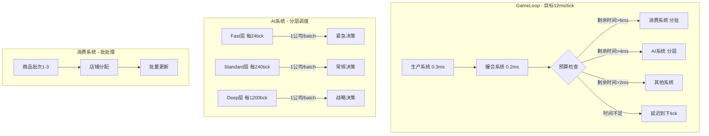

# 关键性能问题修复方案

## 问题概述

根据性能监控数据分析，游戏存在**严重的性能问题**：

| 指标 | 当前值 | 目标值 | 差距 |
|------|--------|--------|------|
| 健康状态 | 100% Critical | 90%+ Healthy | 极差 |
| 平均Tick时间 | 174.66ms | <16.67ms | **10.5x过高** |
| 最大Tick时间 | 518.2ms | <50ms | **10x过高** |
| 对象池命中率 | 0% | >80% | 未工作 |

## 性能瓶颈分析

### 1. AI系统（主要瓶颈，占50-60%）

**典型数据**：
- 正常tick：85-100ms
- 峰值tick：180-329ms（如tick 15达到329ms）

**问题根源**：
```
src/core/ai/AIDecisionEngine.ts (3447行)
├── runAIDecisionCycle() - 每个AI公司执行完整决策周期
│   ├── assessCompanyState() - 评估公司状态
│   ├── evaluatePersonalityGoalGap() - 评估人格目标差距
│   ├── performRiskAssessment() - 风险评估
│   ├── updateCompetitorProfiles() - 更新竞争者档案
│   ├── generateCompetitiveResponses() - 生成竞争响应
│   ├── updateStrategicPlan() - 更新战略规划
│   ├── detectScenarios() - 检测场景
│   ├── getRecommendedActions() - 获取推荐行动
│   ├── 生成各类决策（生产/定价/交易/投资/股票/附属）
│   ├── generateTradingSignals() - 生成交易信号
│   ├── generatePredictiveTradeDecisions() - 预测性交易决策
│   ├── 多层决策过滤和调整
│   └── executeDecision() × N次
```

**问题分析**：
1. **决策模块太多**：集成了8大AI模块，每个模块都在每个决策周期运行
2. **没有有效分层**：虽然有AIScheduler，但实际仍在执行重型操作
3. **遍历所有商品**：很多函数遍历所有商品（ACTUAL_GOODS_COUNT）
4. **未利用缓存**：每次都重新计算，没有利用IndicatorCache等

### 2. 消费者系统（次要瓶颈，占30-40%）

**典型数据**：
- 正常tick：55-80ms
- 峰值tick：114ms

**问题根源**：
```
src/core/economy/ConsumerMarket.ts
├── executeConsumerPurchases()
│   ├── updateRetailSystem() - 零售系统更新
│   │   ├── processRetailDelivery() - 处理收货
│   │   ├── processRestocking() - 处理进货
│   │   ├── processPopConsumption() - Pop消费（核心瓶颈）
│   │   │   ├── 遍历所有消费商品
│   │   │   ├── 每个商品查找有货店铺
│   │   │   ├── 计算吸引力和分配
│   │   │   └── 执行购买
│   │   └── adjustRetailPrices() - 价格调整
│   └── executeB2BPurchases() - B2B采购
```

**问题分析**：
1. **批量处理不足**：每tick处理太多商品
2. **重复遍历**：多次遍历零售店和商品
3. **缓存失效**：缓存更新间隔太短

### 3. 对象池问题（命中率0%）

**问题**：所有对象池（orders, events, trades, pricePoints, typedArrays）的命中率都是0%

**可能原因**：
1. 池化逻辑未正确实现
2. 对象没有被回收到池中
3. 池的初始化/使用流程有问题

## 优化方案

### 方案一：AI系统优化（预期节省60-100ms）

#### 1.1 激进分层策略

修改 `AIScheduler.ts`：

```typescript
// 新配置
const OPTIMIZED_CONFIG: AISchedulerConfig = {
  // 大幅降低处理量
  fastBatchSize: 1,        // 每tick只处理1个公司的fast决策
  standardBatchSize: 1,    // 每tick只处理1个公司的standard决策
  deepBatchSize: 1,        // 每tick只处理1个公司的deep决策
  
  // 大幅增加间隔
  fastInterval: 12,        // 每12tick执行一次（原来4）
  standardInterval: 120,   // 每120tick执行一次（原来48）
  deepInterval: 600,       // 每600tick执行一次（原来180）
  
  maxTimePerTick: 2,       // 严格限制2ms
  
  enableFastDecision: true,
  enableStandardDecision: true,
  enableDeepDecision: true,
};
```

#### 1.2 简化Fast决策

修改 `FastDecision.ts`，只做最核心的操作：

```typescript
export function fastDecision(world: GameWorld, companyId: number): void {
  // 只做3件事：
  // 1. 检查紧急库存（<3天用量）-> 紧急采购
  // 2. 检查积压库存（>30天用量）-> 紧急清仓
  // 3. 更新1-2个最重要商品的订单价格
  
  // 其他复杂逻辑移到standard/deep层级
}
```

#### 1.3 禁用部分模块

在GameLoop中临时禁用非核心AI功能：

```typescript
// 临时禁用以提升性能
// runProductionOptimization() - 每12tick -> 每120tick
// runAISubsidiaryManagement() - 每24tick -> 每240tick
// executeAIStockTrading() - 每12tick -> 每60tick
```

### 方案二：消费者系统优化（预期节省40-60ms）

#### 2.1 增大批处理粒度

```typescript
// RetailSystem.ts
const CONSUMPTION_BATCH_SIZE = 5;   // 从10降到5
const RESTOCK_BATCH_SIZE = 5;       // 从10降到5
const RESTOCK_INTERVAL = 48;        // 从24增加到48
```

#### 2.2 延长缓存有效期

```typescript
// 商品→零售店索引缓存
retailGoodsCache.updateInterval = 100;  // 从50增加到100

// 店铺吸引力缓存
attractivenessCache.updateInterval = 48;  // 从24增加到48

// 买单缓存
BUY_ORDER_CACHE_TTL = 24;  // 从6增加到24
```

#### 2.3 简化消费逻辑

```typescript
function processPopConsumptionOptimized(world: GameWorld): PopConsumptionResult {
  // 简化版本：
  // 1. 使用预计算的商品→店铺映射
  // 2. 按比例直接分配，不计算吸引力
  // 3. 批量更新统计
}
```

### 方案三：GameLoop优化（预期节省10-20ms）

#### 3.1 错峰执行策略

```typescript
// 将同步执行改为分散执行
const TICK_SCHEDULE = {
  0:  ['production', 'matching'],           // 核心功能
  1:  ['consumer', 'retail'],               // 消费系统
  2:  ['ai_fast'],                          // AI快速决策
  3:  ['pricing'],                          // 价格更新
  4:  ['consumer', 'retail'],
  5:  ['ai_fast'],
  6:  ['inventory', 'logistics'],           // 库存物流
  7:  ['consumer', 'retail'],
  8:  ['ai_fast'],
  9:  ['finance'],                          // 金融系统
  10: ['consumer', 'retail'],
  11: ['ai_fast'],
  // ... 循环
};
```

#### 3.2 时间预算强制执行

```typescript
function processTick(): TickResult {
  const startTime = performance.now();
  const BUDGET_MS = 12; // 严格12ms预算
  
  // 核心功能（必须执行）
  updateAllProduction(world);  // ~0.3ms
  matchAllOrders(world);       // ~0.2ms
  
  // 可选功能（按预算执行）
  if (performance.now() - startTime < BUDGET_MS * 0.5) {
    processConsumer(); // 消费者
  }
  
  if (performance.now() - startTime < BUDGET_MS * 0.7) {
    processAI();  // AI
  }
  
  // 剩余功能延迟到下一tick
}
```

### 方案四：对象池修复

#### 4.1 检查池化实现

```typescript
// ObjectPool.ts 修复检查点：
// 1. 确保 releaseOrderSlot() 正确将对象归还池
// 2. 确保 acquireOrderSlot() 优先从池获取
// 3. 添加调试日志追踪池的使用情况
```

#### 4.2 添加池监控

```typescript
// 在每100tick输出池状态
if (tick % 100 === 0) {
  console.log('[Pool Stats]', {
    orders: { acquired: X, released: Y, reused: Z },
    hitRate: Z / X
  });
}
```

## 实施优先级

| 优先级 | 任务 | 预期效果 | 复杂度 |
|--------|------|----------|--------|
| P0 | AI调度器参数调优 | -50ms | 低 |
| P0 | 消费系统批处理调优 | -30ms | 低 |
| P1 | 简化Fast决策 | -20ms | 中 |
| P1 | GameLoop错峰执行 | -15ms | 中 |
| P2 | 对象池修复 | -5ms + 稳定性 | 中 |
| P2 | 时间预算强制 | 峰值控制 | 中 |

## 预期结果

| 指标 | 优化前 | 优化后（预期） |
|------|--------|----------------|
| 平均Tick时间 | 174.66ms | <30ms |
| 最大Tick时间 | 518.2ms | <80ms |
| 健康状态 | 100% Critical | 70%+ Healthy |

## 快速验证方案

### 步骤1：参数调优（5分钟见效）

修改以下文件的常量：

**`src/core/ai/AIScheduler.ts`**:
```typescript
const DEFAULT_CONFIG: AISchedulerConfig = {
  fastBatchSize: 1,
  standardBatchSize: 1,
  deepBatchSize: 1,
  fastInterval: 24,
  standardInterval: 240,
  deepInterval: 1200,
  maxTimePerTick: 2,
  // ...
};
```

**`src/core/economy/RetailSystem.ts`**:
```typescript
const CONSUMPTION_BATCH_SIZE = 3;
const RESTOCK_BATCH_SIZE = 3;
const RESTOCK_INTERVAL = 96;
```

### 步骤2：禁用非核心功能（可选）

在 `GameLoop.ts` 的 `processTick()` 中临时注释掉：
- `runProductionOptimization()`
- `runAISubsidiaryManagement()`
- `executeAIStockTrading()`

这些可以在性能稳定后逐步恢复。

## 架构图



## 下一步行动

1. **立即**：调整AIScheduler和RetailSystem的参数
2. **验证**：运行100tick观察性能变化
3. **迭代**：根据结果进一步调整或实施更深层优化