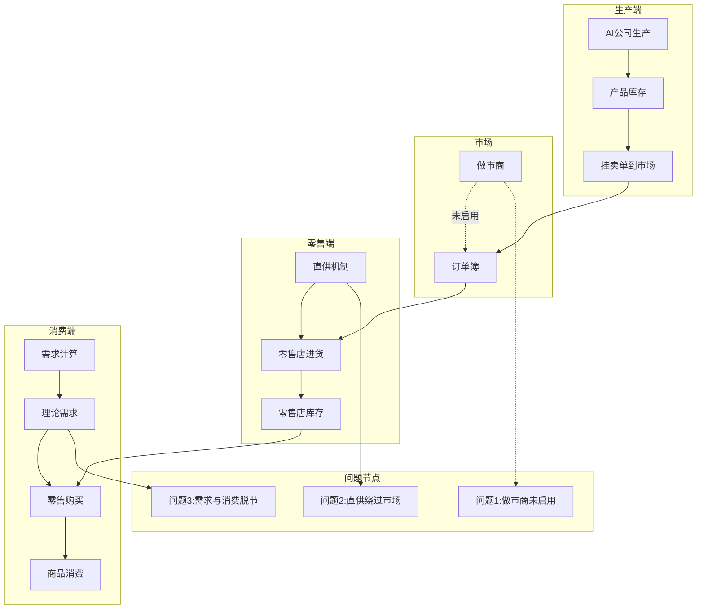
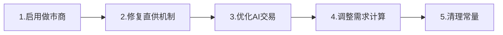

# 游戏当前问题深度分析报告

## 分析日期：2026-01-26

---

## 一、问题概述

经过对游戏核心代码的全面分析，我发现以下几类主要问题：

---

## 二、问题清单

### 【P0 - 严重问题】需立即修复

#### 问题1：做市商系统状态不一致

**问题描述：**
- `GameLoop.ts:114` 注释说"已移除系统做市商"，但 `MarketMaker.ts` 代码仍然存在
- `MarketMaker.ts:70` 使用 `companyId=99` 作为做市商ID
- GameLoop中没有调用 `updateMarketMaker()`，做市商实际未运行
- 市场流动性完全依赖40家AI公司，可能导致某些商品无法交易

**影响：**
- 市场缺乏基础流动性
- 冷门商品可能完全无买卖单
- 价格发现机制失效

**建议：**
重新启用做市商系统，或确保AI公司能覆盖所有商品的流动性

---

#### 问题2：零售系统进货与库存不匹配

**位置：** `RetailSystem.ts`

**问题描述：**
- 零售店初始库存设置为100%容量（第198行）
- 便利店每种商品容量仅100单位（根据buildings.ts）
- 8个消费层级的需求可能在几个tick内耗尽库存
- 进货依赖市场卖单，如果市场没有卖单则使用"直供"机制

**直供机制问题（第392行）：**
```typescript
const directPrice = basePrice * 0.9;  // 直供价格是基准价90%
```
- 直供价格低于基准价，零售商加价后有利润空间
- 但直供相当于"凭空创造商品"，不消耗任何公司库存
- 可能导致市场供需统计失真

**影响：**
- 消费需求能满足，但商品来源不透明
- 生产商的产品可能卖不出去（因为零售商走直供渠道）
- 市场交易量可能被人为压低

---

### 【P1 - 重要问题】影响游戏体验

#### 问题3：AI决策与交易执行脱节

**位置：** `AIDecisionEngine.ts` + `GameLoop.ts`

**问题描述：**
1. AI每tick生成决策并立即执行
2. 交易决策生成买卖订单，但订单在后续tick才撮合
3. AI不检查订单是否成交就继续生成新订单
4. 可能导致同一公司挂出大量未成交订单

**当前流程：**
```
Tick N:
  1. AI公司决策 → 生成卖单
  2. 玩家自动交易 → 生成买卖单  
  3. 消费者市场购买 → 消耗卖单
  4. 订单撮合 → 匹配买卖单
  5. 价格更新
```

**问题点：**
- 步骤3的消费者购买直接消耗卖单，不经过撮合
- 可能导致AI的卖单被消费者买走，而AI的买单无人响应

---

#### 问题4：需求计算与实际消费脱节

**位置：** `DemandCurve.ts` + `ConsumerMarket.ts` + `RetailSystem.ts`

**问题描述：**

1. **DemandCurve.ts** 计算理论需求：
   - 基于8个收入层级的人口（共2.1亿人）
   - 计算每种消费品的理论需求量
   - 存入 `world.goods.demands[]`

2. **RetailSystem.ts** 处理实际消费：
   - 从 `world.goods.demands[]` 读取需求
   - 每tick只消费需求的2%（`RETAIL_MAX_CUSTOMER_RATE = 0.02`）
   - 消费通过零售店进行

3. **问题：**
   - 理论需求很大（百万级），实际消费很小（千级/tick）
   - 需求数据不断累积但消费速度跟不上
   - 导致供需数据失真

---

#### 问题5：玩家自动交易策略过于保守

**位置：** `PlayerAutoTrader.ts`（假设存在）

**问题描述：**
- GameLoop.ts:293 调用 `executePlayerAutoTrade(world)`
- 返回 `{ sellOrders, buyOrders }` 统计
- 需要确认玩家自动交易的策略是否合理

---

### 【P2 - 次要问题】可优化

#### 问题6：常量定义与实际使用不一致

**位置：** `constants.ts`

| 常量 | 定义值 | 实际值 | 问题 |
|------|--------|--------|------|
| GOODS_COUNT | 128 | 104 | 浪费内存 |
| CONSUMER_GOODS_COUNT | 35 | ~35 | OK |
| AI_DECISION_INTERVAL | 24 | 未使用 | 代码不一致 |

---

#### 问题7：平滑系数不一致

**问题描述：**
- `constants.ts:87`: `SUPPLY_DEMAND_SMOOTHING = 0.5`
- `constants.ts:90`: `DEMAND_SMOOTHING_FACTOR = 0.5`
- `DemandCurve.ts:558` 使用 `DEMAND_SMOOTHING_FACTOR`
- 已修复为统一值0.5

---

## 三、问题关系图



---

## 四、根本原因分析

### 核心矛盾：供需链路断裂

1. **生产端** → 生成产品 → 挂卖单
2. **市场** → 订单撮合（理论上）
3. **零售端** → 从市场进货 → 卖给消费者
4. **消费端** → 消费产品

**断裂点：**
- 零售店可以走"直供"渠道，完全绕过市场
- 直供不消耗任何公司库存，相当于凭空创造商品
- 导致生产商的产品卖不出去

---

## 五、推荐修复方案

### 方案A：修复直供机制（推荐）

修改 `RetailSystem.ts` 的 `purchaseFromWholesale` 函数：

```typescript
// 方案A1：完全禁用直供，强制从市场采购
if (purchased < quantity) {
  // 不使用直供，返回实际购买量
  console.log(`[零售] 商品${goodsId}市场供应不足，需求${quantity}，实际${purchased}`);
}

// 方案A2：将直供改为从AI生产商自动采购
// 寻找生产该商品的AI公司，直接从其库存购买
```

### 方案B：启用做市商系统

1. 在 `GameLoop.ts` 中重新调用 `updateMarketMaker()`
2. 做市商为每种商品提供买卖单
3. 确保市场始终有流动性

### 方案C：优化AI交易策略

1. 让AI更积极地挂卖单
2. 降低卖出价格，使其更容易被零售商接受
3. 增加AI挂单数量

---

## 六、优先级排序

| 优先级 | 问题 | 修复复杂度 | 影响范围 |
|--------|------|------------|----------|
| P0 | 直供机制绕过市场 | 中 | 核心经济循环 |
| P0 | 做市商系统未启用 | 低 | 市场流动性 |
| P1 | AI订单累积问题 | 中 | 订单簿性能 |
| P1 | 需求与消费脱节 | 中 | 供需平衡 |
| P2 | 常量不一致 | 低 | 代码质量 |

---

## 七、建议修复顺序



---

## 八、下一步行动

1. **与用户确认**：以上分析是否准确？是否有遗漏的问题？
2. **确定优先级**：用户最关心哪些问题？
3. **制定修复计划**：根据优先级逐一修复
4. **测试验证**：修复后验证市场运行正常

---

*报告完成时间：2026-01-26*