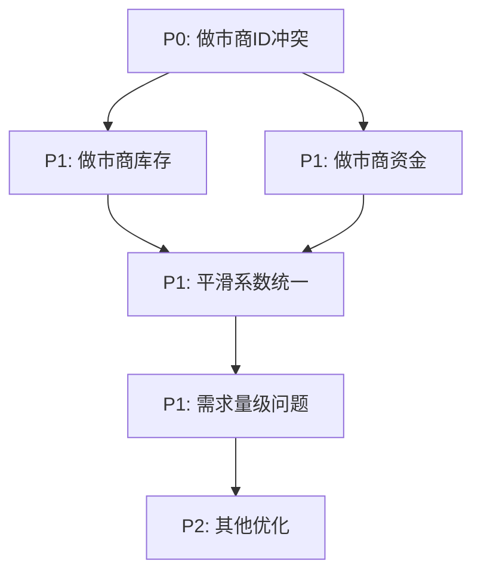

# 当前市场系统问题分析

## 分析日期：2026-01-26

## 概述

本文档是对修复后的市场系统进行的重新分析，识别出仍然存在或新引入的问题。

---

## 问题清单

### 1. 做市商系统问题

#### 问题1.1：做市商公司ID冲突 [P0-严重]
**位置**: `src/core/market/MarketMaker.ts:66`
```typescript
const MARKET_MAKER_COMPANY_ID = 0;  // 使用第一个公司槽位作为系统做市商
```
**问题描述**: 
- 做市商使用公司ID=0，但这是玩家公司的默认槽位
- 可能导致做市商操作玩家的资金和库存
- 玩家订单和做市商订单会混在一起

**建议修复**:
- 将做市商设置为单独的系统账户（负数ID或特殊标记）
- 或者在WorldInitializer中预留做市商槽位

#### 问题1.2：做市商初始无库存 [P1-中等]
**位置**: `src/core/market/MarketMaker.ts:86-93`
**问题描述**:
- 做市商初始化时库存为0
- 只能挂买单，无法立即提供卖出流动性
- 需要先买入才能卖出，启动阶段市场仍然单边

**建议修复**:
- 初始化时给做市商预设一定库存
- 或设置"虚拟库存"机制用于卖出

#### 问题1.3：做市商资金不足 [P1-中等]
**位置**: `src/core/market/MarketMaker.ts:59`
```typescript
capital: 100000,            // 10万资金
```
**问题描述**:
- 10万资金分配给104种商品，每种仅约1000元
- 高价商品（如汽车25000元）几乎无法做市
- 无法有效缩小价差

**建议修复**:
- 提高做市商资金至1000万以上
- 或根据商品价值动态分配资金

---

### 2. 消费需求计算问题

#### 问题2.1：需求量级差异过大 [P1-中等]
**位置**: `src/core/economy/DemandCurve.ts:288-384`
**问题描述**:
- 食品需求3.0×2.1亿人=6.3亿单位/月
- 珠宝需求0.0002×2.1亿人=42000单位/月
- 需求差异达到15000倍，价格机制难以均衡

**建议修复**:
- 引入需求数量的对数缩放
- 或调整生产能力与需求匹配

#### 问题2.2：预算约束可能过紧 [P2-低]
**位置**: `src/core/economy/DemandCurve.ts:273-274`
```typescript
const maxAffordable = availableBudget / currentPrice;
demand = Math.min(demand, maxAffordable);
```
**问题描述**:
- 预算约束使用单一品类预算限制
- 未考虑消费者会在品类间调整预算
- 可能导致高价商品需求被过度压制

---

### 3. AI交易决策问题

#### 问题3.1：决策频率常量未使用 [P2-低]
**位置**: 
- `src/core/constants.ts:119`: `AI_DECISION_INTERVAL = 24`
- `src/core/loop/GameLoop.ts:271-275`: 使用硬编码的3
**问题描述**:
- 定义了AI_DECISION_INTERVAL=24但未使用
- 实际使用硬编码的每3tick一轮

#### 问题3.2：卖出定价不够智能 [P2-低]
**位置**: `src/core/ai/AIDecisionEngine.ts:295-296`
```typescript
const priceDiscount = inventoryDays > 30 ? 0.92 : inventoryDays > 14 ? 0.95 : 0.98;
const sellPrice = currentPrice * priceDiscount;
```
**问题描述**:
- 固定折扣率，未考虑当前订单簿深度
- 可能导致订单无法成交或折价过多

---

### 4. 价格发现问题

#### 问题4.1：供需平滑系数可能过激 [P2-低]
**位置**: `src/core/economy/PriceEngine.ts:15`
```typescript
const SUPPLY_DEMAND_SMOOTHING = 0.4; // 新数据占40%，历史占60%
```
**问题描述**:
- 40%的新数据权重意味着历史数据快速衰减
- 可能导致价格对短期波动过于敏感
- 与DemandCurve.ts中的smoothingFactor=0.7不一致

#### 问题4.2：低交易量时VWAP计算问题 [P2-低]
**位置**: `src/core/economy/PriceEngine.ts:129-131`
```typescript
const volume24h = get24hVolume(world, i);
const vwapWeight = Math.min(0.5, 0.3 + volume24h / 1000 * 0.2);
```
**问题描述**:
- 当成交量为0时，vwapWeight仍为0.3
- 但此时VWAP为null，计算可能异常

---

### 5. 数据一致性问题

#### 问题5.1：平滑系数不一致 [P1-中等]
**位置**: 
- `src/core/economy/PriceEngine.ts:15`: `SUPPLY_DEMAND_SMOOTHING = 0.4`
- `src/core/economy/DemandCurve.ts:551`: `smoothingFactor = 0.7`
**问题描述**:
- 两处使用不同的平滑系数
- 可能导致供需数据混乱

#### 问题5.2：常量与实际不匹配 [P2-低]
**位置**: `src/core/constants.ts`
**问题描述**:
- `GOODS_COUNT=128` 但实际商品104种
- `CONSUMER_GOODS_COUNT=50` 实际消费品35种（filter结果）

---

## 优先级分类

### P0 - 必须立即修复
| ID | 问题 | 影响 |
|----|------|------|
| 1.1 | 做市商公司ID冲突 | 可能污染玩家数据 |

### P1 - 重要问题
| ID | 问题 | 影响 |
|----|------|------|
| 1.2 | 做市商初始无库存 | 启动阶段流动性不足 |
| 1.3 | 做市商资金不足 | 无法有效做市 |
| 2.1 | 需求量级差异过大 | 市场失衡 |
| 5.1 | 平滑系数不一致 | 数据混乱 |

### P2 - 次要问题
| ID | 问题 | 影响 |
|----|------|------|
| 2.2 | 预算约束过紧 | 高价商品需求低 |
| 3.1 | 决策频率常量未使用 | 代码不一致 |
| 3.2 | AI卖出定价不智能 | 成交率可能低 |
| 4.1 | 平滑系数过激 | 价格波动 |
| 4.2 | VWAP计算问题 | 低交易量时异常 |
| 5.2 | 常量与实际不匹配 | 可能造成内存浪费 |

---

## 建议修复顺序



## 修复建议汇总

### 1. 做市商系统修复
```typescript
// MarketMaker.ts 修改
const MARKET_MAKER_COMPANY_ID = -1;  // 使用特殊ID
const DEFAULT_CONFIG = {
  capital: 10_000_000,  // 1000万资金
  initialInventory: 100, // 每种商品初始100单位
  // ...
};
```

### 2. 平滑系数统一
```typescript
// 统一使用一个常量
export const DEMAND_SMOOTHING_FACTOR = 0.6; // 新数据占60%
```

### 3. 需求量级修复
```typescript
// 引入需求缩放
function scaleMarketDemand(rawDemand: number): number {
  // 使用对数缩放使需求差异更合理
  return Math.log10(rawDemand + 1) * 1000;
}