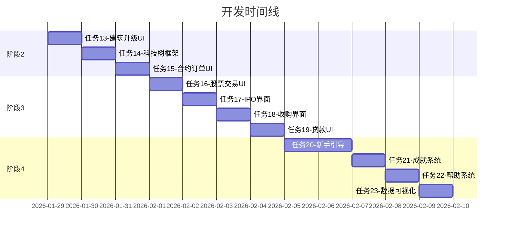

# 供应链指挥官 - 2026年Q1后续开发计划

## 执行摘要

本计划基于对现有代码库的深度分析，制定了游戏从当前状态到正式发布的完整开发路线图。

**当前进度：阶段1-2已完成80%，阶段3-4待开发**

---

## 已完成任务回顾 ✅

### 阶段1：核心问题修复（全部完成）

| 任务 | 状态 | 说明 |
|------|------|------|
| 任务1-6：P0核心修复 | ✅ 已完成 | 前次会话完成 |
| 任务7：AI批发直销机制 | ✅ 已完成 | `RetailSystem.ts` 新增 `processWholesaleSupply` |
| 任务8：消费速率调整 | ✅ 已完成 | `ConsumerMarket.ts` 消费率从0.32提升至0.48 |
| 任务9：冷门商品检测 | ✅ 已完成 | `AIDecisionEngine.ts` 新增 `buildForColdGoods` |
| 任务10：需求移动平均 | ✅ 已完成 | `constants.ts` 平滑系数调整为0.25 |

### 阶段2：游戏深度扩展（大部分完成）

| 任务 | 状态 | 说明 |
|------|------|------|
| 任务11：集成SubstitutionSystem | ✅ 已完成 | `GameLoop.ts` 调用 `applyMarketSubstitution` |
| 任务12：激活QualitySystem | ✅ 已完成 | 已在 `ProductionEngine.ts` 中集成 |
| 任务13：建筑升级UI | 🔄 待实现 | 需要添加升级按钮和进度显示 |
| 任务14：科技树框架 | ⏳ 待开发 | 核心数据结构待设计 |
| 任务15：合约订单UI | ⏳ 待开发 | UI组件待开发 |

---

## 后续开发计划

### 阶段2剩余任务（1-2天）

#### 任务13：建筑升级UI组件

**目标**：在建筑详情面板添加升级功能

**技术方案**：
```
src/ui/components/Building/
├── BuildingUpgradePanel.tsx   # 升级面板组件
├── UpgradeProgressBar.tsx     # 升级进度条
└── UpgradeCostDisplay.tsx     # 升级成本显示
```

**关键功能**：
- 显示当前等级和最大等级
- 升级成本预览（资金+材料）
- 升级后效率提升预览
- 一键升级按钮

#### 任务14：科技树框架

**目标**：创建基础科技研发系统

**数据结构设计**：
```typescript
interface Technology {
  id: number;
  name: string;
  category: 'production' | 'logistics' | 'finance' | 'ai';
  prerequisites: number[];  // 前置科技ID
  researchCost: number;     // 研发成本
  researchTime: number;     // 研发周期（tick）
  effects: TechEffect[];    // 解锁效果
}
```

**科技类别**：
1. **生产科技**：提升产能、降低消耗
2. **物流科技**：加快运输、降低仓储成本
3. **金融科技**：降低贷款利率、提升投资收益
4. **AI科技**：解锁自动化功能

#### 任务15：合约订单UI

**目标**：可视化管理供应合约

**组件设计**：
- `ContractListPanel`：合约列表
- `ContractNegotiationModal`：合约谈判界面
- `ContractPerformanceChart`：履约进度图表

---

### 阶段3：金融系统UI（2-3天）

#### 任务16：股票交易界面

**目标**：完善股票市场交互

**功能列表**：
- [x] 股票列表显示（已有基础实现）
- [ ] 买入/卖出订单面板
- [ ] K线图表组件
- [ ] 持仓管理界面
- [ ] 交易历史记录

**技术栈**：React + Recharts/D3.js

#### 任务17：IPO上市界面

**目标**：支持公司首次公开募股

**功能**：
- IPO申请表单
- 发行价格设定
- 认购进度显示
- 上市成功/失败通知

#### 任务18：收购要约界面

**目标**：可视化并购流程

**功能**：
- 目标公司选择
- 报价设定（溢价计算）
- 股东投票进度
- 收购结果公告

#### 任务19：贷款系统UI

**目标**：完善银行贷款界面

**功能**：
- 贷款产品列表
- 利率计算器
- 还款计划表
- 信用评级显示

---

### 阶段4：用户体验优化（3-4天）

#### 任务20：新手引导系统

**目标**：引导新玩家上手

**实现方案**：
```
src/ui/tutorial/
├── TutorialManager.ts       # 教程管理器
├── TutorialStep.tsx         # 单步骤组件
├── TutorialHighlight.tsx    # 高亮遮罩
└── tutorialScripts/         # 教程脚本
    ├── basicBuilding.ts
    ├── marketTrading.ts
    └── financialSystem.ts
```

**教程流程**：
1. 建造第一个工厂
2. 生产第一批商品
3. 在市场上交易
4. 扩张产业链
5. 金融投资入门

#### 任务21：成就系统

**目标**：增加游戏成就感

**成就类别**：
- 🏭 生产成就：首次生产、产量里程碑
- 💰 财富成就：资产达标、盈利记录
- 📈 市场成就：交易量、价格发现
- 🏆 特殊成就：行业垄断、全产业链

#### 任务22：游戏内帮助系统

**目标**：上下文敏感的帮助

**功能**：
- 悬停提示（Tooltip）增强
- 术语词典
- 快捷键参考
- 系统机制解释

#### 任务23：数据可视化增强

**目标**：提供更丰富的数据展示

**图表类型**：
- 产业链关系图（Sankey）
- 市场供需对比图
- 价格历史趋势图
- 公司财务报表图

---

## 技术债务清理

### 优先级高

1. **组件性能优化**
   - React.memo 应用到高频更新组件
   - useMemo/useCallback 优化渲染

2. **状态管理重构**
   - Zustand store 分片优化
   - 避免不必要的全局状态更新

3. **类型安全增强**
   - 消除 any 类型
   - 添加更严格的类型守卫

### 优先级中

1. **测试覆盖**
   - 核心系统单元测试
   - E2E 关键流程测试

2. **代码文档**
   - JSDoc 注释补充
   - 架构文档更新

---

## 里程碑时间线



---

## 下一步行动

1. **立即执行**：切换到Code模式完成任务13（建筑升级UI）
2. **本周目标**：完成阶段2全部任务
3. **下周目标**：完成阶段3金融系统UI
4. **长期目标**：完成阶段4后进入内测阶段

---

*文档创建时间：2026-01-29*
*最后更新：自动生成*