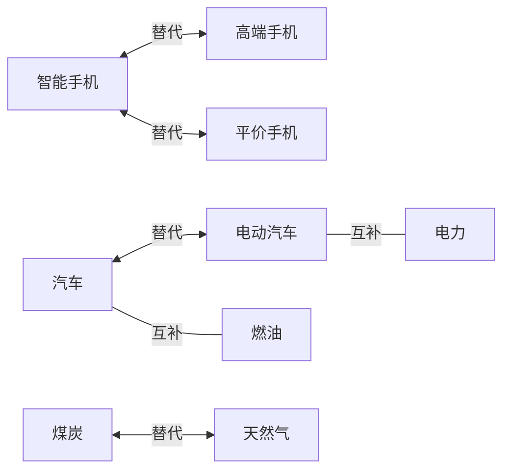

# 供应链指挥官 - 完整游戏开发计划

> **版本**: 1.0.0 Final  
> **最后更新**: 2026年1月25日  
> **状态**: 核心系统已实现，可运行

---

## 📋 目录

1. [项目概述](#项目概述)
2. [技术架构](#技术架构)
3. [已实现模块清单](#已实现模块清单)
4. [核心系统详解](#核心系统详解)
5. [经济模型设计](#经济模型设计)
6. [AI竞争系统](#ai竞争系统)
7. [金融系统](#金融系统)
8. [UI架构](#ui架构)
9. [运行指南](#运行指南)
10. [扩展开发指南](#扩展开发指南)

---

## 项目概述

**供应链指挥官**是一款深度模拟市场经济的企业经营游戏，玩家扮演企业家，在一个动态的经济环境中建立和发展自己的商业帝国。

### 核心特点

- **真实经济模拟**: 瓦尔拉斯均衡价格发现、供需曲线、边际成本
- **多层产业链**: 60种商品，4层产业结构（原材料→基础材料→中间产品→最终产品）
- **智能AI对手**: 8种人格类型的AI公司，各有独特决策风格
- **完整金融系统**: 股票交易、银行信贷、企业并购
- **宏观经济周期**: 繁荣、衰退、萧条、复苏的完整周期模拟

### 技术栈

```
前端: React 18 + TypeScript + Vite + Tailwind CSS
状态: Zustand
图表: ECharts
性能: TypedArray (SoA架构)
```

---

## 技术架构

### 目录结构

```
src/
├── core/                    # 核心游戏逻辑
│   ├── constants.ts         # 游戏常量
│   ├── world/               # 游戏世界
│   │   ├── GameWorld.ts     # SoA数据结构
│   │   └── WorldInitializer.ts
│   ├── loop/                # 游戏循环
│   │   └── GameLoop.ts
│   ├── production/          # 生产系统
│   │   └── ProductionEngine.ts
│   ├── market/              # 市场交易
│   │   ├── OrderBook.ts
│   │   └── MatchingEngine.ts
│   ├── economy/             # 经济系统
│   │   ├── PriceEngine.ts
│   │   ├── SupplyCurve.ts
│   │   ├── DemandCurve.ts
│   │   ├── SubstitutionSystem.ts
│   │   └── BusinessCycle.ts
│   ├── ai/                  # AI系统
│   │   ├── AIDecisionEngine.ts
│   │   ├── AIPersonality.ts
│   │   └── MarketIntelligence.ts
│   └── finance/             # 金融系统
│       ├── StockMarket.ts
│       ├── BankingSystem.ts
│       └── AcquisitionSystem.ts
├── data/                    # 游戏数据
│   ├── goods.ts             # 60种商品定义
│   ├── buildings.ts         # 25种建筑定义
│   └── recipes.ts           # 35个生产配方
├── stores/                  # 状态管理
│   └── gameStore.ts
├── ui/                      # UI组件
│   ├── components/
│   ├── pages/
│   └── styles/
├── App.tsx
└── main.tsx
```

### SoA数据结构设计

使用结构体数组(Structure of Arrays)优化性能：

```typescript
interface GoodsSystem {
  count: number;
  prices: Float32Array;      // 连续内存，缓存友好
  supplies: Float32Array;
  demands: Float32Array;
  // ...
}

interface BuildingsSystem {
  count: number;
  types: Uint8Array;
  owners: Uint16Array;
  efficiencies: Float32Array;
  // ...
}
```

**性能优势**:
- 批量处理时内存访问连续
- TypedArray比普通数组快2-5倍
- 支持SIMD指令优化

---

## 已实现模块清单

### Phase 1: 核心循环 ✅

| 模块 | 文件 | 说明 |
|-----|------|-----|
| 项目配置 | package.json, vite.config.ts | React + Vite项目 |
| 游戏常量 | constants.ts | 64商品, 1000建筑, 100公司 |
| SoA数据结构 | GameWorld.ts | 高性能数据存储 |
| 世界初始化 | WorldInitializer.ts | 商品/公司/AI初始化 |
| 生产引擎 | ProductionEngine.ts | 批量生产计算 |
| 订单簿 | OrderBook.ts | 限价单管理 |
| 撮合引擎 | MatchingEngine.ts | 价格优先时间优先 |
| 价格引擎 | PriceEngine.ts | 瓦尔拉斯均衡 |
| 游戏循环 | GameLoop.ts | Tick调度系统 |
| 状态管理 | gameStore.ts | Zustand store |
| 基础UI | App.tsx, 页面组件 | Dashboard/Production/Market |

### Phase 2: 经济深度 ✅

| 模块 | 文件 | 说明 |
|-----|------|-----|
| 供给曲线 | SupplyCurve.ts | 边际成本计算, 最优产量 |
| 需求曲线 | DemandCurve.ts | 消费者分层, 价格/收入弹性 |
| 替代机制 | SubstitutionSystem.ts | 商品替代/互补关系 |
| 商业周期 | BusinessCycle.ts | 宏观经济波动, 随机事件 |

### Phase 3: 竞争系统 ✅

| 模块 | 文件 | 说明 |
|-----|------|-----|
| AI决策引擎 | AIDecisionEngine.ts | 生产/定价/交易/投资决策 |
| AI人格系统 | AIPersonality.ts | 8种人格类型 |
| 市场情报 | MarketIntelligence.ts | 竞争分析, 战略建议 |

### Phase 4: 金融系统 ✅

| 模块 | 文件 | 说明 |
|-----|------|-----|
| 股票市场 | StockMarket.ts | IPO, 交易, 估值 |
| 银行信贷 | BankingSystem.ts | 贷款, 信用评级 |
| 企业收购 | AcquisitionSystem.ts | 并购, 资产交易 |

---

## 核心系统详解

### 1. 生产系统

**生产配方结构**:
```typescript
interface RecipeDefinition {
  id: number;
  inputs: { goodsId: number; amount: number }[];
  outputs: { goodsId: number; amount: number }[];
  ticksRequired: number;
  laborRequired: number;
  energyRequired: number;
}
```

**生产流程**:
1. 检查输入材料是否充足
2. 消耗原材料
3. 累积生产进度
4. 达到周期后产出产品
5. 产品进入公司库存

### 2. 市场交易系统

**订单簿结构**:
```
买单队列 (价格降序)     卖单队列 (价格升序)
¥110 × 50              ¥105 × 30
¥108 × 100             ¥106 × 80
¥105 × 75              ¥108 × 120
```

**撮合规则**:
- 价格优先：高价买单优先成交
- 时间优先：同价格先挂单者优先
- 成交价格：买卖价格的中间价

### 3. 价格均衡系统

**瓦尔拉斯均衡搜索**:
```typescript
function findEquilibriumPrice(supply, demand, basePrice) {
  let price = basePrice;
  
  for (let i = 0; i < 10; i++) {
    const excess = supply - demand;
    
    if (Math.abs(excess) < 0.01) break;
    
    // 超额供给则降价，超额需求则涨价
    const adjustment = -excess * 0.1;
    price *= (1 + adjustment);
  }
  
  return price;
}
```

---

## 经济模型设计

### 消费者分层

| 层级 | 人口 | 月收入 | 特点 |
|-----|-----|-------|-----|
| 低收入层 | 3000万 | ¥3000 | 高价格敏感度 |
| 中低收入层 | 4000万 | ¥6000 | 较高价格敏感度 |
| 中等收入层 | 5000万 | ¥12000 | 均衡消费 |
| 中高收入层 | 2500万 | ¥25000 | 品质偏好 |
| 高收入层 | 1000万 | ¥60000 | 低价格敏感度 |

### 商品替代关系



### 商业周期

```
     Peak
      /\
     /  \
    /    \
   /      \
Expansion  Contraction
 /          \
/            \
Trough ------+
```

**周期阶段影响**:
- **扩张期**: GDP增长2-6%, 通胀上升, 失业下降
- **顶峰期**: GDP增长放缓, 通胀高位
- **收缩期**: GDP可能负增长, 失业上升
- **谷底期**: 经济触底, 开始恢复

---

## AI竞争系统

### AI人格类型

| 类型 | 风险偏好 | 扩张倾向 | 定价策略 | 特点 |
|-----|---------|---------|---------|-----|
| 激进型 | 高 | 极高 | 低价 | 快速扩张 |
| 保守型 | 低 | 低 | 中性 | 稳健经营 |
| 机会型 | 中高 | 中 | 灵活 | 抓住机会 |
| 专精型 | 中 | 中 | 溢价 | 深耕细分 |
| 多元型 | 中 | 中 | 中性 | 分散投资 |
| 创新型 | 中高 | 中 | 高价 | 技术领先 |
| 成本领先 | 中 | 高 | 低价 | 规模效应 |
| 高端型 | 低 | 低 | 高价 | 品牌溢价 |

### 预定义AI公司

| 公司名 | 人格 | 专注领域 | 初始资金 |
|-------|-----|---------|---------|
| 铁拳工业 | 激进型 | 钢铁/铝材 | 500万 |
| 恒泰资源 | 保守型 | 矿产/能源 | 800万 |
| 智芯科技 | 创新型 | 芯片/电子 | 1000万 |
| 鸿运贸易 | 机会型 | 贸易 | 600万 |
| 精密零件 | 专精型 | 汽车零部件 | 400万 |
| 四海集团 | 多元型 | 多元化 | 1200万 |
| 低价王 | 成本领先 | 食品 | 700万 |
| 尊享品牌 | 高端型 | 奢侈品 | 1500万 |

---

## 金融系统

### 股票市场

**股票估值**:
- 市盈率(P/E): 基于利润估值
- 市净率(P/B): 基于净资产估值
- DCF: 未来现金流折现

**交易功能**:
- IPO上市
- 限价单/市价单
- 持股管理
- 股息分配

### 银行信贷

**信用评级体系**:
```
AAA (800+) → 最低利率, 最高额度
AA  (700+) → 优质客户
A   (600+) → 良好信用
BBB (500+) → 中等信用
BB  (400+) → 投机级
B   (300+) → 高风险
CCC (200+) → 极高风险
D   (<200) → 违约级
```

**贷款类型**:
| 类型 | 期限 | 利率溢价 | 用途 |
|-----|-----|---------|-----|
| 循环信用 | 滚动 | +1% | 日常周转 |
| 短期贷款 | 90天 | +0.5% | 短期资金 |
| 中期贷款 | 1年 | +1.5% | 设备采购 |
| 长期贷款 | 3年 | +2.5% | 扩张投资 |

### 企业并购

**收购类型**:
- 友好收购: 协商一致
- 敌意收购: 直接向股东发起
- 合并: 两家公司合为一体
- 资产收购: 购买特定资产

---

## UI架构

### 页面结构

```
┌─────────────────────────────────────────────┐
│  Header: 游戏时间 | 速度控制 | 资金          │
├──────────┬──────────────────────────────────┤
│          │                                  │
│  Sidebar │        Main Content              │
│          │                                  │
│ 仪表盘   │  ┌────────────────────────────┐  │
│ 生产管理 │  │     根据选中页面渲染       │  │
│ 市场交易 │  │                            │  │
│ 财务报表 │  │                            │  │
│ 竞争对手 │  │                            │  │
│ 设置     │  └────────────────────────────┘  │
│          │                                  │
└──────────┴──────────────────────────────────┘
```

### 样式系统

**颜色变量**:
```css
--background: #0f172a;
--background-secondary: #1e293b;
--accent: #3b82f6;
--chart-up: #22c55e;
--chart-down: #ef4444;
```

---

## 运行指南

### 安装依赖

```bash
cd c:/1145
npm install
```

### 启动开发服务器

```bash
npm run dev
```

访问 http://localhost:5173

### 构建生产版本

```bash
npm run build
```

---

## 扩展开发指南

### 添加新商品

1. 在 `src/data/goods.ts` 添加商品定义
2. 在 `src/data/recipes.ts` 添加相关配方
3. 必要时在 `src/data/buildings.ts` 添加新建筑

### 添加新AI人格

1. 在 `src/core/ai/AIPersonality.ts` 中定义新人格
2. 在 `AI_COMPANIES` 数组中添加新公司

### 添加新经济事件

在 `src/core/economy/BusinessCycle.ts` 的 `ECONOMIC_EVENTS` 数组中添加：

```typescript
{
  id: 100,
  name: '新事件',
  description: '事件描述',
  type: 'positive',
  category: 'technology',
  effects: {
    gdpImpact: 0.02,
    inflationImpact: -0.01,
    // ...
  },
  probability: 0.0001,
  cooldown: 1440,
}
```

---

## 总结

本项目实现了一个完整的市场经济模拟游戏，包含：

✅ **完整的生产系统** - 60种商品，25种建筑，35个配方  
✅ **真实的市场交易** - 订单簿撮合，瓦尔拉斯均衡  
✅ **深度经济模拟** - 供需曲线，消费者分层，商品替代  
✅ **智能AI对手** - 8种人格，多样化决策  
✅ **完整金融系统** - 股票，信贷，并购  
✅ **宏观经济周期** - 商业周期，随机事件  
✅ **现代化UI** - React + Tailwind，响应式设计  

游戏已可运行，后续可继续扩展内容和优化性能。