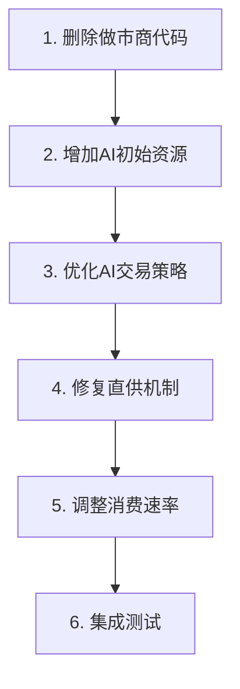

# 游戏问题修复方案

## 用户确认：删除做市商系统

---

## 修复目标

1. **完全删除做市商代码** - 市场流动性由40家AI公司提供
2. **修复直供机制** - 让零售商真正从市场采购
3. **优化AI交易策略** - 确保AI能提供足够的市场深度
4. **调整消费速率** - 使需求与实际消费匹配

---

## 修复任务清单

### 任务1：删除做市商系统 [低风险]

**需要修改的文件：**

1. **删除文件：** `src/core/market/MarketMaker.ts`

2. **修改 `src/core/loop/GameLoop.ts`：**
   - 移除做市商相关导入
   - 删除注释中关于做市商的说明

**验证点：**
- 游戏能正常启动
- 没有做市商相关的运行时错误

---

### 任务2：修复直供机制 [中风险]

**问题描述：**
零售店可以通过"直供"凭空创造商品，绕过市场交易

**当前代码 (`RetailSystem.ts:386-410`)：**
```typescript
// 直供机制：如果市场没买到货，直接"创造"商品
if (purchased < quantity) {
  const directPurchaseQty = quantity - purchased;
  const directPrice = basePrice * 0.9;
  c.cash[companyId] -= directPurchaseQty * directPrice;
  purchased += directPurchaseQty;
  // 钱流入"系统"，商品凭空产生
}
```

**修复方案：**

```typescript
// 方案：从AI生产商库存中采购（而非凭空创造）
if (purchased < quantity) {
  const directResult = purchaseFromProducers(world, goodsId, quantity - purchased, maxPrice);
  purchased += directResult.quantity;
  totalCost += directResult.cost;
}

// 新增函数：从生产商直接采购
function purchaseFromProducers(
  world: GameWorld,
  goodsId: number,
  quantity: number,
  maxPrice: number
): { quantity: number; cost: number } {
  // 寻找生产该商品的AI公司
  // 从其库存中购买（需要实际减少库存）
  // 如果所有生产商库存都不足，则无法购买
}
```

**验证点：**
- 零售店的进货来自真实的库存
- 生产商的产品能被零售商购买
- 市场交易量增加

---

### 任务3：优化AI交易策略 [中风险]

**问题描述：**
AI公司需要更积极地参与市场交易，以弥补做市商缺失的流动性

**需要调整的参数 (`AIDecisionEngine.ts`)：**

| 参数 | 当前值 | 建议值 | 原因 |
|------|--------|--------|------|
| 卖出库存比例 | 60% | 70% | 增加市场供给 |
| 卖出最低库存天数 | 1天 | 0天 | 只要有多余库存就卖 |
| 卖出价格折扣 | 2%-15% | 5%-20% | 更激进定价促成交 |
| 买入触发阈值 | 10个周期 | 8个周期 | 更频繁采购 |
| 每tick最大决策数 | 5 | 8 | 增加决策频率 |

**需要修改的函数：**

1. `generateTradingDecisions()` - 卖出决策
2. `calculateSmartSellPrice()` - 定价策略
3. `runAIDecisionCycle()` - 决策数量限制

---

### 任务4：调整零售消费速率 [低风险]

**问题描述：**
消费速率过低，导致需求积累但实际消费很少

**当前配置 (`constants.ts`)：**
```typescript
RETAIL_MAX_CUSTOMER_RATE = 0.02  // 每tick消费2%需求
```

**建议调整：**
```typescript
RETAIL_MAX_CUSTOMER_RATE = 0.05  // 每tick消费5%需求
```

**同时调整 (`RetailSystem.ts:543`)：**
```typescript
// 当前：每tick消费一小部分需求
const tickDemand = baseDemand * tierShare * RETAIL_MAX_CUSTOMER_RATE;

// 可考虑：根据库存情况动态调整消费率
const stockRatio = totalRetailStock / (tickDemand * 24);  // 库存天数
const adjustedRate = stockRatio > 3 ? RETAIL_MAX_CUSTOMER_RATE * 1.5 : RETAIL_MAX_CUSTOMER_RATE;
```

---

### 任务5：增加AI公司初始库存和资金 [低风险]

**问题描述：**
删除做市商后，需要确保AI公司有足够的资源提供流动性

**需要调整 (`WorldInitializer.ts`)：**

1. 增加AI初始成品库存
2. 增加AI初始现金
3. 确保每种消费品都有AI公司生产和销售

---

## 修复顺序



---

## 风险评估

| 任务 | 风险等级 | 回滚难度 | 测试方法 |
|------|----------|----------|----------|
| 删除做市商 | 低 | 易 | 游戏启动正常 |
| 增加AI资源 | 低 | 易 | 检查初始状态 |
| 优化AI策略 | 中 | 中 | 观察订单簿变化 |
| 修复直供 | 中 | 中 | 观察交易量变化 |
| 调整消费率 | 低 | 易 | 观察库存变化 |

---

## 预期效果

1. **市场活跃度提升**：AI公司频繁交易，订单簿深度增加
2. **产品流通顺畅**：生产商→市场→零售商→消费者的链路畅通
3. **价格发现有效**：供需变化能反映在价格上
4. **游戏平衡性改善**：玩家的交易策略能产生实际效果

---

## 是否确认此方案？

请确认后我将切换到Code模式开始实施修复。

如有其他问题或需要调整方案，请告知。