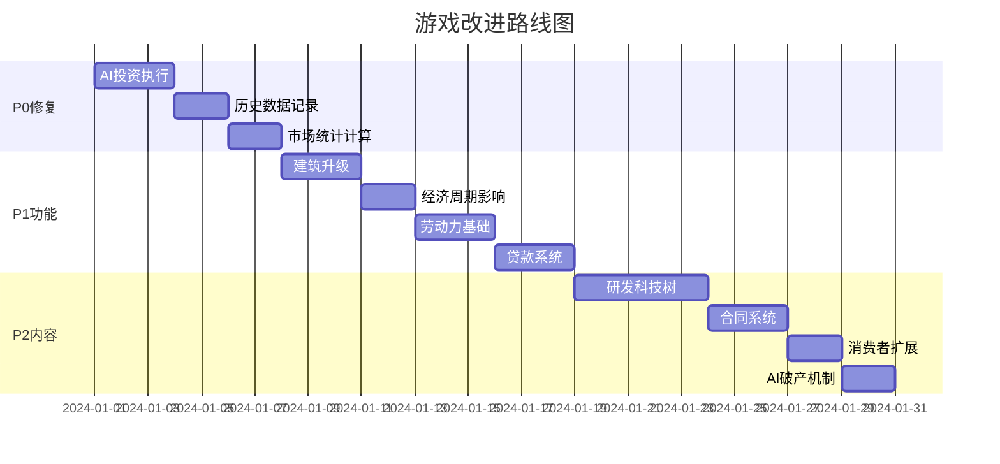

# 市场经济模拟游戏 - 不足分析与改进计划

## 当前状态评估

游戏已实现的核心功能：
- ✅ 104种商品的完整定义（包含5大产业链扩展）
- ✅ 62个生产配方
- ✅ 瓦尔拉斯均衡价格机制
- ✅ AI公司决策引擎
- ✅ 订单簿和撮合系统
- ✅ 基础UI（Dashboard、Market、Production、Finance、Competitors）
- ✅ 存档/加载系统
- ✅ 游戏速度控制

---

## 一、经济模型不足

### 1.1 价格机制问题

**问题描述**：
```typescript
// PriceEngine.ts - 每tick重置供需为0
g.supplies[i] = 0;
g.demands[i] = 0;
```

当前实现每tick重置供需数据，导致：
- 价格波动不连续
- 历史供需趋势丢失
- 无法形成有效的价格预期

**改进建议**：
- 实现滑动窗口的供需累计（保留最近24-168 tick的加权平均）
- 添加价格预期机制（基于历史趋势的预测）
- 实现更精细的价格粘性

### 1.2 消费者需求过于简化

**问题描述**：
```typescript
// PriceEngine.ts - 只有4个人口层级
const populationLayers = [
  { share: 0.10, avgIncome: 50000, priority: ['luxury', 'final'] },
  { share: 0.40, avgIncome: 15000, priority: ['final', 'basic'] },
  { share: 0.35, avgIncome: 6000, priority: ['basic', 'raw'] },
  { share: 0.15, avgIncome: 2500, priority: ['raw'] },
];
```

**改进建议**：
- 扩展到8-12个人口阶层
- 添加地区差异（不同地区的消费偏好）
- 实现动态人口增长和收入变化
- 添加消费者信心指数影响需求

### 1.3 生产系统约束缺失

**问题描述**：
```typescript
// recipes.ts 中定义了但未使用
laborRequired: 80,    // 人力需求 - 未实现
energyRequired: 500,  // 能源需求 - 未实现
```

**改进建议**：
- 实现劳动力市场（招聘、工资、失业率）
- 实现能源消耗和电力市场
- 添加维护成本和折旧

### 1.4 金融系统不完整

**问题描述**：
```typescript
// Finance.tsx - 贷款是硬编码的
{playerLiabilities > 0 ? (
  // 显示硬编码的贷款信息
  <td className="p-3 text-white">经营贷款</td>
  <td className="p-3 text-right text-slate-300">¥500,000</td>
```

**改进建议**：
- 实现真实的贷款系统（申请、审批、还款）
- 添加利率市场（央行基准利率 + 信用利差）
- 实现股票发行和融资
- 添加破产和债务重组机制

---

## 二、AI行为不足

### 2.1 投资决策未执行

**问题描述**：
```typescript
// AIDecisionEngine.ts
function executeInvestmentDecision(world: GameWorld, decision: AIDecision): boolean {
  // 投资决策需要更复杂的实现
  // 暂时只返回成功标志
  return true;  // 没有实际建造！
}
```

**改进建议**：
- 实现AI真正的建筑建造逻辑
- 添加AI扩张策略（垂直整合vs水平扩张）
- 实现AI的财务约束检查

### 2.2 AI策略缺乏差异化

**问题描述**：
当前所有AI公司使用相同的决策逻辑，只有personality定义但没有真正影响行为。

**改进建议**：
```typescript
// 根据personality调整决策参数
aggressive: { priceMultiplier: 0.9, investThreshold: 0.3 }
conservative: { priceMultiplier: 1.05, investThreshold: 0.5 }
```

### 2.3 无破产和新入场机制

**改进建议**：
- 当公司现金为负且无法偿债时触发破产
- 破产公司资产被拍卖
- 市场机会出现时有新AI公司入场

---

## 三、游戏玩法不足

### 3.1 研发系统缺失

**改进建议**：
- 实现科技树（解锁高级配方和建筑）
- 研发投资产生技术积累
- 技术授权交易

### 3.2 建筑升级UI入口缺失

**问题描述**：
```typescript
// Production.tsx 中没有升级按钮
// buildings.ts 中定义了 maxLevel 和 upgradeCosts
```

**改进建议**：
- 在建筑详情中添加"升级"按钮
- 显示升级成本和效果预览
- 升级动画和进度显示

### 3.3 合同/订单系统缺失

**改进建议**：
- 长期供货合同（固定价格、固定数量）
- 政府采购订单
- 出口订单

### 3.4 员工管理缺失

**改进建议**：
- 招聘和解雇员工
- 工资设定
- 员工技能和效率
- 工会谈判

---

## 四、UI/UX不足

### 4.1 图表数据不真实

**问题描述**：
```typescript
// Finance.tsx - 收入趋势是随机生成的
const incomeData = useMemo(() => {
  const data = [];
  for (let i = 0; i <= 30; i++) {
    data.push({
      price: Math.max(0, totalRevenue * (0.8 + Math.random() * 0.4)),
    });
  }
  return data;
}, [tick, totalRevenue]);
```

**改进建议**：
- 记录真实的历史数据
- 在GameWorld中添加历史记录存储
- 实现数据导出功能

### 4.2 市场统计硬编码

**问题描述**：
```typescript
// Competitors.tsx
<div className="text-2xl font-bold text-yellow-400">1,850</div>  // HHI硬编码
<div className="text-2xl font-bold text-green-400">#1</div>     // 排名硬编码
```

**改进建议**：
- 实现真实的HHI计算
- 基于销售额或资产计算真实排名
- 实现竞争强度动态评估

### 4.3 无新手引导

**改进建议**：
- 添加交互式教程
- 首次游戏的引导流程
- 帮助按钮和工具提示

### 4.4 无成就/目标系统

**改进建议**：
- 设定阶段性目标
- 成就徽章
- 排行榜

---

## 五、技术架构不足

### 5.1 Web Worker未真正使用

**问题描述**：
```typescript
// economyWorker.ts 和 WorkerManager.ts 已定义
// 但 GameLoop.ts 中直接在主线程计算
```

**改进建议**：
- 将生产计算移至Worker
- 将价格更新移至Worker
- 实现Worker和主线程的高效通信

### 5.2 TODO未完成

**问题描述**：
```typescript
// PriceEngine.ts
export function calculateCostBasedValue(
  world: GameWorld,
  goodsId: number
): number | null {
  // TODO: 实现基于生产链的成本计算
  return world.goods.baseValues[goodsId];
}

// AIDecisionEngine.ts
profitMargin: 0.1, // TODO: 精确计算
marketShare: 0.05, // TODO: 计算市场份额
```

### 5.3 错误处理不足

**改进建议**：
- 添加全局错误边界
- 网络请求错误处理
- 游戏状态恢复机制

---

## 六、符合模拟市场经济的关键缺失

### 6.1 宏观经济周期

**问题描述**：
```typescript
// GameLoop.ts - cyclePhase定义了但没有实际影响
stats.cyclePhase = 'peak' | 'expansion' | 'trough' | 'contraction';
```

**改进建议**：
- 周期影响消费者需求（繁荣时需求+20%，衰退时-20%）
- 周期影响利率（衰退时降息，繁荣时加息）
- 周期影响AI投资意愿

### 6.2 通货膨胀/紧缩

**改进建议**：
- 追踪CPI（消费者价格指数）
- 货币供应量影响价格水平
- 央行货币政策

### 6.3 国际贸易

**改进建议**：
- 进出口市场
- 汇率波动
- 关税和贸易壁垒

### 6.4 政策干预

**改进建议**：
- 政府税收（所得税、增值税）
- 补贴政策
- 环保法规
- 反垄断调查

---

## 七、优先级排序的改进计划

### P0 - 必须修复（影响核心玩法）

1. **AI投资决策执行** - 让AI公司真正建造建筑
2. **真实历史数据记录** - 替换随机生成的图表数据
3. **HHI和排名计算** - 替换硬编码的市场统计

### P1 - 高优先级（提升游戏深度）

4. **建筑升级功能** - 添加升级UI和逻辑
5. **经济周期影响** - 让cyclePhase真正影响游戏
6. **劳动力系统基础** - 使用laborRequired字段
7. **贷款系统** - 实现真实的借贷功能

### P2 - 中优先级（增加内容）

8. **研发/科技树** - 解锁高级内容
9. **合同系统** - 长期供货订单
10. **消费者阶层扩展** - 更细致的需求模拟
11. **AI破产机制** - 市场动态更真实

### P3 - 低优先级（锦上添花）

12. **新手引导**
13. **成就系统**
14. **国际贸易**
15. **政策干预系统**

---

## 八、建议的实现路线图



---

## 总结

当前游戏已经具备了市场经济模拟的基本框架，但在以下方面需要加强：

1. **经济真实性** - 许多定义好的参数（劳动力、能源、弹性）没有真正影响游戏
2. **AI智能度** - AI投资没有真正执行，策略差异化不足
3. **玩家深度** - 缺少研发、升级、合同等长期目标
4. **数据真实性** - 多处使用硬编码或随机数据
5. **宏观机制** - 经济周期、通胀等宏观机制没有实际影响

通过按优先级实施上述改进，可以将游戏从"能运行的原型"升级为"真正有深度的市场经济模拟游戏"。