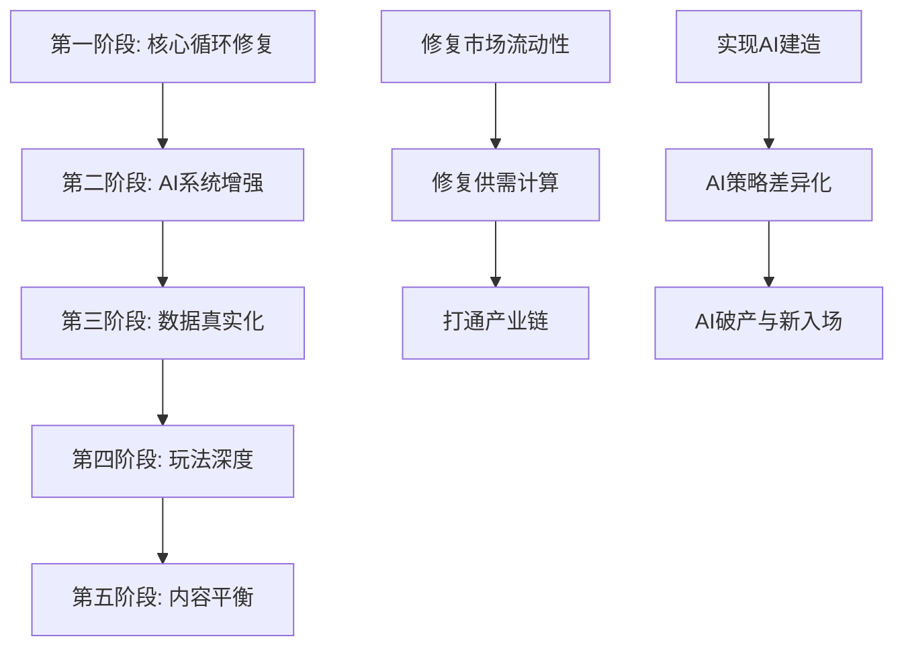

# 《供应链指挥官》游戏内容优化计划

> **版本**: 1.0  
> **日期**: 2026-01-26  
> **状态**: 规划中

---

## 📊 当前状态总览

### 已实现内容规模

| 类别 | 数量 | 说明 |
|------|------|------|
| 商品 | 104种 | 覆盖5大产业链（核心+农业+医药+军工+奢侈品+科技） |
| 建筑 | 59种 | 49种生产建筑 + 10种零售建筑 |
| 配方 | 106个 | 完整产业链配方 |
| AI公司 | 40家 | 8种人格类型 |
| 消费者层级 | 8层 | 从低收入到超高收入 |

### 已实现核心系统

- ✅ 瓦尔拉斯均衡价格机制
- ✅ 供需曲线与弹性计算
- ✅ 订单簿与撮合引擎
- ✅ AI决策引擎
- ✅ 经济周期模拟
- ✅ 零售系统
- ✅ 金融系统（股票、银行、收购）
- ✅ 存档系统

---

## 🔴 关键问题分析

### P0 - 核心经济循环问题

#### 问题1：市场流动性不足
**现象**: 部分商品市场缺乏交易活跃度
**原因**: 
- 做市商系统定义但未启用
- AI交易策略过于保守
- 零售"直供"机制绕过市场

**影响**: 价格发现机制失效，玩家交易体验差

#### 问题2：供需数据失真
**现象**: 理论需求与实际消费严重脱节
**原因**:
- DemandCurve计算的理论需求（百万级）
- RetailSystem每tick只消费2-5%
- 供需数据累积但不消耗

**影响**: 价格信号失真，经济模型不准确

#### 问题3：产业链断裂
**现象**: 生产商产品卖不出，零售商却从"直供"进货
**原因**: 直供机制凭空创造商品，不消耗生产库存

**影响**: 生产端无动力，产业链模拟失败

### P1 - 游戏体验问题

#### 问题4：AI建造未执行
**现象**: AI有投资决策但没有实际建造
**代码位置**: `AIDecisionEngine.ts` 的 `executeInvestmentDecision` 返回 true 但无实际操作

#### 问题5：数据可视化硬编码
**现象**: 图表使用随机数据而非真实历史
**位置**: Finance.tsx、Competitors.tsx 中的多处硬编码

#### 问题6：缺乏玩家引导
**现象**: 新玩家不知道如何开始
**缺失**: 教程系统、引导任务

---

## 📋 优化计划

### 第一阶段：核心循环修复

#### 1.1 修复市场流动性

```
目标: 确保每种商品都有活跃的买卖盘
```

**任务清单**:
- [ ] 重新启用做市商系统
  - 在 GameLoop.ts 中调用 updateMarketMaker
  - 做市商为每种商品提供双边报价
  - 报价围绕均衡价格浮动±5%

- [ ] 优化AI交易策略
  - 增加AI挂单频率（当前每24tick，改为每6tick）
  - 降低AI卖单价格门槛（更接近成本）
  - 增加AI单笔交易量

- [ ] 移除直供机制
  - 修改 RetailSystem.purchaseFromWholesale
  - 强制从市场订单簿采购
  - 或改为从AI生产商库存直接采购

#### 1.2 修复供需计算

```
目标: 理论需求与实际消费匹配
```

**任务清单**:
- [ ] 调整需求计算比例
  - 将 RETAIL_MAX_CUSTOMER_RATE 从 0.05 提升到 0.15
  - 或降低 DemandCurve 的基础需求量

- [ ] 实现需求缓冲机制
  - 需求不立即消耗，而是形成"待满足需求"
  - 待满足需求驱动零售店进货
  - 满足需求后从池中移除

- [ ] 添加需求重置逻辑
  - 每天（24 tick）重置未满足需求
  - 避免需求无限累积

#### 1.3 打通产业链

```
目标: 生产→批发→零售→消费的完整链路
```

**任务清单**:
- [ ] 生产商库存挂单
  - AI生产商库存超过阈值时自动挂卖单
  - 挂单价格 = 成本 × (1 + 目标利润率)

- [ ] 批发商采购
  - 零售店定期从订单簿采购
  - 采购价格基于市场最优卖价
  - 无卖单时等待，而非直供

- [ ] 消费者购买
  - 消费者从零售店购买
  - 支付零售价（批发价 + 加价）
  - 消耗零售库存

### 第二阶段：AI系统增强

#### 2.1 实现AI建造

```
目标: AI能实际扩建和投资
```

**任务清单**:
- [ ] 实现 executeInvestmentDecision 逻辑
  - 检查AI资金是否充足
  - 分配建筑ID
  - 设置建造状态和进度
  - 扣除建造成本

- [ ] 添加AI建筑管理
  - AI选择建造类型（基于产业偏好）
  - AI决定建造数量（基于市场需求）
  - AI管理建造队列

#### 2.2 AI策略差异化

```
目标: 不同人格的AI有明显不同的行为
```

**任务清单**:
- [ ] 定价策略差异
  - 激进型: 低于市场价10-20%
  - 保守型: 高于市场价5-10%
  - 机会型: 根据供需动态调整

- [ ] 扩张策略差异
  - 激进型: 高负债快速扩张
  - 保守型: 低负债稳健经营
  - 专精型: 深耕单一产业

- [ ] 竞争响应差异
  - 垄断者: 价格战+原材料囤积
  - 创新者: 升级设备提效
  - 追潮者: 退出转型

#### 2.3 AI破产与新入场

```
目标: 市场动态更真实
```

**任务清单**:
- [ ] 破产判定
  - 现金为负且无法借款
  - 连续亏损超过12个月
  - 负债率超过200%

- [ ] 破产处理
  - 拍卖资产（建筑、库存）
  - 清算债务
  - 从活跃公司列表移除

- [ ] 新公司入场
  - 检测市场机会（高利润行业）
  - 随机生成新AI公司
  - 分配初始资金和人格

### 第三阶段：数据真实化

#### 3.1 历史数据记录

```
目标: 所有图表展示真实数据
```

**任务清单**:
- [ ] GameWorld 添加历史存储
  ```typescript
  history: {
    prices: Float32Array[];      // 每种商品的价格历史
    volumes: Float32Array[];     // 每种商品的成交量历史
    revenues: Float32Array;      // 玩家收入历史
    profits: Float32Array;       // 玩家利润历史
  }
  ```

- [ ] 每日记录关键指标
  - 商品价格
  - 成交量
  - 公司财务数据
  - 市场份额

- [ ] 替换硬编码数据
  - Finance.tsx 中的收入趋势
  - Competitors.tsx 中的市场统计
  - Dashboard 中的资产走势

#### 3.2 市场统计计算

```
目标: 实时准确的市场分析
```

**任务清单**:
- [ ] HHI 指数计算
  - 按商品类别计算市场集中度
  - 存储并展示给玩家

- [ ] 市场份额计算
  - 基于销售额或产量
  - 按公司统计排名

- [ ] 竞争强度评估
  - 基于价格波动
  - 基于新入场者数量

### 第四阶段：玩法深度

#### 4.1 建筑升级系统

```
目标: 玩家可升级建筑
```

**任务清单**:
- [ ] 添加升级UI
  - Production.tsx 中每个建筑显示升级按钮
  - 显示升级成本和效果预览

- [ ] 实现升级逻辑
  - 检查资金和前置条件
  - 扣除费用并开始升级
  - 升级期间产能降低50%
  - 完成后应用新倍率

#### 4.2 研发与科技系统

```
目标: 解锁高级内容
```

**任务清单**:
- [ ] 定义科技树
  ```
  基础冶金 → 特种钢材 → 军工材料
  基础电子 → 芯片制造 → AI芯片
  基础化工 → 医药化工 → 生物科技
  ```

- [ ] 研发投资机制
  - 建造研发中心
  - 每tick消耗资金进行研发
  - 累积研究点数

- [ ] 科技解锁
  - 达到点数阈值解锁科技
  - 科技解锁新配方或提升效率

#### 4.3 合同订单系统

```
目标: 长期稳定的收入来源
```

**任务清单**:
- [ ] 政府采购订单
  - 定期发布大宗采购需求
  - 固定价格、固定数量
  - 需要按时交付

- [ ] 供货合同
  - 与AI公司签订长期合同
  - 约定价格和供货周期
  - 违约有惩罚

- [ ] 出口订单
  - 国际市场需求
  - 汇率影响收益

### 第五阶段：内容平衡

#### 5.1 价格弹性调整

```
目标: 价格变化符合经济学原理
```

**任务清单**:
- [ ] 审查并调整商品弹性
  - 必需品弹性应更低 (-0.2 ~ -0.5)
  - 奢侈品弹性应更高 (-2.0 ~ -4.0)
  - 中间品弹性适中 (-0.5 ~ -1.0)

- [ ] 添加交叉弹性
  - 替代品价格上涨增加本品需求
  - 互补品价格上涨降低本品需求

#### 5.2 成本利润平衡

```
目标: 各产业有合理的利润空间
```

**任务清单**:
- [ ] 计算各配方成本
  - 原材料成本
  - 人力成本
  - 能源成本

- [ ] 调整基准价格
  - 确保默认利润率在 10-30% 范围
  - 上游产业利润率略低
  - 下游产业利润率略高

#### 5.3 产能供需平衡

```
目标: 市场不会长期过剩或短缺
```

**任务清单**:
- [ ] 计算各商品需求总量
  - 消费品: 人口消费需求
  - 中间品: 下游生产需求
  - 原材料: 加工需求

- [ ] 调整AI初始建筑
  - 确保总产能略高于需求
  - 留有扩张空间

---

## 🔄 实施顺序



---

## 📈 优先级矩阵

| 优化项 | 影响度 | 复杂度 | 优先级 |
|--------|--------|--------|--------|
| 修复市场流动性 | 高 | 中 | **P0** |
| 移除直供机制 | 高 | 低 | **P0** |
| 实现AI建造 | 高 | 中 | **P0** |
| 历史数据记录 | 中 | 中 | **P1** |
| AI策略差异化 | 中 | 中 | **P1** |
| 建筑升级UI | 中 | 低 | **P1** |
| 市场统计计算 | 中 | 低 | **P1** |
| 研发科技系统 | 中 | 高 | **P2** |
| 合同订单系统 | 中 | 高 | **P2** |
| AI破产机制 | 低 | 中 | **P2** |
| 价格弹性调整 | 低 | 低 | **P3** |
| 成本利润平衡 | 低 | 中 | **P3** |

---

## 🎯 成功指标

### 核心循环健康度
- [ ] 每种商品每天至少有5笔成交
- [ ] 价格波动在基准价±50%范围内
- [ ] 零售库存周转率 3-7 天

### AI行为合理性
- [ ] AI公司每月至少有1次建造/升级行为
- [ ] 不同人格AI的定价差异 > 10%
- [ ] 每年有1-3家公司破产或新入场

### 玩家体验
- [ ] 新玩家5分钟内能完成首笔交易
- [ ] 玩家能在图表中看到真实趋势
- [ ] 存在明确的阶段性目标

---

## 📝 备注

1. **优先修复核心循环** - 没有健康的经济循环，其他内容都是空中楼阁
2. **渐进式实施** - 每个阶段完成后测试验证再进入下一阶段
3. **数据驱动** - 添加监控指标，用数据判断优化效果
4. **玩家反馈** - 关键节点收集玩家测试反馈

---

*计划完成时间: 2026-01-26*