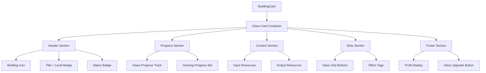

# 🪟 现代毛玻璃风格UI设计方案

## 设计理念

采用Apple Fluent Design / Windows 11 Mica风格，核心特点：
- **半透明**：背景具有磨砂玻璃效果
- **层次感**：通过模糊度和透明度区分层级
- **光影**：微妙的光泽和阴影增强立体感
- **彩色强调**：使用鲜艳的强调色点缀

---

## 当前问题分析

### 1. 色调问题
- 当前背景色过于暗沉（#050505, #0A0A0B）
- 缺少层次变化，所有元素融为一体
- 边框几乎不可见

### 2. 效果缺失
- 没有使用毛玻璃效果（backdrop-blur）
- 缺少微妙的渐变和光泽
- 阴影过于生硬

### 3. 交互反馈弱
- 悬停/选中状态变化不明显
- 状态指示条过于突兀

---

## 新设计规范

### 背景色系（调亮基础色）

```css
/* 新的深色主题背景 - 稍微提亮，为毛玻璃留出层次空间 */
--bg-base: #0c0c0e;           /* 从#050505提亮 */
--bg-surface: rgba(18, 18, 22, 0.8);   /* 半透明 */
--bg-elevated: rgba(28, 28, 35, 0.75); /* 更亮的半透明 */
--bg-overlay: rgba(38, 38, 48, 0.9);   /* 覆盖层 */
--bg-muted: rgba(55, 55, 68, 0.6);     /* 静音层 */

/* 毛玻璃专用 */
--glass-bg: rgba(255, 255, 255, 0.05);
--glass-border: rgba(255, 255, 255, 0.1);
--glass-highlight: rgba(255, 255, 255, 0.15);
--glass-blur: 16px;
```

### 毛玻璃卡片样式

```css
.glass-card {
  background: linear-gradient(
    135deg,
    rgba(255, 255, 255, 0.08) 0%,
    rgba(255, 255, 255, 0.03) 100%
  );
  backdrop-filter: blur(16px) saturate(180%);
  -webkit-backdrop-filter: blur(16px) saturate(180%);
  border: 1px solid rgba(255, 255, 255, 0.1);
  border-radius: 16px;
  box-shadow: 
    0 8px 32px rgba(0, 0, 0, 0.3),
    inset 0 1px 0 rgba(255, 255, 255, 0.1);
}

/* 悬停效果 */
.glass-card:hover {
  background: linear-gradient(
    135deg,
    rgba(255, 255, 255, 0.12) 0%,
    rgba(255, 255, 255, 0.05) 100%
  );
  border-color: rgba(255, 255, 255, 0.18);
  transform: translateY(-2px);
  box-shadow: 
    0 12px 40px rgba(0, 0, 0, 0.4),
    inset 0 1px 0 rgba(255, 255, 255, 0.15);
}
```

### 状态边框（彩色发光替代粗边框）

```css
/* 替代原来的border-l-4，使用整体发光边框 */
.glass-card.status-success {
  border-color: rgba(34, 197, 94, 0.3);
  box-shadow: 
    0 0 20px rgba(34, 197, 94, 0.15),
    0 8px 32px rgba(0, 0, 0, 0.3),
    inset 0 1px 0 rgba(34, 197, 94, 0.1);
}

.glass-card.status-warning {
  border-color: rgba(245, 158, 11, 0.3);
  box-shadow: 
    0 0 20px rgba(245, 158, 11, 0.15),
    0 8px 32px rgba(0, 0, 0, 0.3);
}

.glass-card.status-error {
  border-color: rgba(239, 68, 68, 0.3);
  box-shadow: 
    0 0 20px rgba(239, 68, 68, 0.15),
    0 8px 32px rgba(0, 0, 0, 0.3);
}
```

---

## 建筑卡片新设计

### 视觉层级

```
┌─────────────────────────────────────────────────┐
│ 🔶 铁矿场  Lv.1              ┌──────────────┐ │  ← 头部区域：半透明深色
│     ● 生产中    铁矿开采     │   效率 100%  │ │
│                              └──────────────┘ │
├─────────────────────────────────────────────────┤  ← 绿色发光进度条
│ ████████████████████████████████████████ 100%  │
├─────────────────────────────────────────────────┤
│                                                 │
│   📥 输入              📤 输出                  │  ← 内容区域：更透明
│   ─────────           ─────────                │
│   无需原料            ⛏ +2400/日               │
│                                                 │
├─────────────────────────────────────────────────┤
│   专属方式   [⛏] [⛏] [📊]    能耗-20% 人力-10%│  ← 槽位区域：毛玻璃按钮
├─────────────────────────────────────────────────┤
│ 💰 ¥62K/日                    [ 升级 ¥200K ]   │  ← 底部：柔和渐变
└─────────────────────────────────────────────────┘
```

### 配色方案

| 元素 | 颜色 | 透明度 |
|------|------|--------|
| 卡片背景 | 白色渐变 | 5% → 3% |
| 卡片边框 | 白色 | 10% |
| 头部区域 | 深色叠加 | 50% |
| 内容区域 | 透明 | 0% |
| 底部区域 | 深色叠加 | 30% |
| 状态发光（成功） | #22C55E | 15% |
| 状态发光（警告） | #F59E0B | 15% |
| 状态发光（错误） | #EF4444 | 15% |

### 进度条重设计

```css
/* 玻璃效果进度条 */
.glass-progress-track {
  background: rgba(255, 255, 255, 0.05);
  border-radius: 4px;
  overflow: hidden;
  height: 6px;
}

.glass-progress-bar {
  background: linear-gradient(90deg, #22C55E 0%, #4ADE80 100%);
  box-shadow: 0 0 12px rgba(34, 197, 94, 0.5);
  transition: width 0.3s ease;
}
```

### 槽位按钮重设计

```css
/* 毛玻璃槽位按钮 */
.glass-slot-button {
  width: 40px;
  height: 40px;
  background: rgba(255, 255, 255, 0.08);
  backdrop-filter: blur(8px);
  border: 1px solid rgba(255, 255, 255, 0.12);
  border-radius: 10px;
  transition: all 0.2s ease;
}

.glass-slot-button:hover {
  background: rgba(255, 255, 255, 0.15);
  border-color: rgba(255, 255, 255, 0.25);
  transform: scale(1.05);
}

.glass-slot-button.active {
  background: linear-gradient(135deg, rgba(59, 130, 246, 0.3), rgba(139, 92, 246, 0.3));
  border-color: rgba(59, 130, 246, 0.5);
  box-shadow: 0 0 15px rgba(59, 130, 246, 0.3);
}
```

---

## 按钮样式更新

### 主要按钮（升级按钮）

```css
.glass-button-primary {
  background: linear-gradient(135deg, #3B82F6 0%, #8B5CF6 100%);
  border: 1px solid rgba(255, 255, 255, 0.2);
  border-radius: 10px;
  padding: 10px 20px;
  color: white;
  font-weight: 500;
  box-shadow: 
    0 4px 15px rgba(59, 130, 246, 0.3),
    inset 0 1px 0 rgba(255, 255, 255, 0.2);
  transition: all 0.2s ease;
}

.glass-button-primary:hover {
  transform: translateY(-1px);
  box-shadow: 
    0 6px 20px rgba(59, 130, 246, 0.4),
    inset 0 1px 0 rgba(255, 255, 255, 0.3);
}

.glass-button-primary:disabled {
  background: rgba(255, 255, 255, 0.1);
  border-color: rgba(255, 255, 255, 0.1);
  color: rgba(255, 255, 255, 0.4);
  box-shadow: none;
}
```

### 次要按钮

```css
.glass-button-secondary {
  background: rgba(255, 255, 255, 0.08);
  backdrop-filter: blur(8px);
  border: 1px solid rgba(255, 255, 255, 0.12);
  border-radius: 10px;
  padding: 10px 20px;
  color: rgba(255, 255, 255, 0.9);
  transition: all 0.2s ease;
}

.glass-button-secondary:hover {
  background: rgba(255, 255, 255, 0.12);
  border-color: rgba(255, 255, 255, 0.2);
}
```

---

## 实施步骤

### Phase 1: 基础设施（颜色和样式）
1. 更新 `colors.ts` - 添加毛玻璃色彩变量
2. 更新 `globals.css` - 添加毛玻璃工具类
3. 更新 `tailwind.config.js` - 扩展backdrop-blur

### Phase 2: 组件更新
4. 更新 `Card.tsx` - 添加glass变体
5. 更新 `Button.tsx` - 添加glass变体
6. 更新 `ProgressBar.tsx` - 重新设计为发光效果

### Phase 3: 页面组件
7. 重构 `BuildingCard.tsx` - 应用新设计
8. 更新 `ProductionMethodsPanel.tsx` - 槽位按钮毛玻璃化
9. 更新 `BuildingDetailPanel.tsx` - 整体风格统一

### Phase 4: 验证和调整
10. 在Storybook中预览效果
11. 运行时测试
12. 微调参数

---

## 关键CSS变量新增

```css
:root {
  /* 毛玻璃效果 */
  --glass-blur-sm: 8px;
  --glass-blur-md: 16px;
  --glass-blur-lg: 24px;
  
  --glass-bg-light: rgba(255, 255, 255, 0.05);
  --glass-bg-medium: rgba(255, 255, 255, 0.08);
  --glass-bg-strong: rgba(255, 255, 255, 0.12);
  
  --glass-border-subtle: rgba(255, 255, 255, 0.08);
  --glass-border-default: rgba(255, 255, 255, 0.12);
  --glass-border-strong: rgba(255, 255, 255, 0.2);
  
  --glass-highlight: rgba(255, 255, 255, 0.15);
  --glass-shadow: 0 8px 32px rgba(0, 0, 0, 0.3);
}
```

---

## Mermaid 组件层级图



---

## 预期效果对比

### 改进前
- 暗灰色卡片，边界模糊
- 硬质边框，无层次感
- 静态状态指示

### 改进后
- 半透明毛玻璃卡片，清晰的层级
- 微妙的白色边框高光
- 彩色发光状态指示
- 悬停时有浮动效果
- 按钮有渐变和阴影
- 进度条有柔和发光

---

## 下一步

确认此设计方案后，我将按照实施步骤逐步更新代码。是否有需要调整的地方？