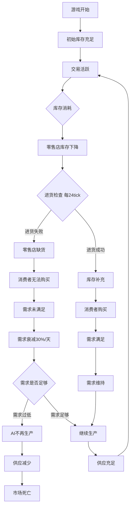

# 市场"死亡"问题分析与修复计划

## 问题描述
用户反馈：市场一开始有成交记录，但运行一段时间后就"死了"，没有交易发生。

## 根本原因分析

通过深入分析代码，我发现了以下几个导致市场逐渐"死亡"的关键问题：

### 1. 需求衰减过快 (DemandCurve.ts)
```typescript
// 当前配置：未满足的需求每天衰减30%
const DEMAND_DECAY_RATE = 0.7; // 保留70%
```
**问题**：如果市场上没有足够的供应，需求会快速衰减到接近0，导致后续即使有供应也没有需求。

### 2. 零售系统进货间隔过长 (RetailSystem.ts)
```typescript
const RESTOCK_INTERVAL = 24;  // 每24 tick检查一次进货（一天一次）
```
**问题**：零售店每天才检查一次进货，如果库存耗尽，消费者无法购买，需求无法转化为交易。

### 3. AI自动挂单频率过低 (GameLoop.ts)
```typescript
// 每6tick执行一次卖单
if (currentTick % 6 === 0) {
  aiSellOrders = autoPostSellOrders(this.world);
}
// 每6tick执行一次买单（错峰）
if (currentTick % 6 === 3) {
  aiBuyOrders = autoPostBuyOrders(this.world);
}
```
**问题**：虽然频率看起来合理，但结合其他问题，可能导致市场流动性不足。

### 4. 消费者购买执行间隔过长 (ConsumerMarket.ts)
```typescript
const DEFAULT_CONFIG: ConsumerBuyConfig = {
  executionInterval: 4,          // 每4tick执行一次消费者购买
  b2bExecutionInterval: 4,       // 每4tick执行一次B2B采购
  goodsBatchGroups: 4,           // 商品分4组轮询处理
};
```
**问题**：商品分4组处理，意味着每种商品每16tick才被处理一次，可能错过交易机会。

### 5. 订单过期时间过短 (OrderBook.ts)
```typescript
// 买单默认24tick过期，卖单48tick过期
const DEFAULT_BUY_EXPIRY = 24;
const DEFAULT_SELL_EXPIRY = 48;
```
**问题**：如果买卖双方的订单在匹配前就过期了，交易无法完成。

### 6. 价格分歧导致无法撮合
**问题**：随着时间推移，买方和卖方的价格预期可能逐渐分离：
- 卖方因为库存积压不断降价
- 买方因为需求衰减不愿出高价
- 最终双方价格无法匹配

### 7. 零售系统与批发市场的断层
```typescript
// 零售系统启用时，Pop消费通过零售店进行
if (world.retail && world.retail.count > 0) {
  const retailResult = updateRetailSystem(world);
  // ...
} else {
  // 降级：没有零售店时，使用传统的直接市场购买
}
```
**问题**：如果零售店库存耗尽且进货失败，消费者无法购买，整个消费链断裂。

## 问题链条图



## 修复方案

### 方案1: 降低需求衰减速度（高优先级）
**文件**: `src/core/economy/DemandCurve.ts`
```typescript
// 修改前
const DEMAND_DECAY_RATE = 0.7; // 保留70%

// 修改后
const DEMAND_DECAY_RATE = 0.9; // 保留90%，衰减更慢
```

### 方案2: 提高零售进货频率（高优先级）
**文件**: `src/core/economy/RetailSystem.ts`
```typescript
// 修改前
const RESTOCK_INTERVAL = 24;  // 每24 tick检查一次

// 修改后
const RESTOCK_INTERVAL = 6;   // 每6 tick检查一次（4小时一次）
```

### 方案3: 增加订单过期时间（中优先级）
**文件**: `src/core/market/OrderBook.ts`
```typescript
// 修改前
const DEFAULT_BUY_EXPIRY = 24;
const DEFAULT_SELL_EXPIRY = 48;

// 修改后
const DEFAULT_BUY_EXPIRY = 72;   // 3天
const DEFAULT_SELL_EXPIRY = 120; // 5天
```

### 方案4: 增加基础需求保底（高优先级）
**文件**: `src/core/economy/DemandCurve.ts`
在需求计算中添加最低需求保底：
```typescript
// 确保每种消费品都有最低需求
const MIN_DEMAND_PER_GOOD = 10; // 每种商品最低需求10单位/tick
```

### 方案5: 优化消费者购买频率（中优先级）
**文件**: `src/core/economy/ConsumerMarket.ts`
```typescript
// 修改前
goodsBatchGroups: 4,           // 商品分4组轮询处理

// 修改后
goodsBatchGroups: 2,           // 商品分2组轮询处理，每种商品每8tick处理一次
```

### 方案6: 添加市场活跃度监控和自动干预（新功能）
创建一个市场健康监控系统，当检测到市场活跃度下降时自动干预：
- 监控每100tick的成交量
- 如果成交量低于阈值，自动注入需求
- 调整AI的交易积极性

### 方案7: 零售店紧急进货机制（中优先级）
**文件**: `src/core/economy/RetailSystem.ts`
当库存低于10%时，立即触发紧急进货，不受间隔限制：
```typescript
// 紧急进货：库存低于10%时立即进货
if (stockRatio < 0.1) {
  // 跳过间隔检查，立即进货
  // ...
}
```

## 实施优先级

| 优先级 | 修复项 | 预期效果 | 风险 |
|--------|--------|----------|------|
| P0 | 降低需求衰减速度 | 需求不会快速消失 | 低 |
| P0 | 增加基础需求保底 | 确保始终有需求 | 低 |
| P1 | 提高零售进货频率 | 零售店不会长期缺货 | 可能增加CPU负载 |
| P1 | 零售店紧急进货机制 | 防止库存完全耗尽 | 低 |
| P2 | 增加订单过期时间 | 给订单更多匹配机会 | 可能增加内存使用 |
| P2 | 优化消费者购买频率 | 更快响应需求 | 可能增加CPU负载 |
| P3 | 市场活跃度监控 | 自动检测和修复问题 | 需要新增代码 |

## 快速验证方案

在实施完整修复前，可以先进行以下快速验证：

1. **临时增加需求**：在控制台手动设置 `world.goods.demands[goodsId] = 1000`
2. **检查订单簿**：查看是否有买单和卖单，价格是否合理
3. **检查零售库存**：查看零售店是否有库存
4. **检查AI现金**：确认AI公司是否有足够现金进行交易

## 预期结果

实施以上修复后：
1. 需求不会快速衰减到0
2. 零售店能够及时补货
3. 订单有足够时间完成匹配
4. 市场始终保持一定的活跃度
5. 即使短期供需失衡，市场也能自我恢复

## 下一步行动

1. 确认用户同意修复方案
2. 按优先级顺序实施修复
3. 在测试环境验证效果
4. 监控修复后的市场表现