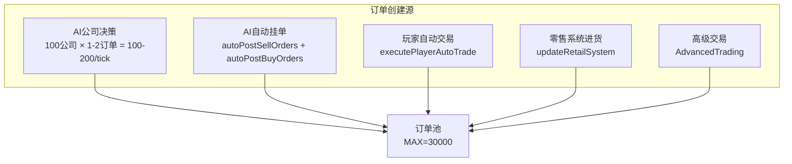

# 订单池已满问题修复方案

## 问题日期：2026-01-26

---

## 一、问题现象

运行游戏时，控制台出现警告：`订单池已满`

**位置：** `OrderBook.ts:183` 和 `OrderBook.ts:260`

```typescript
const orderIdx = orderPool!.acquire();
if (orderIdx === null) {
  console.warn('订单池已满');
  return null;
}
```

---

## 二、根本原因分析

### 2.1 订单池配置

| 参数 | 值 | 来源 |
|------|-----|------|
| MAX_ORDERS | 30,000 | constants.ts:22 |
| 默认过期时间 | 168 ticks (7天) | OrderBook.ts:144 |
| FastDecision过期 | 24 ticks | FastDecision.ts:35 |

### 2.2 订单创建源（每tick）



### 2.3 订单消除机制

1. **订单撮合** - 成功匹配后删除（效率依赖买卖价格匹配度）
2. **过期清理** - 每tick检查 (GameLoop:379)
3. **主动取消** - AI取消过时订单 (FastDecision:369-394)

### 2.4 关键问题：创建速度 > 消除速度

**估算：**
- 每tick创建订单：~150-300个
- 每tick撮合成功：~50-100个（取决于价格匹配度）
- 每tick过期：~10-50个
- **净增加：~50-150个/tick**

**预计填满时间：**
- 30,000 / 100 = **300 ticks**（约12.5天游戏时间）

### 2.5 订单合并机制失效

`OrderBook.ts:106-132` 有合并逻辑，但条件过于严格：

```typescript
function findMatchingOrder(...): number {
  // 价格精确到小数点后2位进行比较
  const roundedPrice = Math.round(price * 100) / 100;
  // ... 必须完全匹配才合并
}
```

**问题：**
- AI每次决策可能生成略有不同的价格
- 例如：100.01, 100.02, 100.03 无法合并
- 导致同一公司同一商品有大量类似订单

---

## 三、解决方案

### 方案概览

| 方案 | 效果 | 复杂度 | 推荐度 |
|------|------|--------|--------|
| A. 增加池容量 | 延缓问题 | 低 | ★★☆☆☆ |
| B. 减少订单创建 | 根本解决 | 中 | ★★★★☆ |
| C. 加速订单清理 | 中等效果 | 低 | ★★★☆☆ |
| D. 优化订单合并 | 根本解决 | 中 | ★★★★★ |
| E. 组合方案 | 最佳效果 | 中 | ★★★★★ |

---

### 方案A：增加订单池容量

**修改：** `constants.ts`

```typescript
// 修改前
export const MAX_ORDERS = 30000;

// 修改后
export const MAX_ORDERS = 100000;
```

**优点：**
- 简单直接
- 无需改动逻辑

**缺点：**
- 增加内存占用
- 治标不治本

---

### 方案B：减少订单创建

#### B1. 限制每公司活跃订单数

**新增函数：** `OrderBook.ts`

```typescript
const MAX_ORDERS_PER_COMPANY = 100;  // 每公司最多100个活跃订单

function countCompanyOrders(world: GameWorld, companyId: number): number {
  let count = 0;
  const o = world.orders;
  for (let i = 0; i < MAX_ORDERS; i++) {
    if (o.isActive[i] && o.companyIds[i] === companyId) {
      count++;
    }
  }
  return count;
}

// 在 createBuyOrder / createSellOrder 开头添加检查
if (countCompanyOrders(world, companyId) >= MAX_ORDERS_PER_COMPANY) {
  return null;  // 拒绝创建更多订单
}
```

#### B2. 限制每公司每商品订单数

```typescript
const MAX_ORDERS_PER_COMPANY_GOODS = 3;  // 每公司每商品最多3个订单

function countCompanyGoodsOrders(world: GameWorld, companyId: number, goodsId: number): number {
  let count = 0;
  const o = world.orders;
  for (let i = 0; i < MAX_ORDERS; i++) {
    if (o.isActive[i] && o.companyIds[i] === companyId && o.goodsIds[i] === goodsId) {
      count++;
    }
  }
  return count;
}
```

#### B3. 增加AI决策间隔

**修改：** `constants.ts`

```typescript
// 修改前
export const AI_DECISION_INTERVAL = 6;

// 修改后
export const AI_DECISION_INTERVAL = 12;  // 每12tick决策一次
```

---

### 方案C：加速订单清理

#### C1. 缩短默认过期时间

**修改：** `OrderBook.ts`

```typescript
// 修改前
export function createBuyOrder(..., expiryTicks: number = 24 * 7): number | null {

// 修改后：默认24tick过期（1天）
export function createBuyOrder(..., expiryTicks: number = 24): number | null {
```

#### C2. 更激进的价格偏离取消

**修改：** `FastDecision.ts`

```typescript
// 修改前：价格偏离20%才取消
if (orderPrice > currentPrice * 1.2) {
  cancelOrder(world, orderIdx);
}

// 修改后：价格偏离10%就取消
if (orderPrice > currentPrice * 1.1) {
  cancelOrder(world, orderIdx);
}
```

#### C3. 增加过期检查频率

**修改：** `GameLoop.ts` - 每tick都清理，而不是只清理本tick过期的

```typescript
// 增强清理：不仅清理过期订单，还清理长期未成交的订单
function aggressiveOrderCleanup(world: GameWorld): number {
  let cleanedCount = cleanupExpiredOrders(world);
  
  // 额外清理：超过50tick未成交的订单
  const o = world.orders;
  for (let i = 0; i < MAX_ORDERS; i++) {
    if (!o.isActive[i]) continue;
    if (world.tick - o.createdTicks[i] > 50 && o.remainings[i] === o.quantities[i]) {
      // 完全未成交超过50tick，取消
      cancelOrder(world, i);
      cleanedCount++;
    }
  }
  
  return cleanedCount;
}
```

---

### 方案D：优化订单合并（推荐）

#### D1. 放宽价格匹配精度

**修改：** `OrderBook.ts` 的 `findMatchingOrder`

```typescript
function findMatchingOrder(
  world: GameWorld,
  companyId: number,
  goodsId: number,
  orderType: number,
  price: number
): number {
  const o = world.orders;
  
  // 价格容差：1%以内视为相同价格
  const priceTolerance = price * 0.01;
  
  for (let i = 0; i < MAX_ORDERS; i++) {
    if (!o.isActive[i]) continue;
    if (o.companyIds[i] !== companyId) continue;
    if (o.goodsIds[i] !== goodsId) continue;
    if (o.types[i] !== orderType) continue;
    
    // 使用容差比较价格
    if (Math.abs(o.prices[i] - price) <= priceTolerance) {
      return i;  // 找到可合并的订单
    }
  }
  
  return -1;
}
```

#### D2. 强制合并到价格最优订单

**逻辑：** 同一公司同一商品，买单合并到最高价，卖单合并到最低价

```typescript
function findBestOrderToMerge(
  world: GameWorld,
  companyId: number,
  goodsId: number,
  orderType: number,
  newPrice: number
): number {
  const o = world.orders;
  let bestIdx = -1;
  let bestPrice = orderType === 0 ? 0 : Infinity;  // 买单找最高，卖单找最低
  
  for (let i = 0; i < MAX_ORDERS; i++) {
    if (!o.isActive[i]) continue;
    if (o.companyIds[i] !== companyId) continue;
    if (o.goodsIds[i] !== goodsId) continue;
    if (o.types[i] !== orderType) continue;
    
    if (orderType === 0) {  // 买单
      if (o.prices[i] > bestPrice) {
        bestPrice = o.prices[i];
        bestIdx = i;
      }
    } else {  // 卖单
      if (o.prices[i] < bestPrice) {
        bestPrice = o.prices[i];
        bestIdx = i;
      }
    }
  }
  
  return bestIdx;
}
```

---

### 方案E：组合方案（最终推荐）

**第一阶段：紧急修复**
1. 增加 `MAX_ORDERS` 到 50000
2. 缩短默认过期时间到 24 ticks
3. 激进取消价格偏离订单（10%阈值）

**第二阶段：核心优化**
1. 放宽订单合并的价格容差（1%）
2. 限制每公司每商品最多3个订单
3. 清理长期未成交订单（>50tick）

**第三阶段：系统改进**
1. 优化AI决策，减少无效订单
2. 改进价格计算，使订单更容易匹配
3. 添加订单池使用率监控

---

## 四、实施计划

### 第一阶段修改（5处）

| 文件 | 修改点 | 改动 |
|------|--------|------|
| `constants.ts:22` | MAX_ORDERS | 30000 → 50000 |
| `OrderBook.ts:144` | 默认过期时间 | 24*7 → 24 |
| `OrderBook.ts:219` | 默认过期时间 | 24*7 → 24 |
| `FastDecision.ts:377` | 取消阈值 | 1.2 → 1.1 |
| `FastDecision.ts:383` | 取消阈值 | 0.8 → 0.9 |

### 第二阶段修改（3处）

| 文件 | 修改点 | 改动 |
|------|--------|------|
| `OrderBook.ts:115-127` | findMatchingOrder | 添加价格容差 |
| `OrderBook.ts` | 新增函数 | countCompanyGoodsOrders |
| `OrderBook.ts:137/213` | 创建前检查 | 添加订单数量限制 |

### 第三阶段修改（监控）

| 文件 | 修改点 | 改动 |
|------|--------|------|
| `GameLoop.ts:349-367` | 调试日志 | 添加订单池使用率 |
| `OrderBook.ts` | 新增函数 | getOrderPoolStats() |

---

## 五、测试验证

### 验证点

1. **订单池不再溢出**
   - 运行游戏1000+ ticks
   - 监控活跃订单数稳定在合理范围

2. **市场流动性正常**
   - 买卖单匹配率提升
   - 成交量正常

3. **AI决策正常**
   - AI公司能正常交易
   - 没有大量被拒绝的订单

### 监控指标

```typescript
// 添加到 GameLoop 的调试日志
console.log(`[订单池状态]`, {
  活跃订单数: world.orders.activeCount,
  池使用率: (world.orders.activeCount / MAX_ORDERS * 100).toFixed(1) + '%',
  本轮创建: createdCount,
  本轮撮合: matchedCount,
  本轮过期: expiredCount,
});
```

---

## 六、预期效果

| 指标 | 修复前 | 修复后 |
|------|--------|--------|
| 订单池使用率 | 100%（溢出） | <60% |
| 每tick净增订单 | 50-150 | <20 |
| 订单平均寿命 | 未知 | <30 ticks |
| 同商品订单数/公司 | 无限制 | ≤3 |

---

*方案完成时间：2026-01-26*