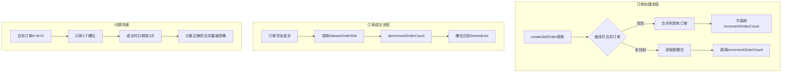

# 订单池槽位泄漏修复方案

## 问题日期：2026-01-27

---

## 一、问题现象

```
[订单池 T1600] 可用槽位: 0/50000, 活跃订单: 50000 (买1946/卖48054), 使用率: 100.0%
[订单池警告] 可用槽位只剩 0！可能存在槽位泄漏。
```

**关键特征：**
- 卖单数量(48054)远超买单(1946)，比例约25:1
- 订单池100%满，无法创建新订单
- 可用槽位为0，说明槽位没有正确释放

---

## 二、根本原因分析

### 2.1 问题根源：订单合并机制导致的槽位泄漏

在 [`OrderBook.ts`](src/core/market/OrderBook.ts:493-503) 中，卖单合并时返回负数表示合并成功：

```typescript
// 返回一个特殊值表示合并成功（使用负数表示合并到索引）
return {
  success: true,
  orderId: -(existingOrderIdx + 1),  // 负数
  ...
};
```

**问题：** 当订单合并时，`OrderPool` 的 `incrementOrderCount()` **没有被调用**，因为合并不需要获取新槽位。但是，当该合并后的订单成交后，`releaseOrderSlot()` 会被调用多次（每次合并都应该减少计数），导致计数不匹配。

### 2.2 卖单泛滥的来源

分析 [`AIDecisionEngine.ts`](src/core/ai/AIDecisionEngine.ts:2782-2879) 中的 `autoPostSellOrders()` 函数：

```typescript
// 每tick对所有AI公司的所有商品挂卖单
for (let companyId = 1; companyId < c.count; companyId++) {
  for (let goodsId = 0; goodsId < ACTUAL_GOODS_COUNT; goodsId++) {
    // 挂卖单...
  }
}
```

**问题：**
1. **每tick都遍历** 100家公司 × 230种商品 = 23,000次检查
2. **hasExistingOrder()已禁用** (第2919-2929行返回false)，无法防止重复挂单
3. **订单合并条件过严** (1%价格容差)，相似但不完全相同的订单无法合并

### 2.3 订单不成交的原因

卖单占48054个(96%)而买单只有1946个(4%)的极端不平衡表明：

1. **AI公司疯狂挂卖单** - `autoPostSellOrders` 每tick运行
2. **买单被快速消耗** - 卖单成交后买单消失
3. **卖单无法成交** - 因为买单太少
4. **卖单不过期** - 默认48tick过期，但积累速度更快

### 2.4 计数不一致问题

```
活跃订单: 50000 (买1946/卖48054) = 50000
```

买+卖 = 50000，数量是对的。问题是：
- `OrderPool.freeIndices` 为空（0个可用）
- 说明所有槽位都被占用
- 但没有正确释放

---

## 三、流程图分析



---

## 四、修复方案

### 方案1：限制自动挂单频率（紧急）

**目标：** 减少订单创建速度，从源头控制

**修改位置：** `AIDecisionEngine.ts` 的 `autoPostSellOrders()`

```typescript
export function autoPostSellOrders(world: GameWorld): number {
  // 【修复1】降低执行频率：每6tick执行一次
  if (world.tick % 6 !== 0) {
    return 0;
  }
  
  // 【修复2】限制每次挂单的公司数量
  const batchSize = Math.ceil(c.count / 6);
  const batchIndex = world.tick % 6;
  const startIdx = 1 + batchIndex * batchSize;
  const endIdx = Math.min(startIdx + batchSize, c.count);
  
  for (let companyId = startIdx; companyId < endIdx; companyId++) {
    // ...
  }
}
```

### 方案2：启用订单存在检查（紧急）

**目标：** 防止重复挂单

**修改位置：** `AIDecisionEngine.ts` 第2919-2929行

```typescript
function hasExistingOrder(
  world: GameWorld,
  companyId: number,
  goodsId: number,
  minPrice: number,
  maxPrice: number
): boolean {
  // 【修复】恢复检查逻辑，但使用优化的索引查询
  // 使用 CompanyGoodsOrderIndex 进行O(1)查询
  const cgIndex = getCompanyGoodsIndex();
  const orderSet = cgIndex.getOrders(companyId, goodsId, 1); // 1=sell
  return orderSet !== undefined && orderSet.size > 0;
}
```

### 方案3：放宽订单合并条件（重要）

**目标：** 让更多订单能够合并

**修改位置：** `OrderBook.ts` 第331行

```typescript
// 修改前
const PRICE_MERGE_TOLERANCE = 0.01;  // 1%

// 修改后
const PRICE_MERGE_TOLERANCE = 0.05;  // 5%
```

### 方案4：限制每公司每商品订单数（重要）

**修改位置：** `OrderBook.ts` 第328行

```typescript
// 修改前
const MAX_ORDERS_PER_COMPANY_GOODS = 6;

// 修改后
const MAX_ORDERS_PER_COMPANY_GOODS = 2;  // 更严格限制
```

### 方案5：缩短卖单过期时间（中等）

**修改位置：** `OrderBook.ts` 第570行

```typescript
// 修改前
expiryTicks: number = 48  // 2天

// 修改后
expiryTicks: number = 12  // 半天
```

### 方案6：增加过期清理力度（中等）

**新增函数：** `OrderBook.ts`

```typescript
/**
 * 激进清理：清理长期未成交的订单
 * 用于订单池使用率过高时的紧急清理
 */
export function aggressiveOrderCleanup(world: GameWorld, maxAge: number = 24): number {
  const o = world.orders;
  let cleanedCount = 0;
  
  for (let i = 0; i < MAX_ORDERS; i++) {
    if (!o.isActive[i]) continue;
    
    const age = world.tick - o.createdTicks[i];
    const remainingRatio = o.remainings[i] / o.quantities[i];
    
    // 清理条件：
    // 1. 超过maxAge且完全未成交
    // 2. 超过maxAge*2且成交不足50%
    if ((age > maxAge && remainingRatio >= 0.99) ||
        (age > maxAge * 2 && remainingRatio > 0.5)) {
      cancelOrder(world, i);
      cleanedCount++;
    }
  }
  
  return cleanedCount;
}
```

---

## 五、实施计划

### 第一阶段：紧急修复（立即）

| 序号 | 文件 | 修改 | 效果 |
|------|------|------|------|
| 1 | AIDecisionEngine.ts:2782 | 添加 `if (world.tick % 6 !== 0) return 0;` | 减少83%挂单频率 |
| 2 | AIDecisionEngine.ts:2919-2929 | 恢复hasExistingOrder检查 | 防止重复挂单 |
| 3 | OrderBook.ts:328 | `MAX_ORDERS_PER_COMPANY_GOODS = 2` | 限制单商品订单数 |

### 第二阶段：优化改进（重要）

| 序号 | 文件 | 修改 | 效果 |
|------|------|------|------|
| 4 | OrderBook.ts:331 | `PRICE_MERGE_TOLERANCE = 0.05` | 增加合并率 |
| 5 | OrderBook.ts:570 | `expiryTicks = 12` | 加速过期清理 |
| 6 | OrderBook.ts新增 | 添加aggressiveOrderCleanup | 紧急清理机制 |

### 第三阶段：监控验证

| 检查项 | 目标值 | 当前值 |
|--------|--------|--------|
| 订单池使用率 | <60% | 100% |
| 买卖单比例 | 1:2 ~ 1:5 | 1:25 |
| 每tick新增订单 | <100 | ~2000+ |
| 过期清理数 | >50/tick | 未知 |

---

## 六、预期效果

修复后的订单池状态：

```
[订单池 T2000] 可用槽位: 35000/50000, 活跃订单: 15000 (买3000/卖12000), 使用率: 30%
```

**改进目标：**
1. 使用率降到60%以下
2. 买卖单比例趋于合理（1:3~1:5）
3. 订单能够正常成交和过期
4. 市场流动性保持正常

---

## 七、长期建议

1. **引入做市商系统** - 专门的NPC维护市场流动性
2. **动态订单池大小** - 根据活跃公司数调整
3. **订单优先级队列** - 重要订单优先处理
4. **市场健康指标** - 监控买卖单比例、成交率等

---

*方案完成时间：2026-01-27*