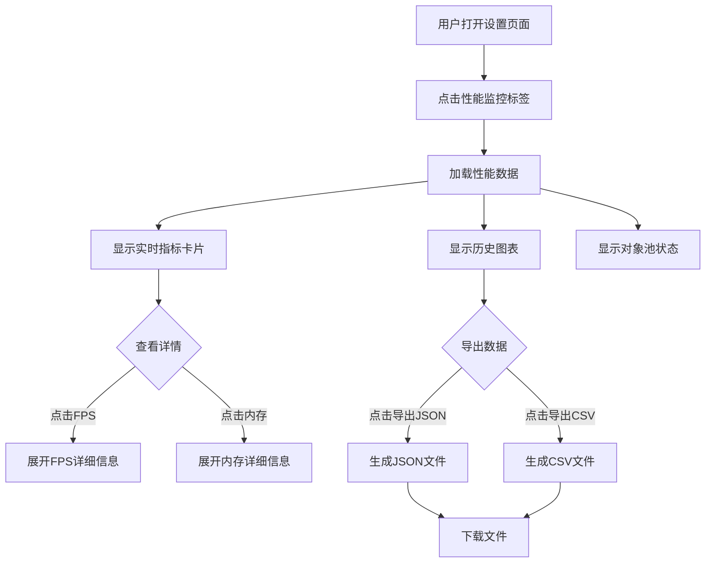

# 性能监控系统设计方案

## 1. 概述

基于现有的 `PerformanceMonitor` 和 `MemoryManager`，构建一个完整的性能监控系统，包括：
- 增强的性能指标收集
- 可视化的UI面板
- 数据导出功能

## 2. 现有代码分析

### 2.1 已有功能
- `PerformanceMonitor`: Tick耗时追踪、系统breakdown (production/matching/pricing/ai/retail)
- `MemoryManager`: 内存压力检测、对象池管理
- `ObjectPool`: 各类对象池（orders/events/trades/pricePoints/typedArrays）
- `GameLoop`: 已集成 perfMonitor.startTick/endTick

### 2.2 缺失功能
- FPS 计算
- 渲染时间追踪
- 对象池使用率实时展示
- UI 可视化面板
- 数据导出

## 3. 系统架构

```
┌─────────────────────────────────────────────────────────────────┐
│                     Performance Monitor System                   │
├─────────────────────────────────────────────────────────────────┤
│  ┌───────────────────────────────────────────────────────────┐  │
│  │                 Enhanced PerformanceMonitor                │  │
│  │  - FPS计算器                                               │  │
│  │  - 渲染时间追踪                                            │  │
│  │  - 系统breakdown增强                                       │  │
│  │  - 对象池统计聚合                                          │  │
│  │  - 历史数据环形缓冲                                        │  │
│  │  - 数据导出接口                                            │  │
│  └───────────────────────────────────────────────────────────┘  │
│                              │                                   │
│  ┌───────────────────────────┼───────────────────────────────┐  │
│  │                    Data Export Module                      │  │
│  │  - JSON导出                                                │  │
│  │  - CSV导出                                                 │  │
│  │  - 时间范围选择                                            │  │
│  │  - 文件下载                                                │  │
│  └───────────────────────────────────────────────────────────┘  │
│                              │                                   │
│  ┌───────────────────────────┼───────────────────────────────┐  │
│  │                 Performance Dashboard UI                   │  │
│  │  ┌─────────────┐ ┌─────────────┐ ┌─────────────┐         │  │
│  │  │  FPS卡片    │ │ Tick耗时卡片│ │ 内存使用卡片│         │  │
│  │  └─────────────┘ └─────────────┘ └─────────────┘         │  │
│  │  ┌─────────────────────────────────────────────┐         │  │
│  │  │            Tick耗时历史折线图                │         │  │
│  │  └─────────────────────────────────────────────┘         │  │
│  │  ┌─────────────────────────────────────────────┐         │  │
│  │  │            系统Breakdown饼图                 │         │  │
│  │  └─────────────────────────────────────────────┘         │  │
│  │  ┌─────────────────────────────────────────────┐         │  │
│  │  │            对象池使用率条形图                │         │  │
│  │  └─────────────────────────────────────────────┘         │  │
│  │  ┌─────────────────────────────────────────────┐         │  │
│  │  │            导出按钮和选项                    │         │  │
│  │  └─────────────────────────────────────────────┘         │  │
│  └───────────────────────────────────────────────────────────┘  │
└─────────────────────────────────────────────────────────────────┘
```

## 4. 详细设计

### 4.1 增强 PerformanceMonitor

**文件**: `src/core/performance/PerformanceMonitor.ts`

新增接口和功能：

```typescript
// 新增：FPS追踪器
interface FPSTracker {
  currentFPS: number;
  avgFPS: number;
  minFPS: number;
  maxFPS: number;
  frameCount: number;
  lastFrameTime: number;
}

// 新增：渲染性能
interface RenderMetrics {
  frameTime: number;
  layoutTime: number;
  paintTime: number;
  jsHeapSize: number;
}

// 新增：综合性能快照
interface PerformanceSnapshot {
  tick: number;
  timestamp: number;
  fps: FPSTracker;
  tickTime: number;
  breakdown: TickBreakdown;
  memory: MemoryStats;
  pools: PoolStats;
  health: 'healthy' | 'warning' | 'critical';
}

// 新增方法
class PerformanceMonitor {
  // FPS追踪
  startFrame(): void;
  endFrame(): void;
  getFPS(): FPSTracker;
  
  // 渲染追踪
  measureRender<T>(fn: () => T): T;
  getRenderMetrics(): RenderMetrics;
  
  // 综合快照
  getSnapshot(): PerformanceSnapshot;
  getHistorySnapshots(count: number): PerformanceSnapshot[];
  
  // 导出
  exportToJSON(options?: ExportOptions): string;
  exportToCSV(options?: ExportOptions): string;
}
```

### 4.2 数据导出模块

**文件**: `src/core/performance/PerformanceExporter.ts`

```typescript
interface ExportOptions {
  format: 'json' | 'csv';
  timeRange?: 'all' | 'last100' | 'last1000';
  includeMemory?: boolean;
  includePools?: boolean;
  includeBreakdown?: boolean;
}

class PerformanceExporter {
  static exportJSON(snapshots: PerformanceSnapshot[], options?: ExportOptions): string;
  static exportCSV(snapshots: PerformanceSnapshot[], options?: ExportOptions): string;
  static downloadFile(content: string, filename: string, mimeType: string): void;
}
```

### 4.3 性能监控UI组件

**文件**: `src/ui/components/Performance/PerformanceDashboard.tsx`

组件结构：
```
PerformanceDashboard
├── PerformanceHeader (标题 + 健康状态指示器 + 导出按钮)
├── MetricsCards (FPS/Tick耗时/内存使用 三个卡片)
├── TickTimeChart (Tick耗时历史折线图)
├── BreakdownChart (系统breakdown饼图)
├── PoolStatsChart (对象池使用率条形图)
└── ExportPanel (导出选项和按钮)
```

**卡片设计**：
- FPS卡片：当前FPS、平均FPS、颜色指示（绿/黄/红）
- Tick耗时卡片：当前/平均/最大耗时、目标帧率指示
- 内存使用卡片：已用/总量、使用率进度条、压力级别

**图表设计**：
- Tick耗时图：ECharts折线图，显示最近100个tick的耗时，标注警告线(16ms)和临界线(33ms)
- Breakdown饼图：ECharts饼图，显示各系统占比
- 对象池条形图：ECharts水平条形图，显示各池的使用率

### 4.4 集成到Settings页面

在 `Settings.tsx` 中新增 "性能" 标签页：

```tsx
// 标签页配置
const tabs = [
  { key: 'game', label: '游戏设置' },
  { key: 'save', label: '存档管理' },
  { key: 'performance', label: '性能监控' },  // 新增
  { key: 'about', label: '关于游戏' },
];
```

### 4.5 gameStore 集成

在 `gameStore.ts` 中添加性能监控相关方法：

```typescript
interface GameActions {
  // ... existing actions
  
  // 性能监控
  getPerformanceSnapshot: () => PerformanceSnapshot | null;
  getPerformanceHistory: (count: number) => PerformanceSnapshot[];
  exportPerformanceData: (format: 'json' | 'csv') => void;
}
```

## 5. 实现步骤

### 步骤1: 增强 PerformanceMonitor
- 添加 FPS 追踪器
- 添加渲染时间追踪
- 添加 getSnapshot 方法
- 添加历史快照存储

### 步骤2: 创建 PerformanceExporter
- 实现 JSON 导出
- 实现 CSV 导出
- 实现文件下载

### 步骤3: 创建 UI 组件
- 创建 PerformanceDashboard 主组件
- 创建各个子组件（MetricsCards, Charts）
- 样式与现有UI风格保持一致

### 步骤4: 集成
- 更新 gameStore
- 更新 Settings 页面
- 添加导出功能

### 步骤5: 测试
- 验证性能数据准确性
- 验证导出功能
- 验证UI响应性

## 6. 文件变更清单

| 操作 | 文件路径 | 描述 |
|------|----------|------|
| 修改 | `src/core/performance/PerformanceMonitor.ts` | 增强FPS、渲染追踪、快照功能 |
| 新建 | `src/core/performance/PerformanceExporter.ts` | 数据导出模块 |
| 修改 | `src/core/performance/index.ts` | 导出新模块 |
| 新建 | `src/ui/components/Performance/PerformanceDashboard.tsx` | 性能监控UI主组件 |
| 新建 | `src/ui/components/Performance/MetricsCards.tsx` | 指标卡片组件 |
| 新建 | `src/ui/components/Performance/PerformanceCharts.tsx` | 图表组件 |
| 修改 | `src/stores/gameStore.ts` | 添加性能监控方法 |
| 修改 | `src/ui/pages/Settings.tsx` | 集成性能监控标签页 |

## 7. 技术细节

### 7.1 FPS 计算
使用 `requestAnimationFrame` 或 tick 间隔计算：
```typescript
// 在每帧开始
const now = performance.now();
const delta = now - this.lastFrameTime;
this.fps = 1000 / delta;
this.lastFrameTime = now;
```

### 7.2 内存获取
使用 Chrome 特有的 `performance.memory`（降级处理）：
```typescript
const memory = (performance as any).memory;
if (memory) {
  return {
    used: memory.usedJSHeapSize,
    total: memory.jsHeapSizeLimit,
    ratio: memory.usedJSHeapSize / memory.jsHeapSizeLimit
  };
}
```

### 7.3 对象池统计
调用现有的 `getAllPoolStats()` 方法获取各池状态。

### 7.4 数据导出格式

**JSON 格式示例**：
```json
{
  "exportTime": "2026-01-26T17:30:00.000Z",
  "totalSnapshots": 100,
  "snapshots": [
    {
      "tick": 1000,
      "timestamp": 1737912600000,
      "fps": { "current": 60, "avg": 58.5, "min": 45, "max": 62 },
      "tickTime": 12.5,
      "breakdown": { "production": 3.2, "matching": 4.1, "pricing": 1.5, "ai": 2.8, "retail": 0.9 },
      "memory": { "used": 150000000, "total": 2147483648, "ratio": 0.07 },
      "health": "healthy"
    }
  ]
}
```

**CSV 格式示例**：
```csv
tick,timestamp,fps_current,fps_avg,tickTime,production,matching,pricing,ai,retail,memory_used,memory_total,health
1000,1737912600000,60,58.5,12.5,3.2,4.1,1.5,2.8,0.9,150000000,2147483648,healthy
```

## 8. UI 设计稿

### 8.1 整体布局
```
┌────────────────────────────────────────────────────────────────────┐
│ 性能监控                                               [导出JSON]  │
│                                                       [导出CSV]   │
├────────────────────────────────────────────────────────────────────┤
│ ┌──────────────┐ ┌──────────────┐ ┌──────────────┐ ┌────────────┐ │
│ │     FPS      │ │   Tick耗时   │ │   内存使用   │ │  健康状态  │ │
│ │     60       │ │   12.5ms     │ │  150MB/2GB   │ │   ✓ 正常   │ │
│ │   avg: 58.5  │ │   avg: 11.2  │ │     7%       │ │            │ │
│ └──────────────┘ └──────────────┘ └──────────────┘ └────────────┘ │
├────────────────────────────────────────────────────────────────────┤
│                        Tick耗时历史                                │
│  ┌────────────────────────────────────────────────────────────┐   │
│  │   ^                                                         │   │
│  │ ms│     ╭─╮   ╭╮                                           │   │
│  │ 16├─────┼─┼───┼┼─────────────────────────────── 警告线      │   │
│  │   │ ╭╮╭╮│ │╭─╮││╭╮  ╭╮                                     │   │
│  │   │╭╯╰╯╰╯ ╰╯ ╰╯╰╯╰──╯╰──╮╭─╮  ╭╮                           │   │
│  │  0└──────────────────────╰╯ ╰──╯╰─────────────────> tick   │   │
│  └────────────────────────────────────────────────────────────┘   │
├────────────────────────────────────────────────────────────────────┤
│  ┌─────────────────────────┐  ┌────────────────────────────────┐  │
│  │    系统耗时breakdown    │  │       对象池使用率              │  │
│  │                         │  │                                │  │
│  │      ┌────┐             │  │ orders    ████████████░░ 80%   │  │
│  │   ┌──┤生产├──┐          │  │ events    ██████░░░░░░░░ 45%   │  │
│  │   │  └────┘  │          │  │ trades    █████████████░ 92%   │  │
│  │ ┌─┴─┐      ┌─┴─┐        │  │ pricePoints ██████████░░ 75%   │  │
│  │ │AI │      │撮合│        │  │ typedArrays █████░░░░░░░ 38%   │  │
│  │ └───┘      └───┘        │  │                                │  │
│  └─────────────────────────┘  └────────────────────────────────┘  │
└────────────────────────────────────────────────────────────────────┘
```

### 8.2 颜色方案
- 健康状态：绿色 `#22c55e`
- 警告状态：黄色 `#f59e0b`
- 临界状态：红色 `#ef4444`
- 系统颜色：
  - production: `#3b82f6` (蓝)
  - matching: `#8b5cf6` (紫)
  - pricing: `#ec4899` (粉)
  - ai: `#f59e0b` (橙)
  - retail: `#22c55e` (绿)
  - other: `#64748b` (灰)

## 9. 用户交互流程



## 10. 性能考量

1. **数据更新频率**：每个tick更新一次（约16ms），但UI刷新限制在每秒10次以内
2. **历史数据限制**：环形缓冲区最多保存1000个快照（约16秒）
3. **图表优化**：ECharts使用 `notMerge: true` 和 `lazyUpdate: true`
4. **内存占用**：快照对象复用，避免频繁GC

## 11. 后续扩展

- 添加性能预警推送
- 添加性能基准测试
- 添加性能对比分析
- 支持性能数据上报