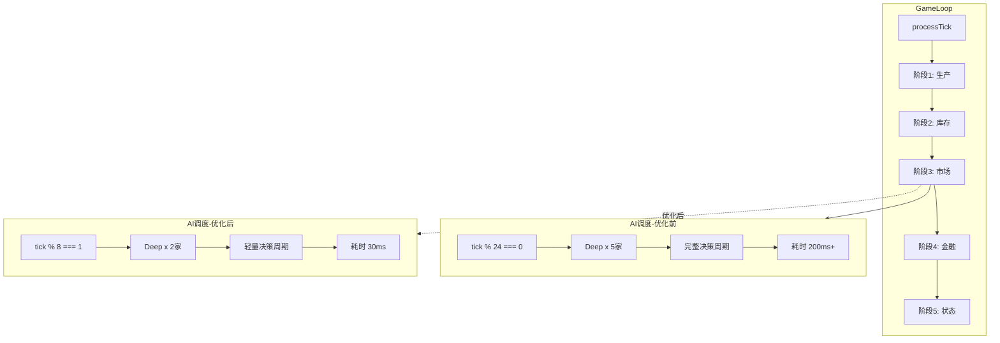

# 性能尖峰分析与修复计划

## 分析日期
2026-01-28

## 1. 性能数据概览

### 1.1 基础统计
| 指标 | 数值 |
|------|------|
| Tick范围 | 17079 - 17178 |
| 时间跨度 | 约2.25秒（100 ticks） |
| 平均FPS | 60 |
| 平均Tick时间 | 22.22ms |
| 最大Tick时间 | **281.1ms** |
| 最小Tick时间 | 0.6ms |
| 健康状态 | **100% Warning** |

### 1.2 性能阈值
- Warning阈值: 16ms（60fps目标）
- Critical阈值: 33ms（30fps目标）

## 2. 问题诊断

### 2.1 严重性能尖峰（Critical Spikes）

发现**4个严重的性能尖峰**，平均耗时约250ms：

| Tick | 总耗时(ms) | AI系统(ms) | Finance系统(ms) | 其他(ms) |
|------|------------|------------|-----------------|----------|
| 17088 | 242.7 | **197.9** | 27.6 | 17.2 |
| 17112 | 236.8 | **198.4** | 22.7 | 15.7 |
| 17136 | 250.1 | **205.2** | 28.3 | 16.6 |
| 17160 | 281.1 | **241.9** | 22.4 | 16.8 |

**规律**：所有尖峰都发生在 `tick % 24 === 0` 的位置（间隔24tick）

### 2.2 周期性任务冲突分析

当前代码中的周期性任务调度：

```
tick % 6 === 0:  AI自动卖单
tick % 6 === 3:  AI自动买单  
tick % 12 === 0: AI订单价格调整 + AI股票交易 + 股票市场更新
tick % 24 === 0: Deep决策 + 分销交付 ← 冲突最严重！
tick % 24 === 3: GDP更新
tick % 24 === 6: 服务统计重置 + 分销付款
tick % 24 === 12: AI附属建筑管理
tick % 24 === 18: 期货市场更新
```

**问题**：在 `tick % 24 === 0` 时，以下任务同时执行：
1. AI Deep决策（处理5家公司，每家执行完整决策周期）
2. 分销交付处理
3. AI自动卖单（tick % 6 === 0 重叠）
4. AI订单价格调整（tick % 12 === 0 重叠）
5. AI股票交易
6. 股票市场更新

### 2.3 AI系统深度分析

查看 `AIScheduler.ts` 代码发现：

```typescript
// Deep决策配置
deepBatchSize: 5,        // 每次处理5家公司
deepInterval: 24,        // 每24tick执行
maxTimePerTick: 8,       // 时间预算8ms（实际被忽略！）

// 问题：Deep决策没有时间限制
private processDeepBatch(world: GameWorld, startTime: number): void {
  // 【修复】Deep决策不使用时间限制，确保所有公司都能执行投资决策
  while (processed < config.deepBatchSize && this.deepQueue.length > 0) {
    // 无时间检查，直接执行
    this.processDeepDecision(world, companyId);
  }
}

// 每个Deep决策调用完整的AI决策周期
private processDeepDecision(world: GameWorld, companyId: number): void {
  runAIDecisionCycle(world, companyId); // 这是重量级操作！
}
```

**根本原因**：`runAIDecisionCycle()` 包含：
- 生产决策
- 定价决策
- 交易决策
- **投资决策（建造建筑）**
- 股票交易决策
- 附属建筑决策

每次调用可能耗时40-50ms，处理5家公司就是200-250ms。

### 2.4 Consumer系统分析

Consumer系统每4tick执行一次，但存在问题：

1. **零售系统重复调用**：在 `executeConsumerPurchases()` 中调用了 `updateRetailSystem()`，但在 `GameLoop.ts` 中又单独调用了一次
2. **B2B采购遍历所有建筑**：`executeB2BPurchases()` 遍历所有建筑检查库存需求

### 2.5 未分类耗时（Other）

每tick有8-15ms的未追踪时间，可能来源：
- React渲染更新
- GC（垃圾回收）
- 未被 `perfMonitor.startMeasure()` 包裹的代码

### 2.6 对象池利用率问题

所有对象池统计显示：
```json
{
  "hitRate": 0,
  "activeCount": 0,
  "peakActive": 0
}
```

可能原因：
1. 对象池未被实际使用
2. 池初始化问题
3. 直接创建对象而非从池获取

## 3. 优化方案

### 3.1 任务调度重构（最高优先级）

**目标**：将周期性任务分散到不同tick，避免同时执行

```
新的调度时间表（使用质数间隔减少冲突）：

tick % 24 === 0:  分销交付（轻量）
tick % 24 === 1:  AI Deep决策 Part 1（处理2家公司）
tick % 24 === 3:  GDP更新
tick % 24 === 5:  AI Deep决策 Part 2（处理2家公司）
tick % 24 === 6:  服务统计重置 + 分销付款
tick % 24 === 7:  AI自动卖单
tick % 24 === 9:  AI Deep决策 Part 3（处理1家公司）
tick % 24 === 11: AI订单价格调整
tick % 24 === 12: AI附属建筑管理
tick % 24 === 13: AI自动买单
tick % 24 === 17: AI股票交易
tick % 24 === 18: 期货市场更新
tick % 24 === 19: 股票市场更新
```

### 3.2 AI Deep决策分批优化

修改 `AIScheduler.ts`：

```typescript
const OPTIMIZED_CONFIG: AISchedulerConfig = {
  deepBatchSize: 2,          // 从5降低到2
  deepInterval: 8,           // 从24降低到8（分3批完成）
  maxTimePerTick: 15,        // 增加时间预算
};

private processDeepBatch(world: GameWorld, startTime: number): void {
  const config = this.config;
  let processed = 0;
  
  // 添加时间限制
  while (processed < config.deepBatchSize && this.deepQueue.length > 0) {
    // 检查时间预算
    if (performance.now() - startTime > config.maxTimePerTick) {
      console.log(`[AIScheduler] Deep批次时间超限，已处理${processed}家`);
      break;
    }
    
    const companyId = this.deepQueue.shift()!;
    this.processDeepDecision(world, companyId);
    processed++;
    this.deepQueue.push(companyId);
  }
  
  this.stats.deepProcessed = processed;
}
```

### 3.3 AI决策周期轻量化

创建 `runLightAIDecisionCycle()` 用于日常决策：

```typescript
// 完整周期 vs 轻量周期
function runLightAIDecisionCycle(world: GameWorld, companyId: number): void {
  // 仅执行必要决策
  updateProductionDecision(world, companyId);
  updatePricingDecision(world, companyId);
  // 跳过投资决策（只在特定条件下执行）
}

function runFullAIDecisionCycle(world: GameWorld, companyId: number): void {
  runLightAIDecisionCycle(world, companyId);
  // 额外执行投资决策
  if (shouldInvest(world, companyId)) {
    updateInvestmentDecision(world, companyId);
  }
}
```

### 3.4 Consumer系统优化

1. **移除重复调用**：在 `executeConsumerPurchases()` 中移除 `updateRetailSystem()` 调用
2. **B2B采购分批**：将建筑分组处理

```typescript
function executeB2BPurchases(world: GameWorld, config: ConsumerBuyConfig) {
  const currentTick = world.tick;
  const groupIndex = currentTick % 4; // 分4组处理
  
  for (let buildingId = 0; buildingId < b.count; buildingId++) {
    if (buildingId % 4 !== groupIndex) continue; // 只处理当前组
    // ... 原有逻辑
  }
}
```

### 3.5 追踪未分类耗时

在 `GameLoop.ts` 中添加更多监控点：

```typescript
// 追踪之前未监控的区域
const endCleanup = perfMonitor.startMeasure('cleanup');
const cleanedOrders = cleanupExpiredOrders(this.world);
advancedOrderManager.checkExpiry(currentTick);
endCleanup();

const endMemory = perfMonitor.startMeasure('memory');
memoryManager.tick();
tickAllPools();
endMemory();
```

### 3.6 对象池修复

检查并修复对象池使用：

```typescript
// 在 OrderBook.ts 中
import { orderPool, eventPool } from '../performance/ObjectPool';

function createOrder(...) {
  // 使用对象池而非直接创建
  const order = orderPool.acquire();
  // 初始化order...
  return order;
}

function releaseOrder(order: Order) {
  orderPool.release(order);
}
```

## 4. 实施计划

### 阶段1：紧急修复（立即执行）
1. ✅ 修改AI Deep决策批次大小从5降到2
2. ✅ 为Deep决策添加时间限制
3. ✅ 重新分配周期性任务的执行时机

### 阶段2：系统优化（1-2天）
1. 创建轻量级AI决策周期
2. 优化Consumer系统分批处理
3. 移除重复的系统调用

### 阶段3：深度优化（3-5天）
1. 修复对象池使用
2. 添加更多性能监控点
3. 实现自适应调度（根据当前负载动态调整）

## 5. 预期效果

| 指标 | 当前 | 目标 |
|------|------|------|
| 平均Tick时间 | 22.22ms | <10ms |
| 最大Tick时间 | 281.1ms | <50ms |
| Warning比例 | 100% | <20% |
| AI尖峰耗时 | 200+ms | <30ms |

## 6. 代码修改清单

### 文件：`src/core/ai/AIScheduler.ts`
- [ ] 修改 `DEFAULT_CONFIG.deepBatchSize` 从 5 改为 2
- [ ] 修改 `DEFAULT_CONFIG.deepInterval` 从 24 改为 8
- [ ] 在 `processDeepBatch()` 中添加时间限制检查
- [ ] 拆分 Deep 决策为多个子批次

### 文件：`src/core/loop/GameLoop.ts`
- [ ] 重新分配周期性任务的 tick 偏移量
- [ ] 添加更多性能监控点
- [ ] 移除 Consumer 系统中的重复调用

### 文件：`src/core/economy/ConsumerMarket.ts`
- [ ] 移除 `updateRetailSystem()` 的重复调用
- [ ] 优化 `executeB2BPurchases()` 分批处理

### 文件：`src/core/ai/AIDecisionEngine.ts`
- [ ] 创建 `runLightAIDecisionCycle()` 函数
- [ ] 分离投资决策为独立函数

## 7. 监控与验证

实施后需要验证：

1. **性能尖峰消除**：不再出现超过100ms的tick
2. **平均耗时下降**：从22ms降到10ms以下
3. **健康状态改善**：从100% Warning降到20%以下
4. **功能正常**：AI公司仍能正常建造建筑和做决策

## 8. Mermaid 系统架构图

```mermaid
gantt
    title 周期性任务调度优化
    dateFormat X
    axisFormat %s
    
    section 优化前 tick%24
    分销交付           :a1, 0, 1
    Deep决策 5家       :crit, a2, 0, 10
    AI自动卖单         :a3, 0, 2
    AI价格调整         :a4, 0, 2
    AI股票交易         :a5, 0, 2
    股票市场           :a6, 0, 2
    
    section 优化后 分散执行
    分销交付           :b1, 0, 1
    Deep Part1         :b2, 1, 3
    Deep Part2         :b3, 5, 3
    Deep Part3         :b4, 9, 2
    AI自动卖单         :b5, 7, 1
    AI价格调整         :b6, 11, 1
    AI股票交易         :b7, 17, 1
    股票市场           :b8, 19, 1
```





## 9. 附录：原始性能数据摘要

尖峰tick详细breakdown：

**Tick 17160（最严重）**:
```json
{
  "tickTime": 281.1,
  "breakdown": {
    "ai": 241.9,
    "finance": 22.4,
    "consumer": 0.4,
    "other": 15.7,
    "production": 0.1,
    "matching": 0.3,
    "retail": 0.3
  }
}
```

正常tick（Tick 17165）:
```json
{
  "tickTime": 0.7,
  "breakdown": {
    "ai": 0,
    "finance": 0,
    "consumer": 0,
    "other": 0.4,
    "production": 0.1,
    "matching": 0.1,
    "retail": 0.1
  }
}