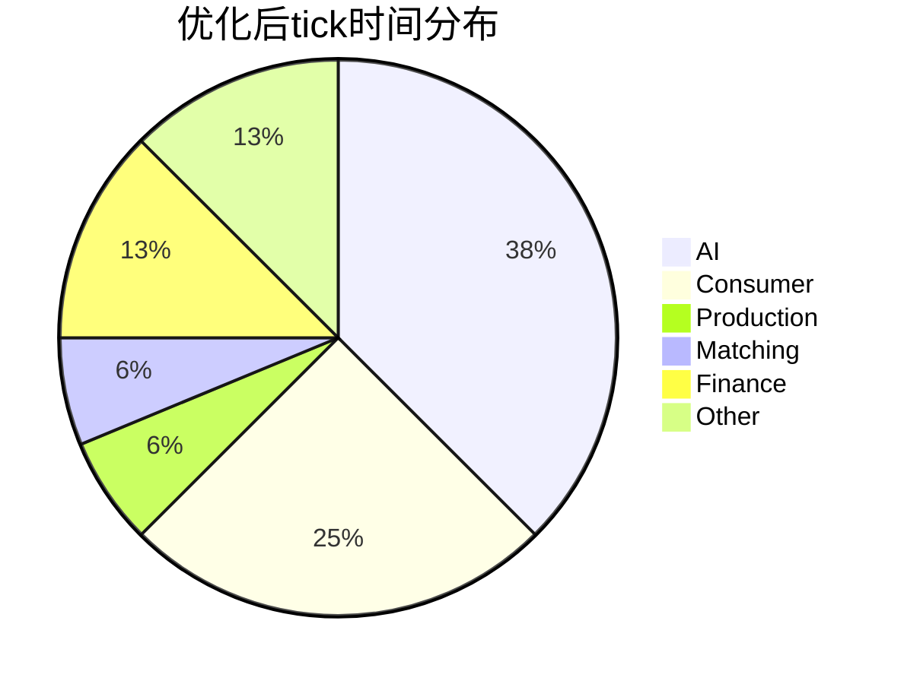

# 每24Tick性能尖峰优化计划

## 问题分析

### 性能数据摘要
基于导出的性能监控数据（100个快照，tick 1104-1203）：

| 指标 | 数值 | 状态 |
|------|------|------|
| 平均Tick时间 | 14.18ms | ✅ 健康 |
| 最大Tick时间 | **39.70ms** | ⚠️ 超标 |
| 最小Tick时间 | 10.60ms | ✅ 正常 |
| 尖峰频率 | 每24 tick | 周期性 |

### 尖峰时段 vs 正常时段对比

| 系统 | 正常tick | 尖峰tick | 差异 |
|------|----------|----------|------|
| AI | 5-6ms | 8-10ms | +50% |
| Finance | 0-1ms | **7-8ms** | +700% |
| Consumer | 5ms | 5-6ms | 稳定 |
| Other | 0.5ms | **16-17ms** | +3300% |
| **总计** | ~12ms | ~40ms | +233% |

### 尖峰原因定位

通过分析 [`GameLoop.ts`](src/core/loop/GameLoop.ts:403)，每24个tick触发以下操作：

```typescript
// 第403-405行：渠道系统
if (currentTick % 24 === 0) {
  distributionManager.processDeliveries(currentTick);
  distributionManager.processPayments(currentTick);
}

// 第421-435行：期货市场
if (currentTick % 24 === 0) {
  futuresMarket.createMonthlyContracts(...);  // 仅tick % (30*24) === 0
  futuresMarket.updatePositionsPnL(spotPrices);
  futuresMarket.handleExpiry(currentTick, spotPrices);
}

// 第454-456行：AI股票交易（tick % 12）
if (currentTick % 12 === 0) {
  executeAIStockTrading(this.world);
}

// 第459-461行：股票市场（tick % 4）
if (currentTick % 4 === 0) {
  updateStockMarket(this.world);  // 重：每次遍历所有股票
}

// 第469-471行：AI附属建筑管理
if (currentTick % 24 === 0) {
  aiSubsidiaryActions = runAISubsidiaryManagement(this.world);
}

// 第479-480行：服务统计重置
if (currentTick % 24 === 0) {
  resetDailyServiceStats();
}
```

### 未追踪时间分析

"other"分类高达16-17ms，表明有大量操作未被监控。可能来源：

1. **Zustand状态更新**：React状态同步
2. **垃圾回收**：大量临时对象创建
3. **DOM渲染**：UI更新延迟
4. **未标记的子系统**：深层调用未被追踪

---

## 优化方案

### 方案1：错峰执行（高优先级）

**问题**：多个重型操作集中在tick % 24 === 0时执行

**解决方案**：将操作分散到不同的tick

```typescript
// 优化前：全部在 tick % 24 === 0
if (currentTick % 24 === 0) {
  distributionManager.processDeliveries(currentTick);
  distributionManager.processPayments(currentTick);
  runAISubsidiaryManagement(this.world);
  resetDailyServiceStats();
}

// 优化后：错峰执行
if (currentTick % 24 === 0) {
  distributionManager.processDeliveries(currentTick);
}
if (currentTick % 24 === 6) {
  distributionManager.processPayments(currentTick);
}
if (currentTick % 24 === 12) {
  runAISubsidiaryManagement(this.world);
}
if (currentTick % 24 === 18) {
  resetDailyServiceStats();
}
```

**预期效果**：将40ms尖峰分散为4个~15ms的tick

---

### 方案2：股票市场优化（高优先级）

**问题**：[`updateStockMarket()`](src/core/finance/StockMarket.ts:995) 每4个tick遍历所有股票

**当前代码问题**：
```typescript
// 第1003-1031行：遍历所有股票
for (const [companyId, stock] of stockMarket.stocks) {
  // 每次都计算估值
  const valuation = calculateValuation(world, companyId);  // 重！
  // 每次都计算动态价格
  const newPrice = calculateDynamicPrice(world, companyId, stock);  // 重！
}
```

**优化方案**：
1. 增加更新间隔：从4 tick改为12或24 tick
2. 批量处理：每次只更新部分股票
3. 缓存估值：复用calculateValuation结果

```typescript
// 优化后
export function updateStockMarket(world: GameWorld): void {
  const batchSize = 10;  // 每次只处理10只股票
  const stockArray = Array.from(stockMarket.stocks.values());
  const startIndex = (world.tick / 4) % Math.ceil(stockArray.length / batchSize) * batchSize;
  
  for (let i = startIndex; i < Math.min(startIndex + batchSize, stockArray.length); i++) {
    const stock = stockArray[i];
    // 处理单只股票...
  }
}
```

**预期效果**：单次更新从遍历50+股票减少到10只

---

### 方案3：期货市场优化（中优先级）

**问题**：[`handleExpiry()`](src/core/finance/FuturesMarket.ts:406) 遍历所有合约和持仓

**优化方案**：
1. 维护到期时间索引，避免全量遍历
2. 使用懒惰清理策略

```typescript
// 添加到期索引
private expiryIndex: Map<number, Set<number>> = new Map();  // tick -> contractIds

handleExpiry(currentTick: number, spotPrices: Map<number, number>): void {
  // 只处理当前tick到期的合约
  const expiredIds = this.expiryIndex.get(currentTick);
  if (!expiredIds) return;
  
  for (const contractId of expiredIds) {
    // 处理到期...
  }
  this.expiryIndex.delete(currentTick);
}
```

---

### 方案4：增强性能追踪（中优先级）

**问题**：16-17ms的"other"时间未被追踪

**解决方案**：添加更细粒度的性能标记

```typescript
// GameLoop.ts 增加追踪
const endDistribution = perfMonitor.startMeasure('distribution');
distributionManager.processDeliveries(currentTick);
distributionManager.processPayments(currentTick);
endDistribution();

const endFutures = perfMonitor.startMeasure('futures');
futuresMarket.updatePositionsPnL(spotPrices);
futuresMarket.handleExpiry(currentTick, spotPrices);
endFutures();

const endAISubsidiary = perfMonitor.startMeasure('ai-subsidiary');
runAISubsidiaryManagement(this.world);
endAISubsidiary();
```

---

### 方案5：对象池激活（中优先级）

**问题**：对象池hitRate为0，未被有效使用

**分析**：
```json
"pools": {
  "orders": { "poolSize": 10, "activeCount": 0, "hitRate": 0 },
  "events": { "poolSize": 10, "activeCount": 0, "hitRate": 0 },
  "trades": { "poolSize": 10, "activeCount": 0, "hitRate": 0 }
}
```

**原因推测**：
1. 订单系统可能直接创建对象而非使用池
2. 池的初始大小(10)可能不足
3. 对象未正确归还池

**解决方案**：
1. 审查订单创建代码，确保使用对象池
2. 增加池大小到100-500
3. 确保对象归还逻辑正确

---

### 方案6：分销渠道优化（低优先级）

**问题**：[`processDeliveries()`](src/core/economy/DistributionChannels.ts:355) 遍历所有订单

**优化方案**：
```typescript
// 当前：遍历所有订单
for (const [, order] of this.orders) {
  if (order.status === ChannelOrderStatus.PENDING && ...) {
    // 处理
  }
}

// 优化：维护待处理订单队列
private pendingOrders: Set<number> = new Set();

processDeliveries(currentTick: number): ChannelOrder[] {
  const delivered: ChannelOrder[] = [];
  
  for (const orderId of this.pendingOrders) {
    const order = this.orders.get(orderId);
    if (order && currentTick >= order.deliveryTick!) {
      // 处理...
      this.pendingOrders.delete(orderId);
      delivered.push(order);
    }
  }
  return delivered;
}
```

---

## 实施计划

### 第一阶段：快速修复（预期效果：40ms → 20ms）

| 任务 | 修改文件 | 复杂度 |
|------|----------|--------|
| 1. 错峰执行24-tick操作 | GameLoop.ts | 低 |
| 2. 降低股票市场更新频率 | StockMarket.ts | 低 |
| 3. 添加性能追踪点 | GameLoop.ts | 低 |

### 第二阶段：结构优化（预期效果：20ms → 15ms）

| 任务 | 修改文件 | 复杂度 |
|------|----------|--------|
| 4. 股票市场批量处理 | StockMarket.ts | 中 |
| 5. 期货市场索引优化 | FuturesMarket.ts | 中 |
| 6. 激活对象池 | OrderBook.ts, ObjectPool.ts | 中 |

### 第三阶段：深度优化（预期效果：稳定在12-14ms）

| 任务 | 修改文件 | 复杂度 |
|------|----------|--------|
| 7. 分销渠道队列优化 | DistributionChannels.ts | 中 |
| 8. 估值计算缓存 | StockMarket.ts | 中 |
| 9. 减少临时对象分配 | 多个文件 | 高 |

---

## 预期成果

### 优化后性能指标

| 指标 | 当前值 | 目标值 | 改善 |
|------|--------|--------|------|
| 平均Tick时间 | 14.18ms | 12ms | -15% |
| 最大Tick时间 | 39.70ms | 18ms | -55% |
| 尖峰/正常比 | 3.33x | 1.5x | -55% |
| 健康百分比 | 100% | 100% | 维持 |

### 优化后Breakdown预期



---

## 监控验证

优化完成后，使用以下命令导出新的性能数据进行对比：

```javascript
// 浏览器控制台执行
const exporter = new PerformanceExporter(perfMonitor);
exporter.exportToFile({
  format: 'json',
  timeRange: 'last100',
  includeBreakdown: true,
  includePools: true,
});
```

验证指标：
1. 最大tick时间 < 20ms
2. 无明显周期性尖峰
3. 对象池hitRate > 0.5
4. "other"分类占比 < 10%

---

## 相关文件

- [`src/core/loop/GameLoop.ts`](src/core/loop/GameLoop.ts) - 主循环
- [`src/core/finance/StockMarket.ts`](src/core/finance/StockMarket.ts) - 股票系统
- [`src/core/finance/FuturesMarket.ts`](src/core/finance/FuturesMarket.ts) - 期货系统
- [`src/core/economy/DistributionChannels.ts`](src/core/economy/DistributionChannels.ts) - 分销系统
- [`src/core/performance/PerformanceMonitor.ts`](src/core/performance/PerformanceMonitor.ts) - 性能监控
- [`src/core/performance/ObjectPool.ts`](src/core/performance/ObjectPool.ts) - 对象池