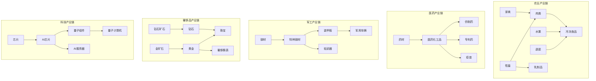

# Phase 5: 内容扩展计划

## 📊 扩展概览

| 产业链 | 新增商品 | 新增建筑 | 新增配方 |
|-------|---------|---------|---------|
| 农业产业链 | 12种 | 4种 | 8个 |
| 医药产业链 | 10种 | 3种 | 6个 |
| 军工产业链 | 8种 | 3种 | 5个 |
| 奢侈品产业链 | 8种 | 2种 | 4个 |
| 科技产业链 | 8种 | 3种 | 5个 |
| **合计** | **46种** | **15种** | **28个** |

---

## 1. 农业产业链扩展

### 1.1 新增商品 (ID: 58-69)

| ID | Key | 名称 | 类别 | 基准价格 | 说明 |
|----|-----|-----|------|---------|------|
| 58 | vegetables | 蔬菜 | raw | ¥8 | 新鲜蔬菜 |
| 59 | fruits | 水果 | raw | ¥12 | 新鲜水果 |
| 60 | livestock | 牲畜 | raw | ¥500 | 活体牲畜 |
| 61 | poultry | 家禽 | raw | ¥30 | 鸡鸭等家禽 |
| 62 | fish | 水产 | raw | ¥25 | 鱼虾等水产 |
| 63 | meat | 肉类 | basic | ¥40 | 加工肉类 |
| 64 | dairy | 乳制品 | basic | ¥20 | 牛奶奶酪等 |
| 65 | frozen-food | 冷冻食品 | intermediate | ¥50 | 速冻食品 |
| 66 | canned-food | 罐头食品 | intermediate | ¥35 | 罐头制品 |
| 67 | snacks | 零食 | final | ¥15 | 休闲食品 |
| 68 | organic-food | 有机食品 | final | ¥80 | 高端有机产品 |
| 69 | pet-food | 宠物食品 | final | ¥45 | 宠物饲料 |

### 1.2 新增建筑 (ID: 25-28)

| ID | Key | 名称 | 类别 | 建造成本 | 配方 |
|----|-----|-----|------|---------|------|
| 25 | vegetable-farm | 蔬菜农场 | extraction | ¥250,000 | 蔬菜种植 |
| 26 | livestock-farm | 畜牧场 | extraction | ¥600,000 | 牲畜养殖、家禽养殖 |
| 27 | fishery | 渔场 | extraction | ¥400,000 | 水产养殖 |
| 28 | meat-processing | 肉类加工厂 | processing | ¥800,000 | 肉类加工、乳制品生产 |

### 1.3 新增配方 (ID: 35-42)

| ID | 名称 | 建筑 | 输入 | 输出 |
|----|-----|-----|------|------|
| 35 | 蔬菜种植 | 蔬菜农场 | - | 蔬菜×150 |
| 36 | 水果种植 | 蔬菜农场 | - | 水果×100 |
| 37 | 牲畜养殖 | 畜牧场 | 粮食×200 | 牲畜×10 |
| 38 | 家禽养殖 | 畜牧场 | 粮食×50 | 家禽×100 |
| 39 | 水产养殖 | 渔场 | - | 水产×80 |
| 40 | 肉类加工 | 肉类加工厂 | 牲畜×5 + 家禽×30 | 肉类×100 |
| 41 | 乳制品生产 | 肉类加工厂 | 牲畜×2 | 乳制品×150 |
| 42 | 冷冻食品生产 | 食品厂 | 肉类×30 + 蔬菜×50 | 冷冻食品×60 |

---

## 2. 医药产业链

### 2.1 新增商品 (ID: 70-79)

| ID | Key | 名称 | 类别 | 基准价格 | 说明 |
|----|-----|-----|------|---------|------|
| 70 | herbs | 药材 | raw | ¥100 | 中草药原料 |
| 71 | medical-chemicals | 医药化工品 | basic | ¥300 | 医药中间体 |
| 72 | antibiotics | 抗生素 | intermediate | ¥800 | 抗生素原料药 |
| 73 | vaccines | 疫苗 | intermediate | ¥2000 | 疫苗制品 |
| 74 | generic-drugs | 仿制药 | final | ¥50 | 普通仿制药 |
| 75 | patent-drugs | 专利药 | final | ¥500 | 专利处方药 |
| 76 | otc-drugs | 非处方药 | final | ¥30 | OTC药品 |
| 77 | medical-consumables | 医用耗材 | intermediate | ¥100 | 口罩注射器等 |
| 78 | diagnostic-equipment | 诊断设备 | final | ¥8000 | 医疗诊断仪器 |
| 79 | surgical-equipment | 手术设备 | final | ¥50000 | 高端手术设备 |

### 2.2 新增建筑 (ID: 29-31)

| ID | Key | 名称 | 类别 | 建造成本 | 配方 |
|----|-----|-----|------|---------|------|
| 29 | herb-farm | 药材种植园 | extraction | ¥400,000 | 药材种植 |
| 30 | pharma-factory | 制药厂 | manufacturing | ¥8,000,000 | 多种药品生产 |
| 31 | medical-device-factory | 医疗器械厂 | manufacturing | ¥12,000,000 | 医疗设备生产 |

### 2.3 新增配方 (ID: 43-48)

| ID | 名称 | 建筑 | 输入 | 输出 |
|----|-----|-----|------|------|
| 43 | 药材种植 | 药材种植园 | - | 药材×60 |
| 44 | 仿制药生产 | 制药厂 | 医药化工品×20 | 仿制药×100 |
| 45 | 专利药生产 | 制药厂 | 医药化工品×40 + 化学品×20 | 专利药×20 |
| 46 | 疫苗生产 | 制药厂 | 医药化工品×50 + 化学品×30 | 疫苗×10 |
| 47 | 医用耗材生产 | 医疗器械厂 | 塑料×30 + 纺织品×20 | 医用耗材×100 |
| 48 | 诊断设备生产 | 医疗器械厂 | 电子元件×30 + 芯片×5 | 诊断设备×2 |

---

## 3. 军工产业链

### 3.1 新增商品 (ID: 80-87)

| ID | Key | 名称 | 类别 | 基准价格 | 说明 |
|----|-----|-----|------|---------|------|
| 80 | special-steel | 特种钢材 | basic | ¥500 | 军工级钢材 |
| 81 | explosives | 炸药 | intermediate | ¥800 | 工业/军用炸药 |
| 82 | armor-plate | 装甲板 | intermediate | ¥2000 | 防护装甲 |
| 83 | military-electronics | 军用电子 | intermediate | ¥3000 | 军用级电子系统 |
| 84 | small-arms | 轻武器 | final | ¥1500 | 步枪手枪等 |
| 85 | heavy-weapons | 重武器 | final | ¥50000 | 火炮导弹等 |
| 86 | military-vehicle | 军用车辆 | final | ¥200000 | 装甲车坦克 |
| 87 | fighter-jet | 战斗机 | final | ¥5000000 | 战斗机 |

### 3.2 新增建筑 (ID: 32-34)

| ID | Key | 名称 | 类别 | 建造成本 | 配方 |
|----|-----|-----|------|---------|------|
| 32 | special-steel-mill | 特钢厂 | processing | ¥5,000,000 | 特种钢生产 |
| 33 | arms-factory | 武器工厂 | manufacturing | ¥20,000,000 | 武器生产 |
| 34 | aerospace-factory | 航空航天厂 | manufacturing | ¥100,000,000 | 航空器生产 |

### 3.3 新增配方 (ID: 49-53)

| ID | 名称 | 建筑 | 输入 | 输出 |
|----|-----|-----|------|------|
| 49 | 特种钢生产 | 特钢厂 | 钢材×100 + 稀土×10 | 特种钢材×50 |
| 50 | 装甲板生产 | 特钢厂 | 特种钢材×50 | 装甲板×20 |
| 51 | 轻武器生产 | 武器工厂 | 特种钢材×20 + 塑料×10 | 轻武器×30 |
| 52 | 军用车辆生产 | 武器工厂 | 装甲板×30 + 军用电子×10 + 电机×5 | 军用车辆×1 |
| 53 | 战斗机生产 | 航空航天厂 | 航空部件×50 + 军用电子×30 + 特种钢材×100 | 战斗机×1 |

---

## 4. 奢侈品产业链

### 4.1 新增商品 (ID: 88-95)

| ID | Key | 名称 | 类别 | 基准价格 | 说明 |
|----|-----|-----|------|---------|------|
| 88 | gold-ore | 金矿石 | raw | ¥5000 | 含金矿石 |
| 89 | diamond-ore | 钻石矿石 | raw | ¥10000 | 原钻矿石 |
| 90 | gold | 黄金 | basic | ¥60000 | 精炼黄金 |
| 91 | diamond | 钻石 | basic | ¥100000 | 切割钻石 |
| 92 | silk | 丝绸 | basic | ¥200 | 高档丝绸 |
| 93 | designer-clothing | 设计师服装 | final | ¥2000 | 品牌服装 |
| 94 | luxury-watch | 奢侈腕表 | final | ¥50000 | 高端手表 |
| 95 | luxury-car | 豪华汽车 | final | ¥500000 | 豪华轿车 |

### 4.2 新增建筑 (ID: 35-36)

| ID | Key | 名称 | 类别 | 建造成本 | 配方 |
|----|-----|-----|------|---------|------|
| 35 | gold-mine | 金矿 | extraction | ¥10,000,000 | 金矿开采 |
| 36 | luxury-factory | 奢侈品工坊 | manufacturing | ¥15,000,000 | 奢侈品制造 |

### 4.3 新增配方 (ID: 54-57)

| ID | 名称 | 建筑 | 输入 | 输出 |
|----|-----|-----|------|------|
| 54 | 金矿开采 | 金矿 | - | 金矿石×5 |
| 55 | 黄金精炼 | 金矿 | 金矿石×10 | 黄金×8 |
| 56 | 珠宝制作 | 奢侈品工坊 | 黄金×5 + 钻石×2 | 珠宝×3 |
| 57 | 奢侈腕表生产 | 奢侈品工坊 | 黄金×2 + 电子元件×5 + 玻璃×3 | 奢侈腕表×2 |

---

## 5. 科技产业链

### 5.1 新增商品 (ID: 96-103)

| ID | Key | 名称 | 类别 | 基准价格 | 说明 |
|----|-----|-----|------|---------|------|
| 96 | ai-chip | AI芯片 | intermediate | ¥5000 | 人工智能芯片 |
| 97 | quantum-component | 量子组件 | intermediate | ¥50000 | 量子计算组件 |
| 98 | biotech-material | 生物材料 | intermediate | ¥3000 | 生物科技材料 |
| 99 | ai-server | AI服务器 | final | ¥100000 | AI计算服务器 |
| 100 | quantum-computer | 量子计算机 | final | ¥10000000 | 量子计算机 |
| 101 | biotech-product | 生物制品 | final | ¥8000 | 生物科技产品 |
| 102 | smart-robot | 智能机器人 | final | ¥80000 | 服务机器人 |
| 103 | vr-device | VR设备 | final | ¥3000 | 虚拟现实设备 |

### 5.2 新增建筑 (ID: 37-39)

| ID | Key | 名称 | 类别 | 建造成本 | 配方 |
|----|-----|-----|------|---------|------|
| 37 | ai-chip-fab | AI芯片厂 | manufacturing | ¥50,000,000 | AI芯片生产 |
| 38 | quantum-lab | 量子实验室 | manufacturing | ¥200,000,000 | 量子组件生产 |
| 39 | biotech-lab | 生物实验室 | manufacturing | ¥30,000,000 | 生物制品生产 |

### 5.3 新增配方 (ID: 58-62)

| ID | 名称 | 建筑 | 输入 | 输出 |
|----|-----|-----|------|------|
| 58 | AI芯片生产 | AI芯片厂 | 芯片×10 + 稀土×5 | AI芯片×5 |
| 59 | 量子组件生产 | 量子实验室 | AI芯片×10 + 稀土×20 | 量子组件×1 |
| 60 | AI服务器组装 | AI芯片厂 | AI芯片×20 + 电子元件×50 | AI服务器×2 |
| 61 | 量子计算机组装 | 量子实验室 | 量子组件×50 + AI芯片×30 | 量子计算机×1 |
| 62 | VR设备生产 | 电子厂 | 屏幕×4 + 芯片×3 + 塑料×10 | VR设备×5 |

---

## 6. 产业链关系图

---

## 7. 商品替代关系扩展

### 7.1 农业品替代
- 肉类 ↔ 水产（蛋白质替代）
- 有机食品 ↔ 普通食品（品质替代）
- 乳制品 ↔ 植物奶（未来可添加）

### 7.2 医药品替代
- 仿制药 ↔ 专利药（价格/效果替代）
- 中药 ↔ 西药（治疗方式替代）

### 7.3 能源替代
- 电动汽车 ↔ 燃油汽车 ↔ 豪华汽车
- 煤炭发电 ↔ 天然气发电 ↔ 光伏发电

### 7.4 消费品替代
- 智能手机 ↔ 高端手机 ↔ 平价手机
- 设计师服装 ↔ 普通服装
- 奢侈腕表 ↔ 普通手表（需添加）

---

## 8. 实施顺序

1. **首先**: 更新 `src/core/constants.ts` 调整常量
2. **其次**: 更新 `src/data/goods.ts` 添加新商品
3. **然后**: 更新 `src/data/buildings.ts` 添加新建筑
4. **接着**: 更新 `src/data/recipes.ts` 添加新配方
5. **最后**: 更新 `src/core/economy/SubstitutionSystem.ts` 扩展替代关系

---

## 9. 扩展后总计

| 类型 | 原数量 | 新增 | 扩展后 |
|-----|-------|-----|--------|
| 商品 | 58 | 46 | **104种** |
| 建筑 | 25 | 15 | **40种** |
| 配方 | 35 | 28 | **63个** |