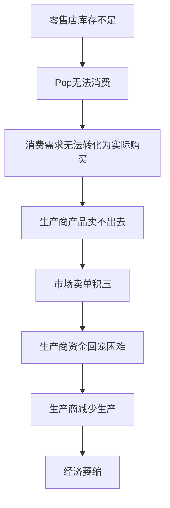

# 零售系统问题诊断与修复方案

## 问题描述
用户反馈："零售业没人干，导致最终产品也没人要"

## 问题分析

### 1. 核心问题：消费需求与库存容量严重失衡

通过代码分析，发现以下关键数据不匹配：

#### 消费需求计算（RetailSystem.ts - calculateTierDemands）
```
baseDemand = 1000 ~ 30000（取决于商品和人口层级）
tierShare = 0.1 ~ 0.2（每层级人口占比）
tickDemand = baseDemand × tierShare × 0.1 = 10 ~ 600 单位/tick
```

#### 零售店库存容量（buildings.ts）
| 零售店类型 | 每种商品容量 | 初始库存(80%) |
|-----------|-------------|--------------|
| 便利店 | 100 | 80 |
| 超市 | 500 | 400 |
| 大卖场 | 2000 | 1600 |
| 电子商城 | 50 | 40 |
| 汽车4S店 | 10 | 8 |

**问题**：便利店每种商品只有100单位容量，但单个消费层级每tick就可能需要数十到数百单位。8个消费层级加起来，第一个tick就能耗尽所有库存！

### 2. 进货机制无法跟上消费速度

进货触发条件（constants.ts）：
- `RETAIL_RESTOCK_THRESHOLD = 0.3`（库存低于30%才进货）
- `RETAIL_TARGET_STOCK_LEVEL = 0.8`（进货到80%）

这意味着：
1. 便利店库存从80→0需要瞬间
2. 触发进货，补充到80单位
3. 下一tick又被消耗光
4. 形成"永久缺货"的恶性循环

### 3. 直供机制的隐患

`purchaseFromWholesale`函数中的直供机制：
```typescript
const directPrice = basePrice * 1.15;  // 直供价格比基准价高15%
```

零售店以基准价115%进货，但加价率只有15%-30%：
```typescript
// 便利店
markupRange: [0.15, 0.30],
```

如果零售价只有基准价的115%-130%，而进货价是115%，利润空间极小甚至亏损！

### 4. 产业链断裂的连锁反应



## 解决方案

### 方案1：增加零售店库存容量（推荐）

修改 `src/data/buildings.ts`：

```typescript
// 便利店
retailConfig: {
  inventoryCapacity: 1000,  // 从100增加到1000
  customerCapacity: 2000,   // 客流也相应增加
}

// 超市
retailConfig: {
  inventoryCapacity: 5000,  // 从500增加到5000
}

// 大卖场
retailConfig: {
  inventoryCapacity: 20000, // 从2000增加到20000
}
```

### 方案2：降低消费速度

修改 `src/core/constants.ts`：

```typescript
// 原值：0.1（每tick消费10%需求）
// 建议值：0.01（每tick消费1%需求）
export const RETAIL_MAX_CUSTOMER_RATE = 0.01;
```

### 方案3：优化进货机制

修改 `src/core/constants.ts`：

```typescript
// 提高进货触发阈值
export const RETAIL_RESTOCK_THRESHOLD = 0.5;  // 从0.3提高到0.5

// 提高目标库存水平
export const RETAIL_TARGET_STOCK_LEVEL = 1.0; // 从0.8提高到1.0（满仓）
```

### 方案4：调整直供价格以保证利润

修改 `src/core/economy/RetailSystem.ts` 的 `purchaseFromWholesale`：

```typescript
// 原值：basePrice * 1.15
// 建议值：basePrice * 0.9（给零售商留出利润空间）
const directPrice = basePrice * 0.9;
```

### 方案5：确保初始库存充足

修改 `src/core/economy/RetailSystem.ts` 的 `registerRetailStore`：

```typescript
// 原值：容量的80%
// 建议值：容量的100%
const initialStock = retail.inventoryCapacities[idx] * 1.0;
```

## 推荐实施顺序

1. **紧急修复**：
   - 降低 `RETAIL_MAX_CUSTOMER_RATE` 到 0.02
   - 增加零售店库存容量 5-10倍
   
2. **利润保障**：
   - 将直供价格从 115% 降到 90%
   - 或者提高零售加价率上限

3. **长期优化**：
   - 调整进货阈值和目标库存
   - 可能需要重新平衡整个经济系统的数值

## 代码修改清单

### 文件1：src/core/constants.ts
```typescript
// 修改这一行
export const RETAIL_MAX_CUSTOMER_RATE = 0.02;  // 从0.1改为0.02
```

### 文件2：src/data/buildings.ts
需要修改所有10种零售建筑的 `retailConfig.inventoryCapacity`

### 文件3：src/core/economy/RetailSystem.ts
```typescript
// 在 purchaseFromWholesale 函数中
const directPrice = basePrice * 0.9;  // 从1.15改为0.9
```

## 验证方法

修改后，观察以下指标：
1. 零售店库存是否稳定在30%以上
2. Pop消费是否正常发生
3. 生产商产品是否能卖出
4. 零售商是否有正利润

添加调试日志：
```typescript
if (world.tick % 100 === 0) {
  console.log(`[零售诊断 T${world.tick}] 
    总库存: ${totalStock}, 
    满足需求比例: ${satisfiedDemand/totalDemand*100}%, 
    进货次数: ${restockCount}`);
}