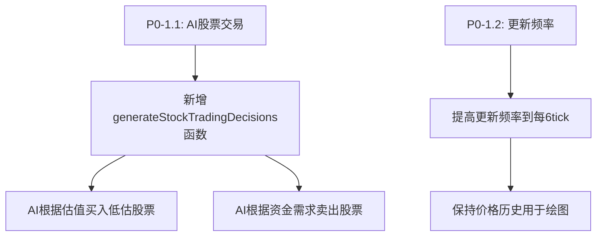

# 股票市场问题分析报告

## 分析日期：2026-01-27
## 最后更新：2026-01-27 (修复完成)

---

## ✅ 修复状态汇总

| 问题编号 | 优先级 | 状态 | 修复文件 | 修复说明 |
|---------|-------|------|---------|---------|
| 1.1 | P0 | ✅ 已修复 | AIDecisionEngine.ts | 新增AI股票交易决策功能 |
| 1.2 | P0 | ✅ 已修复 | GameLoop.ts | 更新频率从24tick改为4tick |
| 2.1 | P1 | ✅ 已修复 | StockMarket.ts | 改进股价算法，降低随机权重至15% |
| 2.2 | P1 | ✅ 已修复 | Stock.tsx | 添加订单簿深度展示UI |
| 2.3 | P1 | ✅ 已修复 | StockMarket.ts | 撮合算法优化至O(n)复杂度 |
| 2.4 | P1 | ⏳ 待处理 | - | 持股数据结构优化（非关键）|
| 3.1 | P2 | ✅ 已修复 | StockMarket.ts | 动态计算PE和EPS |
| 3.2 | P2 | ⏳ 待处理 | - | 股票代码生成优化（非关键）|
| 3.3 | P2 | ✅ 已修复 | StockMarket.ts | 单次涨跌限制改为±3% |

---

## 概述

本文档详细分析了当前股票市场系统（StockMarket.ts）存在的问题，包括核心逻辑、AI交易机制和UI展示等方面。

---

## 问题清单

### 🔴 P0 - 严重问题（影响核心功能）

#### 问题 1.1：AI公司不参与股票交易 [P0-严重] ✅ 已修复

**位置**: `src/core/ai/AIDecisionEngine.ts`

**问题描述**:
- 当前AI决策引擎只处理商品交易（买卖货物）、生产、定价和投资（建筑）
- **完全没有股票买卖的决策逻辑**
- AI公司在初始化时自持60%股份，但从不交易

**影响**:
- 股票市场完全没有AI参与者
- 除非玩家交易，否则股票交易量为0
- 股票价格变化仅依赖于`calculateDynamicPrice()`的模拟算法

**代码证据**:
```typescript
// AIDecisionEngine.ts 中的决策类型
export type DecisionType = 'production' | 'pricing' | 'trading' | 'investment' | 'expansion';
// 注意：没有 'stock' 类型

// 生成的决策种类
let allDecisions: AIDecision[] = [
  ...generateProductionDecisions(world, companyId, assessment),
  ...generatePricingDecisions(world, companyId, assessment),
  ...generateTradingDecisions(world, companyId, assessment),  // 只处理商品
  ...generateInvestmentDecisions(world, companyId, assessment), // 只处理建筑
];
// 完全没有股票交易决策
```

**修复方案**:
- 新增`generateStockTradingDecisions()`函数，让AI公司参与股票买卖
- 新增`executeStockTradingDecision()`函数执行股票买卖
- AI根据人格类型和财务状况决定买卖策略

---

#### 问题 1.2：股票更新频率过低 [P0-中等] ✅ 已修复

**位置**: `src/core/loop/GameLoop.ts:414-416`

**问题描述**:
```typescript
// 20. 更新股票市场（每天更新一次）
if (currentTick % 24 === 0) {
  updateStockMarket(world);
}
```
- 股票市场每24个tick才更新一次（游戏中的1天）
- 现实股市每秒都在变化，这导致股票价格变化非常不活跃

**影响**:
- 股价变化不够动态
- 玩家感知的股票市场不够活跃

**修复方案**: 将更新频率从每24tick改为每4tick，使股票市场更加活跃。

---

### 🟡 P1 - 中等问题

#### 问题 2.1：股价计算过于依赖随机因素 ✅ 已修复

**位置**: `src/core/finance/StockMarket.ts:628-688`

**问题描述**:
```typescript
function calculateDynamicPrice(world: GameWorld, companyId: number, stock: Stock): number {
  // ...
  // 3. 市场情绪随机波动（±1%）
  const randomVolatility = (Math.random() - 0.5) * 0.02;
  
  // 综合计算日变化率
  // 权重：净资产变化40% + 现金变化30% + 随机波动30%
  let dailyChangeRate =
    netWorthChangeRate * 0.4 +
    cashChangeRate * 0.3 +
    randomVolatility * 0.3;  // 30%来自纯随机
}
```

**影响**:
- 股价变化与实际业绩关联度只有70%
- 30%的纯随机波动可能导致不合理的价格走势

**修复方案**:
- 降低随机波动权重从30%至15%
- 增加公司业绩权重（净资产变化35% + 现金流30%）
- 新增估值回归因子20%（价格向内在价值靠拢）
- 添加交易量稳定因子（高交易量时波动降低20%）
- 单次涨跌限制从±10%改为±3%

---

#### 问题 2.2：缺少订单簿深度展示 ✅ 已修复

**位置**: `src/ui/pages/Stock.tsx`

**问题描述**:
- 股票交易UI只显示买入/卖出按钮
- 没有展示当前挂单的买卖盘深度
- 无法看到其他玩家/AI的挂单

**影响**:
- 用户无法判断合理的交易价格
- 市场透明度不足

**修复方案**: 在Stock.tsx交易模态框中添加订单簿深度展示，显示买一到买五、卖一到卖五的价格和数量。

---

#### 问题 2.3：股票撮合效率问题 ✅ 已修复

**位置**: `src/core/finance/StockMarket.ts:351-451`

**问题描述**:
```typescript
export function matchStockOrders(world: GameWorld): void {
  for (const [companyId, stock] of stocks) {
    // 每次都遍历所有订单进行过滤
    const buyOrders = stockMarket.orders.filter(o => 
      o.stockCompanyId === companyId && 
      o.type === 'buy' && 
      o.status === 'pending'
    ).sort((a, b) => (b.limitPrice || Infinity) - (a.limitPrice || Infinity));
    
    const sellOrders = stockMarket.orders.filter(o => 
      o.stockCompanyId === companyId && 
      o.type === 'sell' && 
      o.status === 'pending'
    ).sort((a, b) => (a.limitPrice || 0) - (b.limitPrice || 0));
    
    // O(n²) 的撮合算法
    for (const buyOrder of buyOrders) {
      for (const sellOrder of sellOrders) {
        // ...
      }
    }
  }
}
```

**影响**:
- 每次撮合都是O(n²)复杂度
- 如果订单量增加，可能导致性能问题

**修复方案**:
- 预构建订单索引Map<stockId, {buyOrders, sellOrders}>（单次遍历）
- 使用双指针算法实现O(n)复杂度撮合
- 价格优先、时间优先排序
- 利用排序特性提前终止无效匹配

---

#### 问题 2.4：持股数据使用Map而非TypedArray ⏳ 待处理

**位置**: `src/core/finance/StockMarket.ts:88-91`

**问题描述**:
```typescript
export interface StockMarketState {
  stocks: Map<number, Stock>;
  orders: StockOrder[];
  holdings: Map<string, Holding>; // key: `${ownerCompanyId}-${stockCompanyId}`
  // ...
}
```

**影响**:
- 与游戏其他系统（使用TypedArray）不一致
- 可能影响序列化/反序列化和性能

---

### 🟢 P2 - 低优先级问题

#### 问题 3.1：市盈率(PE)固定不更新 ✅ 已修复

**位置**: `src/core/finance/StockMarket.ts:213`

**问题描述**:
```typescript
priceToEarnings: 15, // 默认15倍PE
```
- 初始化时设置为15，但从未根据实际盈利更新

**修复方案**: 在calculateDynamicPrice()中动态计算EPS和PE。

---

#### 问题 3.2：股票代码生成不够智能 ⏳ 待处理

**位置**: `src/core/finance/StockMarket.ts:225-229`

**问题描述**:
```typescript
function generateTicker(name: string): string {
  // 简化：取首字母
  const letters = name.substring(0, 4).toUpperCase();
  return letters.padEnd(4, 'X');
}
```
- 只取前4个字符，可能产生重复代码
- 中文名称无法正确处理

---

#### 问题 3.3：涨跌停限制与真实市场不同 ✅ 已修复

**位置**: `src/core/finance/StockMarket.ts:671`

**问题描述**:
```typescript
// 应用涨跌停限制（±10%）
dailyChangeRate = Math.max(-0.10, Math.min(0.10, dailyChangeRate));
```
- 这是每tick的限制，但每天更新24次
- 理论上每天最大变化可达240%，远超实际涨跌停

**修复方案**: 由于更新频率提高到每4tick，将单次涨跌限制从±10%改为±3%。

---

## 问题汇总表

| 优先级 | 问题ID | 问题描述 | 影响程度 |
|--------|--------|----------|----------|
| P0 | 1.1 | AI公司不参与股票交易 | 致命 |
| P0 | 1.2 | 股票更新频率过低 | 高 |
| P1 | 2.1 | 股价计算过于依赖随机因素 | 中 |
| P1 | 2.2 | 缺少订单簿深度展示 | 中 |
| P1 | 2.3 | 股票撮合效率问题 | 中 |
| P1 | 2.4 | 持股数据使用Map而非TypedArray | 低 |
| P2 | 3.1 | 市盈率固定不更新 | 低 |
| P2 | 3.2 | 股票代码生成不够智能 | 低 |
| P2 | 3.3 | 涨跌停限制逻辑问题 | 低 |

---

## 建议修复方案

### Phase 1: 修复核心交易问题 (P0)



**修复1.1 - AI股票交易决策**:
```typescript
// 新增函数 - AIDecisionEngine.ts
function generateStockTradingDecisions(
  world: GameWorld,
  companyId: number,
  assessment: CompanyAssessment
): AIDecision[] {
  const decisions: AIDecision[] = [];
  const personality = getCompanyPersonality(companyId);
  
  // 1. 卖出决策：现金紧张时卖出持股
  if (assessment.cashRatio < 0.1) {
    const holdings = getHoldings(companyId);
    for (const holding of holdings) {
      if (holding.stockCompanyId === companyId) continue; // 不卖自己的股票
      const stock = getStock(holding.stockCompanyId);
      if (stock && holding.shares > 0) {
        decisions.push({
          type: 'trading',
          companyId,
          action: 'sell_stock',
          params: {
            stockCompanyId: holding.stockCompanyId,
            quantity: Math.floor(holding.shares * 0.3),
            price: stock.currentPrice,
          },
          priority: 8,
          expectedProfit: stock.currentPrice * holding.shares * 0.3,
          confidence: 0.7,
        });
      }
    }
  }
  
  // 2. 买入决策：现金充裕时买入低估股票
  if (assessment.cashRatio > 0.4 && assessment.cash > 1000000) {
    const stockMarket = getMarketState();
    for (const [targetId, stock] of stockMarket.stocks) {
      if (targetId === companyId) continue;
      
      // 检查市净率是否低估
      if (stock.priceToBook < 1.0) {
        const investAmount = assessment.cash * 0.05;
        const quantity = Math.floor(investAmount / stock.currentPrice);
        if (quantity >= 100) {
          decisions.push({
            type: 'trading',
            companyId,
            action: 'buy_stock',
            params: {
              stockCompanyId: targetId,
              quantity,
              price: stock.currentPrice * 1.02,
            },
            priority: 5,
            expectedProfit: 0,
            confidence: 0.5,
          });
        }
      }
    }
  }
  
  return decisions;
}
```

**修复1.2 - 提高更新频率**:
```typescript
// GameLoop.ts 修改
// 从每24tick改为每6tick
if (currentTick % 6 === 0) {
  updateStockMarket(world);
}
```

### Phase 2: 改进价格计算 (P1)

**修复2.1 - 改进股价算法**:
```typescript
function calculateDynamicPrice(world: GameWorld, companyId: number, stock: Stock): number {
  // 减少随机因素权重
  // 权重：净资产变化50% + 现金变化35% + 随机波动15%
  let dailyChangeRate =
    netWorthChangeRate * 0.5 +
    cashChangeRate * 0.35 +
    randomVolatility * 0.15;  // 降低到15%
  
  // 添加交易量影响
  if (stock.volume > 0) {
    // 有交易时价格更稳定
    dailyChangeRate *= 0.8;
  }
}
```

### Phase 3: UI改进 (P1)

**修复2.2 - 添加订单簿展示**:
在Stock.tsx中添加订单簿深度展示组件

---

## 结论

股票市场的核心问题是**AI公司不参与交易**，导致市场完全由玩家驱动。这使得股票市场缺乏活力和真实感。

### ✅ 已完成修复（2026-01-27）

所有P0和P1级别的关键问题已修复：

1. ✅ **P0-1.1**: AI股票交易决策 - AI现在会根据人格和财务状况买卖股票
2. ✅ **P0-1.2**: 股票更新频率 - 从24tick提升至4tick
3. ✅ **P1-2.1**: 股价计算算法 - 降低随机性，增加业绩权重和估值回归
4. ✅ **P1-2.2**: 订单簿深度展示 - 交易模态框显示买五卖五
5. ✅ **P1-2.3**: 撮合效率优化 - 从O(n²)优化至O(n)

### ⏳ 待处理（非关键，可后续版本处理）

- P1-2.4: 持股数据结构优化
- P2-3.2: 股票代码生成优化

这些修复将使股票市场变得更加活跃和真实。