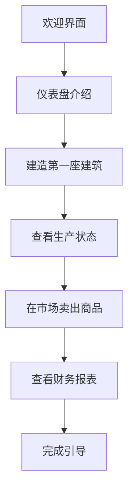

# 《供应链指挥官》后续开发计划

> **版本**: 3.0  
> **更新日期**: 2026-01-29  
> **当前状态**: 阶段3金融系统UI开发中

---

## 一、项目当前状态总览

### 已完成功能清单

| 阶段 | 任务 | 状态 | 说明 |
|------|------|------|------|
| 阶段1 | 核心问题修复 (任务1-6) | ✅ 完成 | 修复市场基础问题 |
| 阶段1 | AI批发直销机制 (任务7) | ✅ 完成 | AI可向零售商直销 |
| 阶段1 | 消费速率调整 (任务8) | ✅ 完成 | 优化消费参数 |
| 阶段1 | 冷门商品检测 (任务9) | ✅ 完成 | 检测和补充机制 |
| 阶段1 | 需求数据平滑 (任务10) | ✅ 完成 | 移动平均算法 |
| 阶段2 | SubstitutionSystem集成 (任务11) | ✅ 完成 | 商品替代机制 |
| 阶段2 | QualitySystem激活 (任务12) | ✅ 完成 | 质量等级系统 |
| 阶段2 | 建筑升级UI (任务13) | ✅ 完成 | BuildingUpgradePanel |
| 阶段2 | 科技树框架 (任务14) | ✅ 完成 | TechnologySystem + TechTreePanel |
| 阶段2 | 合约订单UI (任务15) | ✅ 完成 | ContractListPanel |

### 核心系统实现状态

```
核心逻辑层 (src/core/)
├── finance/
│   ├── StockMarket.ts       ✅ 完整 (1151行) - 股票交易、IPO、估值
│   ├── BankingSystem.ts     ✅ 完整 (686行) - 贷款、信用评级
│   ├── AcquisitionSystem.ts ✅ 完整 (574行) - 并购收购
│   └── OwnershipControl.ts  ✅ 存在 - 控股管理
├── economy/
│   ├── SubstitutionSystem.ts ✅ 激活
│   ├── QualitySystem.ts      ✅ 激活
│   ├── SupplyContracts.ts    ✅ 完整
│   └── ConsumerMarket.ts     ✅ 完整
├── research/
│   └── TechnologySystem.ts   ✅ 新增 - 24项科技
└── construction/
    └── ConstructionManager.ts ✅ 完整

UI组件层 (src/ui/components/)
├── Company/
│   ├── TradePanel.tsx        ✅ 存在 - 股票交易
│   └── ShareholderChart.tsx  ✅ 存在 - 持股图表
├── Research/
│   └── TechTreePanel.tsx     ✅ 新增
├── Contracts/
│   └── ContractListPanel.tsx ✅ 新增
├── Production/
│   └── BuildingUpgradePanel.tsx ✅ 新增
└── Finance/ (缺失)
    ├── StockTradingPanel.tsx  ❌ 需创建
    ├── IPOPanel.tsx           ❌ 需创建
    ├── AcquisitionPanel.tsx   ❌ 需创建
    └── LoanPanel.tsx          ❌ 需创建
```

---

## 二、阶段3：金融系统UI（当前阶段）

### 任务16：股票交易界面

**优先级**: P0  
**预估复杂度**: 高

**目标**: 创建完整的股票交易界面，让玩家可以买卖AI公司股票

**界面设计**:
```
┌─────────────────────────────────────────────────────────────┐
│  股票市场                                    市场指数: 1,234 │
├─────────────────────────────────────────────────────────────┤
│  ┌──────────────────────┐  ┌────────────────────────────┐   │
│  │ 上市公司列表          │  │ 股票详情                    │   │
│  │ 🏭 铁拳重工  ¥12.50   │  │ 公司: 铁拳重工              │   │
│  │ 📈 +2.3%             │  │ 代码: TIQU                 │   │
│  │ 🏢 星辰科技  ¥45.80   │  │ 当前价: ¥12.50             │   │
│  │ 📉 -1.2%             │  │ 涨跌: +2.3%                │   │
│  │ ...                  │  │ 成交量: 15,000             │   │
│  └──────────────────────┘  │ 市值: ¥12,500,000          │   │
│                            │ P/E: 15.2                   │   │
│  ┌──────────────────────┐  │ 股息率: 2.1%               │   │
│  │ 我的持仓              │  └────────────────────────────┘   │
│  │ 铁拳重工: 5,000股     │                                  │
│  │ 成本: ¥10.20         │  ┌────────────────────────────┐   │
│  │ 盈亏: +¥11,500       │  │ 交易面板                    │   │
│  └──────────────────────┘  │ [买入] [卖出]               │   │
│                            │ 数量: [________] 股          │   │
│  ┌──────────────────────┐  │ 价格: [________] ¥          │   │
│  │ K线图/价格走势        │  │ 预估金额: ¥62,500          │   │
│  │ ▃▅▆▇▆▅▄▃▂▁▂▃▄▅▆▇    │  │ [提交订单]                  │   │
│  └──────────────────────┘  └────────────────────────────┘   │
└─────────────────────────────────────────────────────────────┘
```

**需要调用的后端API**:
- `getMarketState()` - 获取市场状态
- `getStock(companyId)` - 获取股票信息
- `getHoldings(companyId)` - 获取持仓
- `buyStock()` - 买入股票
- `sellStock()` - 卖出股票

**实现步骤**:
1. 创建 `src/ui/components/Finance/StockMarketPanel.tsx`
2. 实现股票列表组件
3. 实现K线图/价格走势图
4. 实现交易面板
5. 实现持仓显示
6. 集成到Finance页面

---

### 任务17：IPO发行UI

**优先级**: P0  
**预估复杂度**: 中

**目标**: 让玩家公司可以上市发行股票融资

**界面设计**:
```
┌─────────────────────────────────────────────────────────────┐
│  IPO申请                                                     │
├─────────────────────────────────────────────────────────────┤
│  公司估值分析                                                │
│  ┌────────────────────────────────────────────────────────┐ │
│  │ 账面价值: ¥5,000,000                                   │ │
│  │ 内在价值: ¥8,000,000                                   │ │
│  │ 建议发行价: ¥8.00 - ¥12.00 / 股                        │ │
│  └────────────────────────────────────────────────────────┘ │
│                                                              │
│  发行参数                                                    │
│  ┌────────────────────────────────────────────────────────┐ │
│  │ 发行股数: [________] 股 (建议: 300,000 - 500,000)       │ │
│  │ 发行价格: [________] ¥/股                               │ │
│  │ 流通比例: [40%] ▬▬▬▬▬▬▬▬○▬▬▬▬                          │ │
│  │ 预计募资: ¥4,000,000                                    │ │
│  │ 发行费用: ¥200,000 (5%)                                 │ │
│  └────────────────────────────────────────────────────────┘ │
│                                                              │
│  [取消]                               [确认发行]             │
└─────────────────────────────────────────────────────────────┘
```

**需要调用的后端API**:
- `calculateValuation()` - 计算公司估值
- `initiateIPO()` - 发起IPO

**实现步骤**:
1. 创建 `src/ui/components/Finance/IPOPanel.tsx`
2. 实现估值展示
3. 实现发行参数表单
4. 添加确认对话框
5. 集成到Finance页面

---

### 任务18：收购系统UI

**优先级**: P1  
**预估复杂度**: 高

**目标**: 让玩家可以收购其他公司或响应收购要约

**界面设计**:
```
┌─────────────────────────────────────────────────────────────┐
│  企业并购                                                    │
├─────────────────────────────────────────────────────────────┤
│  收购目标分析                                                │
│  ┌──────────────────────┐  ┌────────────────────────────┐   │
│  │ 可收购公司            │  │ 目标详情: 铁拳重工          │   │
│  │ 铁拳重工 ¥12.5M      │  │                            │   │
│  │ 星辰科技 ¥45.8M      │  │ 市场价值: ¥12,500,000      │   │
│  │ 绿叶能源 ¥8.2M       │  │ 账面价值: ¥10,000,000      │   │
│  │ ...                  │  │ 建议溢价: 20-30%           │   │
│  └──────────────────────┘  │ 风险等级: 中等              │   │
│                            │ 协同效应: ¥500,000/年       │   │
│  收购要约                   └────────────────────────────┘   │
│  ┌────────────────────────────────────────────────────────┐ │
│  │ 目标持股: [51%] ▬▬▬▬▬▬▬▬○▬▬▬▬ (控股权51%)               │ │
│  │ 出价: [15.00] ¥/股 (溢价 20%)                          │ │
│  │ 支付方式: [●现金] [○换股] [○混合]                       │ │
│  │ 总成本: ¥7,650,000                                      │ │
│  └────────────────────────────────────────────────────────┘ │
│                                                              │
│  收到的要约                                                  │
│  ┌────────────────────────────────────────────────────────┐ │
│  │ 暂无收购要约                                            │ │
│  └────────────────────────────────────────────────────────┘ │
│                                                              │
│  [取消]                              [发起收购]              │
└─────────────────────────────────────────────────────────────┘
```

**需要调用的后端API**:
- `evaluateCompanyValue()` - 评估公司价值
- `analyzeAcquisitionFeasibility()` - 分析可行性
- `initiateAcquisition()` - 发起收购
- `respondToOffer()` - 响应要约
- `getOffersForCompany()` - 获取收到的要约

**实现步骤**:
1. 创建 `src/ui/components/Finance/AcquisitionPanel.tsx`
2. 实现目标公司列表
3. 实现估值分析展示
4. 实现收购参数表单
5. 实现收到的要约列表
6. 集成到Finance页面

---

### 任务19：贷款系统UI

**优先级**: P1  
**预估复杂度**: 中

**目标**: 让玩家可以申请贷款融资和管理债务

**界面设计**:
```
┌─────────────────────────────────────────────────────────────┐
│  银行贷款                                                    │
├─────────────────────────────────────────────────────────────┤
│  信用状况                                                    │
│  ┌────────────────────────────────────────────────────────┐ │
│  │ 信用评级: AA     信用分数: 720                         │ │
│  │ 可用额度: ¥3,000,000    已用额度: ¥500,000             │ │
│  │ 债务比率: 0.25          利息覆盖: 8.5                   │ │
│  └────────────────────────────────────────────────────────┘ │
│                                                              │
│  贷款方案                                                    │
│  ┌─────────────┬───────────┬──────────┬──────────────────┐ │
│  │ 类型        │ 最高额度   │ 年利率   │ 期限              │ │
│  ├─────────────┼───────────┼──────────┼──────────────────┤ │
│  │ 短期贷款    │ ¥500,000  │ 5.5%     │ 90天             │ │
│  │ 中期贷款    │ ¥1,500,000│ 6.5%     │ 1年              │ │
│  │ 长期贷款    │ ¥3,000,000│ 7.5%     │ 3年              │ │
│  │ 循环信用    │ ¥800,000  │ 6.0%     │ 随借随还          │ │
│  └─────────────┴───────────┴──────────┴──────────────────┘ │
│                                                              │
│  申请贷款                                                    │
│  ┌────────────────────────────────────────────────────────┐ │
│  │ 贷款类型: [中期贷款 ▾]                                  │ │
│  │ 贷款金额: [________] ¥                                  │ │
│  │ 抵押类型: [●无抵押] [○库存] [○建筑]                     │ │
│  │ 月供预估: ¥85,000                                       │ │
│  │ 总还款额: ¥1,020,000                                    │ │
│  └────────────────────────────────────────────────────────┘ │
│                                                              │
│  现有贷款                                                    │
│  ┌─────────────┬───────────┬──────────┬──────────────────┐ │
│  │ 贷款ID      │ 剩余本金   │ 月供     │ 到期日           │ │
│  ├─────────────┼───────────┼──────────┼──────────────────┤ │
│  │ #1 短期     │ ¥300,000  │ ¥102,000 │ 30天后           │ │
│  └─────────────┴───────────┴──────────┴──────────────────┘ │
│                                                              │
│  [取消]                              [申请贷款]              │
└─────────────────────────────────────────────────────────────┘
```

**需要调用的后端API**:
- `getCreditProfile()` - 获取信用档案
- `getAvailableLoanOptions()` - 获取可用贷款方案
- `applyForLoan()` - 申请贷款
- `getCompanyLoans()` - 获取现有贷款
- `makePayment()` - 还款
- `prepayLoan()` - 提前还款

**实现步骤**:
1. 创建 `src/ui/components/Finance/LoanPanel.tsx`
2. 实现信用状况展示
3. 实现贷款方案列表
4. 实现申请表单
5. 实现现有贷款管理
6. 集成到Finance页面

---

## 三、阶段4：UX优化

### 任务20：新手引导系统

**优先级**: P1  
**预估复杂度**: 中

**目标**: 引导新玩家熟悉游戏操作

**引导流程**:


**实现步骤**:
1. 创建引导状态管理
2. 实现高亮遮罩组件
3. 实现步骤提示卡片
4. 添加跳过/完成逻辑

---

### 任务21：成就系统

**优先级**: P2  
**预估复杂度**: 中

**成就列表**:
| 成就名称 | 条件 | 奖励 |
|----------|------|------|
| 初创企业 | 建造第一座建筑 | 无 |
| 百万富翁 | 现金达到100万 | ¥50,000 |
| 工厂主 | 拥有10座建筑 | 研发点 1,000 |
| 市场领导者 | 任一商品份额30% | ¥200,000 |
| 上市公司 | 完成IPO | 声望+10 |
| 收购大师 | 完成3次收购 | 声望+20 |

---

### 任务22：帮助系统

**优先级**: P2  
**预估复杂度**: 低

**内容**:
- 工具提示增强
- 帮助按钮
- 术语表
- FAQ

---

### 任务23：数据可视化增强

**优先级**: P2  
**预估复杂度**: 中

**增强内容**:
- 历史财务图表（真实数据）
- 市场份额饼图
- 生产效率趋势图
- 价格K线图

---

## 四、阶段5：内容扩展

### 任务24-25：商品和配方完善

**目标**: 完善现有104种商品的平衡性

**工作内容**:
- 审查价格弹性参数
- 平衡生产配方投入产出
- 添加更多替代品规则
- 优化消费者需求分布

---

### 任务26：AI行为优化

**目标**: 让AI公司行为更具策略性和差异化

**优化内容**:
- 完善人格差异化行为
- 添加AI间竞争策略
- 实现AI投资决策执行
- 添加AI破产和新入场机制

---

### 任务27：经济周期事件

**目标**: 增加游戏事件丰富度

**事件类型**:
- 经济繁荣/衰退
- 原材料价格冲击
- 政策变化
- 自然灾害影响

---

## 五、阶段6：性能优化和测试

### 任务28：Web Worker优化

**目标**: 将计算密集任务移至Worker

**工作内容**:
- 集成 economyWorker
- 优化生产计算并行化
- 优化价格更新并行化

---

### 任务29：内存管理

**目标**: 优化内存使用

**工作内容**:
- 对象池优化
- 历史数据清理
- 组件卸载清理

---

### 任务30：全面测试

**目标**: 确保游戏稳定性

**测试类型**:
- 单元测试
- 集成测试
- 性能测试
- 长时间运行测试

---

## 六、技术债务清理

### 待完成的TODO

```typescript
// PriceEngine.ts
export function calculateCostBasedValue(world, goodsId): number | null {
  // TODO: 实现基于生产链的成本计算
  return world.goods.baseValues[goodsId];
}

// AIDecisionEngine.ts
profitMargin: 0.1, // TODO: 精确计算
marketShare: 0.05, // TODO: 计算市场份额
```

### 硬编码数据替换

- Finance.tsx 中的收入趋势使用真实历史数据
- Competitors.tsx 中的HHI使用真实计算
- 市场排名使用真实计算

---

## 七、里程碑与优先级

### 近期目标（阶段3）

| 任务 | 优先级 | 预计工作量 |
|------|--------|-----------|
| 股票交易界面 | P0 | 高 |
| IPO发行UI | P0 | 中 |
| 收购系统UI | P1 | 高 |
| 贷款系统UI | P1 | 中 |

### 中期目标（阶段4-5）

| 任务 | 优先级 | 预计工作量 |
|------|--------|-----------|
| 新手引导 | P1 | 中 |
| 成就系统 | P2 | 中 |
| 帮助系统 | P2 | 低 |
| AI行为优化 | P1 | 高 |

### 长期目标（阶段6）

| 任务 | 优先级 | 预计工作量 |
|------|--------|-----------|
| Worker优化 | P1 | 中 |
| 内存管理 | P2 | 中 |
| 全面测试 | P1 | 高 |

---

## 八、开发规范

### 组件开发规范

1. 使用现有设计系统组件（Button, Card, Badge等）
2. 遵循Tailwind CSS样式规范
3. 使用TypeScript严格类型
4. 组件props使用interface定义

### 状态管理规范

1. 使用Zustand + immer
2. 游戏世界数据使用worldRef外部引用
3. 避免在组件中直接修改world对象

### 测试规范

1. 每个新功能编写单元测试
2. UI组件编写Storybook stories
3. 关键逻辑编写集成测试

---

## 九、当前工作重点

**立即开始任务16：股票交易界面**

工作步骤:
1. 创建 `src/ui/components/Finance/` 目录
2. 创建 `StockMarketPanel.tsx` 组件
3. 实现股票列表和选择
4. 实现交易表单
5. 实现持仓展示
6. 集成到Finance页面
7. 测试交易功能

---

*计划文档结束*