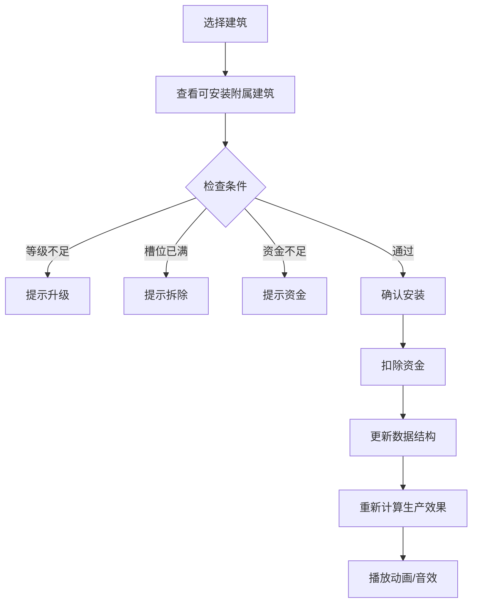
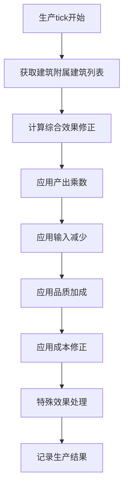

# 附属建筑系统实施计划

## 1. 系统概述

### 1.1 当前状态分析

**现有通用附属设施系统** (`src/core/production/Facilities.ts`):
- 已定义7种通用设施类型（仓储、物流、研发、维护、员工、环保、安保）
- 约20个通用设施定义
- 有基础的效果计算逻辑
- **问题**: 未集成到GameWorld、未实际影响生产、UI未完成

**建筑系统** (`src/data/buildings.ts`):
- 107种建筑类型，分为采掘、加工、制造、服务、零售五大类
- 使用SoA结构高效存储

### 1.2 目标

为每种建筑类型设计3-5个**专属附属建筑**，这些附属建筑：
- 与主建筑类型紧密相关
- 提供独特且有意义的生产效果
- 需要玩家根据策略选择

---

## 2. 数据结构设计

### 2.1 附属建筑定义结构

```typescript
// 新文件: src/core/production/SubsidiaryBuildings.ts

/** 附属建筑类别 */
export type SubsidiaryCategory = 
  | 'production'    // 生产增强
  | 'efficiency'    // 效率优化
  | 'quality'       // 品质提升
  | 'capacity'      // 容量扩展
  | 'specialized';  // 专业特化

/** 附属建筑定义 */
export interface SubsidiaryBuildingDef {
  id: number;                        // 唯一ID (从1000开始)
  key: string;                       // 键名
  name: string;                      // 显示名称
  description: string;               // 描述
  category: SubsidiaryCategory;      // 类别
  
  // 适用范围
  applicableBuildingTypes: number[]; // 可安装的建筑类型ID列表
  
  // 成本
  buildCost: number;                 // 建造成本
  dailyMaintenance: number;          // 每日维护费
  
  // 解锁条件
  requiredBuildingLevel: number;     // 需要主建筑等级
  requiredTech?: string;             // 需要的科技（预留）
  
  // 效果
  effects: SubsidiaryEffects;
  
  // 限制
  maxPerBuilding: number;            // 每建筑最多安装数量
  exclusiveWith?: number[];          // 互斥的附属建筑ID
  
  // 占用
  slots: number;                     // 占用槽位数
}

/** 附属建筑效果 */
export interface SubsidiaryEffects {
  // 生产效果
  outputMultiplier?: number;         // 产出乘数 (1.0 = 不变)
  inputReduction?: number;           // 输入减少比例 (0.1 = 减少10%)
  speedMultiplier?: number;          // 速度乘数
  
  // 品质效果
  qualityBonus?: number;             // 品质加成
  defectReduction?: number;          // 缺陷率降低
  
  // 成本效果
  laborReduction?: number;           // 人工成本降低
  energyReduction?: number;          // 能源成本降低
  maintenanceReduction?: number;     // 维护成本降低
  
  // 容量效果
  storageCapacity?: number;          // 增加存储容量
  bufferCapacity?: number;           // 增加缓冲容量
  
  // 特殊效果
  bonusOutputChance?: number;        // 额外产出几率
  bonusOutputGoods?: number;         // 额外产出商品ID
  bonusOutputAmount?: number;        // 额外产出数量
  
  // 专业效果
  specificGoodsBonus?: Map<number, number>; // 特定商品的产出加成
}

/** 已安装的附属建筑实例 */
export interface InstalledSubsidiary {
  subsidiaryId: number;              // 附属建筑定义ID
  installedTick: number;             // 安装时间
  condition: number;                 // 状态 0-1
  level: number;                     // 等级（用于可升级的附属建筑）
}
```

### 2.2 GameWorld数据结构扩展

```typescript
// 在 src/core/world/GameWorld.ts 中扩展 BuildingsSystem

export interface BuildingsSystem {
  // ... 现有字段 ...
  
  // 附属建筑系统扩展
  subsidiaryIds: Uint16Array;        // [N × MAX_SUBSIDIARIES] 已安装的附属建筑ID
  subsidiaryConditions: Float32Array; // [N × MAX_SUBSIDIARIES] 附属建筑状态
  subsidiaryLevels: Uint8Array;      // [N × MAX_SUBSIDIARIES] 附属建筑等级
  subsidiaryInstalledTicks: Uint32Array; // [N × MAX_SUBSIDIARIES] 安装时间
  subsidiaryCount: Uint8Array;       // [N] 每个建筑已安装的附属建筑数量
}

// 新常量
export const MAX_SUBSIDIARIES = 6;   // 每个建筑最多6个附属建筑
```

---

## 3. 附属建筑设计（按建筑类别）

### 3.1 采掘类建筑附属建筑

#### 矿场类（铁矿场、铜矿场、煤矿、硅石矿场等）

| ID | 名称 | 效果 | 说明 |
|----|------|------|------|
| 1001 | 深井开采设备 | 产出+20%，能耗+15% | 深挖矿脉获取更多矿石 |
| 1002 | 矿石预处理厂 | 品质+0.15，产出-5% | 初步筛选提高矿石纯度 |
| 1003 | 自动化采矿系统 | 人工-30%，维护+10% | 减少人力依赖 |
| 1004 | 矿井通风系统 | 效率+10%，安全加成 | 改善工作环境 |
| 1005 | 矿石储存站 | 存储+500，缓冲+200 | 增加产出缓冲 |

#### 油气田类

| ID | 名称 | 效果 | 说明 |
|----|------|------|------|
| 1010 | 增压注水站 | 产出+25%，能耗+20% | 二次采油提高产量 |
| 1011 | 油气分离器 | 品质+0.2，额外天然气产出 | 分离副产品 |
| 1012 | 海上平台扩展 | 产出+15%，容量+300 | 扩展采集能力 |
| 1013 | 管道直连站 | 运输成本-20% | 直接管道输送 |

#### 农场类（农场、蔬菜农场、畜牧场等）

| ID | 名称 | 效果 | 说明 |
|----|------|------|------|
| 1020 | 温室大棚 | 产出+30%，能耗+25% | 全季节生产 |
| 1021 | 有机认证设施 | 品质+0.25，产出-10% | 有机农产品溢价 |
| 1022 | 灌溉系统 | 效率+15%，水资源消耗 | 稳定灌溉 |
| 1023 | 农业机械库 | 人工-40%，维护+15% | 机械化作业 |
| 1024 | 种子研发站 | 品质+0.1，产出+10% | 改良品种 |
| 1025 | 冷藏存储库 | 存储+800，保鲜效果 | 延长保质期 |

#### 林场/伐木场

| ID | 名称 | 效果 | 说明 |
|----|------|------|------|
| 1030 | 可持续林业中心 | 产出+15%，品质+0.1 | 科学伐木 |
| 1031 | 木材干燥房 | 品质+0.2，处理时间-20% | 木材预处理 |
| 1032 | 林场苗圃 | 长期产出+5%/年 | 森林再生 |

### 3.2 加工类建筑附属建筑

#### 钢铁厂

| ID | 名称 | 效果 | 说明 |
|----|------|------|------|
| 1100 | 高炉扩建 | 产出+25%，能耗+20% | 增加炼钢产能 |
| 1101 | 连铸生产线 | 效率+20%，品质+0.1 | 连续铸造 |
| 1102 | 废钢回收站 | 输入-15%，副产品利用 | 循环利用 |
| 1103 | 特钢研发中心 | 品质+0.25，可生产特钢 | 高端产品 |
| 1104 | 余热发电站 | 能耗-30%，发电收益 | 余热利用 |

#### 炼油厂

| ID | 名称 | 效果 | 说明 |
|----|------|------|------|
| 1110 | 催化裂化装置 | 产出+20%，额外化工品 | 深度加工 |
| 1111 | 脱硫脱蜡设备 | 品质+0.2，环保合规 | 产品提纯 |
| 1112 | 储油罐群 | 存储+2000，容量大增 | 大规模存储 |
| 1113 | 管道运输站 | 运输成本-25% | 管道直运 |

#### 化工厂

| ID | 名称 | 效果 | 说明 |
|----|------|------|------|
| 1120 | 精细化工车间 | 品质+0.3，产出-10% | 高纯度产品 |
| 1121 | 安全控制中心 | 事故率-50%，维护-10% | 安全生产 |
| 1122 | 废水处理站 | 环保合规，运营成本-5% | 环保设施 |
| 1123 | 催化剂工厂 | 效率+15%，成本-10% | 自产催化剂 |

#### 食品厂

| ID | 名称 | 效果 | 说明 |
|----|------|------|------|
| 1130 | 冷链加工线 | 品质+0.2，保鲜+50% | 低温加工 |
| 1131 | 质检实验室 | 品质+0.15，缺陷-30% | 品质把控 |
| 1132 | 包装自动化 | 人工-25%，效率+10% | 自动包装 |
| 1133 | 有机认证车间 | 品质+0.25，可生产有机食品 | 有机认证 |
| 1134 | 食品添加剂站 | 产出+15%，成本+5% | 添加剂加工 |

### 3.3 制造类建筑附属建筑

#### 电子厂

| ID | 名称 | 效果 | 说明 |
|----|------|------|------|
| 1200 | 洁净室扩建 | 品质+0.3，产出+15% | 高等级洁净室 |
| 1201 | SMT贴片线 | 效率+25%，人工-20% | 自动贴片 |
| 1202 | 测试中心 | 品质+0.2，缺陷-40% | 全面测试 |
| 1203 | 研发实验室 | 品质+0.15，可开发新品 | 研发能力 |

#### 半导体厂

| ID | 名称 | 效果 | 说明 |
|----|------|------|------|
| 1210 | 先进光刻室 | 品质+0.4，可生产高端芯片 | 先进制程 |
| 1211 | 无尘车间扩展 | 产出+20%，能耗+15% | 扩大产能 |
| 1212 | 晶圆检测站 | 缺陷-50%，良率提升 | 良率控制 |
| 1213 | 封装测试线 | 效率+15%，完整产业链 | 封测能力 |

#### 汽车工厂

| ID | 名称 | 效果 | 说明 |
|----|------|------|------|
| 1220 | 冲压车间 | 产出+20%，自制零件 | 零件自制 |
| 1221 | 涂装生产线 | 品质+0.2，外观升级 | 高品质涂装 |
| 1222 | 总装自动化 | 效率+25%，人工-30% | 机器人组装 |
| 1223 | 质检中心 | 品质+0.15，缺陷-35% | 严格质检 |
| 1224 | 试车跑道 | 品质+0.1，测试验证 | 下线测试 |

#### 制药厂

| ID | 名称 | 效果 | 说明 |
|----|------|------|------|
| 1230 | GMP洁净车间 | 品质+0.35，合规必需 | GMP认证 |
| 1231 | 质量分析室 | 品质+0.2，缺陷-45% | 严格质控 |
| 1232 | 冷链储存库 | 存储+500，保质期+100% | 药品保鲜 |
| 1233 | 临床试验中心 | 可开发新药，研发加速 | 新药研发 |
| 1234 | 无菌灌装线 | 品质+0.25，无菌产品 | 无菌灌装 |

### 3.4 服务类建筑附属建筑

#### 物流中心

| ID | 名称 | 效果 | 说明 |
|----|------|------|------|
| 1300 | 自动分拣系统 | 效率+40%，人工-35% | 自动化分拣 |
| 1301 | 立体仓库 | 存储+200%，空间利用 | 高密度存储 |
| 1302 | 货运车队 | 运输成本-20%，速度+25% | 自有车队 |
| 1303 | 信息管理中心 | 效率+15%，追踪能力 | 物流追踪 |

#### 发电厂

| ID | 名称 | 效果 | 说明 |
|----|------|------|------|
| 1310 | 增压机组 | 产出+25%，效率+10% | 发电能力提升 |
| 1311 | 脱硫脱硝设备 | 环保合规，补贴收入 | 环保达标 |
| 1312 | 储能电站 | 平滑供电，峰谷套利 | 储能能力 |
| 1313 | 智能调度中心 | 效率+15%，成本-10% | 智能调度 |

### 3.5 零售类建筑附属建筑

#### 便利店/超市

| ID | 名称 | 效果 | 说明 |
|----|------|------|------|
| 1400 | 生鲜区扩建 | 客流+20%，可售生鲜 | 生鲜品类 |
| 1401 | 自助收银系统 | 人工-30%，效率+15% | 自助结账 |
| 1402 | 会员系统 | 客流+10%，复购率+ | 会员运营 |
| 1403 | 配送站点 | 可提供外送，收入+15% | 外卖配送 |

#### 专卖店类（电子商城、奢侈品店等）

| ID | 名称 | 效果 | 说明 |
|----|------|------|------|
| 1410 | VIP客户室 | 高端客流+30%，客单价+ | VIP服务 |
| 1411 | 体验中心 | 转化率+25%，品牌价值 | 沉浸体验 |
| 1412 | 售后服务站 | 客户满意度+，复购+ | 售后保障 |

---

## 4. 系统流程设计

### 4.1 安装流程



### 4.2 效果计算流程



---

## 5. 实施步骤

### 第一阶段：基础架构
1. 创建 `SubsidiaryBuildings.ts` 定义文件
2. 扩展 `GameWorld.ts` 数据结构
3. 更新 `constants.ts` 添加新常量
4. 创建附属建筑管理函数

### 第二阶段：数据定义
1. 定义采掘类附属建筑（约30个）
2. 定义加工类附属建筑（约30个）
3. 定义制造类附属建筑（约40个）
4. 定义服务类附属建筑（约20个）
5. 定义零售类附属建筑（约20个）

### 第三阶段：核心逻辑
1. 实现附属建筑效果计算
2. 集成到 `ProductionEngine.ts`
3. 实现安装/拆除逻辑
4. 实现状态维护（状态衰减、维修）

### 第四阶段：Store集成
1. 添加附属建筑相关Actions
2. 添加查询和计算函数
3. 添加通知和音效

### 第五阶段：UI实现
1. 创建附属建筑选择面板
2. 创建附属建筑详情组件
3. 集成到 `BuildingDetailPanel.tsx`
4. 添加视觉效果和动画

### 第六阶段：测试与优化
1. 单元测试效果计算
2. 集成测试生产流程
3. 性能优化
4. 平衡性调整

---

## 6. 技术注意事项

### 6.1 性能考虑
- 使用TypedArray存储，保持SoA模式
- 效果计算结果缓存，避免每tick重复计算
- 批量更新附属建筑状态

### 6.2 扩展性
- 预留科技解锁接口
- 预留成就系统接口
- 考虑未来MOD支持

### 6.3 平衡性
- 附属建筑成本应与收益匹配
- 避免过强的必选附属建筑
- 保持策略多样性

---

## 7. 文件结构

```
src/
├── core/
│   └── production/
│       ├── SubsidiaryBuildings.ts      # 新：附属建筑定义和逻辑
│       ├── subsidiaries/               # 新：附属建筑数据
│       │   ├── extraction.ts           # 采掘类附属建筑
│       │   ├── processing.ts           # 加工类附属建筑
│       │   ├── manufacturing.ts        # 制造类附属建筑
│       │   ├── service.ts              # 服务类附属建筑
│       │   ├── retail.ts               # 零售类附属建筑
│       │   └── index.ts                # 汇总导出
│       ├── Facilities.ts               # 现有：通用设施（可保留或合并）
│       └── ProductionEngine.ts         # 修改：集成附属建筑效果
├── ui/
│   └── components/
│       └── Production/
│           ├── SubsidiaryPanel.tsx     # 新：附属建筑管理面板
│           ├── SubsidiaryCard.tsx      # 新：附属建筑卡片组件
│           └── BuildingDetailPanel.tsx # 修改：集成附属建筑UI
└── stores/
    └── gameStore.ts                    # 修改：添加附属建筑Actions
```

---

## 8. 预期效果示例

### 铁矿场 + 深井开采设备 + 自动化采矿系统
- 基础产出: 100单位/日
- 深井开采: +20% = 120单位/日
- 自动化: 人工成本-30%
- 综合效果: 产出提升20%，人工成本大幅降低，能耗略增

### 半导体厂 + 先进光刻室 + 晶圆检测站
- 品质基础: 标准
- 先进光刻: 品质+0.4 (可达良好~优质)
- 检测站: 缺陷-50%
- 综合效果: 高端芯片产品，市场售价提升40%+

这种设计确保玩家需要根据市场需求和资金状况，策略性地选择附属建筑配置。