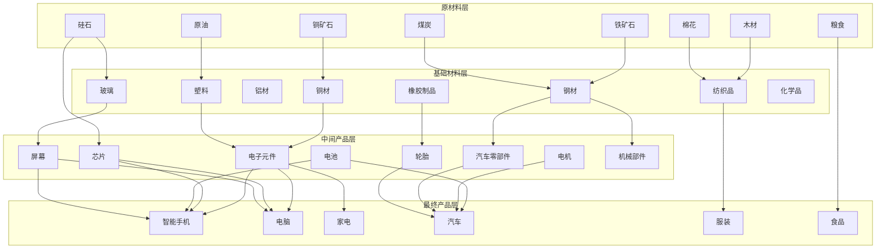
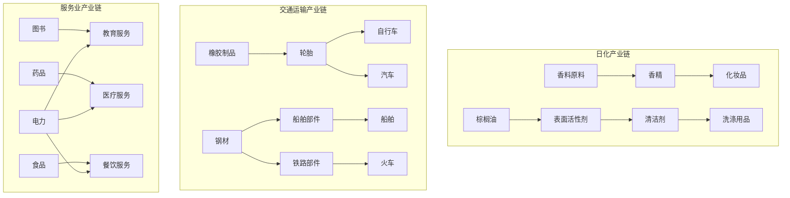

# 产业链全覆盖完善计划

> **文档版本**: 1.0  
> **创建日期**: 2026-01-26  
> **目标**: 实现完整的产业链全覆盖，补充所有缺失环节

---

## 一、现有产业链状况分析

### 1.1 商品统计（现有104种）

| 类别 | 层级 | 数量 | ID范围 |
|------|------|------|--------|
| 核心原材料 | 0 | 14 | 0-13 |
| 核心基础材料 | 1 | 12 | 14-25 |
| 核心中间产品 | 2 | 12 | 26-37 |
| 核心最终产品 | 3 | 20 | 38-57 |
| 农业产业链 | 0-3 | 12 | 58-69 |
| 医药产业链 | 0-3 | 10 | 70-79 |
| 军工产业链 | 1-3 | 8 | 80-87 |
| 奢侈品产业链 | 0-3 | 8 | 88-95 |
| 科技产业链 | 2-3 | 8 | 96-103 |

### 1.2 建筑统计（现有59种）

| 类别 | 数量 | ID范围 |
|------|------|--------|
| 采掘类 | 12 | 0-7, 25-27, 29, 35, 40-41 |
| 加工类 | 12 | 8-15, 28, 32, 42-43 |
| 制造类 | 16 | 16-21, 30-31, 33-34, 36-39, 44-48 |
| 服务类 | 3 | 22-24 |
| 零售类 | 10 | 49-58 |

### 1.3 配方统计（现有106种）
- 采掘类配方：10种 (ID 0-9)
- 加工类配方：11种 (ID 10-20)
- 制造类配方：11种 (ID 21-31)
- 发电配方：3种 (ID 32-34)
- 农业配方：8种 (ID 35-42)
- 医药配方：6种 (ID 43-48)
- 军工配方：5种 (ID 49-53)
- 奢侈品配方：4种 (ID 54-57)
- 科技配方：6种 (ID 58-63)
- 补充配方：42种 (ID 64-105)

---

## 二、缺失产业链识别

### 2.1 完全缺失的产业链

#### A. 服务业产业链 ⭐重要缺失
- 教育服务（学校、培训机构）
- 医疗服务（医院、诊所）
- 金融服务（银行、保险）
- 娱乐服务（影院、游乐场）
- 旅游服务（酒店、旅行社）
- 餐饮服务（餐厅、快餐）
- 物业服务（清洁、保安）

#### B. 日化产业链 ⭐重要缺失
- 化妆品原料 → 化妆品
- 表面活性剂 → 洗涤用品
- 香精香料 → 个人护理品
- 牙膏、肥皂、洗发水等

#### C. 交通运输设备产业链
- 船舶制造
- 铁路车辆
- 民用飞机
- 摩托车/电动车
- 自行车

#### D. 文化传媒产业链
- 出版印刷
- 影视制作
- 游戏开发
- 广告服务

#### E. 通信产业链
- 通信设备
- 通信基站
- 光纤光缆
- 卫星设备

### 2.2 部分缺失的产业链

#### A. 矿业扩展
| 缺失矿种 | 用途 |
|----------|------|
| 锌矿/锌 | 镀锌钢、电池 |
| 镍矿/镍 | 不锈钢、电池 |
| 锡矿/锡 | 焊接、包装 |
| 钨矿/钨 | 合金钢、刀具 |
| 钴矿/钴 | 电池、合金 |
| 锰矿/锰 | 钢铁添加剂 |

#### B. 纺织扩展
| 缺失材料 | 用途 |
|----------|------|
| 羊毛 | 毛纺织品、高档服装 |
| 麻类 | 麻布、环保包装 |
| 皮革 | 皮具、鞋类 |
| 羽绒 | 保暖制品 |

#### C. 建材扩展
| 缺失材料 | 用途 |
|----------|------|
| 砖瓦 | 建筑 |
| 石材 | 装修、雕塑 |
| 陶瓷 | 卫浴、餐具 |
| 涂料 | 装修 |
| 木板 | 家具、装修 |

#### D. 农产品深加工
| 缺失产品 | 原料 |
|----------|------|
| 酒类（啤酒/白酒/葡萄酒） | 粮食/水果 |
| 食用油 | 油料作物 |
| 调味品 | 粮食/蔬菜 |
| 烟草制品 | 烟叶 |
| 糖果 | 糖类 |
| 茶叶 | 茶树 |
| 咖啡 | 咖啡豆 |

#### E. 能源扩展
| 缺失类型 | 说明 |
|----------|------|
| 核能 | 铀矿 → 核燃料 → 核电 |
| 氢能 | 水电解 → 氢气 → 氢燃料电池 |
| 生物燃料 | 粮食/植物 → 乙醇/生物柴油 |
| 地热能 | 地热发电 |

### 2.3 关联性缺失

| 现有商品 | 缺失的上游/下游 |
|----------|----------------|
| 电池(28) | 缺少钴、镍输入 |
| 芯片(27) | 缺少光刻胶、惰性气体 |
| 服装(43) | 缺少拉链、纽扣 |
| 汽车(41/42) | 缺少轮胎、座椅 |

---

## 三、新增商品设计

### 3.1 日化产业链商品（ID 104-115）

```typescript
// 原材料层
{ id: 104, key: 'palm-oil', name: '棕榈油', category: 'raw', tier: 0 },
{ id: 105, key: 'fragrance-raw', name: '香料原料', category: 'raw', tier: 0 },

// 基础材料层  
{ id: 106, key: 'surfactant', name: '表面活性剂', category: 'basic', tier: 1 },
{ id: 107, key: 'fragrance', name: '香精', category: 'basic', tier: 1 },
{ id: 108, key: 'pigment', name: '颜料', category: 'basic', tier: 1 },

// 中间产品层
{ id: 109, key: 'cosmetic-base', name: '化妆品基质', category: 'intermediate', tier: 2 },
{ id: 110, key: 'cleaning-agent', name: '清洁剂原液', category: 'intermediate', tier: 2 },

// 最终产品层
{ id: 111, key: 'cosmetics', name: '化妆品', category: 'final', tier: 3 },
{ id: 112, key: 'skincare', name: '护肤品', category: 'final', tier: 3 },
{ id: 113, key: 'detergent', name: '洗涤用品', category: 'final', tier: 3 },
{ id: 114, key: 'shampoo', name: '洗发护发用品', category: 'final', tier: 3 },
{ id: 115, key: 'toothpaste', name: '口腔护理用品', category: 'final', tier: 3 },
```

### 3.2 交通运输设备商品（ID 116-127）

```typescript
// 中间产品层
{ id: 116, key: 'tire', name: '轮胎', category: 'intermediate', tier: 2 },
{ id: 117, key: 'car-seat', name: '汽车座椅', category: 'intermediate', tier: 2 },
{ id: 118, key: 'ship-parts', name: '船舶部件', category: 'intermediate', tier: 2 },
{ id: 119, key: 'train-parts', name: '铁路车辆部件', category: 'intermediate', tier: 2 },
{ id: 120, key: 'aircraft-engine', name: '航空发动机', category: 'intermediate', tier: 2 },

// 最终产品层
{ id: 121, key: 'bicycle', name: '自行车', category: 'final', tier: 3 },
{ id: 122, key: 'motorcycle', name: '摩托车', category: 'final', tier: 3 },
{ id: 123, key: 'electric-scooter', name: '电动滑板车', category: 'final', tier: 3 },
{ id: 124, key: 'ship', name: '船舶', category: 'final', tier: 3 },
{ id: 125, key: 'train-car', name: '铁路车辆', category: 'final', tier: 3 },
{ id: 126, key: 'civil-aircraft', name: '民用飞机', category: 'final', tier: 3 },
{ id: 127, key: 'bus', name: '公交车', category: 'final', tier: 3 },
```

### 3.3 矿业扩展商品（ID 128-139）

```typescript
// 矿石
{ id: 128, key: 'zinc-ore', name: '锌矿石', category: 'raw', tier: 0 },
{ id: 129, key: 'nickel-ore', name: '镍矿石', category: 'raw', tier: 0 },
{ id: 130, key: 'tin-ore', name: '锡矿石', category: 'raw', tier: 0 },
{ id: 131, key: 'cobalt-ore', name: '钴矿石', category: 'raw', tier: 0 },
{ id: 132, key: 'manganese-ore', name: '锰矿石', category: 'raw', tier: 0 },
{ id: 133, key: 'tungsten-ore', name: '钨矿石', category: 'raw', tier: 0 },

// 精炼金属
{ id: 134, key: 'zinc', name: '锌', category: 'basic', tier: 1 },
{ id: 135, key: 'nickel', name: '镍', category: 'basic', tier: 1 },
{ id: 136, key: 'tin', name: '锡', category: 'basic', tier: 1 },
{ id: 137, key: 'cobalt', name: '钴', category: 'basic', tier: 1 },
{ id: 138, key: 'manganese', name: '锰', category: 'basic', tier: 1 },
{ id: 139, key: 'tungsten', name: '钨', category: 'basic', tier: 1 },
```

### 3.4 纺织扩展商品（ID 140-149）

```typescript
// 原材料
{ id: 140, key: 'wool', name: '羊毛', category: 'raw', tier: 0 },
{ id: 141, key: 'flax', name: '亚麻', category: 'raw', tier: 0 },
{ id: 142, key: 'leather-raw', name: '生皮', category: 'raw', tier: 0 },
{ id: 143, key: 'down', name: '羽绒', category: 'raw', tier: 0 },

// 基础材料
{ id: 144, key: 'wool-yarn', name: '毛纱', category: 'basic', tier: 1 },
{ id: 145, key: 'linen-fabric', name: '麻布', category: 'basic', tier: 1 },
{ id: 146, key: 'leather', name: '皮革', category: 'basic', tier: 1 },

// 最终产品
{ id: 147, key: 'wool-clothing', name: '毛织品', category: 'final', tier: 3 },
{ id: 148, key: 'leather-goods', name: '皮具', category: 'final', tier: 3 },
{ id: 149, key: 'shoes', name: '鞋类', category: 'final', tier: 3 },
```

### 3.5 建材扩展商品（ID 150-159）

```typescript
// 原材料
{ id: 150, key: 'clay', name: '粘土', category: 'raw', tier: 0 },
{ id: 151, key: 'marble', name: '大理石', category: 'raw', tier: 0 },

// 基础/中间产品
{ id: 152, key: 'brick', name: '砖', category: 'basic', tier: 1 },
{ id: 153, key: 'tile', name: '瓷砖', category: 'basic', tier: 1 },
{ id: 154, key: 'wood-board', name: '木板', category: 'basic', tier: 1 },
{ id: 155, key: 'paint', name: '涂料', category: 'intermediate', tier: 2 },
{ id: 156, key: 'ceramics', name: '陶瓷制品', category: 'intermediate', tier: 2 },

// 最终产品
{ id: 157, key: 'sanitary-ware', name: '卫浴设备', category: 'final', tier: 3 },
{ id: 158, key: 'tableware', name: '餐具', category: 'final', tier: 3 },
{ id: 159, key: 'decoration', name: '装饰材料', category: 'final', tier: 3 },
```

### 3.6 农产品深加工商品（ID 160-175）

```typescript
// 原材料
{ id: 160, key: 'grape', name: '葡萄', category: 'raw', tier: 0 },
{ id: 161, key: 'sugarcane', name: '甘蔗', category: 'raw', tier: 0 },
{ id: 162, key: 'tea-leaf', name: '茶叶', category: 'raw', tier: 0 },
{ id: 163, key: 'coffee-bean', name: '咖啡豆', category: 'raw', tier: 0 },
{ id: 164, key: 'tobacco', name: '烟叶', category: 'raw', tier: 0 },
{ id: 165, key: 'oilseed', name: '油料作物', category: 'raw', tier: 0 },

// 基础材料
{ id: 166, key: 'sugar', name: '糖', category: 'basic', tier: 1 },
{ id: 167, key: 'edible-oil', name: '食用油', category: 'basic', tier: 1 },
{ id: 168, key: 'flour', name: '面粉', category: 'basic', tier: 1 },

// 最终产品
{ id: 169, key: 'beer', name: '啤酒', category: 'final', tier: 3 },
{ id: 170, key: 'wine', name: '葡萄酒', category: 'final', tier: 3 },
{ id: 171, key: 'spirits', name: '烈酒', category: 'final', tier: 3 },
{ id: 172, key: 'tea-product', name: '茶饮', category: 'final', tier: 3 },
{ id: 173, key: 'coffee-product', name: '咖啡', category: 'final', tier: 3 },
{ id: 174, key: 'cigarettes', name: '烟草制品', category: 'final', tier: 3 },
{ id: 175, key: 'candy', name: '糖果', category: 'final', tier: 3 },
```

### 3.7 能源扩展商品（ID 176-185）

```typescript
// 原材料
{ id: 176, key: 'uranium-ore', name: '铀矿石', category: 'raw', tier: 0 },
{ id: 177, key: 'biomass', name: '生物质', category: 'raw', tier: 0 },

// 中间产品
{ id: 178, key: 'nuclear-fuel', name: '核燃料', category: 'intermediate', tier: 2 },
{ id: 179, key: 'hydrogen', name: '氢气', category: 'intermediate', tier: 2 },
{ id: 180, key: 'biofuel', name: '生物燃料', category: 'intermediate', tier: 2 },

// 能源设备
{ id: 181, key: 'nuclear-reactor', name: '核反应堆', category: 'final', tier: 3 },
{ id: 182, key: 'fuel-cell', name: '燃料电池', category: 'final', tier: 3 },
{ id: 183, key: 'wind-turbine', name: '风力发电机', category: 'final', tier: 3 },
{ id: 184, key: 'transformer', name: '变压器', category: 'intermediate', tier: 2 },
{ id: 185, key: 'power-cable', name: '电力电缆', category: 'intermediate', tier: 2 },
```

### 3.8 通信产业链商品（ID 186-195）

```typescript
// 原材料/基础材料
{ id: 186, key: 'optical-fiber', name: '光纤', category: 'basic', tier: 1 },
{ id: 187, key: 'antenna', name: '天线', category: 'intermediate', tier: 2 },

// 中间产品
{ id: 188, key: 'sensor', name: '传感器', category: 'intermediate', tier: 2 },
{ id: 189, key: 'memory-chip', name: '存储芯片', category: 'intermediate', tier: 2 },
{ id: 190, key: 'display-panel', name: '显示面板', category: 'intermediate', tier: 2 },

// 最终产品
{ id: 191, key: 'router', name: '路由器', category: 'final', tier: 3 },
{ id: 192, key: 'base-station', name: '通信基站', category: 'final', tier: 3 },
{ id: 193, key: 'satellite', name: '卫星', category: 'final', tier: 3 },
{ id: 194, key: 'tablet', name: '平板电脑', category: 'final', tier: 3 },
{ id: 195, key: 'smartwatch', name: '智能手表', category: 'final', tier: 3 },
```

### 3.9 服务业产品（ID 196-209）

```typescript
// 服务类产品（虚拟商品，用于服务业建筑消费/产出）
{ id: 196, key: 'education-service', name: '教育服务', category: 'final', tier: 3, isService: true },
{ id: 197, key: 'healthcare-service', name: '医疗服务', category: 'final', tier: 3, isService: true },
{ id: 198, key: 'financial-service', name: '金融服务', category: 'final', tier: 3, isService: true },
{ id: 199, key: 'entertainment-service', name: '娱乐服务', category: 'final', tier: 3, isService: true },
{ id: 200, key: 'catering-service', name: '餐饮服务', category: 'final', tier: 3, isService: true },
{ id: 201, key: 'hotel-service', name: '住宿服务', category: 'final', tier: 3, isService: true },
{ id: 202, key: 'transport-service', name: '运输服务', category: 'final', tier: 3, isService: true },
{ id: 203, key: 'cleaning-service', name: '清洁服务', category: 'final', tier: 3, isService: true },
{ id: 204, key: 'security-service', name: '安保服务', category: 'final', tier: 3, isService: true },
{ id: 205, key: 'advertising-service', name: '广告服务', category: 'final', tier: 3, isService: true },
{ id: 206, key: 'legal-service', name: '法律服务', category: 'final', tier: 3, isService: true },
{ id: 207, key: 'consulting-service', name: '咨询服务', category: 'final', tier: 3, isService: true },
{ id: 208, key: 'software-service', name: '软件服务', category: 'final', tier: 3, isService: true },
{ id: 209, key: 'research-service', name: '研发服务', category: 'final', tier: 3, isService: true },
```

### 3.10 文化传媒商品（ID 210-219）

```typescript
// 中间产品
{ id: 210, key: 'printing-ink', name: '印刷油墨', category: 'intermediate', tier: 2 },
{ id: 211, key: 'film-equipment', name: '影视设备', category: 'intermediate', tier: 2 },

// 最终产品
{ id: 212, key: 'books', name: '图书', category: 'final', tier: 3 },
{ id: 213, key: 'magazines', name: '杂志报刊', category: 'final', tier: 3 },
{ id: 214, key: 'music-album', name: '音乐专辑', category: 'final', tier: 3 },
{ id: 215, key: 'movie', name: '电影', category: 'final', tier: 3, isService: true },
{ id: 216, key: 'video-game', name: '电子游戏', category: 'final', tier: 3 },
{ id: 217, key: 'toy', name: '玩具', category: 'final', tier: 3 },
{ id: 218, key: 'sports-equipment', name: '运动器材', category: 'final', tier: 3 },
{ id: 219, key: 'musical-instrument', name: '乐器', category: 'final', tier: 3 },
```

### 3.11 杂项补充商品（ID 220-229）

```typescript
// 补充缺失的中间件
{ id: 220, key: 'zipper', name: '拉链', category: 'intermediate', tier: 2 },
{ id: 221, key: 'buttons', name: '纽扣', category: 'intermediate', tier: 2 },
{ id: 222, key: 'photoresist', name: '光刻胶', category: 'intermediate', tier: 2 },
{ id: 223, key: 'inert-gas', name: '惰性气体', category: 'basic', tier: 1 },
{ id: 224, key: 'catalyst', name: '催化剂', category: 'intermediate', tier: 2 },
{ id: 225, key: 'adhesive', name: '胶粘剂', category: 'intermediate', tier: 2 },
{ id: 226, key: 'bearing', name: '轴承', category: 'intermediate', tier: 2 },
{ id: 227, key: 'spring', name: '弹簧', category: 'intermediate', tier: 2 },
{ id: 228, key: 'seal', name: '密封件', category: 'intermediate', tier: 2 },
{ id: 229, key: 'filter', name: '过滤器', category: 'intermediate', tier: 2 },
```

---

## 四、新增建筑设计

### 4.1 日化产业链建筑（ID 59-62）

```typescript
{
  id: 59, key: 'palm-plantation', name: '棕榈种植园',
  category: 'extraction',
  availableRecipes: [106], // 棕榈油种植
},
{
  id: 60, key: 'fragrance-factory', name: '香精厂',
  category: 'processing',
  availableRecipes: [107, 108], // 香精生产、颜料生产
},
{
  id: 61, key: 'cosmetics-factory', name: '化妆品厂',
  category: 'manufacturing',
  availableRecipes: [109, 110, 111, 112], // 化妆品、护肤品等
},
{
  id: 62, key: 'daily-chemical-factory', name: '日化用品厂',
  category: 'manufacturing',
  availableRecipes: [113, 114, 115], // 洗涤用品、洗发水、牙膏
},
```

### 4.2 交通运输设备建筑（ID 63-67）

```typescript
{
  id: 63, key: 'tire-factory', name: '轮胎厂',
  category: 'manufacturing',
  availableRecipes: [116], // 轮胎生产
},
{
  id: 64, key: 'bicycle-factory', name: '自行车厂',
  category: 'manufacturing',
  availableRecipes: [117, 118, 119], // 自行车、摩托车、电动滑板车
},
{
  id: 65, key: 'shipyard', name: '造船厂',
  category: 'manufacturing',
  availableRecipes: [120, 121], // 船舶部件、船舶
},
{
  id: 66, key: 'train-factory', name: '机车厂',
  category: 'manufacturing',
  availableRecipes: [122, 123], // 铁路车辆部件、铁路车辆
},
{
  id: 67, key: 'bus-factory', name: '客车厂',
  category: 'manufacturing',
  availableRecipes: [124], // 公交车生产
},
```

### 4.3 矿业扩展建筑（ID 68-70）

```typescript
{
  id: 68, key: 'zinc-nickel-mine', name: '锌镍矿场',
  category: 'extraction',
  availableRecipes: [125, 126], // 锌矿开采、镍矿开采
},
{
  id: 69, key: 'rare-metal-mine', name: '稀有金属矿场',
  category: 'extraction',
  availableRecipes: [127, 128, 129, 130], // 锡、钴、锰、钨矿开采
},
{
  id: 70, key: 'smelting-plant', name: '有色金属冶炼厂',
  category: 'processing',
  availableRecipes: [131, 132, 133, 134, 135, 136], // 锌、镍、锡、钴、锰、钨冶炼
},
```

### 4.4 纺织扩展建筑（ID 71-73）

```typescript
{
  id: 71, key: 'wool-farm', name: '牧羊场',
  category: 'extraction',
  availableRecipes: [137, 138], // 羊毛、羽绒生产
},
{
  id: 72, key: 'tannery', name: '制革厂',
  category: 'processing',
  availableRecipes: [139, 140], // 皮革加工、皮具生产
},
{
  id: 73, key: 'shoe-factory', name: '制鞋厂',
  category: 'manufacturing',
  availableRecipes: [141, 142], // 鞋类生产、运动鞋生产
},
```

### 4.5 建材扩展建筑（ID 74-76）

```typescript
{
  id: 74, key: 'quarry', name: '采石场',
  category: 'extraction',
  availableRecipes: [143, 144], // 粘土开采、石材开采
},
{
  id: 75, key: 'ceramics-factory', name: '陶瓷厂',
  category: 'manufacturing',
  availableRecipes: [145, 146, 147, 148], // 砖、瓷砖、陶瓷制品、卫浴
},
{
  id: 76, key: 'paint-factory', name: '涂料厂',
  category: 'processing',
  availableRecipes: [149], // 涂料生产
},
```

### 4.6 农产品深加工建筑（ID 77-81）

```typescript
{
  id: 77, key: 'vineyard', name: '葡萄园',
  category: 'extraction',
  availableRecipes: [150], // 葡萄种植
},
{
  id: 78, key: 'sugar-mill', name: '糖厂',
  category: 'processing',
  availableRecipes: [151, 152], // 制糖、糖果生产
},
{
  id: 79, key: 'brewery', name: '酿酒厂',
  category: 'manufacturing',
  availableRecipes: [153, 154, 155], // 啤酒、葡萄酒、烈酒
},
{
  id: 80, key: 'oil-mill', name: '榨油厂',
  category: 'processing',
  availableRecipes: [156], // 食用油生产
},
{
  id: 81, key: 'tobacco-factory', name: '烟草厂',
  category: 'manufacturing',
  availableRecipes: [157], // 烟草制品
},
```

### 4.7 能源扩展建筑（ID 82-84）

```typescript
{
  id: 82, key: 'uranium-mine', name: '铀矿',
  category: 'extraction',
  availableRecipes: [158], // 铀矿开采
},
{
  id: 83, key: 'nuclear-plant', name: '核电站',
  category: 'service',
  availableRecipes: [159, 160], // 核燃料加工、核电发电
},
{
  id: 84, key: 'hydrogen-plant', name: '制氢厂',
  category: 'processing',
  availableRecipes: [161, 162], // 氢气生产、生物燃料生产
},
```

### 4.8 通信产业建筑（ID 85-87）

```typescript
{
  id: 85, key: 'fiber-optic-factory', name: '光纤厂',
  category: 'manufacturing',
  availableRecipes: [163, 164], // 光纤、天线生产
},
{
  id: 86, key: 'telecom-equipment-factory', name: '通信设备厂',
  category: 'manufacturing',
  availableRecipes: [165, 166, 167], // 路由器、基站、卫星
},
{
  id: 87, key: 'display-factory', name: '显示器厂',
  category: 'manufacturing',
  availableRecipes: [168, 169, 170], // 显示面板、平板电脑、智能手表
},
```

### 4.9 服务业建筑（ID 88-97）

```typescript
{
  id: 88, key: 'school', name: '学校',
  category: 'service',
  availableRecipes: [171], // 教育服务
},
{
  id: 89, key: 'hospital', name: '医院',
  category: 'service',
  availableRecipes: [172], // 医疗服务
},
{
  id: 90, key: 'bank', name: '银行',
  category: 'service',
  availableRecipes: [173], // 金融服务
},
{
  id: 91, key: 'cinema', name: '影院',
  category: 'service',
  availableRecipes: [174], // 娱乐服务
},
{
  id: 92, key: 'restaurant', name: '餐厅',
  category: 'service',
  availableRecipes: [175], // 餐饮服务
},
{
  id: 93, key: 'hotel', name: '酒店',
  category: 'service',
  availableRecipes: [176], // 住宿服务
},
{
  id: 94, key: 'transport-company', name: '运输公司',
  category: 'service',
  availableRecipes: [177], // 运输服务
},
{
  id: 95, key: 'software-company', name: '软件公司',
  category: 'service',
  availableRecipes: [178], // 软件服务
},
{
  id: 96, key: 'advertising-agency', name: '广告公司',
  category: 'service',
  availableRecipes: [179], // 广告服务
},
{
  id: 97, key: 'research-institute', name: '研究院',
  category: 'service',
  availableRecipes: [180], // 研发服务
},
```

### 4.10 文化传媒建筑（ID 98-101）

```typescript
{
  id: 98, key: 'printing-house', name: '印刷厂',
  category: 'manufacturing',
  availableRecipes: [181, 182, 183], // 图书、杂志、印刷油墨
},
{
  id: 99, key: 'film-studio', name: '影视基地',
  category: 'manufacturing',
  availableRecipes: [184, 185], // 电影制作、音乐制作
},
{
  id: 100, key: 'game-studio', name: '游戏工作室',
  category: 'manufacturing',
  availableRecipes: [186], // 电子游戏开发
},
{
  id: 101, key: 'toy-factory', name: '玩具厂',
  category: 'manufacturing',
  availableRecipes: [187, 188, 189], // 玩具、运动器材、乐器
},
```

### 4.11 零售建筑扩展（ID 102-106）

```typescript
{
  id: 102, key: 'cosmetics-store', name: '化妆品店',
  category: 'retail',
  retailConfig: {
    allowedGoodsIds: [111, 112, 113, 114, 115], // 日化产品
  },
},
{
  id: 103, key: 'sports-store', name: '体育用品店',
  category: 'retail',
  retailConfig: {
    allowedGoodsIds: [121, 218, 149], // 自行车、运动器材、鞋类
  },
},
{
  id: 104, key: 'bookstore', name: '书店',
  category: 'retail',
  retailConfig: {
    allowedGoodsIds: [212, 213, 214, 216], // 图书、杂志、音乐、游戏
  },
},
{
  id: 105, key: 'liquor-store', name: '酒类专卖店',
  category: 'retail',
  retailConfig: {
    allowedGoodsIds: [169, 170, 171], // 啤酒、葡萄酒、烈酒
  },
},
{
  id: 106, key: 'home-appliance-store', name: '家居建材店',
  category: 'retail',
  retailConfig: {
    allowedGoodsIds: [155, 156, 157, 159], // 涂料、陶瓷、卫浴、装饰
  },
},
```

---

## 五、新增配方设计

### 5.1 配方ID分配表

| 产业链 | 配方ID范围 | 数量 |
|--------|----------|------|
| 日化产业链 | 106-120 | 15 |
| 交通运输 | 121-130 | 10 |
| 矿业扩展 | 131-142 | 12 |
| 纺织扩展 | 143-150 | 8 |
| 建材扩展 | 151-160 | 10 |
| 农产品深加工 | 161-175 | 15 |
| 能源扩展 | 176-185 | 10 |
| 通信产业 | 186-195 | 10 |
| 服务业 | 196-210 | 15 |
| 文化传媒 | 211-220 | 10 |
| 杂项补充 | 221-230 | 10 |

### 5.2 关键配方示例

#### 日化产业链配方

```typescript
// 棕榈油种植
{
  id: 106, key: 'palm-oil-cultivation', name: '棕榈油种植',
  buildingTypeId: 59,
  inputs: [],
  outputs: [{ goodsId: 104, amount: 100 }],
  ticksRequired: 24,
  laborRequired: 60,
  energyRequired: 30,
},

// 表面活性剂生产
{
  id: 107, key: 'surfactant-production', name: '表面活性剂生产',
  buildingTypeId: 10, // 化工厂
  inputs: [
    { goodsId: 104, amount: 30 }, // 棕榈油
    { goodsId: 12, amount: 20 },  // 化工原料
  ],
  outputs: [{ goodsId: 106, amount: 40 }],
  ticksRequired: 2,
  laborRequired: 40,
  energyRequired: 200,
},

// 化妆品生产
{
  id: 110, key: 'cosmetics-production', name: '化妆品生产',
  buildingTypeId: 61,
  inputs: [
    { goodsId: 109, amount: 30 }, // 化妆品基质
    { goodsId: 107, amount: 10 }, // 香精
    { goodsId: 108, amount: 5 },  // 颜料
    { goodsId: 37, amount: 20 },  // 包装材料
  ],
  outputs: [{ goodsId: 111, amount: 50 }],
  ticksRequired: 3,
  laborRequired: 80,
  energyRequired: 150,
},
```

#### 交通运输配方

```typescript
// 轮胎生产
{
  id: 116, key: 'tire-production', name: '轮胎生产',
  buildingTypeId: 63,
  inputs: [
    { goodsId: 19, amount: 50 },  // 橡胶制品
    { goodsId: 14, amount: 20 },  // 钢材
    { goodsId: 23, amount: 10 },  // 纺织品
  ],
  outputs: [{ goodsId: 116, amount: 30 }],
  ticksRequired: 2,
  laborRequired: 60,
  energyRequired: 200,
},

// 自行车生产
{
  id: 117, key: 'bicycle-production', name: '自行车生产',
  buildingTypeId: 64,
  inputs: [
    { goodsId: 16, amount: 20 },  // 铝材
    { goodsId: 116, amount: 2 },  // 轮胎
    { goodsId: 19, amount: 5 },   // 橡胶制品
  ],
  outputs: [{ goodsId: 121, amount: 10 }],
  ticksRequired: 2,
  laborRequired: 40,
  energyRequired: 100,
},

// 船舶建造
{
  id: 121, key: 'ship-building', name: '船舶建造',
  buildingTypeId: 65,
  inputs: [
    { goodsId: 118, amount: 100 }, // 船舶部件
    { goodsId: 14, amount: 500 },  // 钢材
    { goodsId: 26, amount: 50 },   // 电子元件
    { goodsId: 29, amount: 20 },   // 电机
  ],
  outputs: [{ goodsId: 124, amount: 1 }],
  ticksRequired: 50,
  laborRequired: 500,
  energyRequired: 1000,
},
```

#### 服务业配方

```typescript
// 教育服务
{
  id: 171, key: 'education-service', name: '教育服务',
  buildingTypeId: 88,
  inputs: [
    { goodsId: 212, amount: 10 }, // 图书
    { goodsId: 57, amount: 100 }, // 电力
  ],
  outputs: [{ goodsId: 196, amount: 100 }], // 教育服务
  ticksRequired: 24,
  laborRequired: 200,
  energyRequired: 300,
},

// 医疗服务
{
  id: 172, key: 'healthcare-service', name: '医疗服务',
  buildingTypeId: 89,
  inputs: [
    { goodsId: 74, amount: 20 },  // 仿制药
    { goodsId: 77, amount: 30 },  // 医用耗材
    { goodsId: 78, amount: 5 },   // 诊断设备（消耗）
    { goodsId: 57, amount: 200 }, // 电力
  ],
  outputs: [{ goodsId: 197, amount: 80 }], // 医疗服务
  ticksRequired: 24,
  laborRequired: 300,
  energyRequired: 500,
},
```

---

## 六、产业链关联图

### 6.1 核心产业链完整关联



### 6.2 新增产业链关联



---

## 七、实施计划

### 7.1 Phase 1: 商品定义扩展
- 新增126种商品（ID 104-229）
- 更新 `src/data/goods.ts`
- 更新商品分类和映射

### 7.2 Phase 2: 建筑定义扩展
- 新增48种建筑（ID 59-106）
- 更新 `src/data/buildings.ts`
- 配置建筑槽位

### 7.3 Phase 3: 配方定义扩展
- 新增125种配方（ID 106-230）
- 更新 `src/data/recipes.ts`
- 确保所有商品都有生产路径

### 7.4 Phase 4: 生产方式扩展
- 为新建筑配置生产方式槽位
- 更新 `src/core/production/ProductionMethods.ts`

### 7.5 Phase 5: 零售系统更新
- 更新零售建筑可销售商品列表
- 新增5种零售建筑

### 7.6 Phase 6: 服务业系统实现
- 实现服务类商品的特殊处理逻辑
- 服务消费与人口需求关联

---

## 八、商品全覆盖检查清单

### 8.1 消费品覆盖（面向人口）

| 类别 | 商品 | 状态 |
|------|------|------|
| 食品 | 粮食、加工食品、肉类、乳制品、零食、有机食品 | ✅ 已有 |
| 饮料 | 饮料、啤酒、葡萄酒、烈酒、茶饮、咖啡 | ⚠️ 部分缺失 |
| 服装 | 服装、毛织品、皮具、鞋类、设计师服装 | ⚠️ 部分缺失 |
| 电子 | 手机、电脑、家电、VR设备、智能手表 | ⚠️ 部分缺失 |
| 出行 | 汽车、电动汽车、自行车、摩托车 | ⚠️ 部分缺失 |
| 家居 | 家具、建材成品、卫浴、装饰材料 | ⚠️ 部分缺失 |
| 日化 | 化妆品、护肤品、洗涤用品、口腔护理 | ❌ 缺失 |
| 医药 | 仿制药、专利药、非处方药、保健品 | ✅ 已有 |
| 能源 | 燃油、电力 | ✅ 已有 |
| 娱乐 | 玩具、游戏、运动器材、乐器 | ❌ 缺失 |
| 文化 | 图书、杂志、音乐 | ❌ 缺失 |
| 奢侈 | 奢侈品、珠宝、奢侈腕表、豪华汽车 | ✅ 已有 |

### 8.2 工业品覆盖（面向企业）

| 类别 | 商品 | 状态 |
|------|------|------|
| 金属原料 | 铁矿、铜矿、铝土矿、锌矿、镍矿、钴矿等 | ⚠️ 部分缺失 |
| 金属材料 | 钢材、铜材、铝材、锌、镍、特种钢 | ⚠️ 部分缺失 |
| 化工原料 | 原油、天然气、化工原料 | ✅ 已有 |
| 化工产品 | 塑料、橡胶、化学品、涂料 | ⚠️ 部分缺失 |
| 电子元器件 | 电子元件、芯片、电池、传感器、存储芯片 | ⚠️ 部分缺失 |
| 机械部件 | 机械部件、汽车零部件、轴承、弹簧 | ⚠️ 部分缺失 |
| 建筑材料 | 水泥、玻璃、砖、瓷砖、木板 | ⚠️ 部分缺失 |
| 能源设备 | 光伏板、风机叶片、变压器、电缆 | ⚠️ 部分缺失 |

### 8.3 服务品覆盖

| 类别 | 服务 | 状态 |
|------|------|------|
| 教育 | 教育服务 | ❌ 缺失 |
| 医疗 | 医疗服务 | ❌ 缺失 |
| 金融 | 金融服务 | ❌ 缺失 |
| 娱乐 | 娱乐服务 | ❌ 缺失 |
| 餐饮 | 餐饮服务 | ❌ 缺失 |
| 住宿 | 住宿服务 | ❌ 缺失 |
| 运输 | 运输服务 | ❌ 缺失 |
| 软件 | 软件服务 | ❌ 缺失 |
| 广告 | 广告服务 | ❌ 缺失 |
| 研发 | 研发服务 | ❌ 缺失 |

---

## 九、总结

### 9.1 新增内容统计

| 类型 | 现有数量 | 新增数量 | 完成后总数 |
|------|----------|----------|------------|
| 商品 | 104 | 126 | 230 |
| 建筑 | 59 | 48 | 107 |
| 配方 | 106 | 125 | 231 |

### 9.2 产业链覆盖

| 产业链 | 状态 | 备注 |
|--------|------|------|
| 核心工业 | ✅ 完善 | 钢铁、化工、电子等 |
| 农业 | ✅ 完善 | 种植、养殖、加工 |
| 医药 | ✅ 完善 | 原料、制药、器械 |
| 军工 | ✅ 完善 | 特钢、武器、航空 |
| 奢侈品 | ✅ 完善 | 贵金属、珠宝、高端服装 |
| 高科技 | ✅ 完善 | AI、量子、生物 |
| 日化 | ➕ 新增 | 化妆品、洗涤用品 |
| 交通运输 | ➕ 新增 | 船舶、火车、自行车 |
| 矿业扩展 | ➕ 新增 | 锌、镍、锡、钴等 |
| 纺织扩展 | ➕ 新增 | 羊毛、皮革、鞋类 |
| 建材扩展 | ➕ 新增 | 陶瓷、涂料、装饰 |
| 农产品深加工 | ➕ 新增 | 酒类、糖果、烟草 |
| 能源扩展 | ➕ 新增 | 核能、氢能、生物燃料 |
| 通信 | ➕ 新增 | 光纤、基站、卫星 |
| 服务业 | ➕ 新增 | 教育、医疗、金融等10类 |
| 文化传媒 | ➕ 新增 | 出版、影视、游戏 |

完成后，游戏将拥有16个完整的产业链，230种商品，107种建筑，231种配方，实现真正的产业链全覆盖。

---

*文档结束*