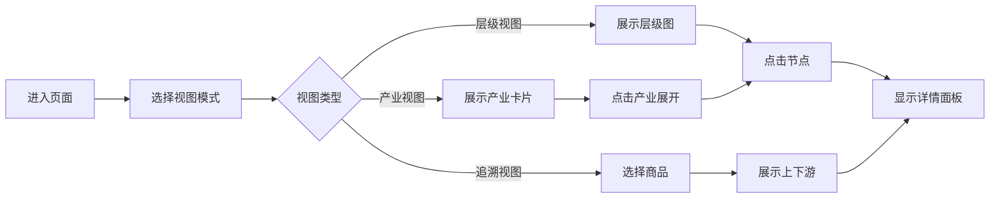
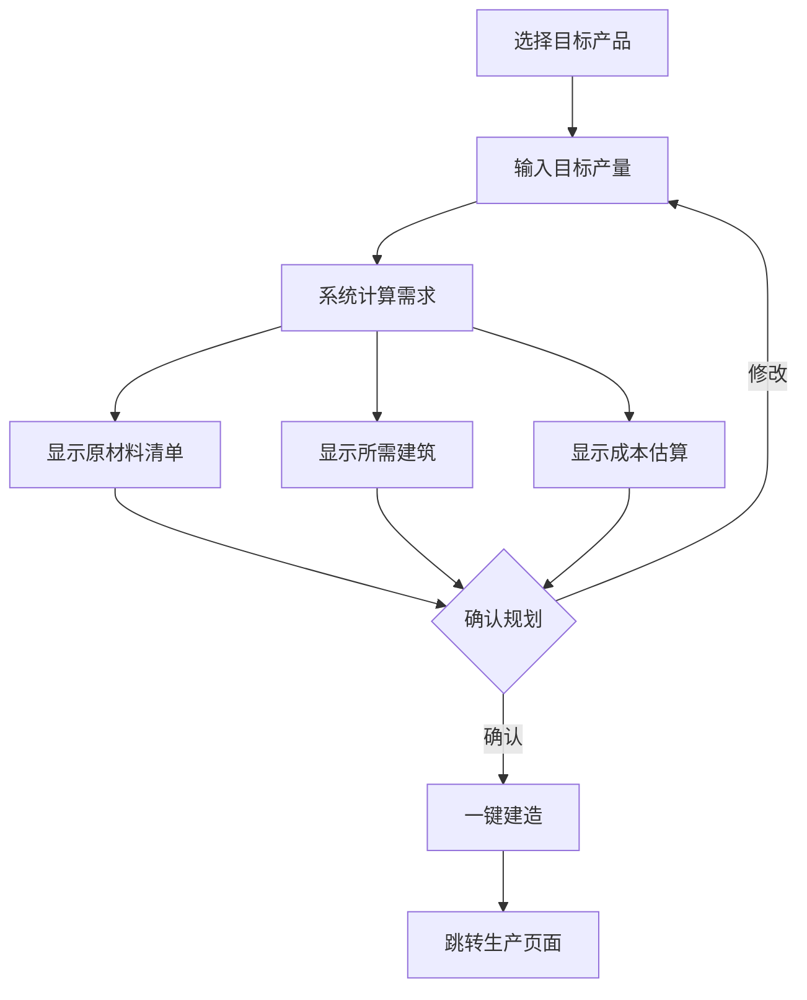

# 产业链可视化UI设计方案

## 📋 项目概述

### 目标
创建一个功能全面、交互友好的产业链可视化系统，帮助玩家：
- 直观了解230种商品之间的生产关系
- 规划生产线，从最终产品反推所需原材料
- 快速定位和建造相关建筑
- 分析不同产业的完整供应链

### 数据基础
- **商品数量**: 230种，分为4个层级
  - Tier 0 (raw): 原材料 - 约40种
  - Tier 1 (basic): 基础材料 - 约35种
  - Tier 2 (intermediate): 中间产品 - 约55种
  - Tier 3 (final): 最终产品 - 约100种
- **配方数量**: 233种生产配方
- **建筑数量**: 107种建筑
- **产业分类**: 17个产业链

---

## 🎨 UI架构设计

### 页面整体布局

```
┌─────────────────────────────────────────────────────────────────┐
│  Header: 产业链浏览器 | 视图切换 | 搜索框 | 筛选器              │
├─────────────┬───────────────────────────────────────┬───────────┤
│             │                                       │           │
│  左侧面板   │         主可视化区域                   │  右侧面板 │
│  (产业/     │    (流程图/树状图/网络图)              │  (详情/   │
│   商品列表) │                                       │   规划)   │
│             │                                       │           │
│  可折叠     │         支持缩放和拖拽                 │  可折叠   │
│             │                                       │           │
├─────────────┴───────────────────────────────────────┴───────────┤
│  底部工具栏: 缩放控制 | 布局切换 | 导出 | 帮助                   │
└─────────────────────────────────────────────────────────────────┘
```

### 三种视图模式

#### 1. 产业分类视图 (Industry View)
按17个产业链分类展示，每个产业显示为一个可展开的卡片组

```
┌─────────────────────────────────────────────────────────────────┐
│  🏭 核心产业链                    🌾 农业产业链                  │
│  ┌─────┐ ┌─────┐ ┌─────┐        ┌─────┐ ┌─────┐ ┌─────┐       │
│  │铁矿石│→│钢材 │→│汽车 │        │粮食 │→│面粉 │→│食品 │       │
│  └─────┘ └─────┘ └─────┘        └─────┘ └─────┘ └─────┘       │
│                                                                 │
│  💊 医药产业链                    ⚔️ 军工产业链                  │
│  ┌─────┐ ┌─────┐ ┌─────┐        ┌─────┐ ┌─────┐ ┌─────┐       │
│  │药材 │→│化工品│→│药品 │        │特钢 │→│装甲板│→│坦克 │       │
│  └─────┘ └─────┘ └─────┘        └─────┘ └─────┘ └─────┘       │
└─────────────────────────────────────────────────────────────────┘
```

#### 2. 层级视图 (Tier View)
按商品层级从左到右排列，清晰展示生产流程

```
┌─────────────────────────────────────────────────────────────────┐
│   Tier 0          Tier 1          Tier 2          Tier 3       │
│   原材料          基础材料         中间产品         最终产品     │
│                                                                 │
│   ┌─────┐        ┌─────┐         ┌─────┐         ┌─────┐      │
│   │铁矿石│───────→│钢材 │────────→│汽车零│────────→│汽车 │      │
│   └─────┘        └─────┘    ╲    │部件 │         └─────┘      │
│                              ╲   └─────┘                       │
│   ┌─────┐        ┌─────┐      ╲                               │
│   │铜矿石│───────→│铜材 │───────→┌─────┐         ┌─────┐      │
│   └─────┘        └─────┘        │电子 │────────→│手机 │      │
│                                 │元件 │         └─────┘      │
│   ┌─────┐        ┌─────┐        └─────┘                       │
│   │硅石 │───────→│玻璃 │──────────────────────────────────→   │
│   └─────┘        └─────┘                                       │
└─────────────────────────────────────────────────────────────────┘
```

#### 3. 单品追溯视图 (Product Trace View)
选中一个商品后，展示其完整的上下游关系

```
┌─────────────────────────────────────────────────────────────────┐
│                        📱 智能手机                               │
│                            │                                    │
│         ┌──────────────────┼──────────────────┐                │
│         ▼                  ▼                  ▼                │
│    ┌─────────┐       ┌─────────┐       ┌─────────┐            │
│    │电子元件 │       │  芯片   │       │  电池   │            │
│    └────┬────┘       └────┬────┘       └────┬────┘            │
│         │                 │                 │                  │
│    ┌────┴────┐       ┌────┴────┐       ┌────┴────┐            │
│    ▼         ▼       ▼         ▼       ▼         ▼            │
│ ┌─────┐ ┌─────┐ ┌─────┐ ┌─────┐ ┌─────┐ ┌─────┐             │
│ │铜材 │ │塑料 │ │硅石 │ │稀土 │ │锂矿 │ │化学品│             │
│ └──┬──┘ └──┬──┘ └─────┘ └─────┘ └─────┘ └──┬──┘             │
│    │       │                               │                  │
│    ▼       ▼                               ▼                  │
│ ┌─────┐ ┌─────┐                        ┌─────┐               │
│ │铜矿石│ │原油 │                        │化工  │               │
│ └─────┘ └─────┘                        │原料 │               │
│                                        └─────┘               │
└─────────────────────────────────────────────────────────────────┘
```

---

## 🧩 核心组件设计

### 1. SupplyChainPage (主页面组件)

```typescript
interface SupplyChainPageProps {
  // 无需props，从store获取数据
}

// 状态管理
interface SupplyChainState {
  viewMode: 'industry' | 'tier' | 'trace';
  selectedGoodsId: number | null;
  selectedIndustry: string | null;
  searchQuery: string;
  filters: {
    tiers: number[];
    categories: string[];
    industries: string[];
  };
  zoom: number;
  panOffset: { x: number; y: number };
}
```

### 2. SupplyChainGraph (可视化图表组件)

```typescript
interface SupplyChainGraphProps {
  viewMode: 'industry' | 'tier' | 'trace';
  selectedGoodsId?: number;
  selectedIndustry?: string;
  onNodeClick: (goodsId: number) => void;
  onNodeHover: (goodsId: number | null) => void;
  zoom: number;
  panOffset: { x: number; y: number };
}

// 节点数据结构
interface GraphNode {
  id: number;
  key: string;
  name: string;
  tier: number;
  category: string;
  industry: string;
  x: number;
  y: number;
  // 视觉属性
  color: string;
  size: number;
  highlighted: boolean;
}

// 边数据结构
interface GraphEdge {
  source: number;
  target: number;
  recipeId: number;
  amount: number;
  // 视觉属性
  color: string;
  width: number;
  animated: boolean;
}
```

### 3. GoodsNode (商品节点组件)

```typescript
interface GoodsNodeProps {
  goods: GoodsDefinition;
  position: { x: number; y: number };
  size: 'sm' | 'md' | 'lg';
  selected: boolean;
  highlighted: boolean;
  showLabel: boolean;
  onClick: () => void;
  onHover: (hover: boolean) => void;
}
```

节点视觉设计：
```
┌─────────────────┐
│  🔩             │  ← 商品图标
│  钢材           │  ← 商品名称
│  Tier 1         │  ← 层级标签
│  ¥150/吨        │  ← 基准价格
└─────────────────┘
```

### 4. GoodsDetailPanel (商品详情面板)

```typescript
interface GoodsDetailPanelProps {
  goodsId: number;
  onClose: () => void;
  onBuildBuilding: (buildingTypeId: number) => void;
  onTraceProduct: (goodsId: number) => void;
}
```

面板内容：
```
┌─────────────────────────────────────┐
│ 🔩 钢材                        [X] │
├─────────────────────────────────────┤
│ 基本信息                            │
│ ├─ 类别: 基础材料 (Tier 1)          │
│ ├─ 基准价格: ¥150/吨                │
│ ├─ 价格弹性: -0.5                   │
│ └─ 是否消费品: 否                   │
├─────────────────────────────────────┤
│ 📥 生产来源 (2种配方)               │
│ ┌─────────────────────────────────┐ │
│ │ 🏭 钢铁冶炼                      │ │
│ │ 输入: 铁矿石×100 + 煤炭×50       │ │
│ │ 输出: 钢材×80                    │ │
│ │ [建造钢铁厂]                     │ │
│ └─────────────────────────────────┘ │
│ ┌─────────────────────────────────┐ │
│ │ ⚡ 电弧炉炼钢                    │ │
│ │ 输入: 铁矿石×80                  │ │
│ │ 输出: 钢材×75                    │ │
│ │ [建造钢铁厂] (需要2级)           │ │
│ └─────────────────────────────────┘ │
├─────────────────────────────────────┤
│ 📤 用途 (12种配方)                  │
│ ├─ 汽车零部件生产                   │
│ ├─ 机械部件生产                     │
│ ├─ 建筑材料生产                     │
│ └─ ... 查看全部                     │
├─────────────────────────────────────┤
│ [🔍 追溯完整产业链] [📊 查看市场]   │
└─────────────────────────────────────┘
```

### 5. ProductionPlanner (生产规划器)

```typescript
interface ProductionPlannerProps {
  targetGoodsId: number;
  targetAmount: number;
  onPlanGenerated: (plan: ProductionPlan) => void;
}

interface ProductionPlan {
  targetGoods: GoodsDefinition;
  targetAmount: number;
  // 所需原材料清单
  rawMaterials: Array<{
    goods: GoodsDefinition;
    amount: number;
    estimatedCost: number;
  }>;
  // 所需中间产品
  intermediates: Array<{
    goods: GoodsDefinition;
    amount: number;
    recipe: RecipeDefinition;
  }>;
  // 所需建筑
  buildings: Array<{
    building: BuildingTypeDefinition;
    count: number;
    totalCost: number;
  }>;
  // 总成本估算
  totalMaterialCost: number;
  totalBuildingCost: number;
  estimatedProfit: number;
}
```

规划器UI：
```
┌─────────────────────────────────────┐
│ 🎯 生产规划器                       │
├─────────────────────────────────────┤
│ 目标产品: [智能手机 ▼]              │
│ 目标数量: [100] 台/天               │
├─────────────────────────────────────┤
│ 📦 所需原材料                       │
│ ├─ 铜矿石: 2000吨 (¥160,000)        │
│ ├─ 硅石: 1500吨 (¥52,500)           │
│ ├─ 稀土: 50kg (¥10,000)             │
│ └─ 锂矿: 300吨 (¥45,000)            │
│                                     │
│ 🏭 所需建筑                         │
│ ├─ 铜矿场 ×2 (¥1,200,000)           │
│ ├─ 钢铁厂 ×1 (¥2,000,000)           │
│ ├─ 电子厂 ×3 (¥15,000,000)          │
│ └─ 半导体厂 ×1 (¥20,000,000)        │
├─────────────────────────────────────┤
│ 💰 成本估算                         │
│ ├─ 原材料成本: ¥267,500/天          │
│ ├─ 建筑投资: ¥38,200,000            │
│ ├─ 运营成本: ¥85,000/天             │
│ └─ 预计收入: ¥800,000/天            │
│                                     │
│ 📈 预计利润: ¥447,500/天            │
│ 📅 投资回收期: 85天                 │
├─────────────────────────────────────┤
│ [一键建造所有建筑] [导出规划]       │
└─────────────────────────────────────┘
```

### 6. IndustryCard (产业卡片组件)

```typescript
interface IndustryCardProps {
  industry: {
    key: string;
    name: string;
    icon: string;
    goods: GoodsDefinition[];
    buildings: BuildingTypeDefinition[];
  };
  expanded: boolean;
  onToggle: () => void;
  onGoodsClick: (goodsId: number) => void;
}
```

### 7. SearchAndFilter (搜索筛选组件)

```typescript
interface SearchAndFilterProps {
  searchQuery: string;
  onSearchChange: (query: string) => void;
  filters: FilterState;
  onFiltersChange: (filters: FilterState) => void;
}

interface FilterState {
  tiers: number[];           // [0, 1, 2, 3]
  categories: string[];      // ['raw', 'basic', 'intermediate', 'final']
  industries: string[];      // ['core', 'agriculture', 'pharma', ...]
  isConsumerGood: boolean | null;
  priceRange: [number, number];
}
```

---

## 🔧 数据处理工具函数

### supplyChainUtils.ts

```typescript
// 构建商品依赖图
export function buildDependencyGraph(): {
  nodes: Map<number, GraphNode>;
  edges: GraphEdge[];
  adjacencyList: Map<number, number[]>;  // goodsId -> 依赖的goodsId列表
  reverseAdjacencyList: Map<number, number[]>;  // goodsId -> 被依赖的goodsId列表
}

// 获取商品的所有上游原材料（递归）
export function getUpstreamMaterials(goodsId: number): Array<{
  goods: GoodsDefinition;
  depth: number;
  path: number[];
}>

// 获取商品的所有下游产品（递归）
export function getDownstreamProducts(goodsId: number): Array<{
  goods: GoodsDefinition;
  depth: number;
  path: number[];
}>

// 获取生产某商品的所有配方
export function getRecipesForGoods(goodsId: number): RecipeDefinition[]

// 获取使用某商品作为原料的所有配方
export function getRecipesUsingGoods(goodsId: number): RecipeDefinition[]

// 获取可以生产某商品的建筑
export function getBuildingsForGoods(goodsId: number): BuildingTypeDefinition[]

// 计算生产计划
export function calculateProductionPlan(
  targetGoodsId: number,
  targetAmount: number
): ProductionPlan

// 按产业分组商品
export function groupGoodsByIndustry(): Map<string, GoodsDefinition[]>

// 按层级分组商品
export function groupGoodsByTier(): Map<number, GoodsDefinition[]>

// 搜索商品
export function searchGoods(query: string, filters: FilterState): GoodsDefinition[]

// 计算节点布局位置（用于可视化）
export function calculateNodePositions(
  viewMode: 'industry' | 'tier' | 'trace',
  selectedGoodsId?: number
): Map<number, { x: number; y: number }>
```

---

## 🎨 视觉设计规范

### 颜色编码

```typescript
// 按层级着色
const tierColors = {
  0: '#22C55E',  // 原材料 - 绿色
  1: '#3B82F6',  // 基础材料 - 蓝色
  2: '#A855F7',  // 中间产品 - 紫色
  3: '#F59E0B',  // 最终产品 - 橙色
};

// 按产业着色
const industryColors = {
  core: '#3B82F6',
  agriculture: '#22C55E',
  pharma: '#EC4899',
  military: '#EF4444',
  luxury: '#F59E0B',
  tech: '#8B5CF6',
  // ...
};

// 节点状态
const nodeStates = {
  default: { opacity: 0.8, scale: 1 },
  hover: { opacity: 1, scale: 1.1, glow: true },
  selected: { opacity: 1, scale: 1.2, ring: true },
  highlighted: { opacity: 1, scale: 1.05 },
  dimmed: { opacity: 0.3, scale: 0.95 },
};
```

### 连线样式

```typescript
// 边的样式
const edgeStyles = {
  default: {
    color: 'rgba(255, 255, 255, 0.2)',
    width: 1,
  },
  highlighted: {
    color: 'rgba(59, 130, 246, 0.8)',
    width: 2,
    animated: true,  // 流动动画
  },
  selected: {
    color: '#3B82F6',
    width: 3,
    animated: true,
  },
};
```

### 动画效果

```css
/* 节点悬停动画 */
.goods-node:hover {
  transform: scale(1.1);
  filter: drop-shadow(0 0 10px var(--accent-glow));
  transition: all 0.2s ease-out;
}

/* 连线流动动画 */
@keyframes flowAnimation {
  from { stroke-dashoffset: 20; }
  to { stroke-dashoffset: 0; }
}

.edge-animated {
  stroke-dasharray: 5, 5;
  animation: flowAnimation 1s linear infinite;
}

/* 节点出现动画 */
@keyframes nodeAppear {
  from { 
    opacity: 0; 
    transform: scale(0.5); 
  }
  to { 
    opacity: 1; 
    transform: scale(1); 
  }
}
```

---

## 📁 文件结构

```
src/ui/
├── pages/
│   └── SupplyChain.tsx              # 主页面
├── components/
│   └── SupplyChain/
│       ├── index.ts                  # 导出
│       ├── SupplyChainGraph.tsx      # 主图表组件
│       ├── GoodsNode.tsx             # 商品节点
│       ├── GoodsEdge.tsx             # 连线组件
│       ├── GoodsDetailPanel.tsx      # 商品详情面板
│       ├── ProductionPlanner.tsx     # 生产规划器
│       ├── IndustryCard.tsx          # 产业卡片
│       ├── IndustryList.tsx          # 产业列表
│       ├── TierLegend.tsx            # 层级图例
│       ├── SearchAndFilter.tsx       # 搜索筛选
│       ├── ViewModeSelector.tsx      # 视图切换
│       ├── ZoomControls.tsx          # 缩放控制
│       └── MiniMap.tsx               # 小地图导航
├── hooks/
│   └── useSupplyChain.ts             # 产业链数据hook
└── utils/
    └── supplyChainUtils.ts           # 工具函数
```

---

## 🔄 交互流程

### 1. 浏览产业链


### 2. 规划生产线


### 3. 快速建造


---

## 📊 性能优化策略

### 1. 虚拟化渲染
- 只渲染视口内的节点
- 使用 `react-window` 或自定义虚拟化
- 远距离节点简化为点

### 2. 数据缓存
```typescript
// 使用 useMemo 缓存计算结果
const dependencyGraph = useMemo(() => 
  buildDependencyGraph(), 
  [/* 依赖项 */]
);

// 使用 React Query 缓存
const { data: upstreamMaterials } = useQuery(
  ['upstream', goodsId],
  () => getUpstreamMaterials(goodsId),
  { staleTime: Infinity }
);
```

### 3. 渐进式加载
- 初始只加载当前视图需要的数据
- 展开/追溯时按需加载更多节点
- 使用骨架屏显示加载状态

### 4. Canvas 渲染
- 大量节点时使用 Canvas 而非 SVG
- 考虑使用 `react-konva` 或 `pixi.js`

---

## 🚀 实施计划

### 第一阶段：基础架构 (2-3天)
1. 创建 `supplyChainUtils.ts` 工具函数
2. 创建基础页面布局 `SupplyChain.tsx`
3. 实现搜索和筛选功能
4. 添加路由和导航入口

### 第二阶段：层级视图 (2-3天)
1. 实现 `SupplyChainGraph` 组件
2. 实现 `GoodsNode` 节点组件
3. 实现层级布局算法
4. 添加缩放和拖拽功能

### 第三阶段：详情面板 (1-2天)
1. 实现 `GoodsDetailPanel` 组件
2. 显示上下游关系
3. 集成建造功能

### 第四阶段：产业视图 (1-2天)
1. 实现 `IndustryCard` 组件
2. 实现产业分组展示
3. 添加展开/折叠动画

### 第五阶段：追溯视图 (2-3天)
1. 实现递归追溯算法
2. 实现树状布局
3. 添加路径高亮动画

### 第六阶段：生产规划器 (2-3天)
1. 实现 `ProductionPlanner` 组件
2. 实现成本计算逻辑
3. 实现一键建造功能

### 第七阶段：优化和完善 (1-2天)
1. 性能优化
2. 动画效果完善
3. 响应式适配
4. 测试和修复

**预计总工时：11-18天**

---

## 📝 注意事项

1. **数据一致性**：确保与 `goods.ts`、`recipes.ts`、`buildings.ts` 数据同步
2. **性能考虑**：230个商品节点需要考虑渲染性能
3. **交互体验**：确保触摸设备也能良好使用
4. **可访问性**：添加键盘导航和屏幕阅读器支持
5. **国际化**：预留多语言支持接口