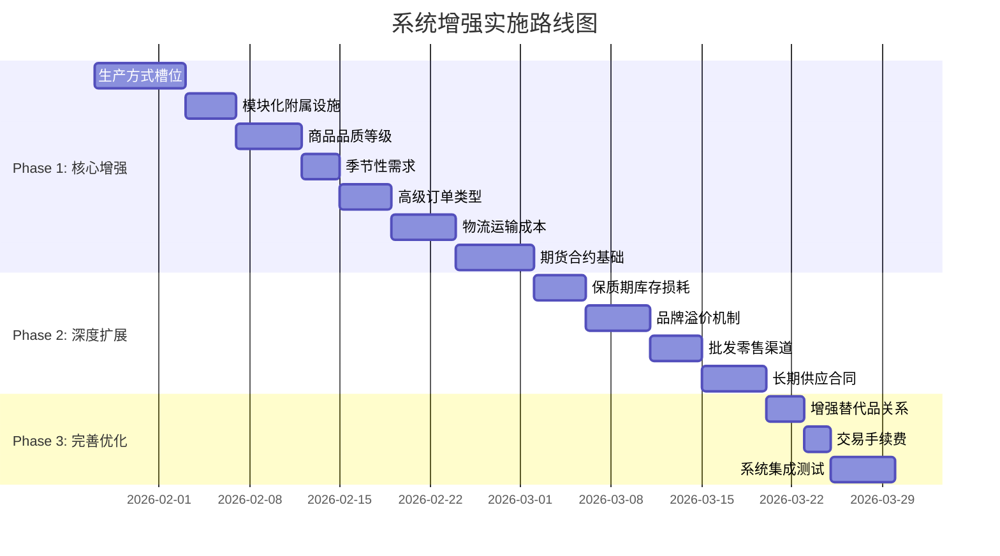

# 建筑系统、商品系统与市场交易系统增强计划

> **文档版本**: 1.1
> **创建日期**: 2026-01-26
> **更新日期**: 2026-01-26
> **文档性质**: 系统增强详细设计与实施计划
> **目标**: 全面增强三大核心系统，提升游戏深度和真实性

---

## 变更记录

| 版本 | 日期 | 变更内容 |
|------|------|----------|
| 1.0 | 2026-01-26 | 初始版本 |
| 1.1 | 2026-01-26 | 移除地理位置系统、建筑老化折旧、科技解锁树 |

---

## 目录

1. [现状分析](#一现状分析)
2. [建筑系统增强设计](#二建筑系统增强设计)
3. [商品系统增强设计](#三商品系统增强设计)
4. [市场交易系统增强设计](#四市场交易系统增强设计)
5. [数据结构变更](#五数据结构变更)
6. [实施优先级与路线图](#六实施优先级与路线图)
7. [附录：详细接口定义](#七附录详细接口定义)

---

## 一、现状分析

### 1.1 建筑系统现状

**已实现功能**：
- ✅ 40种建筑类型定义（采掘/加工/制造/服务/特殊产业链）
- ✅ 5级升级系统，产能和效率倍数
- ✅ 建造成本、建造时间、维护成本
- ✅ 人力成本、能源成本
- ✅ 配方绑定系统

**待增强功能**：
| 功能 | 当前状态 | 优先级 |
|------|----------|--------|
| 生产方式槽位系统 | ❌ 未实现 | P1 |
| 模块化/附属设施 | ❌ 未实现 | P1 |

### 1.2 商品系统现状

**已实现功能**：
- ✅ 104种商品定义（4层产业链 + 5大特殊产业链）
- ✅ 价格弹性和收入弹性参数
- ✅ 消费品标识
- ✅ 8层消费者分层系统（DemandCurve.ts）
- ✅ 替代品/互补品关系（SubstitutionSystem.ts）

**待增强功能**：
| 功能 | 当前状态 | 优先级 |
|------|----------|--------|
| 商品品质等级 | ❌ 未实现 | P1 |
| 保质期/库存损耗 | ❌ 未实现 | P2 |
| 品牌溢价机制 | ❌ 未实现 | P2 |
| 季节性需求波动 | ❌ 未实现 | P1 |
| 增强替代品关系 | ⚠️ 部分实现 | P2 |

### 1.3 市场交易系统现状

**已实现功能**：
- ✅ 基础订单簿（OrderBook.ts）
- ✅ 限价单撮合引擎（MatchingEngine.ts）
- ✅ 成交记录和市场统计
- ✅ 订单过期清理
- ✅ 库存冻结机制

**待增强功能**：
| 功能 | 当前状态 | 优先级 |
|------|----------|--------|
| 市价单/止损单 | ❌ 未实现 | P1 |
| 期货/远期合约 | ❌ 未实现 | P1 |
| 批发/零售渠道 | ❌ 未实现 | P2 |
| 物流运输成本 | ❌ 未实现 | P1 |
| 长期供应合同 | ❌ 未实现 | P2 |
| 交易手续费 | ❌ 未实现 | P3 |

---

## 二、建筑系统增强设计

### 2.1 生产方式槽位系统（Victoria 3风格）

#### 2.3.1 槽位定义

```typescript
/**
 * 生产方式槽位类型
 */
type ProductionSlotType = 
  | 'process'      // 生产工艺
  | 'automation'   // 自动化程度
  | 'energy'       // 能源来源
  | 'logistics'    // 物流方式
  | 'quality'      // 品质控制
  | 'environment'; // 环保措施

/**
 * 生产方式定义
 */
interface ProductionMethod {
  id: number;
  key: string;
  name: string;
  slotType: ProductionSlotType;
  
  // 资源修正
  inputMultipliers: Map<number, number>;   // 输入量倍数
  outputMultipliers: Map<number, number>;  // 输出量倍数
  
  // 成本修正
  laborMultiplier: number;
  energyMultiplier: number;
  maintenanceMultiplier: number;
  
  // 品质影响
  qualityBonus: number;                    // 产品品质提升
  
  // 环境影响
  pollutionMultiplier: number;
  
  // 解锁条件
  requiredLevel: number;
  requiredTech: string[];
  
  // 切换成本
  switchCooldown: number;                  // tick数
  switchCost: number;
  
  // 描述
  description: string;
}

/**
 * 建筑槽位配置
 */
interface BuildingSlotConfig {
  buildingTypeId: number;
  slots: {
    slotType: ProductionSlotType;
    availableMethods: number[];            // 可用方式ID列表
    defaultMethod: number;
  }[];
}

/**
 * 钢铁厂生产方式示例
 */
const STEEL_MILL_METHODS: ProductionMethod[] = [
  // 生产工艺槽
  {
    id: 100,
    key: 'blast_furnace',
    name: '高炉炼钢',
    slotType: 'process',
    inputMultipliers: new Map([[0, 1.0], [3, 1.0]]), // 铁矿石、煤炭标准消耗
    outputMultipliers: new Map([[14, 1.0]]),          // 钢材标准产出
    laborMultiplier: 1.0,
    energyMultiplier: 1.0,
    maintenanceMultiplier: 1.0,
    qualityBonus: 0,
    pollutionMultiplier: 1.2,
    requiredLevel: 1,
    requiredTech: [],
    switchCooldown: 48,
    switchCost: 50000,
    description: '传统高炉工艺，成本低但污染较高',
  },
  {
    id: 101,
    key: 'electric_arc',
    name: '电弧炉炼钢',
    slotType: 'process',
    inputMultipliers: new Map([[0, 0.7]]),            // 减少铁矿石消耗30%
    outputMultipliers: new Map([[14, 1.1]]),          // 产出提升10%
    laborMultiplier: 0.8,
    energyMultiplier: 1.6,
    maintenanceMultiplier: 1.2,
    qualityBonus: 0.1,
    pollutionMultiplier: 0.6,
    requiredLevel: 2,
    requiredTech: ['electric_metallurgy'],
    switchCooldown: 72,
    switchCost: 200000,
    description: '电弧炉工艺，效率高但耗电量大',
  },
  {
    id: 102,
    key: 'continuous_casting',
    name: '连铸连轧',
    slotType: 'process',
    inputMultipliers: new Map([[0, 0.85]]),
    outputMultipliers: new Map([[14, 1.25]]),
    laborMultiplier: 0.6,
    energyMultiplier: 1.3,
    maintenanceMultiplier: 1.5,
    qualityBonus: 0.2,
    pollutionMultiplier: 0.7,
    requiredLevel: 3,
    requiredTech: ['advanced_metallurgy'],
    switchCooldown: 96,
    switchCost: 500000,
    description: '连铸连轧工艺，高效率高品质',
  },
  
  // 自动化槽
  {
    id: 110,
    key: 'manual_operation',
    name: '人工操作',
    slotType: 'automation',
    inputMultipliers: new Map(),
    outputMultipliers: new Map([[14, 0.9]]),
    laborMultiplier: 1.5,
    energyMultiplier: 0.8,
    maintenanceMultiplier: 0.9,
    qualityBonus: -0.1,
    pollutionMultiplier: 1.1,
    requiredLevel: 1,
    requiredTech: [],
    switchCooldown: 12,
    switchCost: 0,
    description: '人工操作，灵活但效率较低',
  },
  {
    id: 111,
    key: 'semi_automation',
    name: '半自动化',
    slotType: 'automation',
    inputMultipliers: new Map(),
    outputMultipliers: new Map([[14, 1.0]]),
    laborMultiplier: 1.0,
    energyMultiplier: 1.0,
    maintenanceMultiplier: 1.0,
    qualityBonus: 0,
    pollutionMultiplier: 1.0,
    requiredLevel: 1,
    requiredTech: [],
    switchCooldown: 24,
    switchCost: 100000,
    description: '半自动化生产线',
  },
  {
    id: 112,
    key: 'full_automation',
    name: '全自动化',
    slotType: 'automation',
    inputMultipliers: new Map(),
    outputMultipliers: new Map([[14, 1.15]]),
    laborMultiplier: 0.4,
    energyMultiplier: 1.3,
    maintenanceMultiplier: 1.4,
    qualityBonus: 0.15,
    pollutionMultiplier: 0.9,
    requiredLevel: 3,
    requiredTech: ['industrial_robotics'],
    switchCooldown: 72,
    switchCost: 500000,
    description: '全自动化产线，低人力高效率',
  },
  {
    id: 113,
    key: 'ai_controlled',
    name: 'AI智能控制',
    slotType: 'automation',
    inputMultipliers: new Map([[0, 0.95], [3, 0.95]]),
    outputMultipliers: new Map([[14, 1.3]]),
    laborMultiplier: 0.2,
    energyMultiplier: 1.5,
    maintenanceMultiplier: 1.8,
    qualityBonus: 0.25,
    pollutionMultiplier: 0.8,
    requiredLevel: 5,
    requiredTech: ['ai_manufacturing'],
    switchCooldown: 120,
    switchCost: 2000000,
    description: 'AI控制的智能工厂，最高效率',
  },
  
  // 能源槽
  {
    id: 120,
    key: 'coal_power',
    name: '燃煤发电',
    slotType: 'energy',
    inputMultipliers: new Map([[3, 1.2]]),  // 需要额外煤炭
    outputMultipliers: new Map(),
    laborMultiplier: 1.1,
    energyMultiplier: 0.3,                   // 大幅降低电网依赖
    maintenanceMultiplier: 1.1,
    qualityBonus: 0,
    pollutionMultiplier: 1.5,
    requiredLevel: 1,
    requiredTech: [],
    switchCooldown: 72,
    switchCost: 300000,
    description: '自备燃煤发电，成本低但污染高',
  },
  {
    id: 121,
    key: 'grid_power',
    name: '电网供电',
    slotType: 'energy',
    inputMultipliers: new Map(),
    outputMultipliers: new Map(),
    laborMultiplier: 1.0,
    energyMultiplier: 1.0,
    maintenanceMultiplier: 1.0,
    qualityBonus: 0,
    pollutionMultiplier: 1.0,
    requiredLevel: 1,
    requiredTech: [],
    switchCooldown: 24,
    switchCost: 50000,
    description: '使用公共电网供电',
  },
  {
    id: 122,
    key: 'gas_power',
    name: '燃气发电',
    slotType: 'energy',
    inputMultipliers: new Map([[5, 0.5]]),  // 需要天然气
    outputMultipliers: new Map(),
    laborMultiplier: 0.95,
    energyMultiplier: 0.4,
    maintenanceMultiplier: 1.05,
    qualityBonus: 0,
    pollutionMultiplier: 0.8,
    requiredLevel: 2,
    requiredTech: ['gas_turbine'],
    switchCooldown: 48,
    switchCost: 400000,
    description: '燃气发电，清洁高效',
  },
  {
    id: 123,
    key: 'solar_power',
    name: '光伏发电',
    slotType: 'energy',
    inputMultipliers: new Map(),
    outputMultipliers: new Map(),
    laborMultiplier: 0.9,
    energyMultiplier: 0.5,
    maintenanceMultiplier: 0.8,
    qualityBonus: 0,
    pollutionMultiplier: 0.3,
    requiredLevel: 2,
    requiredTech: ['solar_energy'],
    switchCooldown: 96,
    switchCost: 800000,
    description: '光伏发电，环保但受天气影响',
  },
  
  // 品质控制槽
  {
    id: 130,
    key: 'basic_qc',
    name: '基础质检',
    slotType: 'quality',
    inputMultipliers: new Map(),
    outputMultipliers: new Map([[14, 0.98]]), // 略有损耗
    laborMultiplier: 1.0,
    energyMultiplier: 1.0,
    maintenanceMultiplier: 1.0,
    qualityBonus: 0,
    pollutionMultiplier: 1.0,
    requiredLevel: 1,
    requiredTech: [],
    switchCooldown: 12,
    switchCost: 20000,
    description: '基础质量检查',
  },
  {
    id: 131,
    key: 'standard_qc',
    name: '标准质检',
    slotType: 'quality',
    inputMultipliers: new Map(),
    outputMultipliers: new Map([[14, 0.95]]),
    laborMultiplier: 1.1,
    energyMultiplier: 1.05,
    maintenanceMultiplier: 1.1,
    qualityBonus: 0.15,
    pollutionMultiplier: 1.0,
    requiredLevel: 1,
    requiredTech: [],
    switchCooldown: 24,
    switchCost: 50000,
    description: '标准质量控制流程',
  },
  {
    id: 132,
    key: 'premium_qc',
    name: '高端质检',
    slotType: 'quality',
    inputMultipliers: new Map(),
    outputMultipliers: new Map([[14, 0.90]]),
    laborMultiplier: 1.3,
    energyMultiplier: 1.1,
    maintenanceMultiplier: 1.2,
    qualityBonus: 0.35,
    pollutionMultiplier: 1.0,
    requiredLevel: 3,
    requiredTech: ['precision_manufacturing'],
    switchCooldown: 48,
    switchCost: 150000,
    description: '严格的高端质量控制',
  },
  
  // 环保措施槽
  {
    id: 140,
    key: 'no_treatment',
    name: '无环保处理',
    slotType: 'environment',
    inputMultipliers: new Map(),
    outputMultipliers: new Map(),
    laborMultiplier: 1.0,
    energyMultiplier: 1.0,
    maintenanceMultiplier: 1.0,
    qualityBonus: 0,
    pollutionMultiplier: 1.5,
    requiredLevel: 1,
    requiredTech: [],
    switchCooldown: 12,
    switchCost: 0,
    description: '无环保处理，高污染风险',
  },
  {
    id: 141,
    key: 'basic_filter',
    name: '基础过滤',
    slotType: 'environment',
    inputMultipliers: new Map(),
    outputMultipliers: new Map(),
    laborMultiplier: 1.05,
    energyMultiplier: 1.1,
    maintenanceMultiplier: 1.15,
    qualityBonus: 0,
    pollutionMultiplier: 0.8,
    requiredLevel: 1,
    requiredTech: [],
    switchCooldown: 24,
    switchCost: 100000,
    description: '基础废气废水处理',
  },
  {
    id: 142,
    key: 'advanced_treatment',
    name: '高级处理',
    slotType: 'environment',
    inputMultipliers: new Map(),
    outputMultipliers: new Map(),
    laborMultiplier: 1.1,
    energyMultiplier: 1.2,
    maintenanceMultiplier: 1.3,
    qualityBonus: 0,
    pollutionMultiplier: 0.4,
    requiredLevel: 2,
    requiredTech: ['environmental_tech'],
    switchCooldown: 48,
    switchCost: 300000,
    description: '先进的环保处理系统',
  },
  {
    id: 143,
    key: 'zero_emission',
    name: '零排放系统',
    slotType: 'environment',
    inputMultipliers: new Map(),
    outputMultipliers: new Map(),
    laborMultiplier: 1.15,
    energyMultiplier: 1.4,
    maintenanceMultiplier: 1.5,
    qualityBonus: 0.05,
    pollutionMultiplier: 0.1,
    requiredLevel: 4,
    requiredTech: ['green_manufacturing'],
    switchCooldown: 96,
    switchCost: 800000,
    description: '近乎零排放的绿色工厂',
  },
];
```

### 2.2 模块化/附属设施

```typescript
/**
 * 附属设施类型
 */
interface Addon {
  id: number;
  key: string;
  name: string;
  type: 'storage' | 'logistics' | 'utility' | 'research' | 'welfare';
  
  // 可附加的建筑类型
  compatibleBuildings: number[];
  
  // 建造成本
  buildCost: number;
  buildTime: number;
  maintenanceCost: number;
  
  // 效果
  effects: {
    storageCapacity?: number;       // 增加存储容量
    productivityBonus?: number;     // 生产效率加成
    qualityBonus?: number;          // 品质加成
    workerSatisfaction?: number;    // 员工满意度
    researchSpeed?: number;         // 研发速度
    energyEfficiency?: number;      // 能源效率
    maintenanceReduction?: number;  // 维护成本降低
  };
  
  // 限制
  maxPerBuilding: number;
  requiredLevel: number;
  
  description: string;
}

const ADDONS: Addon[] = [
  {
    id: 1,
    key: 'warehouse_extension',
    name: '仓库扩建',
    type: 'storage',
    compatibleBuildings: [8, 9, 10, 16, 17, 18, 19], // 工厂类
    buildCost: 200000,
    buildTime: 48,
    maintenanceCost: 500,
    effects: {
      storageCapacity: 1000,
    },
    maxPerBuilding: 3,
    requiredLevel: 1,
    description: '扩展原料和成品仓储容量',
  },
  {
    id: 2,
    key: 'loading_dock',
    name: '装卸码头',
    type: 'logistics',
    compatibleBuildings: [8, 9, 10, 16, 17, 18, 19, 22],
    buildCost: 350000,
    buildTime: 72,
    maintenanceCost: 800,
    effects: {
      productivityBonus: 0.05,
    },
    maxPerBuilding: 2,
    requiredLevel: 2,
    description: '提高物流效率，加快进出货速度',
  },
  {
    id: 3,
    key: 'solar_panel_array',
    name: '太阳能板阵列',
    type: 'utility',
    compatibleBuildings: [], // 所有建筑
    buildCost: 500000,
    buildTime: 96,
    maintenanceCost: 200,
    effects: {
      energyEfficiency: 0.15,
    },
    maxPerBuilding: 1,
    requiredLevel: 2,
    description: '自发电设施，降低能源成本',
  },
  {
    id: 4,
    key: 'rd_lab',
    name: '研发实验室',
    type: 'research',
    compatibleBuildings: [16, 17, 30, 37, 38, 39], // 高科技建筑
    buildCost: 800000,
    buildTime: 120,
    maintenanceCost: 2000,
    effects: {
      researchSpeed: 0.2,
      qualityBonus: 0.1,
    },
    maxPerBuilding: 1,
    requiredLevel: 3,
    description: '产品研发实验室，加速技术升级',
  },
  {
    id: 5,
    key: 'staff_canteen',
    name: '员工食堂',
    type: 'welfare',
    compatibleBuildings: [], // 所有建筑
    buildCost: 150000,
    buildTime: 36,
    maintenanceCost: 1000,
    effects: {
      workerSatisfaction: 0.15,
      productivityBonus: 0.03,
    },
    maxPerBuilding: 1,
    requiredLevel: 1,
    description: '提供员工餐饮，提升满意度',
  },
  {
    id: 6,
    key: 'maintenance_bay',
    name: '维护车间',
    type: 'utility',
    compatibleBuildings: [8, 9, 10, 14, 15, 16, 17, 18, 19, 20, 21],
    buildCost: 300000,
    buildTime: 60,
    maintenanceCost: 600,
    effects: {
      maintenanceReduction: 0.2,
    },
    maxPerBuilding: 1,
    requiredLevel: 2,
    description: '自有维护设施，降低维护成本',
  },
];
```

---

## 三、商品系统增强设计

### 3.1 商品品质等级系统

```typescript
/**
 * 品质等级定义
 */
type QualityGrade = 'standard' | 'quality' | 'premium' | 'luxury';

interface QualityDefinition {
  grade: QualityGrade;
  name: string;
  priceMultiplier: number;      // 价格倍数
  demandMultiplier: number;     // 需求倍数（相对于标准品）
  productionCostMultiplier: number; // 生产成本倍数
  shelfLifeMultiplier: number;  // 保质期倍数
  
  // 品质要求
  minBuildingLevel: number;
  minQualityBonus: number;      // 生产方式品质加成要求
  
  // 消费者偏好
  consumerTierPreference: number[]; // 各收入层偏好系数
}

const QUALITY_GRADES: QualityDefinition[] = [
  {
    grade: 'standard',
    name: '标准品',
    priceMultiplier: 1.0,
    demandMultiplier: 1.0,
    productionCostMultiplier: 1.0,
    shelfLifeMultiplier: 1.0,
    minBuildingLevel: 1,
    minQualityBonus: 0,
    consumerTierPreference: [1.0, 0.9, 0.7, 0.5, 0.3, 0.2, 0.1, 0.05],
  },
  {
    grade: 'quality',
    name: '优质品',
    priceMultiplier: 1.35,
    demandMultiplier: 0.6,
    productionCostMultiplier: 1.2,
    shelfLifeMultiplier: 1.3,
    minBuildingLevel: 2,
    minQualityBonus: 0.15,
    consumerTierPreference: [0.3, 0.5, 0.8, 1.0, 0.9, 0.7, 0.5, 0.3],
  },
  {
    grade: 'premium',
    name: '高端品',
    priceMultiplier: 1.8,
    demandMultiplier: 0.3,
    productionCostMultiplier: 1.5,
    shelfLifeMultiplier: 1.5,
    minBuildingLevel: 3,
    minQualityBonus: 0.35,
    consumerTierPreference: [0.1, 0.2, 0.4, 0.6, 0.9, 1.0, 0.9, 0.7],
  },
  {
    grade: 'luxury',
    name: '奢华品',
    priceMultiplier: 3.0,
    demandMultiplier: 0.1,
    productionCostMultiplier: 2.0,
    shelfLifeMultiplier: 2.0,
    minBuildingLevel: 4,
    minQualityBonus: 0.5,
    consumerTierPreference: [0.02, 0.05, 0.1, 0.2, 0.4, 0.7, 1.0, 1.0],
  },
];

/**
 * 判定生产出的品质等级
 */
function determineQualityGrade(
  buildingLevel: number,
  qualityBonus: number,
  randomFactor: number = Math.random()
): QualityGrade {
  // 基于建筑等级和品质加成计算品质得分
  const qualityScore = buildingLevel * 0.15 + qualityBonus;
  
  // 加入随机因素（±15%）
  const adjustedScore = qualityScore * (0.85 + randomFactor * 0.3);
  
  if (adjustedScore >= 0.5 && randomFactor > 0.85) {
    return 'luxury';
  } else if (adjustedScore >= 0.35) {
    return 'premium';
  } else if (adjustedScore >= 0.15) {
    return 'quality';
  } else {
    return 'standard';
  }
}

/**
 * 品质库存结构
 * 每种商品按品质分开存储
 */
interface QualityInventory {
  goodsId: number;
  quantities: {
    [K in QualityGrade]: number;
  };
  // 生产批次追踪（用于保质期）
  batches: ProductionBatch[];
}

interface ProductionBatch {
  id: number;
  grade: QualityGrade;
  quantity: number;
  producedTick: number;
  expiryTick: number;
  cost: number;               // 单位成本
  buildingId: number;         // 生产建筑
}
```

### 3.2 保质期/库存损耗系统

```typescript
/**
 * 商品保质期配置
 */
interface ShelfLifeConfig {
  goodsId: number;
  hasShelfLife: boolean;
  baseDays: number;           // 基础保质期（游戏日）
  temperatureSensitive: boolean;
  degradationType: 'linear' | 'exponential' | 'cliff';
  
  // 存储条件
  optimalConditions: {
    temperature?: 'frozen' | 'cold' | 'room' | 'any';
    humidity?: 'dry' | 'moderate' | 'any';
  };
  
  // 条件不满足时的损耗
  poorConditionMultiplier: number; // 保质期缩短倍数
}

/**
 * 商品保质期预设
 */
const SHELF_LIFE_CONFIGS: Partial<Record<number, ShelfLifeConfig>> = {
  // 食品类
  8: { goodsId: 8, hasShelfLife: true, baseDays: 90, temperatureSensitive: true, degradationType: 'linear', optimalConditions: { temperature: 'room', humidity: 'dry' }, poorConditionMultiplier: 0.5 },
  44: { goodsId: 44, hasShelfLife: true, baseDays: 30, temperatureSensitive: true, degradationType: 'cliff', optimalConditions: { temperature: 'cold' }, poorConditionMultiplier: 0.3 },
  58: { goodsId: 58, hasShelfLife: true, baseDays: 14, temperatureSensitive: true, degradationType: 'exponential', optimalConditions: { temperature: 'cold' }, poorConditionMultiplier: 0.2 },
  59: { goodsId: 59, hasShelfLife: true, baseDays: 21, temperatureSensitive: true, degradationType: 'exponential', optimalConditions: { temperature: 'cold' }, poorConditionMultiplier: 0.25 },
  63: { goodsId: 63, hasShelfLife: true, baseDays: 7, temperatureSensitive: true, degradationType: 'cliff', optimalConditions: { temperature: 'frozen' }, poorConditionMultiplier: 0.1 },
  64: { goodsId: 64, hasShelfLife: true, baseDays: 14, temperatureSensitive: true, degradationType: 'exponential', optimalConditions: { temperature: 'cold' }, poorConditionMultiplier: 0.2 },
  65: { goodsId: 65, hasShelfLife: true, baseDays: 180, temperatureSensitive: true, degradationType: 'cliff', optimalConditions: { temperature: 'frozen' }, poorConditionMultiplier: 0.1 },
  
  // 药品类
  73: { goodsId: 73, hasShelfLife: true, baseDays: 365, temperatureSensitive: true, degradationType: 'cliff', optimalConditions: { temperature: 'cold' }, poorConditionMultiplier: 0.3 },
  74: { goodsId: 74, hasShelfLife: true, baseDays: 730, temperatureSensitive: false, degradationType: 'cliff', optimalConditions: { temperature: 'room' }, poorConditionMultiplier: 0.5 },
  
  // 化学品
  20: { goodsId: 20, hasShelfLife: true, baseDays: 180, temperatureSensitive: false, degradationType: 'linear', optimalConditions: { humidity: 'dry' }, poorConditionMultiplier: 0.6 },
};

/**
 * 计算库存损耗
 */
function calculateInventoryLoss(
  batches: ProductionBatch[],
  currentTick: number,
  storageConditions: StorageConditions
): InventoryLossResult {
  const losses: { batchId: number; lostQuantity: number; reason: string }[] = [];
  let totalLoss = 0;
  
  for (const batch of batches) {
    const config = SHELF_LIFE_CONFIGS[batch.goodsId];
    if (!config || !config.hasShelfLife) continue;
    
    // 检查是否过期
    if (currentTick >= batch.expiryTick) {
      losses.push({
        batchId: batch.id,
        lostQuantity: batch.quantity,
        reason: '已过期',
      });
      totalLoss += batch.quantity;
      continue;
    }
    
    // 计算劣化损耗
    const age = currentTick - batch.producedTick;
    const maxAge = batch.expiryTick - batch.producedTick;
    const ageRatio = age / maxAge;
    
    let dailyLoss = 0;
    switch (config.degradationType) {
      case 'linear':
        dailyLoss = batch.quantity * 0.001 * ageRatio; // 线性增加
        break;
      case 'exponential':
        dailyLoss = batch.quantity * 0.0005 * Math.exp(ageRatio * 2);
        break;
      case 'cliff':
        if (ageRatio > 0.9) {
          dailyLoss = batch.quantity * 0.05; // 临近过期快速损耗
        }
        break;
    }
    
    // 存储条件影响
    const conditionMultiplier = evaluateStorageConditions(config, storageConditions);
    dailyLoss *= conditionMultiplier;
    
    if (dailyLoss > 0.01) {
      losses.push({
        batchId: batch.id,
        lostQuantity: dailyLoss,
        reason: '自然损耗',
      });
      totalLoss += dailyLoss;
    }
  }
  
  return { losses, totalLoss };
}
```

### 3.3 品牌溢价机制

```typescript
/**
 * 品牌定义
 */
interface Brand {
  id: number;
  name: string;
  ownerId: number;            // 所属公司
  goodsCategories: string[];  // 覆盖的商品类别
  
  // 品牌属性
  awareness: number;          // 知名度 0-100
  reputation: number;         // 口碑 0-100
  loyalty: number;            // 忠诚度 0-100
  
  // 定位
  positioning: 'budget' | 'value' | 'standard' | 'premium' | 'luxury';
  
  // 历史数据
  salesHistory: number[];
  qualityHistory: number[];
  
  // 效果
  priceMultiplier: number;    // 可收取的价格溢价
  demandMultiplier: number;   // 需求提升
}

/**
 * 计算品牌价值
 */
function calculateBrandValue(brand: Brand): number {
  // 品牌价值 = 知名度 × 口碑 × 忠诚度 × 定位系数
  const positioningMultiplier: Record<string, number> = {
    'budget': 0.5,
    'value': 0.8,
    'standard': 1.0,
    'premium': 1.5,
    'luxury': 2.5,
  };
  
  return (brand.awareness / 100) * (brand.reputation / 100) * 
         (brand.loyalty / 100) * positioningMultiplier[brand.positioning] * 1000000;
}

/**
 * 更新品牌属性
 */
function updateBrand(brand: Brand, events: BrandEvent[]): void {
  for (const event of events) {
    switch (event.type) {
      case 'quality_complaint':
        brand.reputation -= 2;
        brand.loyalty -= 1;
        break;
      case 'quality_praise':
        brand.reputation += 1;
        brand.loyalty += 0.5;
        break;
      case 'advertising':
        brand.awareness += event.amount * 0.01;
        break;
      case 'price_increase':
        brand.awareness += 0.5;
        brand.loyalty -= 1;
        break;
      case 'price_decrease':
        brand.loyalty += 0.5;
        break;
      case 'scandal':
        brand.reputation -= 10;
        brand.awareness += 5; // 负面也是曝光
        brand.loyalty -= 5;
        break;
    }
  }
  
  // 限制范围
  brand.awareness = Math.max(0, Math.min(100, brand.awareness));
  brand.reputation = Math.max(0, Math.min(100, brand.reputation));
  brand.loyalty = Math.max(0, Math.min(100, brand.loyalty));
  
  // 重新计算效果
  brand.priceMultiplier = 1 + (brand.reputation / 100) * 0.5;
  brand.demandMultiplier = 1 + (brand.awareness / 100) * (brand.loyalty / 100) * 0.3;
}
```

### 3.4 季节性需求波动

```typescript
/**
 * 季节定义
 */
type Season = 'spring' | 'summer' | 'autumn' | 'winter';

/**
 * 季节性需求配置
 */
interface SeasonalDemand {
  goodsId: number;
  seasonalFactors: {
    [K in Season]: number;    // 需求倍数
  };
  peakMonths?: number[];      // 需求高峰月份（1-12）
  troughMonths?: number[];    // 需求低谷月份
}

const SEASONAL_DEMANDS: SeasonalDemand[] = [
  // 空调/制冷
  { goodsId: 40, seasonalFactors: { spring: 1.0, summer: 1.8, autumn: 0.8, winter: 0.5 }, peakMonths: [6, 7, 8] },
  
  // 暖气设备
  { goodsId: 40, seasonalFactors: { spring: 0.6, summer: 0.3, autumn: 1.2, winter: 1.8 }, peakMonths: [11, 12, 1, 2] },
  
  // 服装
  { goodsId: 43, seasonalFactors: { spring: 1.3, summer: 0.8, autumn: 1.3, winter: 1.0 }, peakMonths: [3, 4, 9, 10] },
  
  // 饮料
  { goodsId: 45, seasonalFactors: { spring: 1.0, summer: 1.6, autumn: 0.9, winter: 0.7 }, peakMonths: [6, 7, 8] },
  
  // 新鲜蔬菜
  { goodsId: 58, seasonalFactors: { spring: 1.2, summer: 1.0, autumn: 1.1, winter: 0.8 } },
  
  // 水果
  { goodsId: 59, seasonalFactors: { spring: 0.9, summer: 1.4, autumn: 1.2, winter: 0.7 } },
  
  // 燃油
  { goodsId: 25, seasonalFactors: { spring: 1.0, summer: 1.1, autumn: 1.0, winter: 1.2 } },
  
  // 电力
  { goodsId: 57, seasonalFactors: { spring: 0.9, summer: 1.4, autumn: 0.9, winter: 1.3 } },
  
  // 汽车（春节/年底购车潮）
  { goodsId: 41, seasonalFactors: { spring: 0.9, summer: 0.8, autumn: 1.0, winter: 1.3 }, peakMonths: [1, 2, 12] },
  { goodsId: 42, seasonalFactors: { spring: 0.9, summer: 0.8, autumn: 1.0, winter: 1.3 }, peakMonths: [1, 2, 12] },
];

/**
 * 获取当前季节
 */
function getCurrentSeason(tick: number): Season {
  const dayOfYear = Math.floor(tick / 24) % 365;
  if (dayOfYear < 90) return 'spring';
  if (dayOfYear < 180) return 'summer';
  if (dayOfYear < 270) return 'autumn';
  return 'winter';
}

/**
 * 计算季节性需求修正
 */
function calculateSeasonalDemand(
  goodsId: number,
  baseDemand: number,
  tick: number
): number {
  const config = SEASONAL_DEMANDS.find(s => s.goodsId === goodsId);
  if (!config) return baseDemand;
  
  const season = getCurrentSeason(tick);
  const seasonFactor = config.seasonalFactors[season];
  
  // 检查是否为高峰/低谷月份
  const month = Math.floor((tick / 24 / 30) % 12) + 1;
  let monthFactor = 1.0;
  if (config.peakMonths?.includes(month)) {
    monthFactor = 1.15;
  } else if (config.troughMonths?.includes(month)) {
    monthFactor = 0.85;
  }
  
  return baseDemand * seasonFactor * monthFactor;
}
```

---

## 四、市场交易系统增强设计

### 4.1 高级订单类型

```typescript
/**
 * 订单类型枚举
 */
type OrderType = 
  | 'limit'           // 限价单
  | 'market'          // 市价单
  | 'stop'            // 止损单
  | 'stop_limit'      // 止损限价单
  | 'trailing_stop'   // 追踪止损
  | 'iceberg'         // 冰山订单
  | 'twap'            // 时间加权平均价格
  | 'vwap';           // 成交量加权平均价格

/**
 * 增强订单接口
 */
interface EnhancedOrder {
  id: number;
  companyId: number;
  goodsId: number;
  side: 'buy' | 'sell';
  orderType: OrderType;
  
  // 价格参数
  price?: number;             // 限价
  stopPrice?: number;         // 触发价格
  trailingAmount?: number;    // 追踪金额
  
  // 数量参数
  quantity: number;
  remaining: number;
  displayQuantity?: number;   // 冰山单显示数量
  
  // 时间参数
  createdTick: number;
  expiryTick: number;
  timeInForce: 'GTC' | 'IOC' | 'FOK' | 'GTD';  // 有效期类型
  
  // 状态
  status: 'pending' | 'active' | 'partial' | 'filled' | 'cancelled' | 'expired';
  filledQuantity: number;
  avgFillPrice: number;
  
  // TWAP/VWAP参数
  executionWindow?: number;   // 执行时间窗口（tick）
  sliceCount?: number;        // 分片数量
  
  // 手续费
  commission: number;
}

/**
 * 市价单处理
 */
function executeMarketOrder(
  order: EnhancedOrder,
  orderBook: OrderBook
): Trade[] {
  const trades: Trade[] = [];
  const oppositeOrders = order.side === 'buy' 
    ? orderBook.sellOrders 
    : orderBook.buyOrders;
  
  let remaining = order.remaining;
  
  for (const opposite of oppositeOrders) {
    if (remaining <= 0) break;
    
    const matchQty = Math.min(remaining, opposite.remaining);
    const matchPrice = opposite.price;
    
    trades.push(createTrade(order, opposite, matchQty, matchPrice));
    
    remaining -= matchQty;
    opposite.remaining -= matchQty;
  }
  
  order.remaining = remaining;
  order.filledQuantity = order.quantity - remaining;
  order.status = remaining === 0 ? 'filled' : 'partial';
  
  return trades;
}

/**
 * 止损单处理
 */
function processStopOrders(
  stopOrders: EnhancedOrder[],
  currentPrice: number
): EnhancedOrder[] {
  const triggeredOrders: EnhancedOrder[] = [];
  
  for (const order of stopOrders) {
    if (order.status !== 'pending') continue;
    
    let triggered = false;
    
    if (order.side === 'sell' && currentPrice <= order.stopPrice!) {
      triggered = true;
    } else if (order.side === 'buy' && currentPrice >= order.stopPrice!) {
      triggered = true;
    }
    
    if (triggered) {
      order.status = 'active';
      if (order.orderType === 'stop') {
        // 转换为市价单
        order.orderType = 'market';
      } else if (order.orderType === 'stop_limit') {
        // 转换为限价单
        order.orderType = 'limit';
      }
      triggeredOrders.push(order);
    }
  }
  
  return triggeredOrders;
}

/**
 * TWAP订单执行
 */
function executeTWAPOrder(
  order: EnhancedOrder,
  currentTick: number
): EnhancedOrder | null {
  const elapsed = currentTick - order.createdTick;
  const window = order.executionWindow!;
  const slices = order.sliceCount!;
  const sliceInterval = window / slices;
  
  // 检查是否到达执行时间
  const currentSlice = Math.floor(elapsed / sliceInterval);
  const expectedFilled = (order.quantity / slices) * currentSlice;
  
  if (order.filledQuantity < expectedFilled) {
    // 需要执行本次分片
    const sliceOrder: EnhancedOrder = {
      ...order,
      id: order.id * 1000 + currentSlice,
      orderType: 'market',
      quantity: order.quantity / slices,
      remaining: order.quantity / slices,
    };
    return sliceOrder;
  }
  
  return null;
}
```

### 4.2 期货/远期合约系统

```typescript
/**
 * 期货合约定义
 */
interface FuturesContract {
  id: number;
  symbol: string;             // 如 "STEEL-2026-06"
  underlyingGoodsId: number;
  
  // 合约规格
  contractSize: number;       // 合约单位
  tickSize: number;           // 最小变动价位
  
  // 时间
  createdTick: number;
  expiryTick: number;
  settlementTick: number;
  
  // 保证金
  initialMargin: number;      // 初始保证金比例
  maintenanceMargin: number;  // 维持保证金比例
  
  // 交割方式
  deliveryType: 'physical' | 'cash';
  
  // 市场数据
  lastPrice: number;
  settlementPrice: number;
  openInterest: number;       // 持仓量
  volume: number;
  
  // 涨跌停
  priceLimit: number;         // 涨跌停幅度
}

/**
 * 期货持仓
 */
interface FuturesPosition {
  id: number;
  companyId: number;
  contractId: number;
  
  side: 'long' | 'short';
  quantity: number;
  averagePrice: number;
  
  // 保证金
  marginDeposited: number;
  unrealizedPnL: number;
  
  // 状态
  status: 'open' | 'closed' | 'liquidated';
}

/**
 * 期货订单
 */
interface FuturesOrder {
  id: number;
  companyId: number;
  contractId: number;
  
  side: 'buy' | 'sell';
  openClose: 'open' | 'close';
  orderType: 'limit' | 'market' | 'stop';
  
  price?: number;
  quantity: number;
  remaining: number;
  
  status: 'pending' | 'active' | 'filled' | 'cancelled';
}

/**
 * 计算保证金要求
 */
function calculateMarginRequirement(
  contract: FuturesContract,
  position: FuturesPosition,
  currentPrice: number
): { initial: number; maintenance: number; call: boolean } {
  const notionalValue = position.quantity * contract.contractSize * currentPrice;
  const initial = notionalValue * contract.initialMargin;
  const maintenance = notionalValue * contract.maintenanceMargin;
  
  // 计算浮动盈亏
  const priceDiff = position.side === 'long' 
    ? currentPrice - position.averagePrice 
    : position.averagePrice - currentPrice;
  position.unrealizedPnL = priceDiff * position.quantity * contract.contractSize;
  
  // 判断是否需要追加保证金
  const effectiveMargin = position.marginDeposited + position.unrealizedPnL;
  const call = effectiveMargin < maintenance;
  
  return { initial, maintenance, call };
}

/**
 * 合约到期交割
 */
function settleContract(
  contract: FuturesContract,
  positions: FuturesPosition[],
  spotPrice: number
): SettlementResult[] {
  const results: SettlementResult[] = [];
  
  for (const position of positions) {
    if (position.status !== 'open') continue;
    
    if (contract.deliveryType === 'cash') {
      // 现金交割
      const pnl = position.unrealizedPnL;
      results.push({
        positionId: position.id,
        type: 'cash',
        amount: pnl,
        goodsDelivered: 0,
      });
    } else {
      // 实物交割
      const goodsAmount = position.quantity * contract.contractSize;
      if (position.side === 'long') {
        // 多头收货付款
        results.push({
          positionId: position.id,
          type: 'physical',
          amount: -goodsAmount * spotPrice,
          goodsDelivered: goodsAmount,
        });
      } else {
        // 空头交货收款
        results.push({
          positionId: position.id,
          type: 'physical',
          amount: goodsAmount * spotPrice,
          goodsDelivered: -goodsAmount,
        });
      }
    }
    
    position.status = 'closed';
  }
  
  return results;
}
```

### 4.3 批发/零售渠道系统

```typescript
/**
 * 销售渠道类型
 */
type ChannelType = 'wholesale' | 'retail' | 'direct' | 'export' | 'government';

/**
 * 销售渠道定义
 */
interface SalesChannel {
  id: number;
  type: ChannelType;
  name: string;
  
  // 价格因素
  priceMultiplier: number;    // 价格倍数（零售>批发）
  volumeThreshold: number;    // 最小交易量
  
  // 成本因素
  commissionRate: number;     // 渠道佣金
  marketingCost: number;      // 营销成本
  logisticsCost: number;      // 物流成本
  
  // 需求特征
  demandStability: number;    // 需求稳定性 0-1
  paymentTerms: number;       // 账期（tick）
  
  // 准入条件
  minReputation: number;
  minBrandAwareness: number;
  
  // 适用商品
  applicableCategories: string[];
}

const SALES_CHANNELS: SalesChannel[] = [
  {
    id: 1,
    type: 'wholesale',
    name: '批发渠道',
    priceMultiplier: 1.0,
    volumeThreshold: 100,
    commissionRate: 0.03,
    marketingCost: 0,
    logisticsCost: 0.02,
    demandStability: 0.8,
    paymentTerms: 30 * 24,    // 30天账期
    minReputation: 20,
    minBrandAwareness: 0,
    applicableCategories: ['raw', 'basic', 'intermediate'],
  },
  {
    id: 2,
    type: 'retail',
    name: '零售渠道',
    priceMultiplier: 1.5,
    volumeThreshold: 1,
    commissionRate: 0.15,
    marketingCost: 0.05,
    logisticsCost: 0.08,
    demandStability: 0.5,
    paymentTerms: 0,          // 即时结算
    minReputation: 40,
    minBrandAwareness: 20,
    applicableCategories: ['final'],
  },
  {
    id: 3,
    type: 'direct',
    name: '直销渠道',
    priceMultiplier: 1.3,
    volumeThreshold: 10,
    commissionRate: 0,
    marketingCost: 0.1,
    logisticsCost: 0.1,
    demandStability: 0.6,
    paymentTerms: 0,
    minReputation: 30,
    minBrandAwareness: 30,
    applicableCategories: ['final'],
  },
  {
    id: 4,
    type: 'export',
    name: '出口渠道',
    priceMultiplier: 1.2,
    volumeThreshold: 500,
    commissionRate: 0.05,
    marketingCost: 0.02,
    logisticsCost: 0.15,
    demandStability: 0.4,
    paymentTerms: 60 * 24,    // 60天账期
    minReputation: 50,
    minBrandAwareness: 10,
    applicableCategories: ['basic', 'intermediate', 'final'],
  },
  {
    id: 5,
    type: 'government',
    name: '政府采购',
    priceMultiplier: 1.1,
    volumeThreshold: 1000,
    commissionRate: 0.02,
    marketingCost: 0.01,
    logisticsCost: 0.05,
    demandStability: 0.95,
    paymentTerms: 90 * 24,    // 90天账期
    minReputation: 70,
    minBrandAwareness: 0,
    applicableCategories: ['basic', 'intermediate', 'final'],
  },
];

/**
 * 计算渠道利润
 */
function calculateChannelProfit(
  channel: SalesChannel,
  basePrice: number,
  quantity: number,
  cost: number
): ChannelProfitAnalysis {
  const revenue = basePrice * channel.priceMultiplier * quantity;
  const commission = revenue * channel.commissionRate;
  const marketing = revenue * channel.marketingCost;
  const logistics = revenue * channel.logisticsCost;
  const totalCost = cost * quantity + commission + marketing + logistics;
  const profit = revenue - totalCost;
  
  return {
    revenue,
    costs: {
      production: cost * quantity,
      commission,
      marketing,
      logistics,
    },
    profit,
    margin: profit / revenue,
    effectivePrice: (revenue - commission - marketing - logistics) / quantity,
  };
}
```

### 4.4 物流运输成本系统

```typescript
/**
 * 运输方式
 */
type TransportMode = 'road' | 'rail' | 'sea' | 'air' | 'pipeline';

/**
 * 运输路线
 */
interface TransportRoute {
  id: number;
  fromRegion: number;
  toRegion: number;
  mode: TransportMode;
  
  // 成本参数
  baseCost: number;           // 基础成本
  costPerUnit: number;        // 单位成本
  costPerDistance: number;    // 距离成本
  distance: number;           // 距离（km）
  
  // 时间参数
  baseTime: number;           // 基础时间（tick）
  timePerDistance: number;    // 距离时间
  
  // 容量限制
  maxCapacity: number;        // 最大运量
  
  // 商品限制
  allowedCategories: string[];
  prohibitedGoods: number[];
  
  // 可靠性
  reliability: number;        // 0-1，1为完全可靠
  delayRisk: number;          // 延误风险
}

/**
 * 运输订单
 */
interface ShipmentOrder {
  id: number;
  companyId: number;
  goodsId: number;
  quantity: number;
  
  fromRegion: number;
  toRegion: number;
  routeId: number;
  
  // 时间
  createdTick: number;
  estimatedArrival: number;
  actualArrival?: number;
  
  // 成本
  shippingCost: number;
  insuranceCost: number;
  
  // 状态
  status: 'pending' | 'in_transit' | 'delivered' | 'delayed' | 'lost';
  
  // 损耗
  expectedLoss: number;       // 预期损耗
  actualLoss?: number;        // 实际损耗
}

/**
 * 计算运输成本
 */
function calculateShippingCost(
  route: TransportRoute,
  goodsId: number,
  quantity: number
): ShippingCostBreakdown {
  const goods = GOODS_BY_ID.get(goodsId);
  const baseValue = goods ? goods.basePrice * quantity : 0;
  
  // 运费
  const transportCost = route.baseCost + 
    route.costPerUnit * quantity + 
    route.costPerDistance * route.distance;
  
  // 保险（按价值比例）
  const insuranceRate = route.mode === 'sea' ? 0.005 : 
                        route.mode === 'air' ? 0.003 : 0.002;
  const insuranceCost = baseValue * insuranceRate;
  
  // 装卸费
  const handlingCost = quantity * 0.5;
  
  // 仓储费（基于预计时间）
  const transitTime = route.baseTime + route.timePerDistance * route.distance;
  const storageCost = quantity * 0.1 * (transitTime / 24);
  
  // 延误风险成本
  const riskCost = baseValue * route.delayRisk * 0.02;
  
  return {
    transportCost,
    insuranceCost,
    handlingCost,
    storageCost,
    riskCost,
    totalCost: transportCost + insuranceCost + handlingCost + storageCost + riskCost,
    transitTime,
    costPerUnit: (transportCost + insuranceCost + handlingCost) / quantity,
  };
}

/**
 * 运输模式比较
 */
const TRANSPORT_MODES: Record<TransportMode, TransportModeConfig> = {
  road: {
    baseCostMultiplier: 1.0,
    speedMultiplier: 1.0,
    capacityMultiplier: 1.0,
    reliabilityMultiplier: 0.95,
    applicableDistance: { min: 0, max: 1000 },
  },
  rail: {
    baseCostMultiplier: 0.7,
    speedMultiplier: 0.8,
    capacityMultiplier: 5.0,
    reliabilityMultiplier: 0.98,
    applicableDistance: { min: 100, max: 3000 },
  },
  sea: {
    baseCostMultiplier: 0.4,
    speedMultiplier: 0.3,
    capacityMultiplier: 50.0,
    reliabilityMultiplier: 0.90,
    applicableDistance: { min: 500, max: 20000 },
  },
  air: {
    baseCostMultiplier: 3.0,
    speedMultiplier: 5.0,
    capacityMultiplier: 0.2,
    reliabilityMultiplier: 0.99,
    applicableDistance: { min: 200, max: 15000 },
  },
  pipeline: {
    baseCostMultiplier: 0.3,
    speedMultiplier: 2.0,
    capacityMultiplier: 10.0,
    reliabilityMultiplier: 0.995,
    applicableDistance: { min: 50, max: 5000 },
  },
};
```

### 4.5 长期供应合同机制

```typescript
/**
 * 供应合同类型
 */
type ContractType = 
  | 'fixed_price'       // 固定价格
  | 'cost_plus'         // 成本加成
  | 'index_linked'      // 指数挂钩
  | 'floor_ceiling'     // 上下限
  | 'take_or_pay';      // 照付不议

/**
 * 供应合同
 */
interface SupplyContract {
  id: number;
  supplierId: number;
  buyerId: number;
  
  goodsId: number;
  contractType: ContractType;
  
  // 数量条款
  minQuantity: number;        // 最小采购量
  maxQuantity: number;        // 最大采购量
  targetQuantity: number;     // 目标采购量
  
  // 价格条款
  basePrice: number;
  priceFormula?: {
    indexGoodsId?: number;    // 挂钩商品
    costBasis?: number;       // 成本基础
    margin?: number;          // 利润率
    floor?: number;           // 价格下限
    ceiling?: number;         // 价格上限
  };
  
  // 时间条款
  startTick: number;
  endTick: number;
  deliveryFrequency: number;  // 交货周期（tick）
  
  // 违约条款
  penaltyRate: number;        // 违约金率
  terminationClauses: string[];
  
  // 执行状态
  deliveredQuantity: number;
  remainingQuantity: number;
  status: 'active' | 'completed' | 'terminated' | 'disputed';
  
  // 历史
  deliveryHistory: ContractDelivery[];
}

/**
 * 合同交货记录
 */
interface ContractDelivery {
  tick: number;
  quantity: number;
  price: number;
  quality: QualityGrade;
  onTime: boolean;
}

/**
 * 计算合同价格
 */
function calculateContractPrice(
  contract: SupplyContract,
  currentTick: number,
  marketPrices: Map<number, number>
): number {
  switch (contract.contractType) {
    case 'fixed_price':
      return contract.basePrice;
      
    case 'cost_plus':
      const cost = contract.priceFormula?.costBasis || contract.basePrice;
      const margin = contract.priceFormula?.margin || 0.1;
      return cost * (1 + margin);
      
    case 'index_linked':
      const indexGoods = contract.priceFormula?.indexGoodsId;
      const indexPrice = indexGoods ? marketPrices.get(indexGoods) || 100 : 100;
      const ratio = indexPrice / 100;
      return contract.basePrice * ratio;
      
    case 'floor_ceiling':
      let price = marketPrices.get(contract.goodsId) || contract.basePrice;
      const floor = contract.priceFormula?.floor || contract.basePrice * 0.8;
      const ceiling = contract.priceFormula?.ceiling || contract.basePrice * 1.2;
      return Math.max(floor, Math.min(ceiling, price));
      
    case 'take_or_pay':
      return contract.basePrice;
      
    default:
      return contract.basePrice;
  }
}

/**
 * 检查合同履行情况
 */
function checkContractCompliance(
  contract: SupplyContract,
  currentTick: number
): ContractComplianceReport {
  const elapsed = currentTick - contract.startTick;
  const duration = contract.endTick - contract.startTick;
  const progress = elapsed / duration;
  
  const expectedDelivered = contract.targetQuantity * progress;
  const actualDelivered = contract.deliveredQuantity;
  const variance = actualDelivered - expectedDelivered;
  
  const onTimeDeliveries = contract.deliveryHistory.filter(d => d.onTime).length;
  const totalDeliveries = contract.deliveryHistory.length;
  const onTimeRate = totalDeliveries > 0 ? onTimeDeliveries / totalDeliveries : 1;
  
  let status: 'compliant' | 'warning' | 'breach';
  if (variance < -expectedDelivered * 0.2) {
    status = 'breach';
  } else if (variance < -expectedDelivered * 0.1 || onTimeRate < 0.8) {
    status = 'warning';
  } else {
    status = 'compliant';
  }
  
  return {
    contractId: contract.id,
    progress,
    expectedDelivered,
    actualDelivered,
    variance,
    onTimeRate,
    status,
    estimatedPenalty: status === 'breach' ? 
      Math.abs(variance) * contract.basePrice * contract.penaltyRate : 0,
  };
}
```

### 4.6 交易手续费系统

```typescript
/**
 * 手续费结构
 */
interface FeeStructure {
  // 交易费用
  tradingFee: {
    makerFee: number;         // 挂单方费率
    takerFee: number;         // 吃单方费率
    minFee: number;           // 最低手续费
  };
  
  // 清算费用
  clearingFee: number;        // 清算费率
  
  // 结算费用
  settlementFee: {
    physical: number;         // 实物交割费率
    cash: number;             // 现金结算费率
  };
  
  // 会员折扣
  memberDiscounts: {
    tier: string;
    tradingDiscount: number;
    clearingDiscount: number;
  }[];
  
  // 大宗交易优惠
  volumeDiscounts: {
    threshold: number;        // 交易量阈值
    discount: number;         // 折扣率
  }[];
}

const DEFAULT_FEE_STRUCTURE: FeeStructure = {
  tradingFee: {
    makerFee: 0.001,          // 0.1%
    takerFee: 0.002,          // 0.2%
    minFee: 1,
  },
  clearingFee: 0.0005,        // 0.05%
  settlementFee: {
    physical: 0.001,          // 0.1%
    cash: 0.0002,             // 0.02%
  },
  memberDiscounts: [
    { tier: 'standard', tradingDiscount: 0, clearingDiscount: 0 },
    { tier: 'silver', tradingDiscount: 0.1, clearingDiscount: 0.1 },
    { tier: 'gold', tradingDiscount: 0.2, clearingDiscount: 0.2 },
    { tier: 'platinum', tradingDiscount: 0.3, clearingDiscount: 0.3 },
  ],
  volumeDiscounts: [
    { threshold: 1000000, discount: 0.1 },
    { threshold: 10000000, discount: 0.2 },
    { threshold: 100000000, discount: 0.35 },
  ],
};

/**
 * 计算交易费用
 */
function calculateTradeFees(
  trade: Trade,
  feeStructure: FeeStructure,
  buyerMembership: string,
  sellerMembership: string,
  monthlyVolume: { buyer: number; seller: number }
): TradeFeeBreakdown {
  const value = trade.quantity * trade.price;
  
  // 基础费用
  let buyerTradingFee = value * feeStructure.tradingFee.takerFee;
  let sellerTradingFee = value * feeStructure.tradingFee.makerFee;
  
  // 会员折扣
  const buyerMemberDiscount = feeStructure.memberDiscounts.find(
    m => m.tier === buyerMembership
  )?.tradingDiscount || 0;
  const sellerMemberDiscount = feeStructure.memberDiscounts.find(
    m => m.tier === sellerMembership
  )?.tradingDiscount || 0;
  
  buyerTradingFee *= (1 - buyerMemberDiscount);
  sellerTradingFee *= (1 - sellerMemberDiscount);
  
  // 大宗折扣
  for (const vd of feeStructure.volumeDiscounts) {
    if (monthlyVolume.buyer >= vd.threshold) {
      buyerTradingFee *= (1 - vd.discount);
    }
    if (monthlyVolume.seller >= vd.threshold) {
      sellerTradingFee *= (1 - vd.discount);
    }
  }
  
  // 最低费用
  buyerTradingFee = Math.max(buyerTradingFee, feeStructure.tradingFee.minFee);
  sellerTradingFee = Math.max(sellerTradingFee, feeStructure.tradingFee.minFee);
  
  // 清算费
  const clearingFee = value * feeStructure.clearingFee;
  
  return {
    buyerFees: {
      trading: buyerTradingFee,
      clearing: clearingFee / 2,
      total: buyerTradingFee + clearingFee / 2,
    },
    sellerFees: {
      trading: sellerTradingFee,
      clearing: clearingFee / 2,
      total: sellerTradingFee + clearingFee / 2,
    },
    totalFees: buyerTradingFee + sellerTradingFee + clearingFee,
  };
}
```

---

## 五、数据结构变更

### 5.1 GameWorld扩展

```typescript
interface EnhancedGameWorld extends GameWorld {
  // 建筑扩展
  buildings: GameWorld['buildings'] & {
    slotMethods: Uint8Array;       // [N × MAX_SLOTS] 生产方式槽位
    addonCounts: Uint8Array;       // 附属设施数量
    addons: Uint16Array;           // [N × MAX_ADDONS] 附属设施ID
  };
  
  // 商品扩展
  goods: GameWorld['goods'] & {
    qualityPrices: Float32Array;   // [GOODS_COUNT × QUALITY_COUNT]
    qualitySupplies: Float32Array;
    qualityDemands: Float32Array;
    seasonalFactors: Float32Array;
  };
  
  // 库存扩展
  inventories: {
    // 替代原有的单一库存数组
    byQuality: Float32Array;       // [COMPANY × GOODS × QUALITY]
    batches: ProductionBatch[];
    batchIndex: Uint32Array;       // [COMPANY × GOODS] -> batch起始索引
  };
  
  // 合同系统
  contracts: {
    supply: SupplyContract[];
    futures: FuturesContract[];
    futuresPositions: FuturesPosition[];
  };
  
  // 订单扩展
  enhancedOrders: {
    data: EnhancedOrder[];
    stopOrders: Uint16Array;       // 止损单索引
    twapOrders: Uint16Array;       // TWAP单索引
  };
  
  // 物流系统
  logistics: {
    routes: TransportRoute[];
    shipments: ShipmentOrder[];
    activeShipments: Uint16Array;
  };
  
  // 品牌系统
  brands: Brand[];
}
```

### 5.2 公司状态扩展

```typescript
interface EnhancedCompany {
  id: number;
  
  // 基础属性
  cash: number;
  
  // 品牌资产
  brands: number[];
  
  // 会员等级
  tradingMembership: string;
  
  // 合同管理
  supplyContracts: number[];        // 作为买方的合同
  salesContracts: number[];         // 作为卖方的合同
  futuresPositions: number[];
  
  // 物流状态
  pendingShipments: number[];
  
  // 渠道关系
  channelAccess: Map<number, ChannelRelationship>;
  
  // 财务指标扩展
  monthlyTradingVolume: number;
  accountsReceivable: number;       // 应收账款
  accountsPayable: number;          // 应付账款
}

interface ChannelRelationship {
  channelId: number;
  level: 'basic' | 'preferred' | 'strategic';
  monthlyQuota: number;
  usedQuota: number;
  relationshipScore: number;
}
```

---

## 六、实施优先级与路线图

### 6.1 优先级矩阵

| 功能模块 | 复杂度 | 游戏影响 | 优先级 |
|---------|--------|---------|--------|
| **建筑系统** |
| 生产方式槽位 | 高 | 高 | P1 |
| 模块化附属设施 | 中 | 中 | P1 |
| **商品系统** |
| 商品品质等级 | 高 | 高 | P1 |
| 季节性需求波动 | 低 | 中 | P1 |
| 保质期/库存损耗 | 中 | 中 | P2 |
| 品牌溢价机制 | 高 | 高 | P2 |
| **市场交易系统** |
| 高级订单类型 | 中 | 高 | P1 |
| 物流运输成本 | 中 | 高 | P1 |
| 期货/远期合约 | 高 | 高 | P1 |
| 批发/零售渠道 | 中 | 中 | P2 |
| 长期供应合同 | 中 | 高 | P2 |
| 交易手续费 | 低 | 低 | P3 |

### 6.2 实施阶段



### 6.3 Phase 1 详细任务清单

**1. 生产方式槽位（7天）**
- [ ] 定义 ProductionMethod 和槽位接口
- [ ] 创建钢铁厂等5种建筑的完整生产方式配置
- [ ] 实现槽位切换逻辑和冷却机制
- [ ] 修改生产计算引擎集成生产方式修正
- [ ] 创建生产方式配置UI
- [ ] 实现方式切换动画和提示

**2. 模块化附属设施（4天）**
- [ ] 定义 Addon 接口和预设附属设施
- [ ] 实现附属设施建造和效果计算
- [ ] 集成到建筑系统
- [ ] 创建附属设施管理UI

**3. 商品品质等级（5天）**
- [ ] 定义 QualityGrade 和品质库存结构
- [ ] 实现品质判定函数
- [ ] 修改生产系统输出品质商品
- [ ] 扩展订单簿支持品质筛选
- [ ] 实现品质价格差异
- [ ] 更新UI显示品质信息

**4. 季节性需求（3天）**
- [ ] 定义季节性需求配置
- [ ] 实现季节判定和需求修正函数
- [ ] 集成到需求计算系统
- [ ] 添加季节指示器UI

**5. 高级订单类型（4天）**
- [ ] 实现市价单处理
- [ ] 实现止损单和止损限价单
- [ ] 实现TWAP订单分片执行
- [ ] 扩展订单创建UI

**6. 物流运输成本（5天）**
- [ ] 定义运输路线和成本结构
- [ ] 实现运输成本计算
- [ ] 创建运输订单管理系统
- [ ] 集成到交易系统
- [ ] 实现运输状态追踪UI

**7. 期货合约基础（6天）**
- [ ] 定义期货合约接口
- [ ] 实现保证金计算
- [ ] 创建期货订单簿
- [ ] 实现每日结算
- [ ] 实现到期交割
- [ ] 创建期货交易UI

---

## 七、附录：详细接口定义

> 详细接口定义见各章节内的TypeScript代码块。

### 关键数据文件变更清单

| 文件 | 变更内容 |
|------|---------|
| `src/data/buildings.ts` | 添加槽位配置、附属设施兼容性 |
| `src/data/goods.ts` | 添加保质期、季节性配置 |
| `src/data/recipes.ts` | 添加品质产出概率 |
| `src/core/world/GameWorld.ts` | 扩展为EnhancedGameWorld |
| `src/core/market/OrderBook.ts` | 支持高级订单类型 |
| `src/core/market/MatchingEngine.ts` | 添加期货撮合 |
| `src/core/production/ProductionEngine.ts` | 集成生产方式系统 |
| **新增文件** |
| `src/core/production/ProductionMethods.ts` | 生产方式定义 |
| `src/core/production/AddonSystem.ts` | 附属设施系统 |
| `src/core/goods/QualitySystem.ts` | 品质系统 |
| `src/core/goods/SeasonalDemand.ts` | 季节需求 |
| `src/core/market/FuturesMarket.ts` | 期货系统 |
| `src/core/market/SupplyContracts.ts` | 供应合同 |
| `src/core/logistics/TransportSystem.ts` | 物流系统 |
| `src/core/brand/BrandSystem.ts` | 品牌系统 |

---

*文档结束*