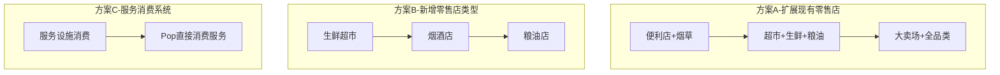
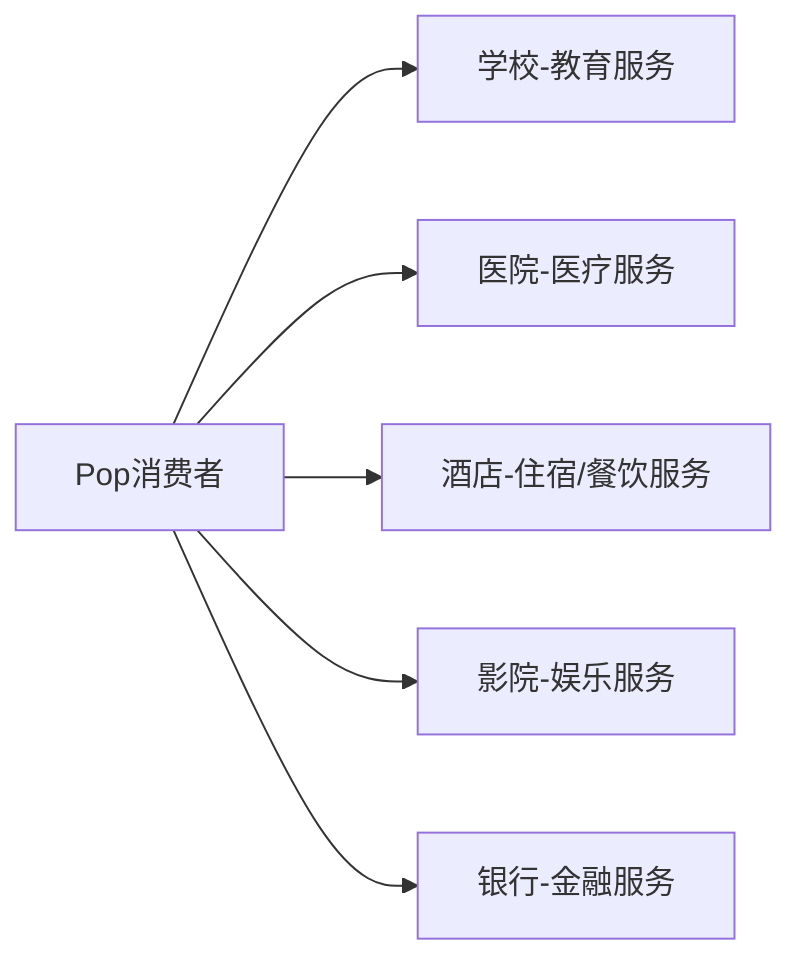

# 未覆盖消费品问题分析与解决方案

## 1. 问题分析

### 1.1 当前消费系统架构
游戏采用**零售系统**作为Pop消费的主要渠道：
- Pop只能通过零售店购买商品（[`ConsumerMarket.ts`](src/core/economy/ConsumerMarket.ts:94)）
- 零售店从批发市场进货，再卖给消费者（[`RetailSystem.ts`](src/core/economy/RetailSystem.ts:1)）
- 每种零售店通过 `allowedGoodsIds` 配置可销售的商品

### 1.2 消费品清单
系统共定义 **94种消费品**（`isConsumerGood: true`），分布如下：

| 类别 | 数量 | 示例 |
|------|------|------|
| 原材料消费品 | 4种 | 粮食、蔬菜、水果、水产 |
| 基础材料消费品 | 7种 | 加工食品、燃油、肉类、乳制品等 |
| 中间产品消费品 | 2种 | 冷冻食品、罐头食品 |
| 最终产品消费品 | 67种 | 手机、电脑、服装、食品等 |
| 服务类商品 | 14种 | 教育、医疗、餐饮、娱乐等 |

### 1.3 零售店覆盖情况
现有 **18种零售店**，覆盖约 **66种消费品**，存在以下缺口：

## 2. 未覆盖的消费品清单

### 2.1 原材料消费品（缺少生鲜渠道）
| ID | 名称 | 问题 |
|----|------|------|
| 58 | 蔬菜 | 无零售店销售 |
| 59 | 水果 | 无零售店销售 |
| 62 | 水产 | 无零售店销售 |

### 2.2 基础材料消费品（应加入超市）
| ID | 名称 | 问题 |
|----|------|------|
| 166 | 糖 | 未加入任何零售店 |
| 167 | 食用油 | 未加入任何零售店 |
| 168 | 面粉 | 未加入任何零售店 |

### 2.3 最终产品消费品
| ID | 名称 | 问题 |
|----|------|------|
| 174 | 烟草制品 | 无零售店销售 |

### 2.4 服务类商品（完全无消费机制）
| ID | 名称 | 问题 |
|----|------|------|
| 196 | 教育服务 | 服务类无零售渠道 |
| 197 | 医疗服务 | 服务类无零售渠道 |
| 198 | 金融服务 | 服务类无零售渠道 |
| 199 | 娱乐服务 | 服务类无零售渠道 |
| 200 | 餐饮服务 | 服务类无零售渠道 |
| 201 | 住宿服务 | 服务类无零售渠道 |
| 202 | 运输服务 | 服务类无零售渠道 |
| 203 | 清洁服务 | 服务类无零售渠道 |
| 206 | 法律服务 | 服务类无零售渠道 |

---

## 3. 解决方案

### 方案概述



### 3.1 方案A：扩展现有零售店配置

**修改文件**：[`src/data/buildings.ts`](src/data/buildings.ts)

#### 3.1.1 扩展便利店
```typescript
// ID 49 便利店 - 添加烟草
allowedGoodsIds: [8, 24, 44, 45, 67, 74, 76, 113, 114, 115, 174]  // +174烟草制品
```

#### 3.1.2 扩展超市
```typescript
// ID 50 超市 - 添加生鲜和粮油
allowedGoodsIds: [
  8, 24, 44, 45, 43, 46, 67, 68, 69, 63, 64, 65, 66, 74, 76,
  111, 112, 113, 114, 115, 169, 170, 171, 172, 173, 175,
  58, 59, 62,  // +生鲜：蔬菜、水果、水产
  166, 167, 168  // +粮油：糖、食用油、面粉
]
```

#### 3.1.3 扩展大卖场
```typescript
// ID 51 大卖场 - 添加生鲜、粮油、烟草
allowedGoodsIds: [
  // ...现有商品
  58, 59, 62,    // +生鲜
  166, 167, 168, // +粮油
  174            // +烟草
]
```

### 3.2 方案B：新增专业零售店（可选）

如果希望更细分市场，可以新增以下零售店类型：

#### 3.2.1 生鲜超市（ID 107）
```typescript
{
  id: 107,
  key: 'fresh-market',
  name: '生鲜超市',
  category: 'retail',
  buildCost: 600000,
  // ...其他配置
  retailConfig: {
    maxInventorySlots: 40,
    inventoryCapacity: 8000,
    customerCapacity: 6000,
    markupRange: [0.15, 0.35],
    allowedGoodsIds: [58, 59, 62, 63, 64, 65, 66, 68],  // 蔬菜、水果、水产、肉类、乳制品等
  },
}
```

#### 3.2.2 粮油店（ID 108）
```typescript
{
  id: 108,
  key: 'grain-oil-store',
  name: '粮油店',
  category: 'retail',
  buildCost: 200000,
  retailConfig: {
    maxInventorySlots: 20,
    inventoryCapacity: 10000,
    customerCapacity: 2000,
    markupRange: [0.08, 0.20],
    allowedGoodsIds: [8, 166, 167, 168],  // 粮食、糖、食用油、面粉
  },
}
```

#### 3.2.3 烟酒店（扩展酒类专卖店）
```typescript
// 修改ID 103 酒类专卖店
{
  id: 103,
  key: 'liquor-tobacco-store',
  name: '烟酒专卖店',  // 改名
  retailConfig: {
    allowedGoodsIds: [169, 170, 171, 172, 173, 174],  // +174烟草制品
  },
}
```

### 3.3 方案C：服务消费系统

服务类商品需要**全新的消费机制**，不能简单通过零售店销售。

#### 3.3.1 服务设施消费模式


#### 3.3.2 实现方案

**新增文件**：`src/core/economy/ServiceConsumption.ts`

```typescript
/**
 * 服务消费系统
 * 
 * 核心逻辑：
 * 1. 服务建筑产出服务商品
 * 2. Pop根据需求和距离选择服务设施
 * 3. 服务设施收取费用，扣减服务库存
 */

interface ServiceFacility {
  buildingId: number;
  serviceGoodsId: number;
  capacity: number;       // 每tick最大服务人数
  priceMultiplier: number; // 定价倍率
}

// 建筑ID → 服务商品ID 映射
const SERVICE_BUILDING_MAP: Map<number, number> = new Map([
  [88, 196],  // 学校 → 教育服务
  [89, 197],  // 医院 → 医疗服务
  [90, 198],  // 银行 → 金融服务
  [91, 201],  // 酒店 → 住宿服务
  // ...
]);

export function processServiceConsumption(world: GameWorld): ServiceConsumptionResult {
  // 遍历所有服务建筑
  // 根据Pop需求分配服务
  // 记录消费和收入
}
```

---

## 4. 推荐实施顺序

| 优先级 | 方案 | 工作量 | 效果 |
|--------|------|--------|------|
| P0 | 方案A：扩展现有零售店 | 低（修改配置） | 立即解决10种商品 |
| P1 | 方案B：新增生鲜超市 | 中（新增建筑） | 提升真实感 |
| P2 | 方案C：服务消费系统 | 高（新增系统） | 解决14种服务商品 |

---

## 5. 修改清单

### 5.1 必须修改
1. **[`src/data/buildings.ts`](src/data/buildings.ts)** - 扩展零售店 `allowedGoodsIds`

### 5.2 可选修改
2. **[`src/data/buildings.ts`](src/data/buildings.ts)** - 新增生鲜超市、粮油店
3. **新建 [`src/core/economy/ServiceConsumption.ts`](src/core/economy/ServiceConsumption.ts)** - 服务消费系统
4. **[`src/core/loop/GameLoop.ts`](src/core/loop/GameLoop.ts)** - 集成服务消费系统

---

## 6. 验证方法

修改完成后，可以通过以下方式验证：

```typescript
// 检查所有消费品是否都有销售渠道
function checkConsumerGoodsCoverage() {
  const coveredGoods = new Set<number>();
  
  for (const building of RETAIL_BUILDINGS_LIST) {
    if (building.retailConfig) {
      for (const goodsId of building.retailConfig.allowedGoodsIds) {
        coveredGoods.add(goodsId);
      }
    }
  }
  
  const uncoveredGoods = CONSUMER_GOODS
    .filter(g => !g.isService)  // 服务类单独处理
    .filter(g => !coveredGoods.has(g.id));
  
  console.log('未覆盖的消费品:', uncoveredGoods.map(g => g.name));
}