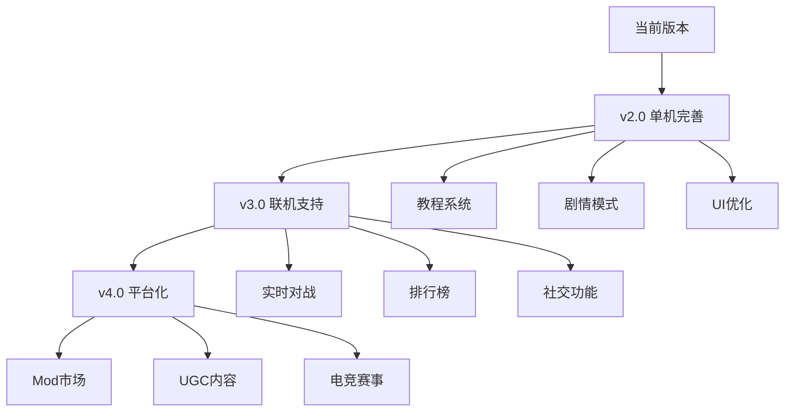

# Supply Chain Commander 开发空间分析报告

## 📊 项目现状总结

### 已完成的核心系统

| 模块 | 状态 | 规模 | 完成度 |
|------|------|------|--------|
| 商品系统 | ✅ 完成 | 80种商品，4层产业链 | 95% |
| 建筑系统 | ✅ 完成 | 40种建筑，内置生产配置 | 90% |
| AI公司 | ✅ 完成 | 45家AI公司，多种性格 | 85% |
| 市场交易 | ✅ 完成 | 订单簿、撮合引擎 | 90% |
| 金融系统 | ✅ 基础完成 | 股票、银行、期货 | 75% |
| 经济周期 | ✅ 基础完成 | 繁荣/衰退周期 | 70% |
| 科技研发 | ⚠️ 框架完成 | 20+科技，待扩展 | 50% |
| 零售系统 | ✅ 完成 | Pop消费、零售店 | 80% |
| UI界面 | ⚠️ 基础完成 | React + Tailwind | 70% |

---

## 🚀 开发空间分类

### 一、游戏性增强（高优先级）

#### 1.1 多人联机系统
**当前状态**: 未实现  
**开发价值**: ⭐⭐⭐⭐⭐

```
可选方案：
├── 异步竞争模式（排行榜竞争）
├── 实时多人联机（WebSocket）
├── 回合制对战
└── 合作经营模式
```

**技术要点**:
- 后端服务器（Node.js/Rust）
- 状态同步机制
- 反作弊系统
- 社交功能（好友、公会）

#### 1.2 剧情/战役模式
**当前状态**: 未实现  
**开发价值**: ⭐⭐⭐⭐

```typescript
// 建议的剧情结构
interface Campaign {
  id: string;
  name: string;
  chapters: Chapter[];
  rewards: Reward[];
}

interface Chapter {
  objectives: Objective[];   // 任务目标
  constraints: Constraint[]; // 限制条件
  dialogue: DialogueNode[];  // 剧情对话
  unlockCondition: Condition;
}
```

**可实现的剧情主题**:
- 从零开始建立商业帝国
- 经济危机生存挑战
- 行业垄断之路
- 可持续发展企业家

#### 1.3 成就与挑战系统
**当前状态**: 基础框架存在  
**开发价值**: ⭐⭐⭐⭐

**可扩展的成就类型**:

| 类型 | 示例 | 实现复杂度 |
|------|------|------------|
| 里程碑 | "首个百万营收" | 低 |
| 收集类 | "解锁所有建筑" | 低 |
| 挑战类 | "30天内盈利100万" | 中 |
| 隐藏类 | "在经济危机中逆势增长" | 中 |
| 连续类 | "连续100天盈利" | 低 |

#### 1.4 新手教程系统
**当前状态**: 未实现  
**开发价值**: ⭐⭐⭐⭐⭐

```
教程流程设计：
1. 基础操作 → 建造第一个矿场
2. 生产链条 → 原材料到成品
3. 市场交易 → 买卖商品
4. 财务管理 → 贷款和投资
5. 竞争策略 → 应对AI对手
6. 高级功能 → 科技研发、并购
```

---

### 二、经济系统深化（中高优先级）

#### 2.1 区域经济系统
**当前状态**: 未实现  
**开发价值**: ⭐⭐⭐⭐

```typescript
interface Region {
  id: number;
  name: string;
  
  // 区域特性
  resourceAbundance: Map<number, number>;  // 资源丰富度
  laborCost: number;                       // 劳动力成本
  taxRate: number;                         // 税率
  infrastructure: number;                   // 基础设施水平
  
  // 市场特性
  marketSize: number;                      // 市场规模
  consumptionPreference: Map<number, number>; // 消费偏好
  
  // 物流
  distanceMatrix: Map<number, number>;     // 与其他区域的距离
}
```

**玩法价值**:
- 资源产地选址策略
- 区域间贸易利润
- 产业转移决策
- 物流成本优化

#### 2.2 国际贸易与汇率
**当前状态**: 未实现  
**开发价值**: ⭐⭐⭐

```typescript
interface Currency {
  code: string;           // CNY, USD, EUR
  name: string;
  exchangeRate: number;   // 对基准货币汇率
  volatility: number;     // 波动性
}

interface TradePolicy {
  exportTariff: Map<number, number>;   // 出口关税
  importQuota: Map<number, number>;    // 进口配额
  tradeAgreements: string[];           // 贸易协定
}
```

#### 2.3 更复杂的税收系统
**当前状态**: 简单实现  
**开发价值**: ⭐⭐⭐

```
可添加的税种：
├── 增值税（生产环节）
├── 企业所得税（利润）
├── 资本利得税（投资收益）
├── 关税（进出口）
├── 环境税（污染排放）
└── 财产税（资产持有）
```

#### 2.4 通货膨胀与货币政策
**当前状态**: 基础实现  
**开发价值**: ⭐⭐⭐

**可深化的方向**:
- 央行利率调控影响借贷成本
- 货币供应量影响商品价格
- 通胀预期影响投资决策
- 量化宽松/紧缩政策事件

---

### 三、公司管理系统（中优先级）

#### 3.1 员工与人力资源
**当前状态**: 未实现  
**开发价值**: ⭐⭐⭐⭐

```typescript
interface Employee {
  id: number;
  name: string;
  role: 'worker' | 'engineer' | 'manager' | 'executive';
  
  // 能力属性
  skills: Map<string, number>;
  experience: number;
  loyalty: number;           // 忠诚度
  satisfaction: number;      // 满意度
  
  // 成本
  salary: number;
  benefits: number;
}

interface HRPolicy {
  baseSalary: number;
  bonusRate: number;
  trainingBudget: number;
  workHours: number;
  vacationDays: number;
}
```

**玩法价值**:
- 人才招聘与培养
- 工资福利平衡
- 员工满意度影响生产效率
- 高管决策影响公司方向

#### 3.2 品牌与市场营销
**当前状态**: 基础框架  
**开发价值**: ⭐⭐⭐⭐

```typescript
interface Brand {
  name: string;
  value: number;              // 品牌价值
  awareness: number;          // 知名度 0-100
  reputation: number;         // 美誉度 0-100
  targetSegment: string[];    // 目标客群
  
  // 品牌效果
  pricePermium: number;       // 溢价能力
  customerLoyalty: number;    // 客户忠诚度
}

interface MarketingCampaign {
  type: 'advertising' | 'promotion' | 'sponsorship' | 'pr';
  budget: number;
  duration: number;
  targetGoodsIds: number[];
  expectedROI: number;
}
```

#### 3.3 研发系统深化
**当前状态**: 基础框架（20+科技）  
**开发价值**: ⭐⭐⭐⭐

**可扩展方向**:

```
科技树扩展：
├── 生产技术线（30+科技）
│   ├── 自动化生产
│   ├── 精益制造
│   └── 智能工厂
├── 产品技术线（25+科技）
│   ├── 新材料
│   ├── 新能源
│   └── 高端制造
├── 管理技术线（20+科技）
│   ├── ERP系统
│   ├── 供应链优化
│   └── 大数据分析
└── 市场技术线（15+科技）
    ├── 电商平台
    ├── 品牌营销
    └── 客户关系管理
```

#### 3.4 企业文化与ESG
**当前状态**: 未实现  
**开发价值**: ⭐⭐⭐

```typescript
interface CorporateCulture {
  innovation: number;         // 创新导向
  efficiency: number;         // 效率导向
  customerFocus: number;      // 客户导向
  sustainability: number;     // 可持续性
}

interface ESGScore {
  environmental: number;      // 环境评分
  social: number;             // 社会责任
  governance: number;         // 公司治理
  
  // 影响
  investorPreference: number; // 投资者偏好
  consumerPreference: number; // 消费者偏好
  regulatoryRisk: number;     // 监管风险
}
```

---

### 四、物流与运输系统（中优先级）

#### 4.1 运输网络
**当前状态**: 未实现（当前为即时交易）  
**开发价值**: ⭐⭐⭐⭐

```typescript
interface TransportNetwork {
  nodes: TransportNode[];      // 节点（城市、港口）
  routes: TransportRoute[];    // 路线
  vehicles: Vehicle[];         // 运输工具
}

interface TransportRoute {
  from: number;
  to: number;
  distance: number;
  travelTime: number;
  capacity: number;
  costPerUnit: number;
  mode: 'road' | 'rail' | 'sea' | 'air';
}

interface Shipment {
  goods: ProductionIO[];
  origin: number;
  destination: number;
  departureTime: number;
  arrivalTime: number;
  status: 'pending' | 'in_transit' | 'delivered';
}
```

**玩法价值**:
- 物流成本影响利润
- 运输时间影响供应链效率
- 物流网络规划
- 紧急订单溢价

#### 4.2 仓储管理
**当前状态**: 基础实现（附属建筑）  
**开发价值**: ⭐⭐⭐

```typescript
interface Warehouse {
  id: number;
  location: number;           // 所在区域
  capacity: number;
  currentStock: Map<number, number>;
  
  // 仓储成本
  rentCost: number;
  handlingCost: number;
  insuranceCost: number;
  
  // 特性
  refrigerated: boolean;      // 冷藏
  hazmat: boolean;            // 危险品
  automated: boolean;         // 自动化
}
```

---

### 五、内容扩展（持续性）

#### 5.1 更多建筑类型
**当前状态**: 40种建筑  
**开发价值**: ⭐⭐⭐⭐

**建议新增的建筑类别**:

```
新增建筑建议（20+）：
├── 服务业建筑
│   ├── 研发中心
│   ├── 物流中心
│   ├── 数据中心
│   └── 总部大楼
├── 高端制造
│   ├── 航空航天厂
│   ├── 精密仪器厂
│   └── 生物制药厂
├── 新能源设施
│   ├── 风力发电场
│   ├── 核电站
│   └── 储能电站
└── 基础设施
    ├── 港口
    ├── 机场货运站
    └── 铁路货运站
```

#### 5.2 更多商品类型
**当前状态**: 80种商品  
**开发价值**: ⭐⭐⭐

**建议新增的商品**:

| 类别 | 新增商品 | 数量 |
|------|----------|------|
| 数字产品 | 软件、游戏、云服务 | 5+ |
| 高端制造 | 航空发动机、精密仪器 | 8+ |
| 新材料 | 碳纤维、石墨烯、特种合金 | 6+ |
| 消费升级 | 宠物用品、健身器材、智能家居 | 10+ |
| 服务类 | 物流服务、金融服务、咨询服务 | 5+ |

#### 5.3 事件系统扩展
**当前状态**: 约15个经济事件  
**开发价值**: ⭐⭐⭐⭐

```typescript
// 建议的事件类型扩展
interface ExtendedEventSystem {
  // 宏观事件
  economicEvents: EconomicEvent[];      // 已有
  
  // 行业事件
  industryEvents: IndustryEvent[];      // 新增
  
  // 公司事件
  companyEvents: CompanyEvent[];        // 新增
  
  // 随机挑战
  challenges: Challenge[];              // 新增
  
  // 新闻系统
  newsItems: NewsItem[];                // 已有基础
}

// 行业事件示例
interface IndustryEvent {
  industryId: string;
  name: string;
  effects: {
    demandChange: number;
    supplyChange: number;
    priceChange: number;
  };
}

// 随机挑战示例
interface Challenge {
  name: string;
  description: string;
  objectives: Objective[];
  timeLimit: number;
  rewards: Reward[];
}
```

---

### 六、UI/UX 改进（高优先级）

#### 6.1 数据可视化增强
**当前状态**: 基础图表  
**开发价值**: ⭐⭐⭐⭐⭐

```
可视化增强方向：
├── 产业链流程图（Sankey Diagram）
├── 市场份额饼图
├── 价格趋势K线图
├── 公司财务仪表盘
├── 地图可视化（区域经济）
└── 实时交易流动画
```

#### 6.2 移动端适配
**当前状态**: 未适配  
**开发价值**: ⭐⭐⭐

**技术方案**:
- 响应式布局优化
- 触控交互适配
- PWA 支持
- 可选：React Native 原生应用

#### 6.3 性能优化
**当前状态**: 有优化空间  
**开发价值**: ⭐⭐⭐⭐

```
优化方向：
├── 虚拟滚动（大列表）
├── Web Worker 分离计算
├── 增量渲染
├── 资源懒加载
├── 状态管理优化
└── 内存占用优化
```

---

### 七、技术架构优化（基础性）

#### 7.1 模块化与可扩展性
**当前状态**: 良好  
**开发价值**: ⭐⭐⭐

```
建议的架构改进：
├── 核心引擎与UI完全解耦
├── 插件系统支持Mod
├── 配置驱动的内容系统
└── 更好的存档兼容性
```

#### 7.2 测试覆盖
**当前状态**: 部分测试  
**开发价值**: ⭐⭐⭐

```
测试策略：
├── 单元测试（核心逻辑）
├── 集成测试（系统交互）
├── E2E测试（用户流程）
└── 性能测试（压力测试）
```

#### 7.3 Mod 支持
**当前状态**: 未实现  
**开发价值**: ⭐⭐⭐⭐

```typescript
interface ModAPI {
  // 内容扩展
  registerGoods(goods: GoodsDefinition[]): void;
  registerBuildings(buildings: BuildingTypeDefinition[]): void;
  registerEvents(events: EconomicEvent[]): void;
  
  // 逻辑扩展
  registerTickHandler(handler: TickHandler): void;
  registerPriceModifier(modifier: PriceModifier): void;
  
  // UI扩展
  registerPanel(panel: CustomPanel): void;
}
```

---

## 📋 开发优先级建议

### 第一优先级（近期）
1. **新手教程系统** - 降低上手门槛
2. **UI/UX优化** - 提升用户体验
3. **成就系统完善** - 增加游戏目标感

### 第二优先级（中期）
1. **剧情/战役模式** - 丰富游戏内容
2. **科技系统深化** - 增加策略深度
3. **区域经济系统** - 扩展玩法维度

### 第三优先级（长期）
1. **多人联机** - 社交互动
2. **物流运输系统** - 真实感提升
3. **Mod 支持** - 社区生态

---

## 🎮 特色功能建议

### 创新玩法1: 供应链危机模式
```
玩法设计：
- 随机供应链中断事件
- 限时寻找替代供应商
- 快速调整生产策略
- 危机管理评分
```

### 创新玩法2: 产业链竞赛
```
玩法设计：
- 选择一条产业链
- 与AI/玩家竞争控制权
- 垂直整合 vs 专精策略
- 市场份额目标
```

### 创新玩法3: 经济沙盒实验室
```
玩法设计：
- 自定义经济参数
- 观察模拟结果
- 对比不同策略效果
- 生成分析报告
```

---

## 📊 开发工作量估算

| 功能模块 | 复杂度 | 核心开发 | 完善优化 |
|----------|--------|----------|----------|
| 新手教程 | 中 | 3-5天 | 2-3天 |
| 剧情模式 | 高 | 10-15天 | 5-7天 |
| 多人联机 | 很高 | 20-30天 | 10-15天 |
| 区域经济 | 高 | 10-15天 | 5-7天 |
| 物流系统 | 高 | 8-12天 | 4-5天 |
| 员工系统 | 中 | 5-8天 | 3-4天 |
| 科技扩展 | 中 | 5-7天 | 3-4天 |
| UI优化 | 中 | 7-10天 | 持续 |
| Mod支持 | 高 | 15-20天 | 持续 |

---

## 🔮 长期愿景



---

*文档版本: 1.0*
*分析日期: 2026-01-30*
*适用版本: Supply Chain Commander v1.x*