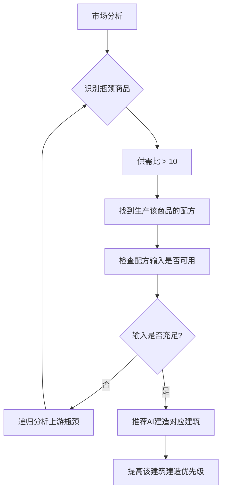
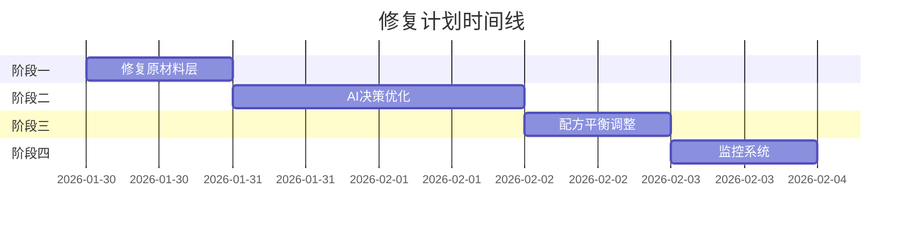

# 无生产商品问题解决方案

## 问题概述

根据价格报告分析，当前有 **44种商品** 没有任何交易量（totalVolume=0），占总商品数的约58%。这严重影响了游戏经济的完整性。

## 根本原因分析

### 1. 产业链断裂问题

通过分析 `recipes.ts` 和 `goods.ts`，发现以下产业链问题：

| 问题类型 | 受影响商品 | 原因 |
|---------|-----------|------|
| **缺少上游原料** | 玻璃(17)、橡胶制品(19)、纺织品(23) | 天然橡胶(11)无生产，棉花产量不足 |
| **缺少生产配方** | 家禽(61)、牲畜(60)、水产(62) | 虽有配方但需要长周期，AI不愿投资 |
| **产业链过长** | 汽车(41)、电动汽车(42)、手机(55/56) | 需要多层中间产品，任一环节断裂就无法生产 |
| **高投入门槛** | 手术设备(79)、诊断设备(78)、疫苗(73) | 建筑成本高，AI资金不足 |

### 2. AI决策偏好问题

分析 `AIProductionOptimizer.ts` 发现AI存在以下问题：

1. **短视决策**：只关注当前利润率，忽略产业链完整性
2. **风险规避**：避开长生产周期的农业/养殖配方
3. **成本导向**：优先选择低成本配方，导致某些产品无人生产
4. **缺乏产业链感知**：不理解上下游依赖关系

### 3. 供需失衡问题

从报告数据可见：
- **高供需比商品**（需求远大于供给但无人生产）：
  - 包装材料(37): 95.833
  - 医用耗材(77): 95.652  
  - 饮料(45): 95.652
  - 电池(28): 88.405

这些商品有巨大市场需求，但AI没有识别出这个机会。

---

## 解决方案

### 方案一：产业链引导机制（推荐）



**实现方式**：
1. 在 `AIDecisionEngine` 中添加产业链分析模块
2. 识别高供需比但无生产的商品
3. 递归追溯产业链，找到根源瓶颈
4. 给AI公司下达"战略建筑"建造指令

### 方案二：初始化补全机制

在游戏初始化时确保每种商品都有至少一个生产者：

```typescript
// 伪代码
function ensureProductionCoverage(world: GameWorld) {
  for (const goods of ALL_GOODS) {
    if (!hasProducer(world, goods.id)) {
      // 创建一个NPC公司专门生产该商品
      createSpecializedCompany(world, goods.id);
    }
  }
}
```

### 方案三：市场激励机制

当某商品长期无生产时，自动提高其价格以吸引投资：

```typescript
function adjustPriceForScarcity(world: GameWorld) {
  for (const goodsId of getAllGoodsIds()) {
    if (world.goods.supplies[goodsId] < 0.01 && world.goods.demands[goodsId] > 0.1) {
      // 稀缺商品价格上涨
      world.goods.prices[goodsId] *= 1.05;
    }
  }
}
```

---

## 具体修复计划

### 阶段一：紧急修复（优先级最高）

**目标**：修复阻塞产业链的关键原材料

| 商品 | 问题 | 修复方案 |
|-----|------|---------|
| 天然橡胶(11) | 有配方但无人生产 | 在世界初始化时强制建造1个橡胶园 |
| 家禽(61) | 周期长，AI不愿投资 | 缩短配方周期或在初始化时预建 |
| 牲畜(60) | 周期长，需要粮食 | 同上 |
| 水产(62) | 同上 | 同上 |

**代码修改位置**：`src/core/world/WorldInitializer.ts`

### 阶段二：AI决策优化

**目标**：让AI识别并填补产业链空白

修改 `src/core/ai/AIDecisionEngine.ts`：

```typescript
// 新增方法：识别未被生产的高需求商品
function identifyUnmetDemand(world: GameWorld): number[] {
  const unmetGoods: number[] = [];
  for (let i = 0; i < GOODS_COUNT; i++) {
    const supply = world.goods.supplies[i];
    const demand = world.goods.demands[i];
    // 供需比超过5且几乎无供给
    if (demand > 10 && supply / demand < 0.1) {
      unmetGoods.push(i);
    }
  }
  return unmetGoods;
}

// 新增方法：为未满足需求的商品找到生产方案
function findProductionSolution(goodsId: number): {
  buildingTypeId: number;
  recipeId: number;
  requiredInputs: number[];
} | null {
  // 查找能生产该商品的配方
  for (const recipe of RECIPES) {
    if (recipe.outputs.some(o => o.goodsId === goodsId)) {
      return {
        buildingTypeId: recipe.buildingTypeId,
        recipeId: recipe.id,
        requiredInputs: recipe.inputs.map(i => i.goodsId)
      };
    }
  }
  return null;
}
```

### 阶段三：平衡性调整

**目标**：调整配方参数使其更具吸引力

| 配方 | 当前问题 | 调整建议 |
|-----|---------|---------|
| 牲畜养殖(37) | 周期36tick | 缩短至24tick |
| 药材种植(43) | 周期36tick | 缩短至24tick |
| 水产养殖(39) | 周期18tick | 保持，增加产量 |
| 家禽养殖(38) | 周期10tick | 增加产量20% |

**代码修改位置**：`src/data/recipes.ts`

### 阶段四：监控和自动修复

**目标**：建立持续监控机制

```typescript
// 每小时检查一次产业链健康度
function checkSupplyChainHealth(world: GameWorld) {
  const report = {
    unproducedGoods: [] as number[],
    blockedChains: [] as string[],
    recommendations: [] as string[]
  };
  
  for (const goods of ALL_GOODS) {
    if (world.goods.supplies[goods.id] < 0.01) {
      report.unproducedGoods.push(goods.id);
      
      // 分析原因
      const solution = findProductionSolution(goods.id);
      if (solution) {
        // 检查输入是否可用
        const missingInputs = solution.requiredInputs.filter(
          id => world.goods.supplies[id] < 1
        );
        if (missingInputs.length > 0) {
          report.blockedChains.push(
            `${goods.name} 被阻塞，缺少: ${missingInputs.join(', ')}`
          );
        }
      }
    }
  }
  
  return report;
}
```

---

## 具体商品修复方案

### 原材料层（Tier 0）

| ID | 商品 | 供需比 | 修复方案 |
|----|------|--------|---------|
| 11 | 天然橡胶 | 0.016 | 初始化时建造橡胶园，配方ID=106 |
| 60 | 牲畜 | 20.036 | 缩短配方周期，初始化时建造畜牧场 |
| 61 | 家禽 | 56.655 | 增加产量，初始化时建造畜牧场 |
| 62 | 水产 | 2.552 | 初始化时建造渔场 |

### 基础材料层（Tier 1）

| ID | 商品 | 供需比 | 修复方案 |
|----|------|--------|---------|
| 17 | 玻璃 | 0.533 | 依赖硅石，需确保硅石供给 |
| 19 | 橡胶制品 | 17.178 | 依赖天然橡胶，修复上游后自动解决 |
| 22 | 纸张 | 0.424 | 依赖木材，需建造造纸厂 |
| 23 | 纺织品 | 7.202 | 依赖棉花，需增加棉花产量 |
| 63 | 肉类 | 5.844 | 依赖牲畜+家禽，修复上游后解决 |
| 64 | 乳制品 | 14.46 | 依赖牲畜，需修复牲畜生产 |
| 71 | 医药化工品 | 7.334 | 依赖化工原料+药材，检查上游 |

### 中间产品层（Tier 2）

| ID | 商品 | 供需比 | 修复方案 |
|----|------|--------|---------|
| 28 | 电池 | 88.405 | 高需求！依赖锂矿+铜+化学品 |
| 30 | 屏幕 | 7.085 | 依赖玻璃+电子元件 |
| 34 | 光伏板 | 67.407 | 高需求！依赖硅石+玻璃+铝 |
| 37 | 包装材料 | 95.833 | 极高需求！依赖纸张+塑料 |
| 65 | 冷冻食品 | 14.536 | 依赖肉类+蔬菜 |
| 72 | 抗生素 | 7.19 | 依赖医药化工品 |
| 73 | 疫苗 | 33.704 | 依赖医药化工品+化学品 |
| 77 | 医用耗材 | 95.652 | 极高需求！依赖塑料+纺织品 |

### 最终产品层（Tier 3）

| ID | 商品 | 供需比 | 修复方案 |
|----|------|--------|---------|
| 41 | 汽车 | 0 | 依赖汽车零部件+电子+橡胶+玻璃 |
| 42 | 电动汽车 | 0 | 依赖汽车零部件+电池+电机 |
| 55 | 高端手机 | 19.295 | 依赖电子元件+芯片+电池+玻璃 |
| 56 | 平价手机 | 14.312 | 依赖电子元件+芯片+电池+塑料 |

---

## 实施优先级



## 预期效果

实施后预计：
- 无生产商品数量从44种降至10种以内
- 产业链覆盖率从42%提升至90%以上
- AI公司收入多样化
- 市场价格更加稳定

## 风险评估

| 风险 | 可能性 | 影响 | 缓解措施 |
|------|-------|------|---------|
| 强制建造导致AI破产 | 中 | 中 | 只在初始化时建造，不影响运行中的AI |
| 配方调整破坏平衡 | 低 | 高 | 小幅调整，逐步验证 |
| 供给过剩导致价格崩盘 | 中 | 中 | 保留现有的供应过剩自动减产机制 |