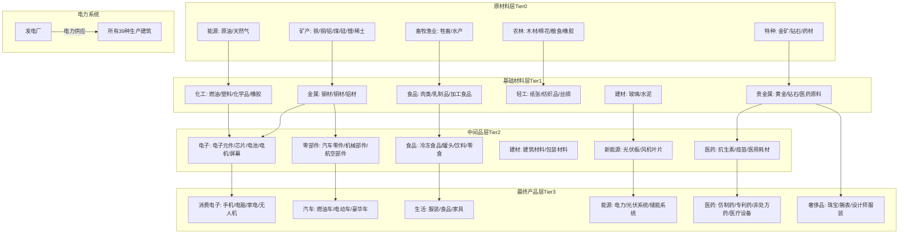

# 产业链、商品、建筑、公司 重构计划

> **目标**：完全重新设计游戏的经济系统，建立一个逻辑清晰、产业链完整、商品总数不超过80种的全新体系，每个建筑拥有独一无二的生产方式。

---

## 一、设计原则

1. **商品总数 ≤ 80种**（严格低于100种）
2. **ID连续**：0-79，无跳跃
3. **4层产业链**：原材料 → 基础材料 → 中间品 → 最终产品
4. **完整闭环**：每种商品都有生产来源和消费去向
5. **独特生产方式**：每个建筑有专属的槽位和方式组合
6. **平衡设计**：生产周期、产量、价格相互平衡
7. **电力约束**：所有建筑运营必须消耗电力

---

## 二、全新商品体系（80种）

### 2.1 原材料层 Tier 0（ID 0-17，共18种）

| ID | Key | 名称 | 类型 | 基础价格 |
|----|-----|------|------|----------|
| 0 | iron_ore | 铁矿石 | 矿产 | 50 |
| 1 | copper_ore | 铜矿石 | 矿产 | 80 |
| 2 | bauxite | 铝土矿 | 矿产 | 45 |
| 3 | coal | 煤炭 | 矿产 | 30 |
| 4 | crude_oil | 原油 | 能源 | 100 |
| 5 | natural_gas | 天然气 | 能源 | 65 |
| 6 | silicon | 硅石 | 矿产 | 40 |
| 7 | lithium | 锂矿 | 矿产 | 150 |
| 8 | rare_earth | 稀土 | 矿产 | 200 |
| 9 | timber | 木材 | 林业 | 25 |
| 10 | cotton | 棉花 | 农业 | 20 |
| 11 | grain | 粮食 | 农业 | 15 |
| 12 | rubber_raw | 天然橡胶 | 农业 | 50 |
| 13 | livestock | 牲畜 | 畜牧 | 400 |
| 14 | seafood | 水产 | 渔业 | 30 |
| 15 | herbs | 药材 | 农业 | 100 |
| 16 | gold_ore | 金矿石 | 贵金属 | 3000 |
| 17 | diamond_ore | 钻石原石 | 宝石 | 8000 |

### 2.2 基础材料层 Tier 1（ID 18-35，共18种）

| ID | Key | 名称 | 主要原料 | 基础价格 |
|----|-----|------|----------|----------|
| 18 | steel | 钢材 | 铁矿+煤炭 | 150 |
| 19 | copper | 铜材 | 铜矿 | 200 |
| 20 | aluminum | 铝材 | 铝土矿 | 130 |
| 21 | fuel | 燃油 | 原油 | 120 |
| 22 | plastic | 塑料 | 原油 | 70 |
| 23 | chemicals | 化学品 | 原油+天然气 | 160 |
| 24 | glass | 玻璃 | 硅石 | 85 |
| 25 | cement | 水泥 | 硅石+煤炭 | 45 |
| 26 | paper | 纸张 | 木材 | 35 |
| 27 | textiles | 纺织品 | 棉花 | 55 |
| 28 | rubber | 橡胶制品 | 天然橡胶+化学品 | 110 |
| 29 | meat | 肉类 | 牲畜 | 45 |
| 30 | dairy | 乳制品 | 牲畜 | 25 |
| 31 | processed_food | 加工食品 | 粮食 | 22 |
| 32 | gold | 黄金 | 金矿石 | 50000 |
| 33 | diamond | 钻石 | 钻石原石 | 80000 |
| 34 | pharma_base | 医药原料 | 药材+化学品 | 350 |
| 35 | silk | 丝绸 | 棉花 | 180 |

### 2.3 中间品层 Tier 2（ID 36-55，共20种）

| ID | Key | 名称 | 主要原料 | 基础价格 |
|----|-----|------|----------|----------|
| 36 | electronics | 电子元件 | 铜材+塑料 | 320 |
| 37 | chips | 芯片 | 硅石+稀土+化学品 | 550 |
| 38 | battery | 电池 | 锂矿+铜材+化学品 | 420 |
| 39 | motor | 电机 | 铜材+钢材+稀土 | 380 |
| 40 | screen | 屏幕 | 玻璃+电子元件+稀土 | 280 |
| 41 | car_parts | 汽车零件 | 钢材+塑料 | 480 |
| 42 | mechanical_parts | 机械部件 | 钢材+铝材 | 220 |
| 43 | aircraft_parts | 航空部件 | 铝材+钢材+稀土 | 900 |
| 44 | solar_panel | 光伏板 | 硅石+玻璃+铝材 | 340 |
| 45 | wind_blade | 风机叶片 | 铝材+塑料 | 650 |
| 46 | building_materials | 建筑材料 | 水泥+钢材 | 110 |
| 47 | packaging | 包装材料 | 纸张+塑料 | 48 |
| 48 | frozen_food | 冷冻食品 | 肉类+水产 | 55 |
| 49 | canned_food | 罐头食品 | 肉类+加工食品+钢材 | 40 |
| 50 | antibiotics | 抗生素 | 医药原料 | 850 |
| 51 | vaccine | 疫苗 | 医药原料+化学品 | 2200 |
| 52 | medical_supplies | 医用耗材 | 塑料+纺织品 | 120 |
| 53 | beverages | 饮料 | 粮食 | 12 |
| 54 | snacks | 零食 | 粮食+包装材料 | 18 |
| 55 | clothing_fabric | 服装面料 | 纺织品 | 75 |

### 2.4 最终产品层 Tier 3（ID 56-79，共24种）

| ID | Key | 名称 | 主要原料 | 基础价格 | 是否消费品 |
|----|-----|------|----------|----------|------------|
| 56 | smartphone | 智能手机 | 电子元件+芯片+电池+屏幕 | 1200 | ✓ |
| 57 | computer | 电脑 | 电子元件+芯片+屏幕+塑料 | 1400 | ✓ |
| 58 | appliances | 家电 | 钢材+电子元件+塑料 | 650 | ✓ |
| 59 | drone | 无人机 | 电子元件+芯片+电池+塑料 | 2200 | ✓ |
| 60 | car | 燃油汽车 | 汽车零件+电子元件+橡胶+玻璃 | 28000 | ✓ |
| 61 | electric_car | 电动汽车 | 汽车零件+电池+电机+电子元件 | 38000 | ✓ |
| 62 | luxury_car | 豪华汽车 | 汽车零件+电子元件+黄金+玻璃 | 450000 | ✓ |
| 63 | clothing | 服装 | 服装面料 | 90 | ✓ |
| 64 | food | 食品 | 加工食品 | 25 | ✓ |
| 65 | furniture | 家具 | 木材+钢材 | 550 | ✓ |
| 66 | electricity | 电力 | 煤炭/天然气/光伏 | 0.6 | ✓ |
| 67 | solar_system | 光伏系统 | 光伏板+电子元件+电池 | 9000 | ✗ |
| 68 | energy_storage | 储能系统 | 电池+电子元件 | 11000 | ✗ |
| 69 | industrial_robot | 工业机器人 | 机械部件+电子元件+芯片 | 16000 | ✗ |
| 70 | building_products | 建材成品 | 建筑材料+玻璃 | 220 | ✗ |
| 71 | generic_drug | 仿制药 | 医药原料 | 55 | ✓ |
| 72 | patent_drug | 专利药 | 医药原料+化学品 | 550 | ✓ |
| 73 | otc_drug | 非处方药 | 医药原料+包装材料 | 35 | ✓ |
| 74 | medical_device | 医疗设备 | 电子元件+芯片+钢材 | 9000 | ✗ |
| 75 | jewelry | 珠宝 | 黄金+钻石 | 12000 | ✓ |
| 76 | luxury_watch | 奢侈腕表 | 黄金+电子元件+玻璃 | 55000 | ✓ |
| 77 | designer_clothing | 设计师服装 | 丝绸+纺织品 | 2500 | ✓ |
| 78 | pet_food | 宠物食品 | 肉类+粮食 | 50 | ✓ |
| 79 | organic_food | 有机食品 | 粮食 | 85 | ✓ |

---

## 三、全新建筑体系（40种）+ 专属生产方式

### 3.1 采掘类建筑（ID 0-14，共15种）

#### 建筑 0: 铁矿场
| 槽位 | 名称 | 生产方式选项 |
|------|------|-------------|
| mining_method | 开采方式 | 露天开采(产量+20%,成本低) / 地下开采(产量标准,品质+15%) / 自动化采矿(产量+40%,能耗+50%) |
| ore_grade | 矿石品位 | 普通矿(标准) / 富矿(产量+30%,稀有) / 贫矿(产量-30%,成本-20%) |
| safety_level | 安全等级 | 基础安全(标准) / 强化安全(成本+20%,效率-10%) / 智能监控(成本+40%,效率+10%) |

#### 建筑 1: 铜矿场
| 槽位 | 名称 | 生产方式选项 |
|------|------|-------------|
| extraction | 提取工艺 | 浮选法(标准) / 湿法冶金(铜品位+20%) / 生物提取(环保,效率-15%) |
| processing | 选矿方式 | 粗选(快速,品质-10%) / 精选(品质+20%,时间+50%) / 联合选矿(平衡) |
| water_mgmt | 水资源管理 | 常规用水 / 循环用水(成本-15%,能耗+10%) / 干式处理(成本+30%,无污染) |

#### 建筑 2: 铝矿场
| 槽位 | 名称 | 生产方式选项 |
|------|------|-------------|
| mining_tech | 采矿技术 | 表层开采(成本低) / 深层开采(产量+25%) / 联合开采(平衡) |
| beneficiation | 选矿工艺 | 洗矿(标准) / 浮选分离(品质+15%) / 磁选(效率+20%) |
| tailings | 尾矿处理 | 堆存(成本低,污染) / 回填(成本+20%) / 资源化利用(副产品+) |

#### 建筑 3: 煤矿
| 槽位 | 名称 | 生产方式选项 |
|------|------|-------------|
| coal_type | 煤种选择 | 动力煤(产量+20%) / 炼焦煤(价格+40%) / 无烟煤(品质+30%) |
| ventilation | 通风系统 | 自然通风(成本低) / 机械通风(安全+,能耗+) / 智能通风(效率+20%) |
| automation | 自动化程度 | 人工开采 / 半自动化(效率+30%) / 全自动化(效率+60%,维护高) |

#### 建筑 4: 油田
| 槽位 | 名称 | 生产方式选项 |
|------|------|-------------|
| extraction | 采油方式 | 自喷采油(初期高效) / 机械采油(稳定) / 注水采油(延长寿命) |
| well_type | 油井类型 | 直井(成本低) / 定向井(覆盖广) / 水平井(产量+50%) |
| enhanced | 强化采收 | 无 / 热力采油(重油+40%) / 化学驱油(采收率+25%) |

#### 建筑 5: 气田
| 槽位 | 名称 | 生产方式选项 |
|------|------|-------------|
| gas_source | 气源类型 | 常规气田(标准) / 页岩气(储量大) / 煤层气(联产煤炭) |
| processing | 处理方式 | 脱硫脱水(标准) / 深度净化(品质+25%) / LNG液化(存储便利) |
| transport | 输送方式 | 管道输送(连续) / 压缩储罐(灵活) / 就地发电(转化) |

#### 建筑 6: 硅矿场
| 槽位 | 名称 | 生产方式选项 |
|------|------|-------------|
| purity_level | 纯度等级 | 工业级硅(标准) / 太阳能级(纯度99.99%) / 电子级(纯度99.9999%) |
| crushing | 破碎方式 | 颚式破碎(粗) / 圆锥破碎(中) / 球磨(细,能耗高) |
| separation | 分选方式 | 重选(简单) / 浮选(效率高) / 光电分选(品质+) |

#### 建筑 7: 锂矿场
| 槽位 | 名称 | 生产方式选项 |
|------|------|-------------|
| source_type | 矿源类型 | 硬岩锂矿(品位高) / 盐湖提锂(成本低) / 云母提锂(资源广) |
| extraction | 提取工艺 | 硫酸法(标准) / 煅烧法(效率+20%) / 膜分离(能耗-30%) |
| concentration | 浓缩方式 | 蒸发浓缩(慢,纯) / 膜浓缩(快) / 电渗析(节能) |

#### 建筑 8: 稀土矿
| 槽位 | 名称 | 生产方式选项 |
|------|------|-------------|
| ore_type | 矿石类型 | 离子吸附型(轻稀土) / 混合型矿(重稀土) / 独居石(高品位) |
| separation | 分离工艺 | 溶剂萃取(标准) / 离子交换(高纯) / 联合工艺(平衡) |
| environmental | 环保措施 | 基础处理 / 清洁生产(成本+30%) / 零排放(成本+60%) |

#### 建筑 9: 伐木场
| 槽位 | 名称 | 生产方式选项 |
|------|------|-------------|
| harvest_method | 采伐方式 | 皆伐(效率高) / 择伐(可持续) / 带状采伐(平衡) |
| wood_type | 木材类型 | 针叶材(快生长) / 阔叶材(品质高) / 混合林(多样化) |
| processing | 初加工 | 原木出售 / 锯材加工(附加值+30%) / 切片处理(造纸用) |

#### 建筑 10: 农场
| 槽位 | 名称 | 生产方式选项 |
|------|------|-------------|
| crop_type | 作物类型 | 粮食作物(稳定) / 经济作物(棉花,利润高) / 轮作(品质+15%) |
| irrigation | 灌溉方式 | 漫灌(成本低) / 滴灌(节水50%) / 智能灌溉(效率+30%) |
| fertilizer | 施肥方式 | 化肥(产量+30%) / 有机肥(品质+20%) / 精准施肥(平衡) |

#### 建筑 11: 橡胶园
| 槽位 | 名称 | 生产方式选项 |
|------|------|-------------|
| tapping | 割胶方式 | 传统割胶 / 低频割胶(树寿命+) / 气刺激(产量+25%) |
| variety | 品种选择 | 高产型(产量+20%) / 抗病型(稳定) / 高含胶(品质+15%) |
| intercrop | 间作方式 | 单一种植 / 间作粮食(副产品) / 林下经济(多样化) |

#### 建筑 12: 畜牧场
| 槽位 | 名称 | 生产方式选项 |
|------|------|-------------|
| animal_type | 畜种选择 | 肉牛(肉产量高) / 奶牛(乳制品) / 综合养殖(多产品) |
| feeding | 饲养方式 | 圈养(效率高) / 散养(品质+30%) / 草饲(有机认证) |
| breeding | 繁殖管理 | 自然繁殖 / 人工授精(品种改良) / 胚胎移植(高端) |

#### 建筑 13: 渔场
| 槽位 | 名称 | 生产方式选项 |
|------|------|-------------|
| aquaculture | 养殖模式 | 池塘养殖(传统) / 网箱养殖(高密度) / 工厂化养殖(可控) |
| species | 品种选择 | 四大家鱼(稳定) / 高档海鲜(利润高) / 观赏鱼(特种) |
| feeding | 投喂方式 | 人工投喂 / 自动投喂(效率+) / 精准投喂(节约30%) |

#### 建筑 14: 药材园
| 槽位 | 名称 | 生产方式选项 |
|------|------|-------------|
| cultivation | 种植方式 | 露天种植(成本低) / 大棚种植(可控) / 仿野生(品质+40%) |
| species | 品种选择 | 常用中药(需求稳定) / 珍稀药材(价格高) / GAP认证(出口) |
| harvest | 采收加工 | 鲜货出售 / 初加工(附加值+) / 产地加工(深加工) |

---

### 3.2 加工类建筑（ID 15-26，共12种）

#### 建筑 15: 钢铁厂
| 槽位 | 名称 | 生产方式选项 |
|------|------|-------------|
| steelmaking | 炼钢工艺 | 高炉-转炉(产量大) / 电弧炉(节能) / 氢冶金(零碳) |
| heat_treatment | 热处理 | 无处理(快速) / 正火退火(品质+15%) / 淬火回火(强度+30%) |
| quality_control | 质量控制 | 抽检(成本低) / 全检(品质保证) / 智能检测(效率+品质) |

#### 建筑 16: 有色金属冶炼厂
| 槽位 | 名称 | 生产方式选项 |
|------|------|-------------|
| metal_type | 冶炼金属 | 铜(需求大) / 铝(轻量化) / 多金属(灵活) |
| smelting | 冶炼工艺 | 火法冶炼(传统) / 湿法冶炼(铜用) / 电解精炼(高纯) |
| energy | 能源选择 | 煤电(成本低) / 天然气(清洁) / 绿电(零碳) |

#### 建筑 17: 炼油厂
| 槽位 | 名称 | 生产方式选项 |
|------|------|-------------|
| refining | 精炼工艺 | 常减压蒸馏(基础) / 催化裂化(提高收率) / 加氢裂化(高品质) |
| product_mix | 产品结构 | 汽柴油为主 / 化工原料优先 / 深度加工(多产品) |
| desulfur | 脱硫脱硝 | 基础处理 / 加氢脱硫(高标准) / 近零排放(环保) |

#### 建筑 18: 化工厂
| 槽位 | 名称 | 生产方式选项 |
|------|------|-------------|
| product | 产品类型 | 塑料(需求大) / 化学品(工业用) / 橡胶制品(特种) |
| reaction | 反应工艺 | 间歇反应(灵活) / 连续反应(效率高) / 微通道(精密) |
| catalyst | 催化体系 | 无催化(简单) / 均相催化(效率+) / 酶催化(绿色) |

#### 建筑 19: 玻璃厂
| 槽位 | 名称 | 生产方式选项 |
|------|------|-------------|
| melting | 熔化工艺 | 传统熔窑(标准) / 全电熔(清洁) / 氧燃烧(高效) |
| forming | 成型方式 | 浮法(平板玻璃) / 压制(器皿) / 拉制(玻纤) |
| finishing | 后处理 | 无处理 / 钢化(强度+) / 镀膜(功能性) |

#### 建筑 20: 水泥厂
| 槽位 | 名称 | 生产方式选项 |
|------|------|-------------|
| kiln_type | 窑型选择 | 干法回转窑(标准) / 预分解窑(效率+25%) / 新型窑(节能30%) |
| grinding | 粉磨工艺 | 球磨机(传统) / 立磨(节能40%) / 辊压联合(效率+) |
| additive | 掺合料 | 纯水泥(高标号) / �ite添加(成本-15%) / 粉煤灰(环保) |

#### 建筑 21: 造纸厂
| 槽位 | 名称 | 生产方式选项 |
|------|------|-------------|
| pulp_source | 浆源选择 | 木浆(品质高) / 废纸浆(成本低) / 非木浆(竹麻) |
| bleaching | 漂白工艺 | 氯漂(传统) / ECF(少氯) / TCF(无氯,环保) |
| product | 产品类型 | 新闻纸(量大) / 包装纸(需求稳) / 特种纸(利润高) |

#### 建筑 22: 纺织厂
| 槽位 | 名称 | 生产方式选项 |
|------|------|-------------|
| spinning | 纺纱工艺 | 环锭纺(品质高) / 气流纺(效率+30%) / 紧密纺(高端) |
| weaving | 织造方式 | 有梭织机(传统) / 剑杆织机(灵活) / 喷气织机(高速) |
| finishing | 后整理 | 基础整理 / 预缩防皱(功能+) / 功能整理(特殊) |

#### 建筑 23: 食品厂
| 槽位 | 名称 | 生产方式选项 |
|------|------|-------------|
| production | 生产线 | 手工加工(品质+) / 机械加工(效率+) / 全自动化(规模大) |
| preservation | 保鲜方式 | 常温(保质期短) / 冷藏(品质+) / 速冻(保质期长) |
| quality | 品质等级 | 普通(成本低) / 绿色食品(品质+) / 有机认证(溢价高) |

#### 建筑 24: 肉类加工厂
| 槽位 | 名称 | 生产方式选项 |
|------|------|-------------|
| slaughter | 屠宰方式 | 传统屠宰 / 流水线作业(效率+50%) / 精细分割(附加值+) |
| processing | 加工深度 | 鲜肉销售 / 冷鲜肉(品质+) / 深加工肉制品(利润+30%) |
| cold_chain | 冷链管理 | 常规冷链 / 全程冷链(品质保证) / 智能监控(损耗-) |

#### 建筑 25: 乳品厂
| 槽位 | 名称 | 生产方式选项 |
|------|------|-------------|
| pasteurization | 杀菌工艺 | 巴氏杀菌(鲜奶) / 超高温(保质期长) / 无菌(利乐包) |
| product | 产品类型 | 液态奶(量大) / 酸奶(附加值高) / 奶粉(保质期长) |
| packaging | 包装形式 | 袋装(成本低) / 盒装(便利) / 瓶装(高端) |

#### 建筑 26: 建材厂
| 槽位 | 名称 | 生产方式选项 |
|------|------|-------------|
| product | 产品类型 | 预制构件(标准化) / 装配式部品(高端) / 定制建材(灵活) |
| automation | 自动化 | 人工生产(灵活) / 半自动(效率+30%) / 全自动(效率+60%) |
| quality | 质量等级 | 普通级 / 优等品(品质+) / 精品(溢价+50%) |

---

### 3.3 制造类建筑（ID 27-36，共10种）

#### 建筑 27: 电子厂
| 槽位 | 名称 | 生产方式选项 |
|------|------|-------------|
| product_line | 产品线 | 元件生产(基础) / 消费电子(手机电脑) / 无人机(高端) |
| assembly | 组装方式 | 手工组装(灵活) / 流水线(效率+40%) / 机器人组装(精度+) |
| testing | 测试标准 | 抽检(成本低) / 全检(品质保证) / 自动化检测(效率+品质) |

#### 建筑 28: 半导体厂
| 槽位 | 名称 | 生产方式选项 |
|------|------|-------------|
| process_node | 制程节点 | 成熟制程(14nm+,成本低) / 先进制程(7nm,性能+) / 前沿制程(3nm,顶级) |
| cleanroom | 洁净等级 | Class 100(标准) / Class 10(高端) / Class 1(顶级) |
| yield_mgmt | 良率管理 | 基础监控 / AI良率优化(良率+15%) / 自适应调整(良率+25%) |

#### 建筑 29: 电池厂
| 槽位 | 名称 | 生产方式选项 |
|------|------|-------------|
| cell_type | 电芯类型 | 圆柱(18650) / 方形(动力电池) / 软包(轻量化) |
| chemistry | 化学体系 | 磷酸铁锂(安全) / 三元锂(能量密度高) / 固态电池(前沿) |
| manufacturing | 制造工艺 | 卷绕(传统) / 叠片(效率+) / 干电极(下一代) |

#### 建筑 30: 零部件厂
| 槽位 | 名称 | 生产方式选项 |
|------|------|-------------|
| product | 产品类型 | 电机(新能源) / 屏幕(显示) / 汽车零件(大宗) / 机械部件(通用) |
| precision | 精度等级 | 普通精度 / 高精度(品质+25%) / 超精密(溢价+50%) |
| automation | 自动化 | CNC加工(标准) / 柔性制造(灵活) / 智能制造(效率+40%) |

#### 建筑 31: 汽车工厂
| 槽位 | 名称 | 生产方式选项 |
|------|------|-------------|
| vehicle_type | 车型选择 | 燃油车(成熟) / 电动车(新能源) / 豪华车(高端) |
| production | 生产方式 | 传统流水线 / 模块化装配(灵活) / 柔性生产(多车型) |
| quality | 品控标准 | 国标 / 欧标(出口) / 德系标准(顶级) |

#### 建筑 32: 家电厂
| 槽位 | 名称 | 生产方式选项 |
|------|------|-------------|
| product | 产品线 | 白电(冰洗空) / 黑电(电视音响) / 小家电(厨卫) |
| smart | 智能化 | 传统家电 / 联网智能(附加值+30%) / AI家电(高端) |
| energy | 能效等级 | 普通能效 / 一级能效(节能) / 超一级(顶级节能) |

#### 建筑 33: 家具厂
| 槽位 | 名称 | 生产方式选项 |
|------|------|-------------|
| material | 材质选择 | 板材家具(成本低) / 实木家具(品质+) / 定制家具(溢价高) |
| style | 风格类型 | 现代简约(主流) / 中式古典(特色) / 北欧极简(出口) |
| assembly | 生产方式 | 成品出厂 / 平板包装(物流成本-) / 模块化(灵活) |

#### 建筑 34: 新能源厂
| 槽位 | 名称 | 生产方式选项 |
|------|------|-------------|
| product | 产品类型 | 光伏板(太阳能) / 风机叶片(风能) / 光伏系统(集成) |
| technology | 技术路线 | 多晶硅(成本低) / 单晶PERC(效率高) / HJT异质结(前沿) |
| manufacturing | 制造水平 | 半自动化 / 全自动化(效率+30%) / 智能制造(效率+50%) |

#### 建筑 35: 制药厂
| 槽位 | 名称 | 生产方式选项 |
|------|------|-------------|
| product | 药品类型 | 仿制药(成本低) / 专利药(利润高) / 生物药(前沿) |
| production | 生产方式 | 手工生产 / 半自动化(效率+) / 连续制造(效率+50%) |
| certification | 认证标准 | GMP国标 / FDA认证(出口) / 欧盟CE(高端) |

#### 建筑 36: 医疗器械厂
| 槽位 | 名称 | 生产方式选项 |
|------|------|-------------|
| product | 产品类型 | 耗材(量大) / 诊断设备(技术型) / 高端设备(影像) |
| cleanroom | 洁净级别 | 十万级(普通) / 万级(高端) / 千级(顶级) |
| certification | 认证体系 | 国内注册 / CE认证(欧洲) / FDA认证(全球) |

---

### 3.4 奢侈品建筑（ID 37-38，共2种）

#### 建筑 37: 金矿/黄金精炼
| 槽位 | 名称 | 生产方式选项 |
|------|------|-------------|
| mining | 采金方式 | 岩金开采(品位高) / 砂金淘洗(成本低) / 伴生金(副产) |
| refining | 精炼工艺 | 电解精炼(99.9%) / 化学提纯(99.99%) / 超高纯(99.999%) |
| product | 产品形态 | 金锭(交易用) / 金粒(加工用) / 定制形状(工业用) |

#### 建筑 38: 奢侈品工坊
| 槽位 | 名称 | 生产方式选项 |
|------|------|-------------|
| product | 产品类型 | 珠宝(需求稳) / 腕表(技术型) / 设计师服装(时尚) |
| craftsmanship | 工艺水平 | 机械制作(效率高) / 手工打造(品质+50%) / 大师手作(溢价+100%) |
| material | 用料等级 | 标准用料 / 精选用料(品质+) / 顶级用料(奢华) |

---

### 3.5 服务类建筑（ID 39，共1种）

#### 建筑 39: 发电厂
| 槽位 | 名称 | 生产方式选项 |
|------|------|-------------|
| fuel_type | 燃料类型 | 燃煤(成本低) / 燃气(清洁) / 光伏(零碳) |
| generation | 发电技术 | 亚临界(标准) / 超临界(效率+15%) / 超超临界(效率+25%) |
| emission | 排放控制 | 达标排放 / 超低排放(投资高) / 近零排放(环保) |

---

## 四、生产方式设计原则

### 4.1 槽位设计规则

每个建筑有 **3个专属槽位**，每个槽位有 **3-4个方式选项**：

1. **第一槽位**：核心工艺/产品类型选择
2. **第二槽位**：生产效率/品质平衡
3. **第三槽位**：成本/环保/特殊效果

### 4.2 方式效果设计

| 效果类型 | 范围 | 说明 |
|----------|------|------|
| 产量修正 | 0.7 - 1.5 | 影响产出数量 |
| 品质加成 | 0 - 0.5 | 影响产品品质等级 |
| 成本倍率 | 0.7 - 1.5 | 影响运营成本 |
| 能耗倍率 | 0.6 - 1.5 | 影响能源消耗 |
| 污染倍率 | 0 - 1.5 | 影响环境污染 |
| 速度倍率 | 0.8 - 1.3 | 影响生产周期 |

### 4.3 解锁等级设计

| 建筑等级 | 可用方式 |
|----------|----------|
| Lv.1 | 每个槽位第1个方式 |
| Lv.2 | 每个槽位第2个方式 |
| Lv.3 | 每个槽位第3个方式 |
| Lv.4-5 | 每个槽位第4个方式（如有） |

---

## 五、公司体系设计（45家）

*[公司配置同前，此处省略]*

---

## 六、电力消耗系统

### 6.1 设计原则

- **所有建筑都消耗电力**，无论采掘、加工还是制造
- 电力消耗量与建筑复杂度和产能成正比
- 电力不足时，建筑效率按比例下降
- 电力来源：发电厂生产的电力商品（ID 66）

### 6.2 各建筑电力消耗表

| 建筑ID | 建筑名称 | 基础电力消耗/tick | 类别 |
|--------|----------|-------------------|------|
| 0 | 铁矿场 | 15 | 采掘 |
| 1 | 铜矿场 | 18 | 采掘 |
| 2 | 铝矿场 | 20 | 采掘 |
| 3 | 煤矿 | 12 | 采掘 |
| 4 | 油田 | 25 | 采掘 |
| 5 | 气田 | 22 | 采掘 |
| 6 | 硅矿场 | 18 | 采掘 |
| 7 | 锂矿场 | 30 | 采掘 |
| 8 | 稀土矿 | 35 | 采掘 |
| 9 | 伐木场 | 8 | 采掘 |
| 10 | 农场 | 5 | 采掘 |
| 11 | 橡胶园 | 6 | 采掘 |
| 12 | 畜牧场 | 10 | 采掘 |
| 13 | 渔场 | 12 | 采掘 |
| 14 | 药材园 | 8 | 采掘 |
| 15 | 钢铁厂 | 80 | 加工 |
| 16 | 有色金属冶炼厂 | 90 | 加工 |
| 17 | 炼油厂 | 60 | 加工 |
| 18 | 化工厂 | 55 | 加工 |
| 19 | 玻璃厂 | 45 | 加工 |
| 20 | 水泥厂 | 50 | 加工 |
| 21 | 造纸厂 | 35 | 加工 |
| 22 | 纺织厂 | 25 | 加工 |
| 23 | 食品厂 | 20 | 加工 |
| 24 | 肉类加工厂 | 30 | 加工 |
| 25 | 乳品厂 | 28 | 加工 |
| 26 | 建材厂 | 40 | 加工 |
| 27 | 电子厂 | 45 | 制造 |
| 28 | 半导体厂 | 120 | 制造 |
| 29 | 电池厂 | 70 | 制造 |
| 30 | 零部件厂 | 50 | 制造 |
| 31 | 汽车工厂 | 85 | 制造 |
| 32 | 家电厂 | 40 | 制造 |
| 33 | 家具厂 | 25 | 制造 |
| 34 | 新能源厂 | 55 | 制造 |
| 35 | 制药厂 | 60 | 制造 |
| 36 | 医疗器械厂 | 50 | 制造 |
| 37 | 金矿/黄金精炼 | 65 | 奢侈品 |
| 38 | 奢侈品工坊 | 15 | 奢侈品 |
| 39 | 发电厂 | 0 | 服务 |

### 6.3 电力消耗计算

```
实际电力消耗 = 基础消耗 × 产能利用率 × 能耗倍率（来自生产方式）
```

- **产能利用率**：0-100%，取决于原料供应和订单需求
- **能耗倍率**：由选择的生产方式决定（0.6-1.5）

### 6.4 电力不足影响

| 电力供应率 | 生产效率 | 品质影响 |
|------------|----------|----------|
| 100%+ | 100% | 无 |
| 80-99% | 90% | -5% 品质 |
| 60-79% | 70% | -10% 品质 |
| 40-59% | 50% | -20% 品质 |
| 20-39% | 25% | -30% 品质 |
| <20% | 0%（停产） | N/A |

### 6.5 电力市场

- 发电厂生产电力（ID 66），通过市场交易
- 公司需要购买电力或自建发电厂
- 电价随供需波动，高峰期价格上涨
- 可签订长期供电合同稳定成本

---

## 七、实施步骤

### Phase 1: 基础数据重写
1. **goods.ts** - 80种商品定义
2. **buildings.ts** - 40种建筑定义
3. **recipes.ts** - ~70个配方定义

### Phase 2: 生产方式重构
4. **methods/types.ts** - 更新类型定义
5. **methods/registry.ts** - 更新注册逻辑
6. **为每个建筑创建专属方式文件**

### Phase 3: AI与公司配置
7. **AIPersonality.ts** - 更新45家公司

### Phase 4: 辅助系统
8. **buildingMaterials.ts** - 建筑材料
9. **零售系统配置**

### Phase 5: 测试验证
10. 产业链完整性测试
11. 供需平衡验证
12. 生产方式效果测试

---

## 八、总结

| 类别 | 数量 |
|------|------|
| 商品总数 | 80种 |
| 建筑总数 | 40种 |
| 生产方式槽位 | 120个（40建筑×3槽位） |
| 生产方式选项 | ~360个（120槽位×3选项） |
| 配方总数 | ~70个 |
| 公司总数 | 45家 |

**核心特点**：
- 每个建筑有独一无二的3个专属槽位
- 每个槽位有3-4个差异化的方式选项
- 不同方式组合产生丰富的策略深度
- 所有ID连续，商品0-79，建筑0-39
- **所有建筑消耗电力**，形成能源约束机制
- 电力不足会影响生产效率和产品品质

---

## 九、产业链流程图



**电力依赖关系**：
- 发电厂（建筑39）生产电力（商品66）
- 其他39种建筑全部消耗电力
- 形成完整的能源经济循环