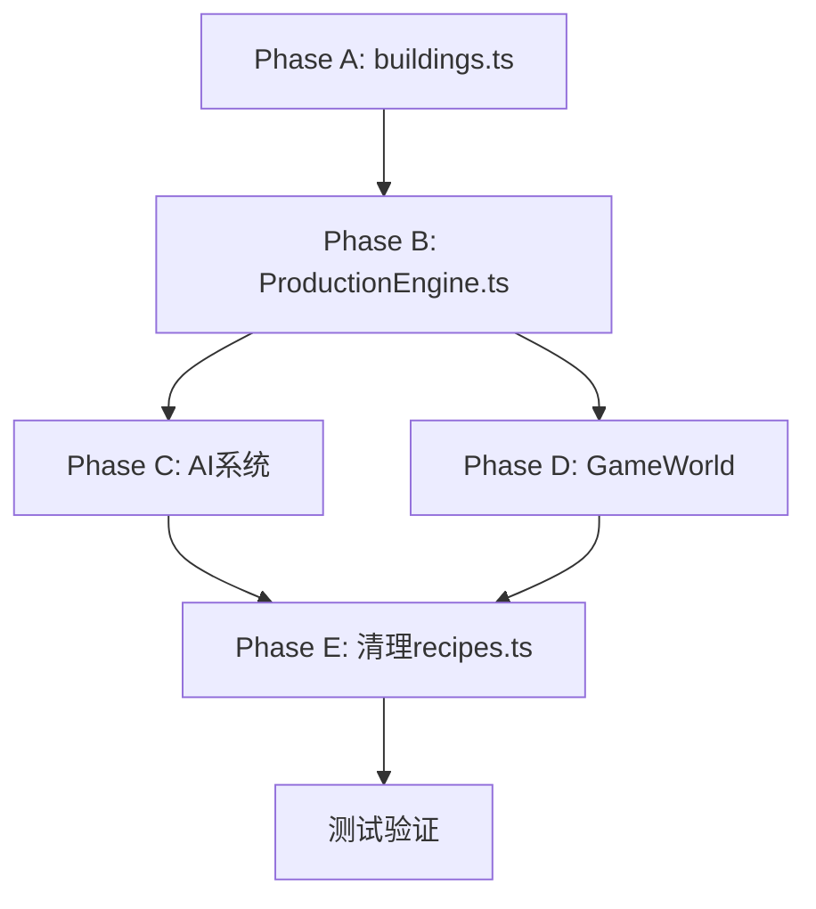

# 删除配方机制 - 详细实施计划

> **确认方案**：方案B - 使用生产方式切换产品类型，保持40个建筑不变

---

## 一、核心设计

### 1.1 新的建筑数据结构

```typescript
interface BuildingProductionConfig {
  // 基础生产参数
  inputs: { goodsId: number; amount: number }[];
  outputs: { goodsId: number; amount: number }[];
  ticksRequired: number;
  laborRequired: number;
  energyRequired: number;
  
  // 可选输出模式（用于多产品建筑）
  outputModes?: {
    modeId: number;           // 模式ID
    name: string;             // 模式名称
    inputs: { goodsId: number; amount: number }[];
    outputs: { goodsId: number; amount: number }[];
    // 可覆盖基础参数
    ticksRequired?: number;
    laborRequired?: number;
    energyRequired?: number;
  }[];
}

interface BuildingTypeDefinition {
  id: number;
  key: string;
  name: string;
  category: 'extraction' | 'processing' | 'manufacturing' | 'luxury' | 'service';
  
  // 新增：内置生产配置
  production: BuildingProductionConfig;
  
  // 保留原有属性
  buildCost: number;
  buildTime: number;
  maxLevel: number;
  powerConsumption: number;
  efficiencyMultipliers: number[];
  description: string;
  
  // 删除
  // availableRecipes: number[];  // 删除
  // defaultRecipeId: number;     // 删除
}
```

### 1.2 多产品建筑列表

以下建筑需要使用 `outputModes` 支持多种产品：

| 建筑ID | 建筑名称 | 原配方数 | 产品模式 |
|--------|----------|----------|----------|
| 10 | 农场 | 2 | 粮食/棉花 |
| 16 | 有色金属冶炼厂 | 2 | 铜材/铝材 |
| 18 | 化工厂 | 2 | 化学品/橡胶制品 |
| 22 | 纺织厂 | 2 | 纺织品/丝绸 |
| 23 | 食品厂 | 5 | 加工食品/饮料/零食/食品成品/宠物食品 |
| 24 | 肉类加工厂 | 2 | 肉类/冷冻食品 |
| 26 | 建材厂 | 2 | 建筑材料/包装材料 |
| 27 | 电子厂 | 4 | 电子元件/手机/电脑/无人机 |
| 29 | 电池厂 | 3 | 电池/储能系统/光伏系统 |
| 30 | 零部件厂 | 6 | 电机/屏幕/汽车零件/机械部件/航空部件/服装面料 |
| 31 | 汽车工厂 | 3 | 燃油车/电动车/豪华车 |
| 33 | 家具厂 | 2 | 家具/服装 |
| 34 | 新能源厂 | 3 | 光伏板/风机叶片/工业机器人 |
| 35 | 制药厂 | 5 | 医药原料/抗生素/疫苗/仿制药/专利药 |
| 36 | 医疗器械厂 | 2 | 医用耗材/医疗设备 |
| 37 | 金矿/黄金精炼 | 3 | 金矿开采/钻石开采/黄金精炼 |
| 38 | 奢侈品工坊 | 3 | 珠宝/腕表/设计师服装 |
| 39 | 发电厂 | 3 | 燃煤发电/燃气发电/光伏发电 |

---

## 二、Phase A: 重构 buildings.ts

### 2.1 新的建筑定义示例

```typescript
// 单产品建筑示例（铁矿场）
{
  id: 0,
  key: 'iron_mine',
  name: '铁矿场',
  category: 'extraction',
  production: {
    inputs: [],
    outputs: [{ goodsId: GoodsId.IRON_ORE, amount: 100 }],
    ticksRequired: 1,
    laborRequired: 50,
    energyRequired: 200,
  },
  buildCost: 500000,
  // ... 其他属性
}

// 多产品建筑示例（农场）
{
  id: 10,
  key: 'farm',
  name: '农场',
  category: 'extraction',
  production: {
    // 默认生产粮食
    inputs: [],
    outputs: [{ goodsId: GoodsId.GRAIN, amount: 200 }],
    ticksRequired: 18,
    laborRequired: 100,
    energyRequired: 50,
    // 可选产品模式
    outputModes: [
      {
        modeId: 0,
        name: '粮食种植',
        inputs: [],
        outputs: [{ goodsId: GoodsId.GRAIN, amount: 200 }],
      },
      {
        modeId: 1,
        name: '棉花种植',
        inputs: [],
        outputs: [{ goodsId: GoodsId.COTTON, amount: 80 }],
        laborRequired: 80,
        energyRequired: 40,
      },
    ],
  },
  buildCost: 200000,
  // ... 其他属性
}
```

### 2.2 buildings.ts 变更清单

1. **添加** `BuildingProductionConfig` 接口
2. **添加** `production` 属性到每个建筑
3. **删除** `availableRecipes` 属性
4. **删除** `defaultRecipeId` 属性
5. **删除** `import { RecipeId } from './recipes'`

---

## 三、Phase B: 重构 ProductionEngine.ts

### 3.1 主要变更

```typescript
// 删除
import { RECIPES_BY_ID, RecipeDefinition } from '@/data/recipes';
interface RecipeCache { ... }
const recipeCache: Map<number, RecipeCache> = new Map();
function initRecipeCache(): void { ... }
function getRecipeCache(recipeId: number): RecipeCache | undefined { ... }

// 新增
interface BuildingProductionCache {
  inputCount: number;
  outputCount: number;
  inputGoods: number[];
  inputAmounts: number[];
  outputGoods: number[];
  outputAmounts: number[];
  ticksRequired: number;
  laborRequired: number;
  energyRequired: number;
}

const productionCache: Map<number, BuildingProductionCache> = new Map();

function initProductionCache(): void {
  productionCache.clear();
  for (const building of ALL_BUILDINGS) {
    const prod = building.production;
    productionCache.set(building.id, {
      inputCount: prod.inputs.length,
      outputCount: prod.outputs.length,
      inputGoods: prod.inputs.map(i => i.goodsId),
      inputAmounts: prod.inputs.map(i => i.amount),
      outputGoods: prod.outputs.map(o => o.goodsId),
      outputAmounts: prod.outputs.map(o => o.amount),
      ticksRequired: prod.ticksRequired,
      laborRequired: prod.laborRequired / prod.ticksRequired,
      energyRequired: prod.energyRequired / prod.ticksRequired,
    });
  }
}
```

### 3.2 processBuildingProduction 函数重构

```typescript
function processBuildingProduction(
  world: GameWorld,
  buildingId: number,
  resources: CompanyResources
): { produced: boolean; laborUsed: number; energyUsed: number; qualityBonus: number } {
  const b = world.buildings;
  
  // 获取建筑类型
  const buildingTypeId = b.types[buildingId];
  
  // 从建筑定义获取生产参数（替代从配方获取）
  const prodCache = productionCache.get(buildingTypeId);
  
  // 检查是否有产品模式选择
  const outputMode = b.outputModes[buildingId];
  if (outputMode > 0) {
    // 使用指定的产品模式
    const building = ALL_BUILDINGS.find(b => b.id === buildingTypeId);
    const mode = building?.production.outputModes?.find(m => m.modeId === outputMode);
    if (mode) {
      // 覆盖生产参数
      // ...
    }
  }
  
  // 后续逻辑类似，但从 prodCache 获取数据而非 recipe
  // ...
}
```

---

## 四、Phase C: 更新 AI 系统

### 4.1 AIPersonality.ts 变更

```typescript
// 原配置
initialBuildings: [
  { typeId: BuildingId.IRON_MINE, recipeId: RecipeId.IRON_MINING, count: 18 },
]

// 新配置
initialBuildings: [
  { typeId: BuildingId.IRON_MINE, outputMode: 0, count: 18 },
]

// 或者简化为
initialBuildings: [
  { typeId: BuildingId.IRON_MINE, count: 18 },  // 使用默认模式
]
```

### 4.2 AIDecisionEngine.ts 变更

移除所有 `recipeId` 引用，改用 `buildingTypeId` 和 `outputMode`。

```typescript
// 删除
const recipe = RECIPES.find(r => r.id === recipeId);
const recipeId = world.buildings.recipeIds[i];

// 替换为
const building = ALL_BUILDINGS.find(b => b.id === typeId);
const production = building.production;
const outputMode = world.buildings.outputModes[i];
```

---

## 五、Phase D: 更新 GameWorld

### 5.1 数据结构变更

```typescript
// GameWorld.ts

// 删除
recipeIds: Uint8Array;          // 当前使用的配方ID

// 新增
outputModes: Uint8Array;        // 当前产品模式 (0 = 默认)
```

### 5.2 SaveManager.ts 变更

```typescript
// 存档格式变更
interface BuildingSaveData {
  // 删除
  recipeIds: number[];
  
  // 新增
  outputModes: number[];
}

// 迁移逻辑
function migrateFromRecipeToOutputMode(oldRecipeId: number, buildingTypeId: number): number {
  // 将旧配方ID映射到新的outputMode
  // ...
}
```

---

## 六、Phase E: 清理 recipes.ts

### 6.1 删除文件

- `src/data/recipes.ts` - 完全删除

### 6.2 更新导入

搜索并删除所有文件中的：
```typescript
import { RECIPES, RecipeDefinition, RECIPES_BY_ID, RecipeId } from '@/data/recipes';
```

### 6.3 受影响文件列表

| 文件路径 | 变更类型 |
|----------|----------|
| src/data/buildings.ts | 重写 |
| src/data/recipes.ts | 删除 |
| src/core/production/ProductionEngine.ts | 重构 |
| src/core/world/GameWorld.ts | 修改 |
| src/core/world/WorldInitializer.ts | 重构 |
| src/core/save/SaveManager.ts | 重构 |
| src/core/ai/AIPersonality.ts | 修改 |
| src/core/ai/AIDecisionEngine.ts | 重构 |
| src/core/ai/AIProductionOptimizer.ts | 修改 |
| src/core/ai/StrategicPlanner.ts | 修改 |
| src/core/economy/DemandCurve.ts | 修改 |
| src/core/economy/SupplyCurve.ts | 修改 |
| src/core/economy/ConsumerMarket.ts | 修改 |
| src/core/construction/ConstructionTick.ts | 修改 |
| src/core/construction/ConstructionManager.ts | 修改 |
| src/core/llm/ActionExecutor.ts | 修改 |
| src/core/llm/CodeSandbox.ts | 修改 |
| src/core/loop/GameLoop.ts | 修改 |
| src/core/workers/*.ts | 修改 |
| src/stores/gameStore.ts | 修改 |
| src/ui/utils/supplyChainUtils.ts | 重构 |

---

## 七、实施顺序



### 建议实施顺序

1. **Day 1**: Phase A - 重构 buildings.ts
   - 添加 production 属性
   - 暂时保留 availableRecipes 和 defaultRecipeId（兼容）

2. **Day 2**: Phase B - 重构 ProductionEngine.ts
   - 创建新的生产缓存系统
   - 同时支持新旧两种模式

3. **Day 3**: Phase C + D - 更新 AI 和 GameWorld
   - 更新所有 AI 相关代码
   - 更新 GameWorld 结构

4. **Day 4**: Phase E - 清理
   - 删除 recipes.ts
   - 删除所有配方引用
   - 删除兼容代码

5. **Day 5**: 测试验证
   - 运行 TypeScript 编译
   - 运行游戏测试
   - 验证所有功能

---

## 八、风险缓解

1. **编译错误过多**
   - 分阶段修改，每阶段确保编译通过
   - 使用 `// @ts-ignore` 临时忽略

2. **运行时错误**
   - 保留详细的控制台日志
   - 使用默认值防止崩溃

3. **回滚策略**
   - 使用 Git 分支
   - 每个阶段完成后提交

---

**确认开始实施？请切换到 Code 模式进行代码修改。**